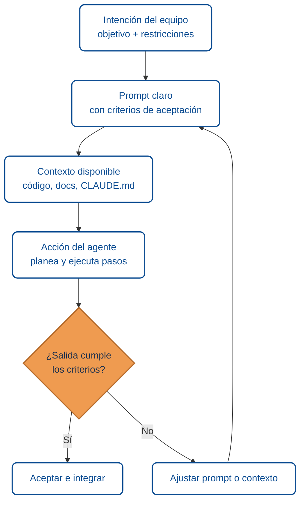

import AuthorCredit from '@site/src/components/AuthorCredit';

# Fundamentos de colaboración con agentes de IA

Trabajar con un agente de IA no es lo mismo que pedirle a un asistente que responda una pregunta. Un agente **ejecuta acciones** en tu entorno (lee archivos, corre comandos, hace cambios, toma decisiones), y esas acciones tienen consecuencias reales. Esta primera lección fija el marco mental.

## ¿Qué diferencia a un agente de un asistente?

| Rasgo | Asistente clásico | Agente |
|-------|-------------------|--------|
| Interacción | Pregunta → Respuesta | Intención → Plan → Acciones → Verificación |
| Contexto | El que cabe en el chat | Archivos, herramientas, entorno |
| Errores | Respuesta imprecisa | Efectos secundarios (archivos modificados, comandos ejecutados) |
| Rol humano | Consultar | Dirigir y verificar |

## El ciclo de colaboración

## Tareas en las que un agente rinde bien

- **Bien delimitadas**: "renombra esta función en todo el repositorio", "agrega validación a este DTO", "genera pruebas para este servicio".
- **Con criterios verificables**: hay un `build`, un `test`, un linter o una comprobación visual que responde pasa/no pasa.
- **Con contexto suficiente**: el archivo de contexto (`CLAUDE.md`/`AGENTS.md`) describe convenciones, el código sigue patrones claros, hay ejemplos previos.
- **Repetitivas con variación**: escribir varios endpoints similares, migrar archivos, convertir formatos.

## Tareas en las que un agente rinde mal

- **Ambiguas** ("mejora este código"): sin criterio, el agente optimiza lo que crea que importa.
- **Que requieren conocimiento tácito** que no está en el repositorio ni en el prompt.
- **Irreversibles sin revisión**: eliminar datos, publicar a producción, enviar correos.
- **Estratégicas**: decidir qué producto construir, cómo priorizar, cómo negociar.

## Principios prácticos

1. **Describe la intención, no solo la instrucción.** "Queremos que el endpoint rechace entradas con más de 100 elementos porque nos saturaron el servicio" da más señal que "agrega validación".
2. **Deja criterios de aceptación** en el prompt. Ej.: *"Build verde, pruebas existentes pasan, no se introducen dependencias nuevas."*
3. **Trust but verify.** Si el agente dice que terminó, verifica corriendo lo que dijo que corrió.
4. **Reduce la distancia.** Un archivo de contexto corto y preciso evita que el agente explore y se desvíe.
5. **Escala con cuidado.** Automatiza tareas de bajo riesgo primero; deja acciones destructivas bajo revisión humana.

## Errores frecuentes al empezar

- **Hacer preguntas abiertas** cuando se quiere una acción concreta.
- **Delegar la comprensión**: *"haz lo que creas mejor"* — el agente decide por ti y quizá mal.
- **No mantener el archivo de contexto** al día: el agente repite errores porque no hay dónde registrar aprendizajes.
- **Ignorar la verificación** porque el build parece compilar (compilar ≠ cumplir la intención).

## Resumen

Un agente es una extensión del equipo que actúa en tu entorno. Rinde cuando le das **objetivo claro**, **contexto útil** y **forma de verificar**. Todo lo demás (productividad, seguridad, calidad) se deriva de cuidar esos tres ingredientes.

---

### Bloque estructurado para agentes

**Objetivo:** establecer el marco mental para colaborar con un agente antes de asignarle tareas.

**Entradas:**
- Proyecto con código fuente.
- Archivo de contexto del agente (opcional pero recomendado).
- Intención del equipo: qué se quiere lograr y por qué.

**Pasos:**
1. Formular la intención (objetivo + restricciones + motivo).
2. Traducir intención a prompt con criterios de aceptación verificables.
3. Asegurar contexto relevante (convenciones, ejemplos, `CLAUDE.md`).
4. Ejecutar la tarea con el agente.
5. Verificar contra los criterios.
6. Ajustar prompt o contexto si la salida no cumple.

**Salidas:**
- Cambio aplicado y verificado.
- Aprendizajes registrados (en `CLAUDE.md`, notas del equipo, etc.).

**Errores comunes:**
- Pedir algo ambiguo sin criterio de éxito.
- No verificar el resultado más allá del "compila".
- Delegar decisiones estratégicas.

**Referencias cruzadas:**
- [02 · Context engineering](./02-context-engineering-claude-md.md)
- [05 · Diseño de prompts y verificación](./05-diseno-de-prompts-y-verificacion.md)

---

<AuthorCredit />
