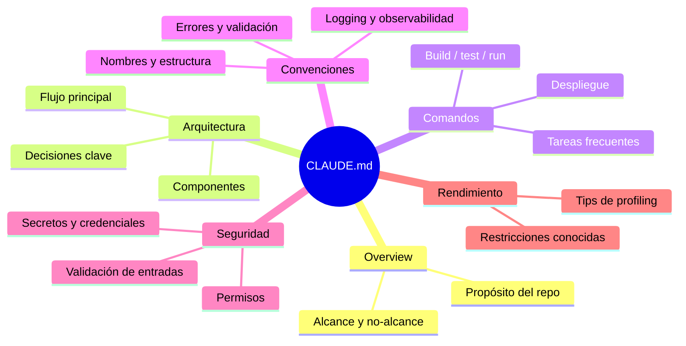

# Context engineering: el archivo que decide la calidad del agente

Cuando trabajas con un agente de IA en un repositorio, hay un factor que determina más que casi ningún otro la calidad de sus resultados: **qué información encuentra al arrancar**. A ese trabajo de preparar, organizar y mantener esa información se le llama **context engineering**.

El artefacto central es un archivo de contexto del repositorio: se llama `CLAUDE.md` (para Claude Code), `AGENTS.md`, `.cursorrules` (en Cursor), o simplemente un README ampliado. El nombre importa poco; lo que importa es **qué contiene** y **cuán bien lo mantienes**.

## Criterio guía

> El archivo de contexto debe bastar para que un agente **ejecute una tarea típica** del proyecto **sin tener que explorar todo el repositorio**.

Si cada vez que pides algo el agente primero lee media docena de archivos para "entender", tu contexto está incompleto. Si lee uno o dos archivos puntuales y actúa, está bien dimensionado.

## Anatomía de un CLAUDE.md útil

### Secciones recomendadas

| Sección | Qué contiene | Por qué importa |
|---------|--------------|-----------------|
| **Overview** | Qué hace el proyecto, quién lo usa, qué NO hace | Evita que el agente invente alcance |
| **Arquitectura** | Diagrama + flujo principal + decisiones arquitectónicas | Sin esto, el agente propone cambios que rompen el diseño |
| **Comandos comunes** | `build`, `test`, `run`, `publish` con banderas correctas | Evita que adivine banderas o mezcle gestores |
| **Convenciones** | Estilo de nombres, estructura de carpetas, patrones de errores | Reduce churn: el agente escribe código que encaja |
| **Seguridad** | Validación, secretos, permisos | Evita introducir vulnerabilidades conocidas |
| **Rendimiento** | Partes críticas y tips | Protege rutas calientes del proyecto |

## Cuándo crear un archivo nuevo vs. extender uno existente

- **Extender** si ya hay `CLAUDE.md` o `AGENTS.md`: añade secciones o amplía las existentes. No fragmentes.
- **Crear** si no existe: empieza mínimo (Overview + Comandos) y crece con el uso.
- **No dupliques** información que ya vive en un `README.md` autoritativo — **enlaza**.
- **Un archivo por repositorio.** En monorepos, considera uno por paquete si los contextos son distintos.

## Qué NO va en el archivo de contexto

- Pasos de instalación del sistema operativo (eso va en README).
- Historia del proyecto, roadmap estratégico, notas de reuniones.
- Secretos, credenciales, rutas locales específicas de una máquina.
- Información que cambia cada semana sin actualizar el archivo.

## Un antipatrón común: el archivo "diario"

Muchos equipos empiezan bien y luego convierten el archivo en un diario de eventos: *"el 5 de marzo agregamos X", "en la revisión dijimos que Y"*. Para el agente, esas notas son ruido. Si un aprendizaje es permanente, expresarlo como **regla** o **convención**; si es temporal, no va aquí.

## Mantenimiento

- Revisa el archivo tras cada cambio arquitectónico relevante.
- Cuando el agente falle de forma reproducible, pregúntate: *¿el archivo decía lo necesario?* Si no, agrégalo.
- Pide al agente que revise el archivo y marque contradicciones con el código real; eso lo mantiene vivo.

## Tamaño razonable

Un archivo entre **150 y 500 líneas** suele ser suficiente para un repositorio mediano. Si supera las 800, probablemente hay secciones que deberían ser sub-páginas referenciadas.

## Extender el patrón: archivos de contexto por dominio

`CLAUDE.md` / `AGENTS.md` es el archivo general. Cuando un dominio tiene reglas suficientemente densas como para inflar ese archivo, conviene separarlo en un archivo propio al que el principal referencia. El patrón es el mismo (reglas permanentes, ejemplos breves, enlaces en lugar de duplicación), solo cambia el dominio.

Ejemplos habituales:

| Archivo | Qué contiene | Para qué tarea lo lee el agente |
|---------|--------------|---------------------------------|
| `SECURITY.md` | Validación de entradas, manejo de secretos, política de dependencias | Revisar un endpoint nuevo, auditar una PR |
| `TESTING.md` | Estrategia de pruebas, qué se mockea y qué no, fixtures | Escribir o corregir pruebas |
| `DESIGN.md` | Paleta, tipografía, tokens, componentes, estilo "sí/no" | Generar o modificar UI sin romper la marca |

El caso de `DESIGN.md` es especialmente interesante: permite que un agente produzca interfaces coherentes con la marca sin necesidad de exportaciones de Figma ni JSON de tokens. Un buen ejemplo de cómo se ve este archivo en productos reales es [VoltAgent/awesome-design-md](https://github.com/VoltAgent/awesome-design-md), que cura `DESIGN.md` extraídos de 68+ sitios (Claude, Linear, Stripe, Vercel, etc.). Sirve como referencia de qué secciones incluir y con qué nivel de detalle.

**Regla de cuándo separar:** si la sección correspondiente en `CLAUDE.md` supera ~80 líneas o dos o tres equipos distintos la consultan con fines diferentes, muévela a un archivo de dominio y deja un enlace desde el principal.

## Glosario

**Context engineering** *(Context engineering)* — disciplina de preparar, organizar y mantener la información que un agente encuentra al arrancar una tarea. Se apoya en técnicas de prompt engineering descritas en la [documentación oficial de Anthropic](https://docs.anthropic.com/en/docs/build-with-claude/prompt-engineering/overview).

**CLAUDE.md / AGENTS.md** *(Agent memory file)* — archivo de contexto del repositorio; fuente autoritativa de convenciones, arquitectura y comandos. Claude Code lo carga automáticamente al iniciar una sesión ([Claude Code docs](https://docs.claude.com/en/docs/claude-code/overview)).

**Archivo de dominio** *(Domain-specific context file)* — archivo separado (`SECURITY.md`, `TESTING.md`, `DESIGN.md`) al que el archivo principal hace referencia cuando un tema tiene reglas densas; patrón sugerido para mantener la memoria del agente escalable ([Claude Code docs](https://docs.claude.com/en/docs/claude-code/overview)).

**Exploración innecesaria** *(Unnecessary exploration)* — síntoma de contexto incompleto: el agente lee múltiples archivos para entender lo que debería estar declarado. Anthropic recomienda *"be clear and direct"* en sus [guías de prompt engineering](https://docs.anthropic.com/en/docs/build-with-claude/prompt-engineering/overview) para evitar este comportamiento.

**Archivo diario** *(Ephemeral notes — antipattern)* — antipatrón en que el contexto acumula notas temporales en vez de reglas permanentes; contrasta con la recomendación de [Anthropic](https://docs.anthropic.com/en/docs/build-with-claude/prompt-engineering/overview) de mantener el contexto estable y reutilizable.

**Monorepo** *(Monorepo)* — repositorio con varios paquetes; puede requerir un archivo de contexto por paquete cuando los dominios difieren, patrón soportado por la carga jerárquica de `CLAUDE.md` en [Claude Code](https://docs.claude.com/en/docs/claude-code/overview).

:::info Referencias primarias
- [Claude Code documentation](https://docs.claude.com/en/docs/claude-code/overview) — referencia oficial sobre memoria del agente y `CLAUDE.md`.
- [Anthropic · Prompt engineering overview](https://docs.anthropic.com/en/docs/build-with-claude/prompt-engineering/overview) — prácticas para contexto claro y directo.
:::

---

### Bloque estructurado para agentes

**Objetivo:** construir o mejorar un archivo de contexto (`CLAUDE.md` / `AGENTS.md` / `.cursorrules`) que minimice la exploración innecesaria del agente y maximice la calidad de sus aportes.

**Entradas:**
- Repositorio con código fuente.
- Archivo de contexto existente (si lo hay).
- Lista de tareas frecuentes que se espera que el agente resuelva.

**Pasos:**
1. Revisar si existe archivo de contexto y su estado.
2. Cubrir las 6 secciones recomendadas (Overview, Arquitectura, Comandos, Convenciones, Seguridad, Rendimiento).
3. Remover diario histórico, rutas locales, secretos.
4. Validar que una tarea típica pueda resolverse leyendo solo el archivo + 1-2 archivos puntuales del código.
5. Acordar cadencia de mantenimiento (quién y cuándo lo revisa).

**Salidas:**
- Archivo de contexto de 150-500 líneas, actualizado, versionado con el código.
- Reducción verificable en tiempo de arranque del agente por tarea.

**Errores comunes:**
- Mezclar diario histórico con reglas permanentes.
- Duplicar el README en lugar de enlazarlo.
- Olvidar sección de Seguridad (es la que más impacto tiene si falta).
- Dejar el archivo sin owner.

**Referencias cruzadas:**
- [6.3 Arquitectura orientada a skills](./03-arquitectura-orientada-a-skills.md)
- [6.4 Seguridad al ejecutar herramientas externas](./04-seguridad-en-herramientas-externas.md)

---

<AuthorCredit />
