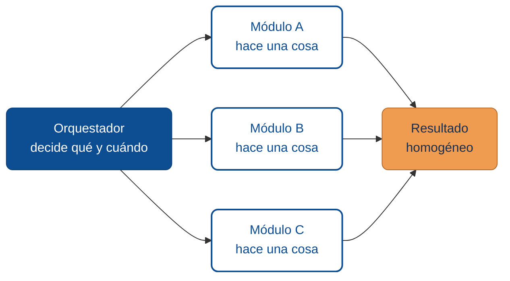

# Arquitectura orientada a skills

Los proyectos que colaboran bien con agentes tienden a compartir una forma: están construidos como **unidades reutilizables, orquestadas por un núcleo pequeño**. Esa forma también se presta a que un agente la entienda, la extienda y, cuando conviene, la convierta en una *skill* de su propio toolkit.

Esta lección trata de cómo diseñar software así, independientemente del lenguaje.

:::tip Skills copiables del bootcamp
En [`examples-md/agents/skills/`](https://github.com/10xGuatemala/bootcamp/tree/main/examples-md/agents/skills) viven plantillas listas para copiar a tu repo. Están organizadas por dominio:

- **`general/`** (agnósticas de stack): [`code-review`](https://github.com/10xGuatemala/bootcamp/blob/main/examples-md/agents/skills/general/code-review.skill.md.example), [`release-notes`](https://github.com/10xGuatemala/bootcamp/blob/main/examples-md/agents/skills/general/release-notes.skill.md.example), [`redactar-manual-usuario`](https://github.com/10xGuatemala/bootcamp/blob/main/examples-md/agents/skills/general/redactar-manual-usuario.skill.md.example), [`revisar-hallazgo-sast`](https://github.com/10xGuatemala/bootcamp/blob/main/examples-md/agents/skills/general/revisar-hallazgo-sast.skill.md.example), [`entrevista-specs`](https://github.com/10xGuatemala/bootcamp/blob/main/examples-md/agents/skills/general/entrevista-specs.skill.md.example), [`scaffolding-desde-specs`](https://github.com/10xGuatemala/bootcamp/blob/main/examples-md/agents/skills/general/scaffolding-desde-specs.skill.md.example), [`escribir-slash-command`](https://github.com/10xGuatemala/bootcamp/blob/main/examples-md/agents/skills/general/escribir-slash-command.skill.md.example).
- **`net-core-web-api/`** (específicas del curso 1.2): `nuevo-endpoint-rest-net`, `nueva-entidad-ef-core`, `checklist-produccion-net`.

Las dos skills de **arranque de proyecto** (`entrevista-specs` + `scaffolding-desde-specs`, combinadas con la plantilla [`specs.md.example`](https://github.com/10xGuatemala/bootcamp/blob/main/examples-md/project/specs.md.example)) implementan el flujo "de specs a proyecto real": entrevista guiada → contrato aprobado → scaffolding reproducible.

La skill [`escribir-slash-command`](https://github.com/10xGuatemala/bootcamp/blob/main/examples-md/agents/skills/general/escribir-slash-command.skill.md.example) es **meta**: documenta el patrón para diseñar comandos complejos que leen código fuente y generan artefactos derivados (manuales, reportes, diagramas) con args explícitos, proceso numerado, reglas de exclusión y checklist de calidad.
:::

## Orquestación vs. ejecución

Divide el sistema en dos partes claras:



- **Orquestador**: decide qué hacer, con qué orden, con qué timeout, qué fallos son tolerables.
- **Módulos**: hacen *una cosa* y la hacen bien. No deciden, no coordinan.

Esta separación es la que permite que un agente agregue un módulo nuevo sin tocar el orquestador, o que el orquestador evolucione sin reescribir módulos.

## Configuración data-driven en vez de código

Uno de los patrones más rentables: mueve la información que cambia a **archivos de datos** (`JSON`, `YAML`, `TOML`) y deja el código como intérprete.

**Ejemplo conceptual:**

```json
{
  "name": "validar-entrada",
  "purpose": "Valida que el texto no contenga caracteres prohibidos.",
  "timeoutSeconds": 5,
  "inputs": { "texto": "string" },
  "rules": [
    { "type": "forbid-chars", "value": ["&", ";", "|", "`"] },
    { "type": "max-length", "value": 1024 }
  ]
}
```

Ventajas:
- Agregar una regla nueva no requiere un PR de código: se edita el JSON.
- El agente puede generar reglas nuevas siguiendo un esquema conocido.
- Se puede testear la configuración sin levantar la aplicación.

Cuidado: **valida el esquema** antes de consumirlo. Datos sin validar son una puerta abierta a errores silenciosos.

## Unidades reutilizables: contrato explícito

Cada módulo — ya sea una función, una clase, un servicio — debe declarar un contrato:

| Elemento | Qué declara |
|----------|-------------|
| **Entradas** | Tipos, rangos, valores permitidos |
| **Salidas** | Tipo y forma del resultado |
| **Efectos laterales** | ¿Escribe en disco? ¿Hace llamadas de red? |
| **Errores** | Qué excepciones o códigos devuelve y cuándo |
| **Recursos** | Tiempo máximo, memoria máxima |

Este contrato es lo que un agente copia cuando convierte el módulo en una skill.

## Placeholders validados

Si tu módulo compone comandos, rutas o consultas a partir de entradas, **no concatenes strings**. Usa placeholders y valida cada uno:

```
# Mala idea:
cmd = f"nmap {target} -oN {outfile}"

# Mejor:
template = "nmap {target} -oN {outfile}"
render(template, {
    "target": validate_host(target),
    "outfile": validate_path(outfile)
})
```

El validador es una primera línea de defensa contra injection; la veremos con detalle en el [módulo 04](./04-seguridad-en-herramientas-externas.md).

## Concurrencia con límites explícitos

Cuando orquestas varios módulos en paralelo, **acota** la concurrencia:

- Usa un semáforo o un pool configurable (p. ej., entre 1 y 16 ejecuciones simultáneas).
- Registra el tiempo de cada módulo y su resultado.
- Propaga cancelación: si el orquestador decide detener, los módulos deben cerrar limpiamente.

Un número mágico escondido en el código es un dolor futuro; expónlo como parámetro.

## Deduplicación de salidas

Cuando varios módulos pueden encontrar lo mismo (p. ej., el mismo hallazgo de seguridad desde dos herramientas), define un **fingerprint** y deduplica antes de reportar. Un fingerprint simple:

```
fingerprint = hash(severidad | titulo | descripcion | evidencia)
```

El orquestador guarda una lista de fingerprints ya vistos y descarta colisiones.

## Código en español, identificadores en inglés

Una convención útil cuando el equipo habla español pero usa herramientas inglesas: **comentarios y UI en español**, **identificadores (clases, funciones, variables) en inglés**. Simplifica dependencias externas y mantiene legibilidad.

## Tres pistas de que tu arquitectura se presta a skills

1. **Se puede explicar en una página**. Si la descripción cabe en una hoja, un agente puede internalizarla.
2. **Agregar un caso no toca el orquestador.** Implica que los módulos son de verdad reutilizables.
3. **Los efectos laterales son explícitos.** No hay "magia" que el agente tenga que descubrir.

## Glosario

**Orquestador** *(Orchestrator)* — componente que decide qué módulos ejecutar, en qué orden y con qué timeouts. En la taxonomía de [Anthropic · Building effective agents](https://www.anthropic.com/engineering/building-effective-agents) corresponde al patrón *orchestrator-workers*.

**Módulo** *(Module)* — unidad reutilizable que hace una sola cosa bien, con contrato explícito de entradas, salidas y efectos. Principio de diseño implícito en la [documentación de Anthropic](https://docs.anthropic.com/) sobre herramientas bien definidas.

**Skill** *(Agent Skill)* — paquete reutilizable que extiende las capacidades de un agente; Anthropic lo define como *"a way to teach Claude new capabilities using a structured folder"* ([Claude · Agent Skills overview](https://docs.claude.com/en/docs/agents-and-tools/agent-skills/overview)).

**Data-driven** *(Data-driven configuration)* — diseño en que la configuración vive en archivos de datos (JSON/YAML) validados por esquema en lugar de código; facilita mantenimiento y auditoría de herramientas y skills ([Claude · Agent Skills](https://docs.claude.com/en/docs/agents-and-tools/agent-skills/overview)).

**Placeholder validado** *(Validated placeholder)* — marcador `{name}` en una plantilla que solo se sustituye por un valor previamente validado, nunca por texto crudo; práctica recomendada en la [documentación de Anthropic](https://docs.anthropic.com/) para prevenir inyección en herramientas.

**Fingerprint** *(Fingerprint / Dedup hash)* — hash canónico de una salida usado para deduplicar hallazgos que varios módulos pueden reportar; técnica estándar en orquestación de herramientas externas.

**Contrato del módulo** *(Module contract / Tool schema)* — declaración explícita de entradas, salidas, efectos laterales, errores y recursos máximos; equivalente al *tool schema* JSON usado por Claude en [tool use](https://docs.anthropic.com/).

**Árbol de procesos** *(Process tree)* — conjunto de procesos hijos creados por un subproceso; debe terminarse completo al cancelar para evitar *zombies* y consumo de recursos.

:::info Referencias primarias
- [Claude · Agent Skills overview](https://docs.claude.com/en/docs/agents-and-tools/agent-skills/overview) — referencia oficial sobre skills como unidades reutilizables.
- [Anthropic · Building effective agents](https://www.anthropic.com/engineering/building-effective-agents) — patrones arquitectónicos (orchestrator-workers, routing, etc.).
- [Anthropic Documentation](https://docs.anthropic.com/) — referencia general sobre tool use y diseño de agentes.
:::

---

<div className="agent-block">

### Bloque estructurado para agentes

**Objetivo:** estructurar (o reestructurar) un componente como unidad reutilizable orquestada, apta para ser invocada por agentes y humanos con el mismo contrato.

**Entradas:**
- Componente a estructurar (función, clase o servicio).
- Lista de casos de uso esperados.
- Restricciones de seguridad y recursos.

**Pasos:**
1. Separar orquestador (decide) de módulos (ejecutan).
2. Mover configuración variable a archivo de datos (JSON/YAML) con esquema validado.
3. Declarar contrato: entradas, salidas, efectos laterales, errores, recursos.
4. Reemplazar concatenación de strings por placeholders validados.
5. Exponer concurrencia y timeouts como parámetros, no hardcoded.
6. Definir fingerprint para deduplicar salidas similares.

**Salidas:**
- Componente con orquestador, módulos y configuración claramente separados.
- Contratos documentados por módulo.
- Casos de uso resolubles por composición, no por parches al núcleo.

**Errores comunes:**
- Poner lógica de decisión dentro de módulos (rompe reutilización).
- Configuración data-driven sin validación de esquema.
- No acotar concurrencia.
- Duplicar salidas porque no hay fingerprint.

**Referencias cruzadas:**
- [6.2 Context engineering y CLAUDE.md](./02-context-engineering-claude-md.md)
- [6.4 Seguridad al ejecutar herramientas externas](./04-seguridad-en-herramientas-externas.md)
</div>

---

<AuthorCredit />
