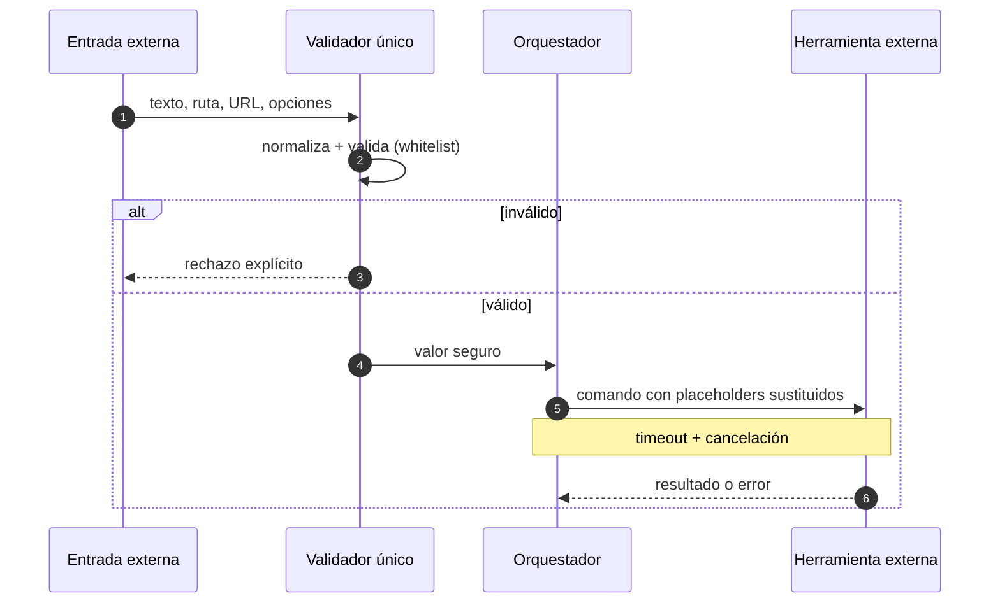

import AuthorCredit from '@site/src/components/AuthorCredit';

# Seguridad al ejecutar herramientas externas

Cuando un agente o un orquestador **ejecuta subprocesos** (comandos de shell, herramientas externas, consultas a sistemas) con entradas que vienen de un usuario o de otro sistema, entras en territorio donde un descuido puede costar caro: *shell injection*, fuga de archivos, agotamiento de CPU por expresiones regulares maliciosas, procesos huérfanos que se quedan corriendo.

Esta lección resume el conjunto mínimo de prácticas que deberían estar siempre.

## El principio central



**Toda entrada cruza un único punto de validación antes de llegar a un subproceso.** Sin excepciones.

## Validación de entradas

Principio: **whitelist, no blacklist.** Declara qué está permitido; todo lo demás se rechaza.

### Caracteres a bloquear por defecto

En entradas que terminarán en una línea de comando, rechaza (o escapa) al menos:

```
; & | ` $ ( ) > < " ' \n \r \\
```

Y trata con especial cuidado los espacios en rutas.

### Reglas por tipo de entrada

| Tipo | Regla |
|------|-------|
| Hostname | Letras, dígitos, puntos, guiones. Sin espacios. Longitud ≤ 253. |
| URL | Esquema `http`/`https`. Hostname válido. Sin caracteres de control. |
| Ruta de archivo | Debe estar bajo un directorio base conocido; resuelve `..` antes de comparar. |
| Número | Conviértelo a tipo numérico y valida rango, no string. |
| Texto libre | Limita longitud; escapa caracteres peligrosos o rechaza si no aplica. |

### Ejemplo ilustrativo

```
def validate_host(value: str) -> str:
    if len(value) > 253:
        raise InvalidInput("hostname demasiado largo")
    if any(c in value for c in "; & | ` $ ( ) > < \" ' \n \r \\".split()):
        raise InvalidInput("caracteres prohibidos en hostname")
    if not HOSTNAME_REGEX.match(value):
        raise InvalidInput("formato de hostname no válido")
    return value.lower()
```

## Plantillas de comando con placeholders

No construyas comandos concatenando strings. Define plantillas con placeholders `{name}` y sustituye solo valores **ya validados**:

```
"herramienta --target {target} --output '{outputDir}/resultado'"
```

Reglas:
- La plantilla **no puede** contener `\n`, `\r`, ni backticks.
- Cada placeholder se sustituye por un valor validado.
- El resultado final pasa por el shell solo si hace falta; prefiere ejecución sin shell cuando el lenguaje lo permite (`exec`/`spawn` directo con array de argumentos).

## ReDoS: expresiones regulares como trampa

Un regex mal escrito más una entrada adversarial puede consumir CPU durante minutos. Defensas:

1. **Compila una vez** y cachea; no compiles en el hot path.
2. **Configura un timeout** por evaluación (muchos lenguajes lo permiten; p. ej. en .NET `Regex` admite `TimeSpan`; en Go usa `regexp` con RE2 que ya es lineal; en Python prefiere `regex` con timeout sobre `re`).
3. **Evita backtracking catastrófico**: patrones con `(a+)+`, `(.*)*`, cuantificadores anidados sin anclajes.
4. **Limita el tamaño de la entrada** antes de aplicar el regex.

## Timeouts y cierre limpio de procesos

Todo subproceso debe tener:

- **Timeout máximo**. Si vence, se cancela.
- **Árbol de procesos**: cuando matas el proceso, mata también a sus hijos (los spawns internos no deben sobrevivir).
- **Señales correctas**: primero una señal suave (SIGTERM / CancelationToken), espera unos segundos, luego forzada.
- **Logging del cierre**: dejar constancia de cancelaciones; son útiles para debuggear flakiness.

## Aislamiento

- Ejecuta con el **mínimo privilegio** necesario. No corras herramientas como root o como admin si se puede evitar.
- **Directorio de trabajo acotado**. El subproceso no debería poder escribir fuera de una carpeta bajo tu control.
- **Variables de entorno filtradas**: no heredes secretos del proceso padre si el hijo no los necesita.

## Rate limiting y abuso

Cuando la entrada viene de un sistema público, protege también con:

- **Rate limiting** por IP/usuario (p. ej., `N` peticiones por minuto).
- **Respuesta 429** con encabezado `Retry-After` cuando el límite se alcanza.
- **Límites por tamaño de payload**: 1 MB bien contado suele ser más que suficiente para una API de texto.

## Checklist de revisión

- [ ] ¿Toda entrada externa pasa por el validador antes de llegar al subproceso?
- [ ] ¿Se usan placeholders en lugar de concatenación de strings?
- [ ] ¿Cada regex tiene timeout y está cacheada?
- [ ] ¿Cada subproceso tiene timeout y mata su árbol al cancelarse?
- [ ] ¿El subproceso corre con mínimo privilegio y directorio acotado?
- [ ] ¿Hay rate limiting si la entrada es pública?

---

<div className="agent-block">

### Bloque estructurado para agentes

**Objetivo:** blindar la superficie donde el software ejecuta herramientas externas con entradas provenientes de usuarios u otros sistemas.

**Entradas:**
- Código que invoca subprocesos o evalúa regex sobre entradas externas.
- Lista de tipos de entrada aceptados (hostname, URL, ruta, número, texto).
- Recursos máximos disponibles (CPU, tiempo, memoria).

**Pasos:**
1. Centralizar validación en un único punto; usar whitelist por tipo de entrada.
2. Reemplazar concatenación de strings por plantillas con placeholders validados.
3. Compilar y cachear regex; añadir timeout por evaluación; auditar patrones susceptibles a ReDoS.
4. Asignar timeout y cancelación de árbol de procesos a cada subproceso.
5. Ejecutar con mínimo privilegio y directorio de trabajo acotado.
6. Añadir rate limiting y límites de payload para entradas públicas.

**Salidas:**
- Validador central con whitelist.
- Plantillas de comandos sin concatenación.
- Regex con timeout y cache.
- Procesos que cierran limpio bajo cancelación.
- Rate limiting configurado y probado.

**Errores comunes:**
- Validar con blacklist (siempre se escapa algo).
- Reutilizar la entrada sin validar entre módulos.
- Regex compilados en caliente sin timeout.
- Mata-proceso que no mata hijos.
- Confiar en que la UI "ya filtra" y no validar en el servidor.

**Referencias cruzadas:**
- [03 · Arquitectura orientada a skills](./03-arquitectura-orientada-a-skills.md)
- [06 · Seguridad de chatbots con IA](./06-seguridad-de-chatbots.md)

</div>

---

<AuthorCredit />
