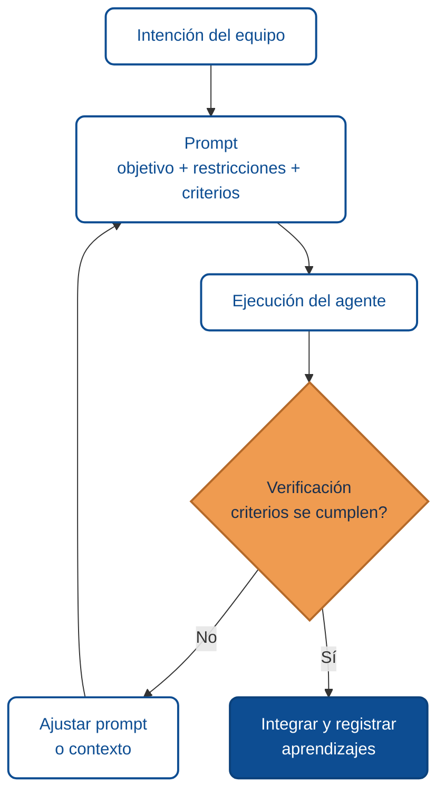
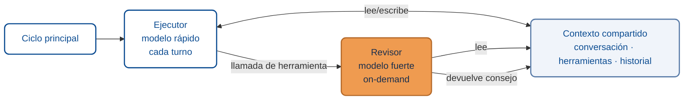

import AuthorCredit from '@site/src/components/AuthorCredit';

# Diseño de prompts y verificación

Un prompt es un encargo. Si el encargo es ambiguo, el resultado será ambiguo. Si el encargo no trae forma de verificar, no sabrás si se cumplió. Esta lección cubre cómo redactar prompts útiles y cómo cerrar el ciclo con verificación real.

## El ciclo completo



## Anatomía de un prompt útil

Un prompt que rinde suele tener cinco partes:

1. **Objetivo**: qué se quiere lograr, una sola oración.
2. **Contexto mínimo**: archivos o símbolos relevantes. No el repo entero.
3. **Restricciones**: qué no se debe tocar, qué dependencias no añadir, qué convención seguir.
4. **Criterios de aceptación**: cómo sabrás que está bien. Verificables.
5. **Salida esperada**: ¿solo cambios en archivos? ¿también un resumen? ¿una prueba?

### Ejemplo

> **Objetivo:** añadir validación de longitud máxima (1024 caracteres) al campo `comentario` del DTO `CrearTicketRequest`.
>
> **Contexto:** archivo `src/tickets/dto/crear-ticket.request.ts`.
>
> **Restricciones:** usar la convención del proyecto (decoradores de `class-validator`); no alterar otros campos; no introducir dependencias nuevas.
>
> **Criterios:** (1) `pnpm run lint` y `pnpm run test` pasan; (2) existe un test nuevo que verifica que una cadena de 1025 caracteres es rechazada.
>
> **Salida:** cambios en el DTO y test nuevo. Mensaje de commit siguiendo Conventional Commits.

## Lo que NO debe contener

- *"Haz lo que creas mejor."* Delega la comprensión, garantía de deriva.
- Atajos ambiguos como *"mejóralo"*, *"hazlo bonito"*, *"optimiza"*.
- Múltiples tareas no relacionadas en el mismo prompt. Divide.

## Verificación: más allá del "compila"

> Que compile no significa que cumpla la intención.

La verificación debe tocar **la intención original**, no solo el árbol de tipos.

| Nivel | Qué verifica | Ejemplo |
|-------|--------------|---------|
| **Sintáctica** | Compila, pasa el linter | `tsc`, `eslint`, `pnpm run build` |
| **Unitaria** | Funciones individuales | `pnpm run test` |
| **Integración** | Varios módulos juntos | `curl` al endpoint, prueba de contrato |
| **Funcional** | El usuario obtiene el resultado esperado | Caso de prueba manual o E2E |
| **De intención** | Resuelve el problema de negocio | Revisión con quien pidió el cambio |

Saltar niveles es normal para cambios pequeños. Saltar **todos** los niveles es un atajo que suele pagar caro.

## Trust but verify cuando hay subagentes

Si el agente delega a otro agente (p. ej., un subagente para testear una rama), confía pero **verifica el estado real** (archivos, build, git) antes de declarar éxito.

Los subagentes reportan lo que *intentaron* hacer. El estado del repositorio es lo que *pasó*. Ambos deben coincidir.

## Patrón: ejecutor + revisor sobre contexto compartido

Una variante útil del "trust but verify" cuando la tarea es larga o tiene puntos de decisión críticos: dividir el trabajo entre dos agentes con roles distintos que comparten el mismo contexto.

- Un **ejecutor** corre en cada turno. Se elige un modelo rápido y económico porque hace el trabajo repetitivo: leer, editar, correr comandos.
- Un **revisor** se invoca *on-demand*, solo cuando el ejecutor lo pide como si fuera una herramienta más. Se elige un modelo más fuerte porque interviene en los momentos que más pesan: validar una decisión de arquitectura, revisar un diff crítico, cuestionar un supuesto.
- Ambos leen y escriben sobre el mismo **contexto compartido** (conversación, herramientas, historial). El revisor no empieza de cero: ve lo mismo que el ejecutor.



**Cuándo conviene.** Tareas largas donde un error temprano se amplifica: migraciones, refactors grandes, decisiones de seguridad, elegir entre dos diseños. El costo extra del revisor se paga en evitar retrabajo.

**Cuándo no.** Tareas cortas y baratas (un fix de typo, una pregunta puntual). La sobrecarga de coordinar dos agentes pesa más que la calidad extra.

**Regla práctica:** el ejecutor debe poder terminar solo la mayoría de los turnos. Si está invocando al revisor en cada paso, el rol está mal dividido — probablemente el ejecutor necesita un contexto mejor, no un segundo agente.

## Plantillas reusables

### Plantilla: refactor

```
Objetivo: refactorizar {componente} para {propósito}.
Contexto: {archivos relevantes}.
Restricciones: no cambiar el comportamiento observable; mantener API pública; no añadir dependencias.
Criterios: tests existentes pasan sin modificación; no se introducen warnings nuevos; diff comprensible y acotado al refactor.
Salida: cambios en archivos + resumen de 3 bullets de qué se movió.
```

### Plantilla: fix

```
Objetivo: corregir {síntoma observable}. Causa sospechada: {hipótesis si la hay, si no déjalo vacío}.
Contexto: {archivos, logs, reproducción}.
Restricciones: fix mínimo; no reordenar el archivo; no tocar código no relacionado.
Criterios: reproducir el problema antes, verificar que ya no ocurre; añadir test que capture el caso.
Salida: cambios + test + 1-2 líneas explicando la causa raíz real.
```

### Plantilla: documentar

```
Objetivo: redactar sección "{tema}" en {archivo}.
Contexto: código de referencia en {ruta}; tono del resto del doc.
Restricciones: máximo 400 palabras; incluir 1 diagrama Mermaid si aplica; sin capturas de pantalla.
Criterios: un lector nuevo debe entender el tema sin leer el código; al final incluir bloque estructurado para agente.
Salida: sección insertada en el archivo indicado.
```

## Errores comunes al redactar prompts

- **Pedir explicaciones cuando se quiere acción** (o al revés).
- **Omitir restricciones** que el equipo da por supuestas pero el agente no sabe.
- **No ubicar el cambio**: "en el proyecto" ≠ "en `src/foo/bar.ts`".
- **Criterios no verificables** ("que se vea profesional").

## Dos señales de que vas bien

1. El prompt cabe en una pantalla y se puede leer en voz alta.
2. Puedes decir de antemano qué comando o revisión **decide** si el trabajo está aceptado.

---

<div className="agent-block">

### Bloque estructurado para agentes

**Objetivo:** redactar un prompt verificable y establecer el ciclo de verificación antes de ejecutar una tarea con un agente.

**Entradas:**
- Intención del equipo.
- Archivos relevantes.
- Convenciones del proyecto.
- Herramientas disponibles para verificar (build, tests, linter, E2E).

**Pasos:**
1. Escribir el objetivo en una sola oración.
2. Listar contexto mínimo (archivos, símbolos, ejemplos).
3. Declarar restricciones (qué no tocar, qué no añadir).
4. Definir criterios de aceptación verificables.
5. Especificar salida esperada (código, tests, resumen).
6. Ejecutar y verificar contra cada criterio.
7. Si no cumple, ajustar el prompt o el contexto; no insistir con el mismo texto.

**Salidas:**
- Cambio aplicado y verificado en los niveles que correspondan (sintáctico → intención).
- Registro de qué ajuste del prompt funcionó (para reutilizarlo).

**Errores comunes:**
- Prompt ambiguo.
- Criterios no verificables.
- Verificar solo "compila" y dar por terminado.
- Creer ciegamente el reporte de un subagente sin comprobar estado real.

**Referencias cruzadas:**
- [01 · Fundamentos de colaboración con agentes](./01-fundamentos-colaboracion-agentes.md)
- [02 · Context engineering](./02-context-engineering-claude-md.md)

</div>

---

<AuthorCredit />
