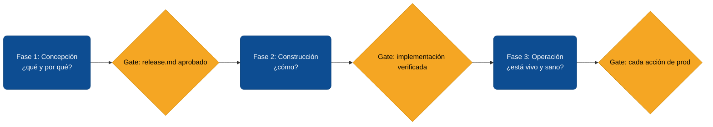

# Ciclo de vida de software con agentes de IA

El módulo anterior cierra con un proyecto arrancado desde un contrato `specs.md`. La pregunta inmediata es: cuando ese proyecto entre en operación y deba evolucionar release tras release, ¿qué disciplina mantiene al agente útil y al equipo en control? Sin un ciclo, cada nueva versión vuelve a ser una conversación abierta donde el alcance se negocia en chat y los defaults ocultos se cuelan por la puerta de atrás.

Este módulo presenta **AIDLC 10X**, una versión opinada del [AI-Driven Development Life Cycle](https://github.com/awslabs/aidlc-workflows) de AWS Labs adaptada al flujo de release usado por equipos de producto de 10X. Es la capa de orquestación que faltaba: tres fases con gates humanos que aseguran que el agente acelera, pero no decide.

## ¿Qué es AIDLC 10X?

Un ciclo de vida en **markdown puro** que orquesta el trabajo del equipo con su agente de IA en tres fases con artefactos y gates explícitos. No requiere herramientas particulares — funciona con [Claude Code](https://www.anthropic.com/claude-code), [Cursor](https://cursor.com/), [Codex](https://openai.com/codex/) o cualquier agente capaz de leer y escribir archivos. Lo único que el agente necesita ver para operar bajo el ciclo es la carpeta `aidlc/` en la raíz del repo y una frase de activación.



## Por qué un ciclo estructurado importa

- **El agente trabaja a velocidad constante; el equipo no debería pagar la factura de esa velocidad.** Sin gates, el agente convierte una conversación de cinco minutos en cinco horas de rollback.
- **Las versiones son la única unidad de auditoría que sobrevive.** Una conversación se pierde, un release `vX.Y.Z` queda. Si tu trazabilidad vive en chat, no tienes trazabilidad.
- **El scope creep mata más proyectos que la complejidad técnica.** Un ciclo declarado convierte el "ya que estoy aquí" en una conversación explícita: o entra al release o va al backlog.
- **El equipo crece y el contexto no escala.** Si cada miembro tiene un modelo mental distinto del flujo, cada release se discute desde cero. Un ciclo común es un acuerdo escrito, no una preferencia personal.
- **La línea humano-agente debe ser visible.** Cuando todo se hace "en chat", nadie sabe qué decidió quién. Los gates son la frontera explícita: el agente prepara, el humano autoriza.

## Objetivo

Adoptar un ciclo de tres fases (Concepción → Construcción → Operación) que tu equipo y tu agente sigan release tras release, con gates humanos que prevengan scope creep, defaults ocultos y deploys sin autorización.

## Entradas

- Un proyecto en marcha (o uno recién arrancado con la [Actividad 0](./07-de-specs-a-proyecto-real.md)) con `CLAUDE.md` o `AGENTS.md` por repo.
- Un repositorio de documentación del producto donde vivan `releases/`, `BACKLOG.md` y `RELEASING.md` (puede ser el mismo repo del producto si es un solo repo, o uno dedicado tipo `docs/` si el producto tiene varios).
- Un agente de IA capaz de leer/escribir archivos y ejecutar comandos.
- Acuerdo del equipo: el ciclo se respeta. No es una sugerencia.

## Pasos para adoptar el ciclo

### Paso 1: Instalar el paquete `aidlc-10x` en el repo de docs

El paquete vive en [`examples-md/aidlc-10x/`](https://github.com/10xGuatemala/bootcamp/tree/main/examples-md/aidlc-10x). Cópialo entero a tu repo de docs como carpeta `aidlc/`:

```bash
cp -r aidlc-10x/ ../mi-proyecto-docs/aidlc/
```

Quedan ocho archivos: el `core-workflow.md` con las reglas maestras, los tres archivos de fase (`concepcion.md`, `construccion.md`, `operacion.md`), `principios.md`, y tres plantillas (`_release-template.md`, `BACKLOG.md`, `RELEASING.md`).

- Mal: *"Lo leo en GitHub cuando lo necesite."* El agente no lee tu chat — lee archivos del repo. Si `aidlc/` no está en el repo, el ciclo no aplica.
- Bien: *"Copio la carpeta y la commiteo. El agente la encuentra automáticamente."*

**Valor para el agente:** la sola presencia de `aidlc/core-workflow.md` en el árbol de archivos es la señal de que este proyecto opera bajo el ciclo. El agente lo detecta al cargar el repo.

### Paso 2: Anclar el ciclo en cada `CLAUDE.md`

Por cada repo del producto (API, frontend, mobile, etc.), abre su `CLAUDE.md` y agrega una sección corta al principio:

```markdown
## Ciclo de vida

Este proyecto sigue **AIDLC 10X**. Antes de cualquier cambio funcional:

1. Lee `aidlc/core-workflow.md` y `aidlc/principios.md` del repo de docs.
2. Identifica la fase del trabajo solicitado (Concepción / Construcción / Operación).
3. Sigue la guía de esa fase. Pregunta una vez a la vez. No cruces gates sin confirmación humana.
```

Esa sección es la garantía de que cualquier sesión del agente — la primera del día o la número 50 — empieza por el mismo lado.

- Mal: *"Lo dejo solo en el README, ahí lo vé."* Los README son para humanos; los `CLAUDE.md` son para agentes.
- Bien: *"Lo escribo en `CLAUDE.md`. Está en cada repo del producto."*

### Paso 3: Aprender los cinco principios

Antes de la primera sesión bajo el ciclo, el equipo lee `aidlc/principios.md` y se compromete con cinco tenets:

1. **Humano en el bucle en cada gate.** El agente nunca cruza un gate solo.
2. **La documentación es el contrato.** Si la conversación contradice al documento, se actualiza el documento, no se ejecuta sobre la conversación.
3. **Una pregunta a la vez.** Sin cuestionarios masivos.
4. **No defaults ocultos.** Toda decisión se registra; lo no decidido es deuda.
5. **Trazabilidad por versión.** Todo cambio funcional pertenece a un `vX.Y.Z`.

**Valor para el agente:** un equipo que conoce los principios sabe cómo corregir al agente cuando se desvía. Sin ese vocabulario común, las correcciones se vuelven personales y se pierden entre miembros.

### Paso 4: Activar el ciclo con la frase canónica

Cuando un miembro del equipo abre una sesión y quiere operar bajo el ciclo, lo invoca explícitamente:

> *Usando AIDLC 10X, vamos a `<planear v1.5.0 | implementar el item 1.2 | liberar v1.4.3 a producción>`.*

Esa frase no es decorativa — le dice al agente "carga el ciclo y úbicate en la fase que corresponde". Sin la frase, el agente opera normal; con la frase, asume las reglas del ciclo. Es opt-in deliberado: no toda sesión necesita ciclo (un fix de typo en docs no lo necesita), pero toda versión sí.

- Mal: *"Hazme el bug del cotizador rápido, no formalices."* El bug entra a producción sin contrato y sin trazabilidad. Si vuelve a aparecer en tres meses, nadie sabe quién lo decidió ni por qué.
- Bien: *"Usando AIDLC 10X, vamos a abrir un v1.4.4 con un solo bugfix."* Aunque sea un parche minúsculo, existe el archivo, existe el tag, existe la auditoría.

### Paso 5: Practicar los gates

El gate es el punto donde el agente se detiene y pide autorización humana. Hay tres gates principales:

1. **Final de Concepción:** *"He preparado `releases/v1.5.0.md`. ¿Apruebas este archivo como contrato de implementación?"*
2. **Final de Construcción:** *"Todos los items están en `[x]`. Build y tests verdes. ¿Confirmas para pasar a Operación?"*
3. **Cada acción que toca producción:** backup BD, ejecutar migración, deploy, push de tag. Cada una pide autorización por separado, no como bloque.

**Valor para el agente:** el gate cierra la conversación previa con un artefacto verificable. El humano puede revisar el archivo o el comando y decidir; no necesita reconstruir el contexto del chat.

## Salidas

- Carpeta `aidlc/` instalada en el repo de docs del producto.
- Sección "Ciclo de vida" agregada al `CLAUDE.md` de cada repo del producto.
- Equipo familiarizado con los cinco principios y la frase de activación.
- Primera versión operada bajo el ciclo con sus tres archivos: `releases/vX.Y.Z.md`, entrada en `BACKLOG.md` actualizado, `RELEASING.md` ejecutado.
- Tag SemVer empujado a cada repo afectado.

## Errores comunes

- **Adoptar el ciclo "a medias".** El equipo lo aplica para releases grandes pero no para parches; resultado: la mitad de los releases sin trazabilidad. La regla es binaria — toda versión, sin excepciones.
- **Convertir el gate en trámite.** El humano dice "sí" sin leer el archivo; el gate deja de proteger. Cuando el gate se vuelve mecánico, hay que recalibrarlo (¿se está pidiendo autorización para algo trivial? ¿debería automatizarse?).
- **Mezclar el `BACKLOG.md` con el `releases/vX.Y.Z.md`.** El backlog son ideas; el release es contrato. Un item duplicado en ambos lugares se actualiza solo en uno y diverge.
- **Saltar fases bajo presión.** "Es urgente, no hagamos release.md." Tres meses después nadie sabe qué se cambió. Para urgencias hay un patrón explícito (hotfix con release.md mínimo de tres líneas), no un bypass.
- **Olvidar registrar excepciones.** Cuando se rompe un principio (legítimo en emergencia), no se documenta en `Notas` del release. Se pierde el aprendizaje.
- **Aplicar el ciclo solo cuando uno se acuerda.** Sin la frase de activación en cada sesión relevante, el agente opera con sus defaults. La disciplina es del humano, no del agente.

:::tip Empezar pequeño
Adoptá el ciclo en la **próxima** versión del proyecto, no en la actual. Dejá la actual cerrar con el flujo viejo y arranqué la siguiente (`vX+1.0.0` o `vX.Y+1.0`, según corresponda) ya bajo AIDLC 10X. Forzar el ciclo a mitad de release abierto genera más fricción que valor.
:::

## Puente al siguiente módulo

Con el ciclo instalado, la siguiente pregunta es operacional: ¿cómo se ve la primera fase en práctica? El módulo [6.9 Fase 1: Concepción del release](./09-fase-1-concepcion-del-release.md) cubre el camino del item suelto al `releases/vX.Y.Z.md` aprobado, con los tres ejemplos de redacción que más se confunden y el gate humano que cierra la fase.

---

<div className="agent-block">

### Bloque estructurado para agentes

**Objetivo:** adoptar AIDLC 10X en un proyecto, con gates humanos en las tres fases del ciclo.

**Entradas:**
- Proyecto con `CLAUDE.md` o `AGENTS.md` por repo.
- Repositorio de docs del producto.
- Acuerdo de equipo de respetar el ciclo.

**Pasos:**
1. Instalar el paquete `aidlc-10x` como `aidlc/` en el repo de docs.
2. Anclar el ciclo en cada `CLAUDE.md` con la sección "Ciclo de vida".
3. Acordar los cinco principios con el equipo (`aidlc/principios.md`).
4. Activar con la frase *"Usando AIDLC 10X, ..."* al inicio de cada sesión relevante.
5. Practicar los gates: aprobación de `release.md`, fin de construcción, cada acción de producción.

**Salidas:**
- `aidlc/` en el repo de docs.
- `CLAUDE.md` por repo con sección de ciclo de vida.
- Primera versión operada bajo el ciclo (release.md aprobado, implementado, liberado, tagueado).

**Errores comunes:**
- Adoptar el ciclo solo para releases grandes.
- Gate como trámite (sin lectura real).
- Mezclar `BACKLOG.md` con `releases/vX.Y.Z.md`.
- Saltar fases bajo presión sin registrar la excepción.
- Olvidar la frase de activación.

**Referencias cruzadas:**
- [6.7 De specs a proyecto real](./07-de-specs-a-proyecto-real.md)
- [6.9 Fase 1: Concepción del release](./09-fase-1-concepcion-del-release.md)
- [5.1 De la idea al release](../documentacion-y-requerimientos/01-de-la-idea-al-release.md)
- [5.4 Trazabilidad requerimiento ↔ release](../documentacion-y-requerimientos/04-trazabilidad-requerimiento-release.md)
</div>

---

## Glosario

**AIDLC** *(AI-Driven Development Life Cycle)* — metodología de desarrollo que estructura la colaboración humano-agente en fases con artefactos y gates explícitos. La versión 10X adapta el [AIDLC original de AWS Labs](https://github.com/awslabs/aidlc-workflows) al flujo de release con `vX.Y.Z.md` como contrato.

**Frase de activación** *(Activation phrase)* — la frase canónica *"Usando AIDLC 10X, ..."* que el humano usa al inicio de una sesión para indicarle al agente que cargue las reglas del ciclo. Sin ella, el agente opera con sus defaults.

**Gate humano** *(Human gate)* — punto del ciclo donde el agente se detiene y pide autorización explícita antes de avanzar. Los gates están marcados en cada fase: aprobación del `release.md`, fin de construcción verificada, cada acción que toca producción.

**Documento contrato** *(Contract document)* — archivo que el ciclo declara como fuente única de verdad para una decisión. En Concepción es `releases/vX.Y.Z.md`; en cada repo es `CLAUDE.md`. Si la conversación contradice al documento, se actualiza el documento, no la conversación.

**Default oculto** *(Hidden default)* — decisión que el agente toma sin preguntar y sin registrar. Es la principal fuente de deuda en proyectos sin ciclo, y uno de los cinco principios prohíbe ampararse en *"es lo habitual"*.

:::info Referencias primarias
- [awslabs/aidlc-workflows](https://github.com/awslabs/aidlc-workflows) — AI-Driven Development Life Cycle original de AWS Labs (Apache 2.0).
- [Anthropic · Claude Code documentation](https://docs.claude.com/en/docs/claude-code) — referencia del agente que más se usa con AIDLC 10X.
- [Semantic Versioning 2.0.0](https://semver.org/lang/es/) — base para los `vX.Y.Z` que estructuran el ciclo.
- [Keep a Changelog](https://keepachangelog.com/es-ES/1.0.0/) — formato de CHANGELOG por repo que el ciclo asume.
:::

---

<AuthorCredit />
