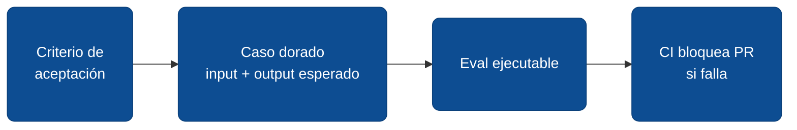

# Evaluaciones automáticas del trabajo del agente

Los gates de AIDLC asumen que un humano lee y aprueba. Funciona hoy porque el agente no se gana la confianza para operar solo. La pregunta práctica es: ¿qué construye esa confianza? La respuesta no es "más reuniones de revisión" — es **un harness de evaluaciones automáticas** que valida lo que el agente entregó contra el contrato del release. Sin ese harness, los gates son revisión humana eterna; con él, los gates se reducen a aprobar el plan.

Este módulo introduce el rol de **eval champion** y el flujo de trabajo que convierte criterios de aceptación en pruebas que corren en cada PR.

## ¿Qué es una evaluación del trabajo del agente?

Una prueba automática que verifica que el agente cumplió un criterio de aceptación específico del `releases/vX.Y.Z.md`. No es un test unitario tradicional — esos prueban una función. Una evaluación prueba **comportamiento contractual**: dado un input que un humano describiría con palabras, ¿el sistema produce el output que el contrato declara?



Una evaluación tiene tres partes: **input** (datos o estado de entrada), **acción** (lo que el agente o el sistema ejecuta), y **assertion** (qué tiene que ser cierto al final). Vive en el repo, en una carpeta `evals/`, y corre en cada PR.

## Por qué las evaluaciones importan ahora

- **Sin evals, la autonomía del agente es ruleta rusa.** Cualquier promesa de *"el agente puede operar solo"* depende de que algo distinto del humano valide el resultado. Ese algo son los evals.
- **El review humano línea por línea no escala.** Cuando el agente toca 30 archivos en un PR, leer cada diff es trabajo de jornada completa. Los evals te dicen "el contrato se cumplió" o "no se cumplió" sin que abras el archivo.
- **Los evals son el activo que sobrevive el cambio de modelo.** Si mañana cambias de Claude a un modelo distinto, tus evals te dicen si el nuevo modelo cumple los mismos contratos. Sin evals, cada cambio de modelo es un acto de fe.
- **Son la única forma honesta de medir progreso.** *"Cobertura de tests"* mide código; *"cobertura de evals"* mide cuánto del comportamiento contratado está protegido.
- **Son el habilitador de paralelismo.** Cuando el equipo confía en el harness, dos devs pueden mergear simultáneamente sin coordinarse. El CI dirá quién rompió qué.

## El rol del eval champion

El **eval champion** es la persona del equipo cuyo KPI es la cobertura del harness. No es QA tradicional — esa valida el producto. El eval champion valida **al agente**: cada criterio de aceptación nuevo del release debe quedar protegido por al menos un caso dorado antes de que la versión se cierre.

En equipos pequeños, el rol arranca como *part-time* del tech lead o de un dev senior. En equipos de 5+ personas, vale la pena que sea un sombrero dedicado. El skill clave no es codear evals — es **traducir un criterio en lenguaje natural a una assertion ejecutable**.

## Objetivo

Establecer un harness de evaluaciones que crezca release tras release, hasta que la mayoría de los gates de AIDLC dejen de requerir revisión humana línea por línea y se reduzcan a *"el harness pasa, aprobado"*.

## Entradas

- `releases/vX.Y.Z.md` con criterios de aceptación verificables.
- Un repo con CI configurado (GitHub Actions, GitLab CI o equivalente).
- Framework de tests del stack del proyecto (Vitest, xUnit, pytest, etc.) o herramienta dedicada (`promptfoo`, `evals` de Anthropic, etc.).
- Un eval champion designado, aunque sea part-time.

## Pasos para construir el harness

### Paso 1: Empezar con un solo caso dorado

El error más común es esperar a tener una "estrategia de evals" antes de escribir el primero. No esperés. Tomá el item más simple del próximo release y escribí su caso dorado.

- Mal: *"Primero diseñamos el framework de evals, después codeamos."* Tres meses sin evals.
- Bien: *"Item 1.1 dice que con el toggle apagado el PDF no muestra columna de impuesto. Eval: input = cotización con toggle off, assertion = output PDF no contiene la columna."* Un caso, hoy.

**Valor para el agente:** un primer caso dorado convierte un criterio narrativo en algo ejecutable. Establece el patrón para los siguientes.

### Paso 2: Traducir cada criterio de aceptación a un caso

Por cada item del `releases/vX.Y.Z.md` con criterio de aceptación, el eval champion redacta el caso dorado **antes** de que el dev empiece la implementación. Esa secuencia importa: el caso es la traducción ejecutable del criterio. Si no se puede escribir el caso, el criterio está mal redactado y vuelve a Concepción.

```text
Item 1.1 — Toggle "Mostrar columna de impuesto"
Criterio: con el toggle apagado, el PDF no muestra columna IMPUESTOS.

Caso dorado:
- Input: cotización con 2 ítems, IVA 12%, toggle = false
- Acción: generar PDF
- Assertions:
    - El header del PDF no contiene "IMPUESTOS"
    - El bloque totales no contiene "Base imponible" ni "Impuestos"
    - El subtotal y total siguen presentes
```

### Paso 3: Implementar el caso como código ejecutable

El eval vive en `evals/v1.16.0/item-1.1-toggle-impuesto.test.ts` (o el equivalente del stack). Un caso por archivo, nombre que mapee al item.

- Mal: poner todos los evals del release en un solo archivo gigante. Imposible de mantener.
- Bien: un archivo por item, ruta predecible, así un nuevo dev encuentra el eval en 10 segundos.

### Paso 4: Integrar al CI con bloqueo de merge

El harness se corre en cada PR. Si falla, el merge se bloquea — independiente de la revisión humana. Eso es lo que convierte al harness en un gate real, no en una sugerencia.

```yaml
# .github/workflows/evals.yml (ejemplo)
- name: Run evals
  run: pnpm test evals/
```

**Valor para el agente:** el agente puede pedirle al CI que corra los evals localmente antes de marcar `[x]` en el item. Si fallan, sabe que el item no está hecho — sin necesidad de revisión humana.

### Paso 5: Medir y exhibir cobertura

El eval champion mantiene una métrica visible: *qué porcentaje de los criterios de aceptación de los últimos N releases tiene caso dorado*. Sirve para detectar releases con criterios sin proteger.

```text
Cobertura de evals (últimas 5 versiones)
v1.12.0: 4/4 criterios cubiertos    ✓ 100%
v1.13.0: 6/7 criterios cubiertos    ⚠ 86%  (item 2.1 sin eval)
v1.14.0: 5/5 criterios cubiertos    ✓ 100%
v1.15.0: 3/3 criterios cubiertos    ✓ 100%
v1.16.0: 7/8 criterios cubiertos    ⚠ 88%  (item 3.2 sin eval)
```

### Paso 6: Mantener el harness vivo

Los evals que se ignoran cuando fallan son peor que no tenerlos — entrenan al equipo a ignorar el harness. Reglas mínimas:

- Si un eval falla y se decide aceptarlo, se documenta en `Notas` del release y se abre item para arreglarlo.
- Si un eval queda obsoleto (se cambia el comportamiento contratado), se borra **explícitamente** en el release que lo cambió. No se deja comentado.
- Los evals que tardan demasiado se acortan o se mueven a un job nocturno.

## Salidas

- Carpeta `evals/` con casos dorados organizados por versión y por item.
- CI que corre el harness en cada PR y bloquea merge en falla.
- Métrica de cobertura visible para el equipo.
- Eval champion designado con KPI claro.

## Errores comunes

- **Evals que prueban output literal, no comportamiento.** *"El PDF tiene exactamente este string"* falla cuando cambia un espacio. *"El PDF no contiene el header IMPUESTOS"* prueba lo que importa.
- **Esperar a tener "el framework perfecto" antes de escribir el primero.** El primer eval es siempre feo. Lo importante es que exista y corra en CI.
- **Evals que solo el eval champion entiende.** Si el resto del equipo no puede leerlos ni mantenerlos, son tu single point of failure.
- **No actualizar evals cuando cambia el comportamiento contratado.** El release.md cambia, pero el eval queda probando el comportamiento viejo. CI rojo permanente, equipo aprende a ignorarlo.
- **Confundir tests unitarios con evals.** Los unitarios prueban funciones; los evals prueban contratos. Coexisten — no se reemplazan.
- **Tener cobertura sin tener calidad.** 100% de criterios con eval, pero los evals son triviales (`assert response != null`). La cobertura miente; el rigor de cada eval importa.

## Prompt de auditoría

Antes de cerrar un release bajo AIDLC, el eval champion (o el agente, si está habilitado) corre:

```text
Lee releases/vX.Y.Z.md y la carpeta evals/vX.Y.Z/. Por cada item
del release con criterio de aceptación, dime:

1. ¿Existe un eval que mapea a ese criterio? (sí/no)
2. ¿El eval prueba comportamiento (no string literal)?
3. ¿El eval falla cuando el criterio NO se cumple? (intentá romperlo)
4. ¿Está integrado al CI?

Para cada item sin eval, sugerí el caso dorado en una línea.
```

:::tip Empezá hoy con uno
La barrera más alta del harness es escribir el primer eval. Eligí el criterio más simple del próximo release y escribí su caso dorado **hoy**. No "el framework perfecto" — un caso real, ejecutable, en CI. El segundo es 10x más fácil; el quinto, automático.
:::

## Puente al siguiente módulo

El harness de evals es el primer paso para reducir la dependencia del review humano línea por línea. El siguiente nivel — orquestar varios agentes en paralelo, donde uno escribe y otro audita — depende totalmente de tener este harness en producción. Cuando el harness es el árbitro, los agentes se pueden multiplicar sin caos. Hasta que llegue ese módulo, practicá multi-agente manualmente: una sesión que implementa, otra que audita contra el release.md y el harness.

---

<div className="agent-block">

### Bloque estructurado para agentes

**Objetivo:** establecer un harness de evaluaciones que valide el cumplimiento del contrato (`releases/vX.Y.Z.md`) sin requerir revisión humana línea por línea.

**Entradas:**
- `releases/vX.Y.Z.md` con criterios de aceptación verificables.
- CI configurado.
- Framework de tests del stack o herramienta dedicada.
- Eval champion designado.

**Pasos:**
1. Escribir un primer caso dorado, hoy.
2. Por cada criterio de aceptación, redactar el caso antes de implementar.
3. Implementar como código ejecutable, un archivo por item.
4. Integrar al CI con bloqueo de merge en falla.
5. Medir y exhibir cobertura por release.
6. Mantener vivo: actualizar, retirar evals obsoletos explícitamente.

**Salidas:**
- Carpeta `evals/` organizada por versión e item.
- CI corriendo el harness en cada PR.
- Métrica de cobertura visible.
- Eval champion con KPI.

**Errores comunes:**
- Evals literales en lugar de comportamiento.
- Esperar al "framework perfecto".
- Evals que solo entiende una persona.
- No actualizarlos al cambiar el contrato.
- Confundir unitarios con evals.
- Cobertura alta con calidad baja.

**Referencias cruzadas:**
- [6.9 Fase 1: Concepción del release](./09-fase-1-concepcion-del-release.md)
- [6.10 Fase 2: Construcción dirigida por release.md](./10-fase-2-construccion-dirigida-por-release.md)
- [6.11 Fase 3: Operación con humano en el bucle](./11-fase-3-operacion-con-humano-en-el-bucle.md)
- [6.5 Diseño de prompts y verificación](./05-diseno-de-prompts-y-verificacion.md)
</div>

---

## Glosario

**Caso dorado** *(Golden case)* — par input + assertions que representa la verdad esperada para un criterio de aceptación. Es la unidad mínima del harness: un caso por criterio.

**Eval champion** *(Eval champion)* — persona del equipo cuyo KPI es la cobertura del harness. Traduce criterios de aceptación a casos ejecutables. En equipos pequeños es un sombrero part-time del lead; en equipos grandes es rol dedicado.

**Cobertura de evals** *(Eval coverage)* — porcentaje de criterios de aceptación de los últimos N releases que tiene al menos un caso dorado pasando. Métrica honesta de progreso hacia autonomía.

**Comportamiento contractual** *(Contractual behavior)* — lo que el `releases/vX.Y.Z.md` declaró que tiene que ser cierto, no la implementación interna. Un eval prueba lo primero; un test unitario prueba lo segundo.

**Harness** *(Eval harness)* — conjunto del código de evals + configuración de CI + métricas. Es el activo que sobrevive cambios de modelo, refactors y rotación de equipo.

:::info Referencias primarias
- [Anthropic · Evals cookbook](https://github.com/anthropics/anthropic-cookbook) — patrones de evaluaciones para LLMs.
- [promptfoo](https://www.promptfoo.dev/) — herramienta open-source para evaluar comportamiento de prompts y agentes.
- [OpenAI · Evals](https://github.com/openai/evals) — framework de referencia para evals de modelos de lenguaje.
- [Hamel Husain · Your AI product needs evals](https://hamel.dev/blog/posts/evals/) — argumento práctico sobre por qué los evals son la única forma honesta de medir productos con IA.
:::

---

<AuthorCredit />
