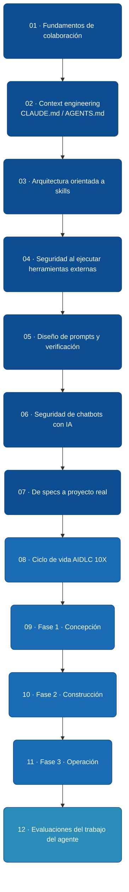

# Colaboración con Agentes de IA

Esta ruta reúne principios probados en proyectos reales para trabajar con **agentes de desarrollo** como [Claude Code](https://www.anthropic.com/claude-code), [Cursor](https://cursor.com/), [Codex](https://openai.com/codex/), [Antigravity](https://antigravity.google/) y [Kiro](https://kiro.dev/), entre otros. El material está redactado para **personas** y estructurado para que un agente pueda convertirlo en una *skill* reutilizable.

## Dos conceptos clave: skill y archivo de contexto

Antes de la ruta, conviene separar dos términos que suelen confundirse: una **skill** es una tarea reutilizable; un **archivo de contexto** (`CLAUDE.md` / `AGENTS.md` / `.cursorrules`) es el mapa del proyecto. Se usan juntos, pero no son lo mismo.

### ¿Qué es una skill?

Una *skill* es un **procedimiento reutilizable** que un agente ejecuta para resolver una tarea concreta: redactar un requerimiento, migrar una tabla, generar un manual de usuario, revisar seguridad de un endpoint. Una skill bien escrita describe:

- **Objetivo** — qué logra.
- **Entradas** — qué necesita para empezar.
- **Pasos** — cómo procede.
- **Salidas** — qué entrega.
- **Errores comunes** — qué debe evitar.

Cada módulo de esta ruta termina con un bloque estructurado que puede servirte como plantilla de skill.

### ¿Qué es un archivo de contexto (CLAUDE.md / AGENTS.md)?

Un **archivo de contexto** es un documento en la raíz del repositorio que le dice al agente **todo lo que necesita saber del proyecto antes de hacer algo**: arquitectura, convenciones, comandos comunes, reglas de seguridad, flujo de desarrollo obligatorio. Vive junto al código y se carga automáticamente al iniciar la sesión.

### Diferencia, en una tabla

| | Skill | Archivo de contexto (CLAUDE.md) |
|---|-------|------------------------------------|
| **Qué es** | Receta reutilizable para *una tarea* | Mapa general *del proyecto* |
| **Alcance** | Una acción concreta (redactar manual, migrar schema) | Todo el repo (estructura, reglas, comandos) |
| **Se invoca** | Por descripción: el agente la activa cuando la tarea coincide con el `description` de la skill. También se puede invocar explícitamente (*"usa la skill X"*) | Implícitamente: el agente lo lee en cada sesión |
| **Dónde vive** | Directorio dedicado: `skills/<nombre-skill>/SKILL.md` (+ scripts o plantillas opcionales en la misma carpeta) | `CLAUDE.md` o `AGENTS.md` en la raíz del repo |
| **Cuántos hay** | Muchos — uno por tipo de tarea recurrente | Uno por repositorio (a veces uno por subproyecto) |
| **Ejemplo típico** | "Generar un manual de usuario a partir de una captura" | "Este proyecto usa .NET 8, MySQL, tests en xUnit; antes de codear, documenta el requerimiento en `releases/vX.Y.Z.md`" |

**Regla mental:** el archivo de contexto responde *"¿cómo trabajamos aquí?"*; una skill responde *"¿cómo hacemos esta tarea?"*. Las skills pueden declararse **dentro del archivo de contexto** o en archivos separados que el contexto referencia.

## Ruta sugerida

La ruta tiene tres tramos. Los módulos **6.1 a 6.7** cubren los fundamentos: cómo colaborar con agentes, escribir contexto útil, diseñar skills, prevenir riesgos de seguridad y arrancar un proyecto desde un contrato `specs.md`. Los módulos **6.8 a 6.11** suben un nivel: presentan **AIDLC 10X**, un ciclo de vida de software con tres fases y gates humanos para que el equipo pueda construir productos completos con su agente sin perder control. El módulo **6.12** mira hacia adelante: las evaluaciones automáticas del trabajo del agente, el activo que reduce la dependencia del review humano y abre el camino a operación más autónoma.

**Alternativa en lista** (accesible y útil si el diagrama no carga):

1. [**6.1 Fundamentos de colaboración con agentes**](./01-fundamentos-colaboracion-agentes.md) — qué hace bien un agente, cuándo delegarle.
2. [**6.2 Context engineering y CLAUDE.md**](./02-context-engineering-claude-md.md) — cómo escribir un `CLAUDE.md` útil.
3. [**6.3 Arquitectura orientada a skills**](./03-arquitectura-orientada-a-skills.md) — diseñar skills reutilizables.
4. [**6.4 Seguridad al ejecutar herramientas externas**](./04-seguridad-en-herramientas-externas.md) — validación, ReDoS, timeouts.
5. [**6.5 Diseño de prompts y verificación**](./05-diseno-de-prompts-y-verificacion.md) — instrucciones claras y verificables.
6. [**6.6 Seguridad de chatbots con IA**](./06-seguridad-de-chatbots.md) — prompt injection, exposición de datos.
7. [**6.7 De specs a proyecto real**](./07-de-specs-a-proyecto-real.md) — arranque guiado: entrevista, contrato `specs.md`, scaffolding reproducible.
8. [**6.8 Ciclo de vida AIDLC 10X**](./08-ciclo-de-vida-aidlc-10x.md) — introducción al ciclo de tres fases con gates humanos para construir software con agentes.
9. [**6.9 Fase 1 · Concepción del release**](./09-fase-1-concepcion-del-release.md) — del backlog al `releases/vX.Y.Z.md` aprobado como contrato.
10. [**6.10 Fase 2 · Construcción dirigida por release.md**](./10-fase-2-construccion-dirigida-por-release.md) — implementación sin scope creep, migraciones BD probadas, CHANGELOG por repo.
11. [**6.11 Fase 3 · Operación con humano en el bucle**](./11-fase-3-operacion-con-humano-en-el-bucle.md) — bump, backup, deploy, verificación post-deploy, tag, modo incidente.
12. [**6.12 Evaluaciones del trabajo del agente**](./12-evaluaciones-del-trabajo-del-agente.md) — el harness que reduce la dependencia del review humano y habilita la autonomía progresiva del agente.

## Cómo aprovechar este contenido

1. Léelo como material de curso: cada módulo se sostiene solo.
2. Llévalo a tu proyecto: copia el bloque estructurado al archivo de contexto del agente (`CLAUDE.md`, `.cursorrules` u otro) y pídele que lo aplique.
3. Adáptalo: los ejemplos son ilustrativos. Los principios valen para cualquier stack.

---

<AuthorCredit />

**Contenido:**

- [6.1 Fundamentos de colaboración con agentes](./01-fundamentos-colaboracion-agentes.md)
- [6.2 Context engineering y CLAUDE.md](./02-context-engineering-claude-md.md)
- [6.3 Arquitectura orientada a skills](./03-arquitectura-orientada-a-skills.md)
- [6.4 Seguridad al ejecutar herramientas externas](./04-seguridad-en-herramientas-externas.md)
- [6.5 Diseño de prompts y verificación](./05-diseno-de-prompts-y-verificacion.md)
- [6.6 Seguridad de chatbots con IA](./06-seguridad-de-chatbots.md)
- [6.7 De specs a proyecto real](./07-de-specs-a-proyecto-real.md)
- [6.8 Ciclo de vida AIDLC 10X](./08-ciclo-de-vida-aidlc-10x.md)
- [6.9 Fase 1 · Concepción del release](./09-fase-1-concepcion-del-release.md)
- [6.10 Fase 2 · Construcción dirigida por release.md](./10-fase-2-construccion-dirigida-por-release.md)
- [6.11 Fase 3 · Operación con humano en el bucle](./11-fase-3-operacion-con-humano-en-el-bucle.md)
- [6.12 Evaluaciones del trabajo del agente](./12-evaluaciones-del-trabajo-del-agente.md)

