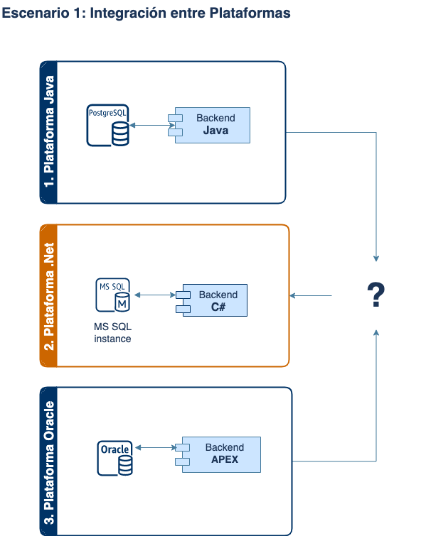
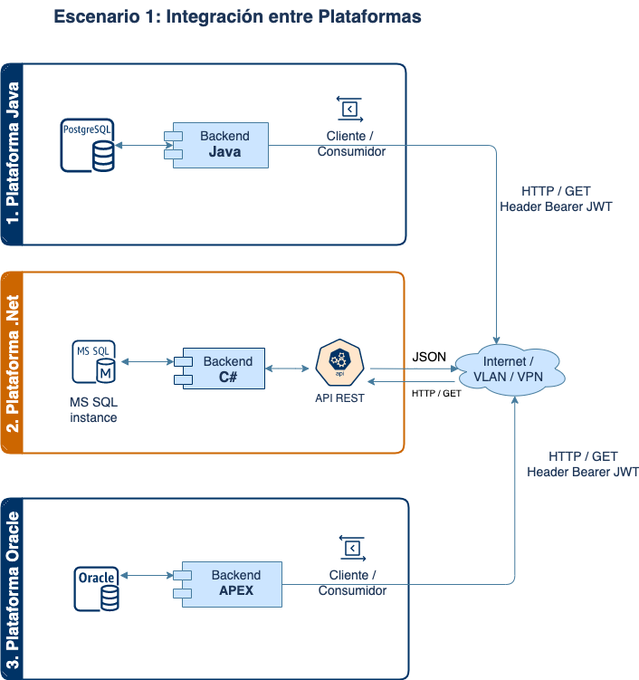
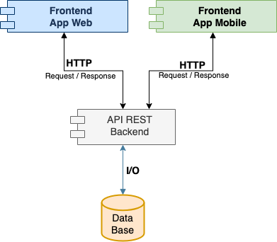
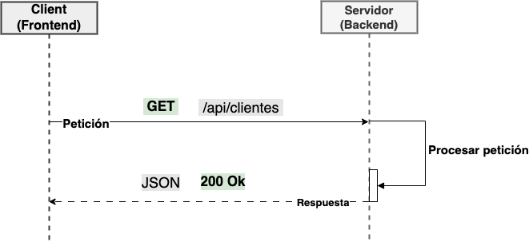

# Introducción a Web Service de tipo API REST

Un servicio web es una interfaz de programación que permite la comunicación entre dos aplicaciones a través de la red, utilizando protocolos como HTTP. Entre los diferentes tipos de servicios web, uno de los más utilizados es la API REST (Representational State Transfer). Esta arquitectura permite que las aplicaciones realicen operaciones como obtener, crear, actualizar o eliminar datos de manera estructurada y estandarizada. Gracias a REST, es posible integrar aplicaciones desarrolladas en diferentes plataformas para que trabajen juntas de manera eficiente y segura.

## Escenario 1: Integración entre Plataformas

Imagina que tienes una plataforma desarrollada en .NET que necesita compartir información con clientes o sistemas de terceros que utilizan tecnologías diversas, como Java y Oracle. En este caso, podrías crear un servicio web de tipo API REST que permita a cada plataforma consumir la información de manera segura y eficiente.

La **solución** consiste en implementar un servicio web RESTful que procese los datos desde el backend y los entregue a los consumidores bajo demanda. Para garantizar la seguridad, se pueden aplicar mecanismos de autenticación, como JSON Web Tokens (JWT), asegurando que solo los usuarios autorizados puedan acceder a la información.

### Ejemplo de Arquitectura

En la imagen adjunta, se muestra un ejemplo de arquitectura que ilustra cómo diferentes plataformas pueden integrarse mediante APIs REST:

1. **Plataforma Java**: Una aplicación en Java con base de datos PostgreSQL que consume información de la API a través de solicitudes HTTP.
2. **Plataforma .NET**: Un backend en C# que interactúa con una base de datos MS SQL y expone los datos en formato JSON a través de la API.
3. **Plataforma Oracle**: Un sistema desarrollado en APEX con base de datos Oracle, también consumiendo información mediante solicitudes HTTP.

Cada una de estas plataformas puede interactuar con la API para obtener, crear o modificar datos según sea necesario, sin importar las diferencias en tecnología. Este enfoque asegura una **comunicación estandarizada y escalable** entre sistemas heterogéneos, optimizando la interoperabilidad y simplificando la integración.

## Escenario 2: Separación de Lógica entre Backend y Frontend

En un sistema moderno, es común separar la lógica de negocio del backend y la interfaz de usuario del frontend, manteniendo una estructura independiente pero interconectada. Este enfoque permite una **consistencia en la lógica de negocio** y ofrece flexibilidad para desarrollar aplicaciones con diferentes tecnologías en el frontend, ya sea web o móvil, sin depender del backend.

La **solución** en este caso es crear una API REST que sirva como intermediaria entre el backend y cualquier frontend. De esta manera, la lógica de negocio reside exclusivamente en el backend, mientras que el frontend se encarga solo de la presentación y experiencia del usuario. Esto permite que:

- La lógica de negocio se mantenga **centralizada y consistente**, evitando duplicación de lógica en cada cliente.
- El desarrollo del frontend se pueda realizar en múltiples tecnologías (como Angular, React, Vue para web, o Flutter, Kotlin y React Native para móvil), permitiendo elegir la mejor opción según las necesidades sin afectar al backend.
- La interfaz de usuario sea **independiente y escalable**, permitiendo actualizar o cambiar el frontend sin necesidad de modificar la lógica del backend.

### Beneficios de esta Arquitectura

- **Escalabilidad**: El frontend y el backend pueden escalar de manera independiente, según las demandas del usuario y los recursos del servidor.
- **Facilidad de Mantenimiento**: Al mantener la lógica de negocio en el backend, cualquier cambio en la lógica se aplica automáticamente a todos los clientes.
- **Interoperabilidad**: La API REST permite que diferentes tipos de frontends, incluso desarrollados en plataformas distintas, se conecten al mismo backend.

Este enfoque es especialmente útil en aplicaciones que requieren **flexibilidad en la presentación** y deben ofrecer una experiencia consistente en múltiples dispositivos y entornos.

## Las características fundamentales de una API REST

- Stateless: Cada solicitud del cliente contiene toda la información necesaria, sin depender del estado en el servidor
- HTTP Methods: Usa métodos HTTP como GET, POST, PUT, DELETE para definir operaciones CRUD (Create, Read, Update, Delete).
- Resource-Based: La información se estructura en "recursos" identificados por URL, y las acciones se realizan sobre estos.
- Representation: Los datos se envían en formatos como JSON o XML, permitiendo flexibilidad en la representación
- Cacheable: Las respuestas deben ser cacheables para mejorar la eficiencia y el rendimiento.
- Layered System: La arquitectura permite capas (por ejemplo, entre cliente y servidor), lo que facilita escalabilidad y seguridad.

