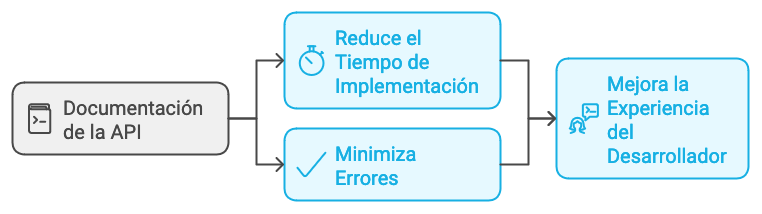
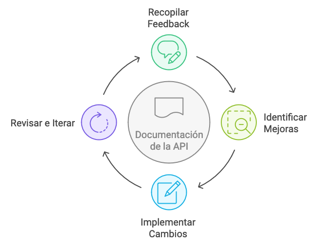

# Documentación y Mejora Continua

La documentación de una API es crucial para facilitar la integración por parte de otros desarrolladores. Una buena documentación reduce el tiempo de implementación y el margen de errores al consumir la API.

## Herramientas para Documentación

- **Swagger/OpenAPI**: [Swagger/OpenAPI](https://swagger.io/) Estas herramientas permiten generar documentación interactiva para las APIs. Swagger se integra al API desarrollado con librerías como **Springfox** para Java y **Swashbuckle** para .NET. Con **Swagger**, los desarrolladores pueden explorar los endpoints, probar peticiones, y visualizar la estructura de las respuestas de una manera intuitiva. **OpenAPI** es el estándar detrás de Swagger que define cómo debe estructurarse la documentación para las APIs.
- **Ascii Doctor**: [Ascii Doctor](https://asciidoctor.org/) es una herramienta que permite crear documentación técnica en un formato limpio y estructurado. Es ideal para generar documentación más detallada o para proyectos que requieren una presentación personalizada.
- **Postman**: [Postman](https://www.postman.com/) es una herramienta popular para probar y documentar APIs. Permite a los desarrolladores crear colecciones de solicitudes, compartirlas, y generar documentación que describe cómo interactuar con la API. Además, facilita la realización de pruebas automáticas para validar el comportamiento de los endpoints.

### Comparación de Herramientas

A continuación, se presenta una tabla comparativa de las herramientas mencionadas para la documentación de APIs:

| Herramienta      | Ventajas                                                                 | Desventajas                                                     | Casos de Uso                          |
|------------------|--------------------------------------------------------------------------|-----------------------------------------------------------------|---------------------------------------|
| **Swagger/OpenAPI** | Documentación interactiva, permite probar peticiones, estándar reconocido. Se integra con librerías como **Springfox** para Java y **Swashbuckle** para .NET. | Puede requerir configuración inicial compleja.                   | APIs públicas y privadas, integración continua. |
| **Ascii Doctor** | Documentación técnica detallada y personalizada, fácil de mantener.      | Menos visual, requiere conocimientos de marcado AsciiDoc.       | Documentación técnica extensa y detallada. |
| **Postman**      | Pruebas automáticas, colecciones compartibles, fácil de usar.            | La documentación generada es menos estructurada que Swagger.    | Pruebas de endpoints, generación rápida de documentación. |

## Mejores Prácticas para Documentar APIs

- **Documentación Interactiva**: Utilizar herramientas como **Swagger** para ofrecer una interfaz donde los usuarios puedan probar los distintos endpoints de la API.
- **Definir Ejemplos Claros**: Proporcionar ejemplos de peticiones y respuestas para cada endpoint, incluyendo los posibles códigos de error y cómo manejarlos.
- **Versionado de la Documentación**: Mantener versiones de la documentación actualizadas para que cada versión de la API tenga su documentación correspondiente.

## Automatización de la Documentación

- **Generación Automática**: Utilizar herramientas que permitan generar documentación automáticamente a partir del código de la API. Swagger, por ejemplo, se integra fácilmente con muchas plataformas para generar documentación basada en anotaciones del código.
- **Documentación Continua**: Mantener la documentación actualizada a medida que se hacen cambios en la API, para asegurar que los consumidores de la API siempre tengan información correcta y completa.

## Mejora Continua Basada en Feedback

- **Recopilación de Feedback (retroalimentación)**: Permitir que los desarrolladores que consumen la API proporcionen comentarios sobre la documentación. Esto puede ayudar a identificar áreas de mejora o aclarar puntos confusos.
- **Iteración Continua**: Basarse en el feedback recibido para iterar y mejorar tanto la API como su documentación. La documentación debe considerarse un elemento vivo del proyecto.

## Glosario

**OpenAPI** *(OpenAPI Specification)* — estándar abierto para describir APIs REST de forma legible para humanos y máquinas ([OpenAPI 3.1](https://spec.openapis.org/oas/v3.1.0)).

**Swagger** *(Swagger UI / Swagger Tools)* — conjunto de herramientas que implementan OpenAPI, incluye documentación interactiva ([Swagger](https://swagger.io/)).

**AsciiDoctor** *(AsciiDoctor)* — procesador de texto AsciiDoc para generar documentación técnica ([AsciiDoctor](https://asciidoctor.org/)).

**Postman** *(Postman)* — cliente HTTP para probar APIs, crear colecciones y generar documentación ([Postman](https://www.postman.com/)).

**Documentación viva** *(Living documentation)* — documentación que se actualiza automáticamente desde el código o las pruebas, evitando desincronización.

**Versionado de la API** *(API versioning)* — mecanismo para evolucionar la API sin romper consumidores existentes.

:::info Referencias primarias
- [OpenAPI Specification 3.1](https://spec.openapis.org/oas/v3.1.0) — estándar para descripción de APIs.
- [Swagger](https://swagger.io/) — ecosistema de herramientas OpenAPI.
- [Postman Learning Center](https://learning.postman.com/) — documentación oficial de Postman.
- [AsciiDoctor](https://asciidoctor.org/) — herramienta de documentación técnica.
:::

---

### Bloque estructurado para agentes

**Objetivo:** establecer documentación viva y procesos de mejora continua para una API REST.

**Entradas:**
- Endpoints y contratos actuales de la API.
- Herramientas disponibles (Swagger/OpenAPI, AsciiDoctor, Postman).
- Feedback de consumidores internos y externos.
- Plan de versionado de la API.

**Pasos:**
1. Generar documentación desde el código con Swagger/OpenAPI, incluyendo ejemplos de request y response.
2. Complementar con guías narrativas en AsciiDoctor cuando se requiera detalle adicional.
3. Mantener colecciones Postman para pruebas y reproducción de casos.
4. Versionar la documentación junto con la API y el código.
5. Canalizar feedback de consumidores y convertirlo en issues priorizados.
6. Iterar la API y la documentación en cada release manteniendo compatibilidad declarada.

**Salidas:**
- Portal de documentación interactivo accesible y actualizado.
- Colecciones de pruebas reutilizables.
- Registro de cambios entre versiones de la API.

**Errores comunes:**
- Publicar documentación desactualizada respecto al código en producción.
- Omitir ejemplos de error y dejar solo los de éxito.
- No versionar la documentación y perder trazabilidad entre releases.
- Ignorar el feedback recurrente de los consumidores.

**Referencias cruzadas:**
- [1.1.2 Componentes Básicos de un Servicio Web tipo API REST](./02-componentes-basicos-api-rest.md)
- [5.2 Versionado semántico en equipos](../../documentacion-y-requerimientos/02-versionado-semantico-en-equipos.md)
- [5.4 Trazabilidad requerimiento → release](../../documentacion-y-requerimientos/04-trazabilidad-requerimiento-release.md)

