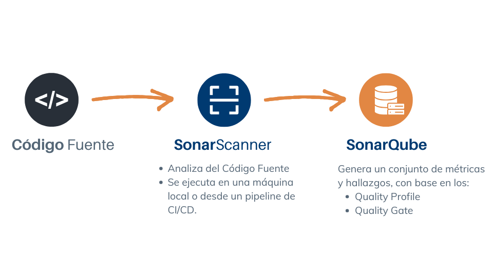

# Introducción a SonarQube

## ¿Qué es SonarQube?

SonarQube™ es la herramienta líder para inspeccionar continuamente la calidad y seguridad del código, potenciando a los equipos de desarrollo. Soporta más de 25 lenguajes populares como Java, C#, VB.Net, JavaScript, TypeScript, C++, PHP, APEX entre otros.

### Funcionalidades principales

- Análisis estático del código fuente
- Evaluación según estándares de calidad definidos
- Identificación de bugs, vulnerabilidades, puntos sensibles de seguridad y problemas de mantenibilidad.

### ¿Cómo funciona SonarQube?

- El código fuente es analizado por el scanner, que aplica reglas estáticas configuradas previamente.
- Los resultados son enviados al servidor, donde se presentan métricas, alertas y dashboards visuales.
- Los resultados pueden utilizarse para permitir o no la publicación de la aplicación, o bien por los equipos que usan la información para mejorar continuamente la calidad y seguridad de su código.
  

## ¿Qué es SonarScanner?

SonarScanner es una herramienta de línea de comando utilizada para analizar el código fuente localmente y enviar resultados a SonarQube.

### ¿Cómo funciona?

1. El desarrollador ejecuta el análisis con SonarScanner desde su máquina local o desde un pipeline de CI/CD.
2. SonarScanner analiza el código estáticamente, generando un conjunto de métricas y hallazgos.
3. Estos resultados son enviados al servidor de SonarQube (SonarQube Server) donde son almacenados, organizados y visualizados a través de la interfaz web.

- [Descargar SonarScanner](https://docs.sonarqube.org/latest/analysis/scan/sonarscanner/)
- [SonarScanner para .NET](https://docs.sonarqube.org/latest/analyzing-source-code/scanners/sonarscanner-for-dotnet/)
- [SonarScanner para Maven](https://docs.sonarqube.org/latest/analyzing-source-code/scanners/sonarscanner-for-maven/)
- [Ver todos los lenguajes soportados](https://docs.sonarsource.com/sonarqube-server/latest/analyzing-source-code/languages/overview/)

## ¿Qué es SonarQube Server?

Sonar-Server es la plataforma centralizada que almacena los resultados del análisis estático, configura perfiles de calidad (Quality Profiles) y criterios de evaluación (Quality Gates), y ofrece reportes completos para la gestión del proyecto.

## ¿Qué es SonarLint?

SonarLint es una extensión para IDEs que permite detectar y corregir problemas en el código en tiempo real, antes de enviarlo a SonarQube.
[Instalar SonarLint](https://www.sonarlint.org/)

### ¿Cómo ayuda?

- SonarLint actúa como un analizador en vivo dentro del editor de código, alertando al desarrollador inmediatamente sobre bugs, code smells o posibles vulnerabilidades mientras escribe el código.
- Evita tener que esperar a que el análisis se ejecute en el servidor SonarQube, permitiendo una retroalimentación inmediata.
- Puede integrarse con SonarQube para mantener consistencia entre los resultados locales y los de servidor.
