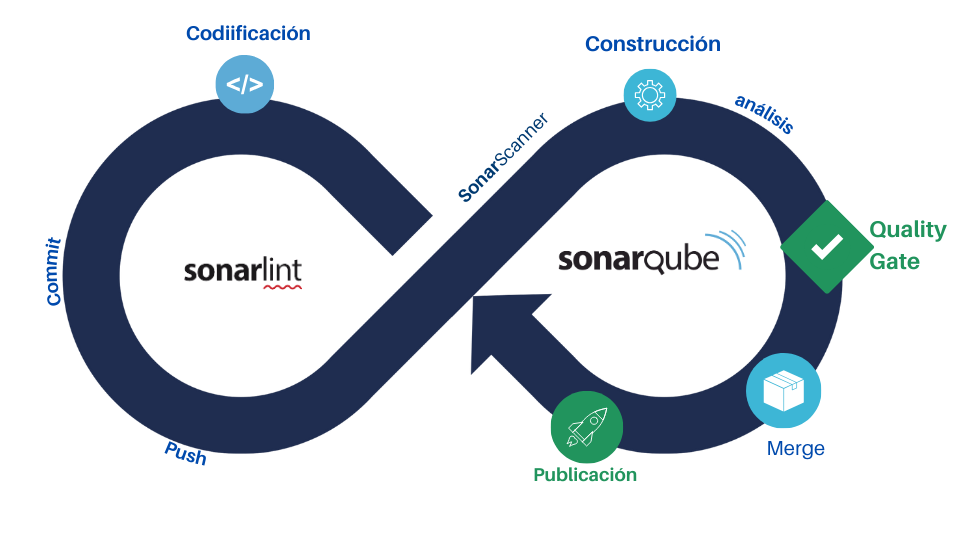

# Integración de SonarQube en el ciclo DevOps

SonarQube y sus componentes —**SonarScanner**, **SonarLint** y el **SonarQube Server**— pueden integrarse de manera efectiva en el flujo de DevOps, automatizando el control de calidad y seguridad desde la codificación hasta el despliegue.

## Flujo de integración típico

1. **Codificación con SonarLint:** El desarrollador escribe código y SonarLint analiza en tiempo real dentro del IDE, detectando errores, malas prácticas y problemas de seguridad.
2. **Commit y Push al repositorio:** El código corregido se sube a un sistema de control de versiones como Git.
3. **Ejecución de pipeline (CI/CD):** Al hacer push o abrir un pull request, se activa el pipeline de integración continua. Aquí entra **SonarScanner**, ejecutándose en el pipeline para analizar el código automáticamente.
4. **Publicación de resultados en SonarQube Server:** Los resultados del análisis estático son enviados al servidor de SonarQube, que los presenta visualmente para su revisión.
5. **Evaluación con Quality Gates:** El servidor aplica reglas de calidad (Quality Gates) para decidir si el código puede avanzar a producción. Si no cumple con los criterios (por ejemplo, presencia de bugs críticos o baja cobertura), se detiene el flujo.
6. **Merge/Despliegue automático:** Solo si se aprueba el Quality Gate, el pipeline permite el merge o el despliegue a producción.

### Beneficios clave para DevOps

- **Prevención automatizada de errores:** Se evita que código defectuoso llegue a producción.
- **Mayor velocidad con menor riesgo:** Aumenta la frecuencia de entregas sin sacrificar seguridad ni calidad.
- **Feedback inmediato:** Cada commit puede recibir evaluación inmediata y objetiva.
- **Estándares de calidad compartidos:** Toda la organización puede alinear sus prácticas de desarrollo.
- **Mejor visibilidad:** Todos los miembros del equipo pueden consultar el estado del proyecto desde un único dashboard.

:::info
Integrar SonarQube al ciclo DevOps convierte la calidad del código en una métrica operativa continua, no en un paso aislado o final.
:::

## ¿Quieres verlo en acción?

Puedes explorar un proyecto real que ya está integrado con SonarCloud y GitHub:

- 🔎 **Panel en SonarCloud:** [SonarQube Cloud DiezX.Api.Commons](https://sonarcloud.io/project/overview?id=SolucionesModernas10X_DiezX.Api.Commons)  
- 💻 **Código fuente en GitHub:** [github.com/10xGuatemala/DiezX.Api.Commons](https://github.com/10xGuatemala/DiezX.Api.Commons)

Este ejemplo te ayudará a visualizar cómo se conectan los componentes de SonarQube con los pipelines de CI/CD en un proyecto profesional.
