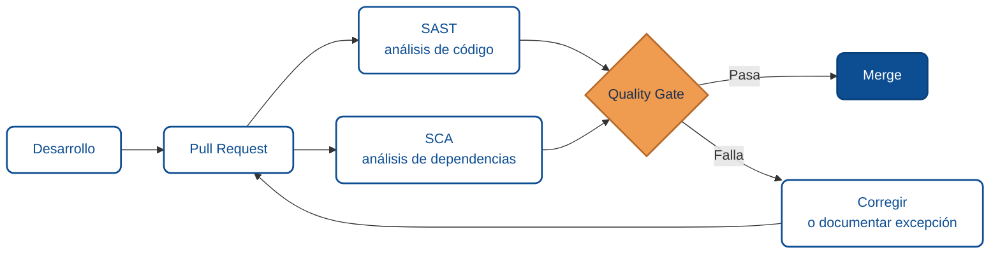

import AuthorCredit from '@site/src/components/AuthorCredit';

# SAST y SCA en la fase de validación

Validar una entrega no significa revisar solo si "funciona". También conviene revisar si el cambio introduce riesgos técnicos o de seguridad. En ese punto aparecen dos prácticas complementarias: `SAST` y `SCA`.

:::info Ver también
Este módulo complementa [Integración de SonarQube en el ciclo DevOps](./04-ciclo-devops.md).
:::

## Dónde encajan en el ciclo

## 5.1 Qué aporta SAST

`Static Application Security Testing` analiza el código fuente o artefactos relacionados sin ejecutar la aplicación. Su objetivo es encontrar patrones de riesgo antes de que lleguen a producción.

SAST ayuda a detectar, por ejemplo:

- Errores de validación.
- Uso inseguro de datos.
- Patrones vulnerables conocidos.
- Problemas de mantenibilidad que también afectan la calidad.

## 5.2 Qué no cubre SAST

SAST no resuelve todo. No reemplaza:

- Pruebas funcionales.
- Validación con usuarios.
- Revisión de arquitectura.
- Monitoreo en producción.
- Análisis de dependencias de terceros.

Por eso conviene verlo como parte de la validación, no como su totalidad.

## 5.3 Dónde entra SAST en el ciclo

Una ubicación práctica para SAST es la fase de **Validación**, antes del merge o antes del despliegue. El objetivo es que el pipeline ayude a responder:

- ¿El cambio cumple estándares mínimos?
- ¿Existen hallazgos críticos o bloqueantes?
- ¿Se puede avanzar con seguridad razonable?

## 5.4 Quality Gate como criterio operativo

Un `quality gate` convierte reglas técnicas en una decisión operativa. No reemplaza el juicio humano, pero ayuda a mantener consistencia.

Por ejemplo, puede bloquear avances cuando:

- Hay vulnerabilidades críticas.
- La calidad mínima definida por el equipo no se cumple.
- Aparecen hallazgos que requieren revisión antes del release.

## 5.5 Qué aporta SCA

`Software Composition Analysis` se enfoca en las dependencias que una aplicación utiliza, incluidas las transitivas. Esto importa porque una aplicación puede ser segura en su código propio y aun así heredar riesgo desde librerías externas.

SCA ayuda a detectar:

- Dependencias vulnerables.
- Versiones obsoletas con alertas conocidas.
- Riesgos heredados por dependencias transitivas.
- Necesidad de actualizar, reemplazar o justificar excepciones.

## 5.6 Dependencias transitivas

Una dependencia transitiva es una librería que tu proyecto no instaló directamente, pero que llega como requisito de otra. Ese detalle importa porque el riesgo puede existir aunque nadie la haya agregado “a mano”.

Por eso no basta con revisar solo `package.json`, `csproj` o archivos equivalentes. También hay que considerar el árbol completo de dependencias.

## 5.7 Qué hacer ante una alerta

No todas las alertas se resuelven del mismo modo, pero el flujo básico suele ser:

1. Confirmar el impacto real.
2. Actualizar la dependencia si existe una versión segura compatible.
3. Sustituirla si ya no es mantenible o segura.
4. Documentar una excepción temporal si no hay alternativa inmediata.

La excepción no debe convertirse en olvido. Debe quedar visible y con contexto.

## 5.8 Integración típica en forjas y pipelines

Hoy es común que plataformas de desarrollo y CI ofrezcan integración con análisis de código y dependencias. Lo relevante no es la marca de la herramienta, sino el flujo:

- Ejecutar análisis en cada cambio relevante.
- Mostrar resultados en el pipeline o pull request.
- Definir umbrales claros para bloquear o permitir avance.
- Mantener evidencia del riesgo aceptado cuando exista excepción.

## 5.9 Validación completa: usuarios + SAST + SCA

Una validación madura combina varias miradas:

- **Usuarios o negocio:** confirman utilidad y comprensión del cambio.
- **SAST:** revisa riesgos en el código y hallazgos estáticos.
- **SCA:** revisa riesgo en dependencias y componentes reutilizados.

Juntas, estas revisiones reducen puntos ciegos.

## 5.10 Utilidad para agentes y automatización

Para un agente, esta fase ofrece señales estructuradas sobre riesgo:

- Qué hallazgos son bloqueantes.
- Qué dependencias requieren atención.
- Qué excepciones están documentadas.
- Qué parte del pipeline valida calidad y seguridad.

Eso mejora la capacidad de generar resúmenes, checklists o skills operativas con contexto suficiente.

## Resumen para agentes

- **Objetivo:** validar seguridad y calidad antes de implementar.
- **Entradas comunes:** código fuente, dependencias directas y transitivas, reglas del pipeline.
- **Controles clave:** SAST, SCA, quality gate, excepción documentada.
- **Salidas esperadas:** decisión informada de avanzar, corregir o documentar riesgo.
- **Errores frecuentes:** confiar solo en pruebas funcionales, ignorar dependencias transitivas, aceptar alertas sin contexto.

---

<AuthorCredit />
