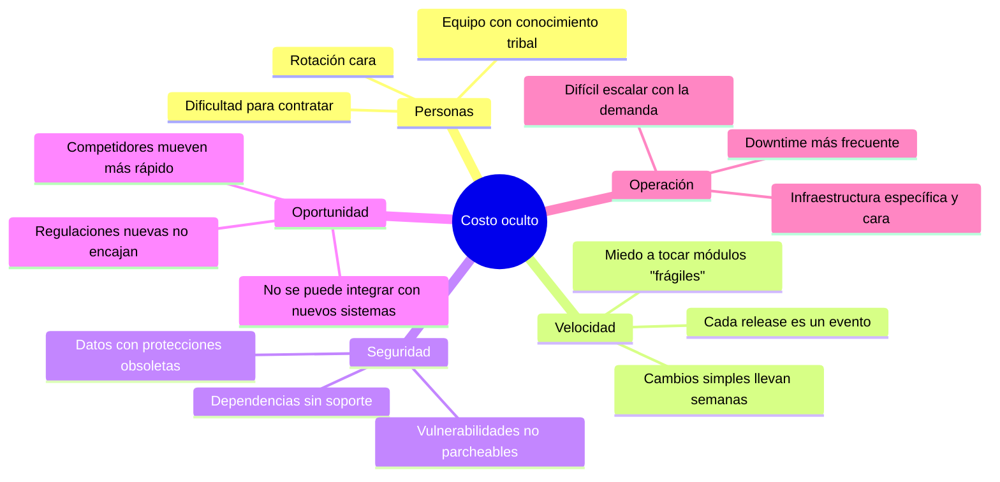

import AuthorCredit from '@site/src/components/AuthorCredit';

# El costo oculto del software legacy

Un sistema "legacy" no es necesariamente uno viejo. Es un sistema que **no puede evolucionar al ritmo que el negocio necesita**. A veces tiene tres años y ya lo es; a veces tiene veinte y todavía no.

El problema es que su costo rara vez aparece en una sola línea del presupuesto. Se paga de a poco, en muchos lugares, y solo se hace visible cuando ya es grave.

## Dónde se esconde el costo

Ninguna de estas categorías aparece en una factura. Pero juntas son las que acaban por forzar el rewrite a destiempo — en medio de una crisis, no en un momento planificado.

## Señales de deuda crítica

No todo sistema viejo debe modernizarse. Hay que distinguir el **legacy saludable** (hace su trabajo, estable, nadie lo necesita tocar) del **legacy crítico** (bloquea al negocio).

Señales de que el legacy ya es crítico:

| Señal | Por qué importa |
|-------|-----------------|
| El equipo que lo mantiene se reduce cada año | Cuando se va la última persona, queda caja negra |
| Dependencias fuera de soporte (frameworks, BD, SO) | Parches de seguridad dejan de existir |
| Cambios simples requieren pruebas manuales largas | Indicador de falta de tests y acoplamiento alto |
| Cualquier integración con sistemas nuevos es un proyecto | Aísla al sistema de la estrategia del negocio |
| Incidentes repetidos que "nadie sabe por qué ocurren" | Conocimiento tácito que ya se perdió |
| Regulaciones recientes que no se pueden cumplir con el diseño actual | Riesgo legal creciente |

Si tres o más de estas señales aplican, el legacy ya no es una opción sostenible, es un pasivo.

## Cuándo *no* modernizar

Modernizar por modernizar es otra forma de quemar presupuesto. No lo hagas solo porque:

- El stack "se ve viejo" pero el sistema funciona y no cambia.
- Hay un framework nuevo de moda.
- El equipo quiere usar algo que les guste más.
- Alguien lo propuso en una reunión estratégica sin evaluar alternativas.

La pregunta correcta no es *"¿es viejo?"*. Es *"¿me impide alcanzar los objetivos del negocio en los próximos 12–24 meses?"*.

## Tres estrategias de respuesta

Cuando la respuesta es "sí, me impide avanzar", hay tres caminos:

1. **Mantener con contención.** Parchar lo imprescindible, pero no invertir en mejoras. Solo tiene sentido si el sistema tiene fecha de retiro clara y cercana.
2. **Reemplazo progresivo (strangler fig).** Construir piezas nuevas alrededor del legacy y migrar por dominio. Ver el [siguiente módulo](./02-migracion-progresiva.md).
3. **Rewrite completo.** Reconstruir desde cero. Caro, lento, alto riesgo; rara vez es la mejor opción.

En la mayoría de los casos que vemos en la región, la **estrategia progresiva** da mejor retorno porque reduce riesgo y permite entregar valor mientras se migra.

## Cómo justificar la inversión

Al presentar un plan de modernización, evita los argumentos técnicos puros ("el framework está desactualizado"). Prefiere los argumentos de negocio:

- **Tiempo de entrega**: "Un cambio de este tipo toma X semanas hoy; con la nueva arquitectura tomaría Y días."
- **Riesgo**: "Si esta dependencia tiene una CVE crítica mañana, no tenemos forma de parchearla."
- **Oportunidad**: "Para cumplir la regulación N o integrarnos con el proveedor M, el sistema actual no puede; uno nuevo sí."
- **Costo operativo**: "La infraestructura actual cuesta X al año; con la nueva arquitectura estimamos Y."

Una historia de negocio bien armada consigue el presupuesto. Una lista de tecnologías no.

## Preparar al equipo y al cambio

Modernizar es tanto un cambio técnico como un cambio humano:

- Documenta el sistema legacy **antes** de empezar a modificarlo (un agente bien dirigido puede ayudar, ver [Colaboración con Agentes de IA](../../colaboracion-con-agentes-ia/02-context-engineering-claude-md.md)).
- Identifica quién posee el conocimiento tribal y apóyalo en la transición.
- Formaliza el dominio: glosario, reglas de negocio, casos de uso reales.
- Alinea expectativas: "no se verá en 3 meses, se verá en 12".

## Cerrando el ciclo

Un proyecto de modernización sin métricas es un proyecto sin brújula. Define desde el inicio cómo vas a medir el progreso:

- Porcentaje de tráfico/funcionalidad ya migrada.
- Incidentes asociados al legacy vs. a lo nuevo.
- Tiempo promedio de entrega de cambios.
- Costo de operación por módulo migrado.

Esos números convierten una migración en algo auditable, no solo sentido.

---

### Bloque estructurado para agentes

**Objetivo:** evaluar si un sistema legacy requiere modernización y preparar el caso de negocio asociado.

**Entradas:**
- Sistema o conjunto de sistemas actuales.
- Objetivos del negocio a 12–24 meses.
- Inventario de dependencias (frameworks, librerías, BD, SO).
- Historial de incidentes y tiempos de entrega.

**Pasos:**
1. Detectar señales de deuda crítica (tabla de referencia).
2. Clasificar legacy saludable vs. legacy crítico.
3. Evaluar las tres estrategias: contención, reemplazo progresivo, rewrite.
4. Construir caso de negocio en términos de tiempo, riesgo, oportunidad y costo operativo.
5. Definir métricas de progreso verificables.
6. Documentar el sistema legacy antes de intervenirlo.

**Salidas:**
- Diagnóstico con justificación de negocio.
- Estrategia seleccionada con métricas.
- Documento de contexto del legacy para apoyar la migración.

**Errores comunes:**
- Modernizar solo porque "se ve viejo".
- Justificar con argumentos técnicos sin conectar a negocio.
- Iniciar migración sin documentar el sistema actual.
- Omitir la dimensión humana (conocimiento tribal, rotación).

**Referencias cruzadas:**
- [02 · Migración progresiva (strangler fig)](./02-migracion-progresiva.md)
- [02 · Context engineering](../../colaboracion-con-agentes-ia/02-context-engineering-claude-md.md)

---

<AuthorCredit note={<>Basado en contenido del <a href="https://www.10x.gt/blog/" target="_blank" rel="noopener noreferrer">blog de 10X</a>.</>} />
