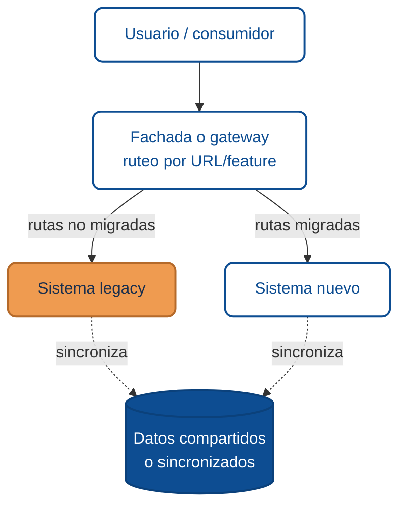

# Migración progresiva: el patrón strangler fig

El patrón **strangler fig** — nombrado por una planta tropical que crece alrededor de un árbol y progresivamente lo reemplaza — es la forma más segura y documentada de modernizar un sistema sin apagarlo.

La idea es simple: **el sistema nuevo crece alrededor del viejo**, y va tomando responsabilidades una por una. Hasta que el viejo puede retirarse sin que nadie lo note.

## Por qué funciona mejor que el rewrite

| Rewrite | Strangler fig |
|---------|---------------|
| "Lo rehacemos todo y luego lo reemplazamos." | "Reemplazamos de a pedazos, en producción." |
| Riesgo concentrado en el "big bang" | Riesgo distribuido en decenas de migraciones pequeñas |
| Valor al final (a veces nunca) | Valor continuo desde la primera migración |
| El legacy sigue evolucionando mientras escribes el nuevo | El legacy queda congelado; solo se mantiene lo crítico |
| El equipo aprende todo al final | El equipo aprende sobre el sistema real de forma incremental |

El rewrite clásico tiene una tasa de fracaso alta. El strangler fig, bien hecho, rara vez falla del todo — a lo sumo se extiende en el tiempo.

## La anatomía del patrón

Tres piezas clave:

1. **Fachada de ruteo** (reverse proxy, API gateway, frontend wrapper): decide qué requests van al viejo y cuáles al nuevo.
2. **Sistema nuevo**: implementa primero los casos de uso más valiosos o menos arriesgados.
3. **Capa de datos coexistente**: los dos sistemas ven los mismos datos — o sincronizados — durante la transición.

## Fases de un strangler fig

### Fase 1 · Documentar lo que tienes

Antes de extender algo, entiende qué hay. Mapea:

- Funcionalidades (no tablas; funcionalidades).
- Usuarios por funcionalidad.
- Reglas de negocio reales (no las "oficiales" — las que el código aplica hoy).
- Integraciones con otros sistemas.

Este es el mapa que guiará el orden de migración.

### Fase 2 · Poner la fachada

Introduce el ruteador *antes* de migrar nada. Al principio, el 100% del tráfico sigue yendo al legacy. Pero ya tienes el punto donde podrás cambiar routing sin tocar clientes.

**Beneficio clave**: cualquier cambio posterior pasa por la fachada, nunca por una migración de clientes.

### Fase 3 · Migrar por dominio, no por capa

Este es el error más común: equipos que intentan "primero la base de datos, luego el backend, luego el frontend". Resultado: meses sin entregar valor.

La alternativa: elige una **funcionalidad completa** (p.ej. "generar reporte mensual") y migra todas sus capas al sistema nuevo. El resto sigue en el legacy. Cuando el tráfico de esa funcionalidad se estabiliza, eliges la siguiente.

### Fase 4 · Coexistencia de datos

Durante la migración, los dos sistemas suelen necesitar ver los mismos datos. Opciones:

- **Misma base de datos**: simple, pero acopla las dos aplicaciones.
- **Sincronización unidireccional**: útil cuando una de las dos aplicaciones es "fuente de verdad".
- **Sincronización bidireccional**: necesaria en transiciones largas; costosa y con riesgos de conflicto.
- **Eventos / CDC** (change data capture): escalable, pero añade complejidad operativa.

No hay una opción universal. La regla práctica: usa la más simple que tu caso tolere.

### Fase 5 · Corte final

Cuando el legacy ya no tiene tráfico real, llega el momento de retirarlo. Pasos prudentes:

1. Confirmar métricas: no hay requests al legacy por N semanas.
2. Congelar el legacy: nadie puede hacerle cambios.
3. Mantenerlo apagado un tiempo en modo "rollback posible".
4. Apagar definitivamente y archivar.

## Antipatrones típicos

- **"Mini legacy":** migras solo un pedazo y te quedas meses ahí. El legacy sigue creciendo porque tiene que seguir evolucionando en paralelo.
- **Sin métricas de progreso:** nadie sabe qué porcentaje se migró ni cuánto falta. Imposible defender el proyecto frente a stakeholders.
- **Doble mantenimiento indefinido:** cada cambio debe hacerse en los dos sistemas. Si esto dura más de seis meses, el equipo quema.
- **Fachada frágil:** un gateway mal hecho puede ser el nuevo cuello de botella.
- **Migrar sin simplificar:** reproducir el legacy en una tecnología nueva, sin repensar el diseño. Pierdes la oportunidad de modernizar de verdad.

## Casos comunes

Algunos ejemplos de migraciones progresivas frecuentes:

| De | A | Punto de entrada típico |
|----|---|-------------------------|
| Aplicación monolítica on-premise | Servicios desacoplados en la nube | API gateway al frente del monolito |
| Frontend de servidor (JSP, ASP.NET Forms) | SPA + API | Frontend nuevo consume endpoints del monolito vía `/api`, y gradualmente los reemplaza |
| Oracle Forms / aplicaciones cliente-servidor | Web moderna | Replicar pantallas críticas primero; mantener el resto mientras se migra |
| Procesos batch nocturnos | Procesos asíncronos orientados a eventos | Dual-run: correr ambos y comparar resultados |

## Gobernanza y comunicación

Una migración larga necesita gobernanza ligera pero constante:

- **Reporte quincenal de progreso** (% migrado, incidentes por sistema, próximos dominios).
- **Decisiones registradas** (por qué se priorizó X sobre Y).
- **Dueño único** del proyecto de migración, no comité.
- **Visibilidad a negocio**: dashboards o one-pagers que muestren el avance sin tecnicismos.

## Glosario

**Strangler Fig** *(Strangler Fig Pattern)* — patrón de migración incremental que envuelve el sistema legacy y redirige gradualmente funcionalidad al nuevo, descrito por [Martin Fowler](https://martinfowler.com/bliki/StranglerFigApplication.html).

**Fachada** *(Facade)* — componente que expone una interfaz unificada y oculta la complejidad del legacy y del nuevo sistema detrás.

**Big bang** *(Big-bang migration)* — estrategia de migración de todo el sistema en una sola entrega; alto riesgo y contraria al enfoque strangler.

**Dominio** *(Bounded context)* — área funcional coherente del negocio que puede migrarse como unidad independiente.

**Rollback** *(Rollback)* — vuelta atrás segura a la versión previa cuando la nueva implementación falla.

**Shadow traffic** *(Shadow traffic)* — envío del mismo request a legacy y a la nueva implementación para comparar resultados sin impactar al usuario.

:::info Referencias primarias
- [Martin Fowler · Strangler Fig Application](https://martinfowler.com/bliki/StranglerFigApplication.html) — definición canónica del patrón.
- [Michael Feathers · Working Effectively with Legacy Code](https://www.oreilly.com/library/view/working-effectively-with/0131177052/) — técnicas de intervención segura en legacy.
- [ThoughtWorks Technology Radar](https://www.thoughtworks.com/radar) — prácticas recomendadas de modernización.
:::

---

### Bloque estructurado para agentes

**Objetivo:** ejecutar una migración legacy → nuevo aplicando el patrón strangler fig con riesgo controlado.

**Entradas:**
- Sistema legacy documentado con inventario de funcionalidades.
- Sistema objetivo con arquitectura definida.
- Infraestructura para introducir un ruteador/gateway.
- Estrategia de coexistencia de datos.

**Pasos:**
1. Documentar el legacy por funcionalidades (no por capas).
2. Introducir fachada de ruteo con 100% de tráfico al legacy inicialmente.
3. Elegir primera funcionalidad a migrar por valor o bajo riesgo.
4. Migrar todas las capas de esa funcionalidad; cambiar ruta en la fachada.
5. Monitorear incidentes; ajustar; pasar a la siguiente funcionalidad.
6. Mantener métricas de progreso (% migrado, tráfico legacy, incidentes).
7. Al vaciar el legacy, congelarlo; cortar tras periodo de observación.

**Salidas:**
- Ruteo operando con al menos una funcionalidad migrada.
- Dashboard de progreso actualizado.
- Legacy retirado al finalizar el ciclo.

**Errores comunes:**
- Migrar por capa en lugar de por dominio.
- Doble mantenimiento indefinido.
- Migración sin métricas ni dueño.
- Reproducir el legacy sin repensar el diseño.

**Referencias cruzadas:**
- [1.4.1 El costo oculto del software legacy](./01-costo-oculto-del-legacy.md)
- [1.1.4 Autenticación y Autorización en APIs RESTful](../capacitacion-servicios-web-api-rest/04-autenticacion-autorizacion-rest.md)

---

<AuthorCredit note={<>Basado en contenido del <a href="https://www.10x.gt/blog/" target="_blank" rel="noopener noreferrer">blog de 10X</a>.</>} />
