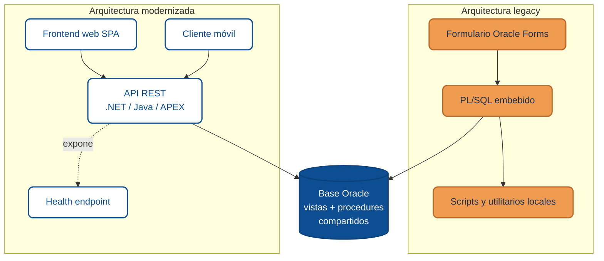

import AuthorCredit from '@site/src/components/AuthorCredit';

# Migración desde Oracle Forms

Oracle Forms es uno de los casos más frecuentes de legacy crítico en la región. Sistemas que llevan décadas operando, con lógica de negocio profundamente entrelazada con la base de datos, interfaces construidas pantalla por pantalla, y equipos originales que ya no están. La pregunta no suele ser *si* hay que migrar, sino *a qué* y *cómo* — sin parar la operación.

El escenario típico de destino es una aplicación web moderna: un frontend de una sola página (SPA) o renderizado en servidor, consumiendo una API REST, con un cliente móvil cuando el dominio lo justifica. Este módulo toma dos fuentes: el análisis publicado por 10X sobre [alternativas para migrar de Oracle Forms](https://www.10x.gt/blog/transformacion-digital/alternativas-para-migrar-de-oracle-forms/) y un conjunto de patrones observados en proyectos reales de modernización — tanto de pantallas de captura y consulta como de subsistemas de integración que viven detrás de esas pantallas. El enfoque es práctico: qué se decide al inicio, qué se mantiene durante la transición y qué lecciones cuesta caras aprender por cuenta propia.

## Elegir el stack destino

Antes de planear la migración hay que decidir hacia dónde se va. No existe una respuesta universal, pero el blog de 10X resume tres alternativas maduras y ofrece una forma de ordenarlas según el contexto del proyecto, no según la moda del momento.

**Oracle APEX** tiene sentido cuando los datos ya viven en Oracle, el equipo conoce PL/SQL a fondo y la aplicación no es de misión crítica en el sentido fuerte. Aprovecha lo existente, reduce el tiempo de desarrollo y conserva el ecosistema ya pagado. Es la ruta más barata cuando las condiciones se alinean, y la más riesgosa cuando se fuerza en un contexto que pide más flexibilidad.

**.NET 8 o superior** encaja bien en organizaciones con tracción en ecosistema Microsoft, donde ya hay equipos trabajando en Azure o con servicios internos en C#. Se presta a arquitecturas web basadas en APIs REST, con un frontend en Angular, React o Blazor y clientes móviles en .NET MAUI si el alcance lo pide. Permite convivir con la base Oracle sin forzar una migración de datos en el día uno.

**Java 21 con Spring Boot o Jakarta EE** es la opción natural cuando la aplicación es verdaderamente crítica, necesita alta disponibilidad, integra con múltiples fuentes heterogéneas o cuando la organización quiere reducir su dependencia de un proveedor específico. El frontend suele vivir en Angular o React sobre la API Java, y los clientes móviles en Android nativo, Kotlin Multiplatform o soluciones híbridas según el caso. Trae más ceremonia que .NET o APEX, pero paga esa ceremonia en ecosistema maduro y portabilidad.

### Matriz de decisión 10X

El mismo artículo propone una matriz de cuatro preguntas que ayuda a ordenar la conversación con los responsables técnicos y de negocio. No es una receta: es una forma disciplinada de evitar decidir por moda.

| Pregunta clave | Oracle APEX | .NET 8+ (C#) | Java 21+ |
|---|---|---|---|
| ¿Dónde están tus datos hoy? | En Oracle y seguirán allí | SQL Server, MySQL, PostgreSQL u otra base relacional | Fuentes variadas o migración planificada a entornos distribuidos |
| ¿Qué experiencia técnica tiene tu equipo? | Fuerte en PL/SQL, familiaridad con Oracle Forms | Experiencia en stack Microsoft, Visual Studio, APIs REST | Experiencia en Java, Spring, arquitecturas empresariales complejas |
| ¿Qué tanto necesitas escalar o integrar con otras plataformas? | Escalabilidad moderada, integración limitada al ecosistema Oracle | Alta escalabilidad e integración con múltiples servicios (Azure, APIs) | Máxima escalabilidad, ideal para microservicios y sistemas distribuidos |
| ¿Qué tan crítica es la aplicación para el negocio? | Importante, pero no misión crítica | Misión crítica, bajo control | Misión crítica, con alta disponibilidad y resiliencia |

Cuando las cuatro respuestas apuntan a la misma columna, la decisión se vuelve mecánica. Cuando se dispersan — por ejemplo, datos en Oracle pero equipo con mayor fortaleza en .NET — la conversación honesta es sobre compensaciones y, probablemente, sobre formar al equipo antes de elegir. Una matriz así, discutida y firmada por los responsables, vale más que cualquier comparación de rendimiento en abstracto.

## No reescribas lo que aún funciona

La tentación natural al modernizar es reescribirlo todo. Oracle Forms con PL/SQL embebido, procedimientos duplicados, vistas con reglas opacas — todo se ve viejo y da ganas de empezar en limpio. Es casi siempre un error.

La estrategia más robusta es mantener en la base de datos aquello que ya funciona y dejar que la nueva aplicación lo consuma. Las vistas Oracle con lógica de filtrado compleja siguen siendo vistas. Los procedimientos que autorizan operaciones siguen siendo procedimientos. Las tablas de control y auditoría siguen recibiendo sus registros. Lo que cambia es *quién* invoca esa lógica: en lugar de un formulario que consulta directamente, ahora es una API REST que expone esos datos a un frontend web o móvil y respeta las mismas reglas.

Este enfoque tiene dos virtudes que rara vez se aprecian al inicio. Primera, elimina de golpe una clase entera de riesgos: si la aplicación nueva lee la misma fuente de verdad, no hay manera de que se desincronice con el legacy. Segunda, convierte la migración en un trabajo gradual real. Una vez que la API nueva está consumiendo vistas antiguas, se puede empezar a mover lógica hacia el nuevo stack pantalla por pantalla, sin apuros y con evidencia en cada paso.

El costo es aceptar que, durante un tiempo, la arquitectura se verá mixta. Código C# o Java convive con PL/SQL legible. Los puristas lo odian. Los equipos que han entregado migraciones exitosas saben que es el precio correcto.

## Extraer patrones, no solo traducir código

Cuando sí toca llevar lógica al nuevo stack, la oportunidad real no es traducir línea por línea, sino identificar los patrones que el código legacy nunca pudo expresar con claridad.

Un caso típico son las pantallas que existen en varias variantes casi idénticas, una por cada tipo de cliente, de producto o de flujo. En Forms y PL/SQL, esa duplicación era la única forma práctica de manejar las diferencias. En un frontend moderno se convierte en un conjunto de componentes reutilizables más un mecanismo de configuración que los adapta, y en el backend en una clase base que define el flujo común y un puñado de clases hijas que encapsulan solo el delta. Lo que eran miles de líneas repetidas se vuelve un núcleo común y especializaciones pequeñas.

Algo análogo aparece al generar salidas en formatos estrictos que la aplicación web tiene que producir — recibos fiscales, reportes oficiales, archivos de integración con terceros, cualquier cosa con reglas rígidas. El código legacy suele armar esos formatos por concatenación directa, con manejo frágil de separadores y órdenes. La versión moderna se beneficia enormemente de un *builder* con API fluida: cada parte se agrega como un método, las validaciones viven en un solo lugar, y cambiar un formato deja de ser un ejercicio arqueológico.

Lo importante no es el patrón específico — es ver el código legacy como un espejo imperfecto de la lógica real y usar la migración para pulir ese espejo. Sin exagerar: el objetivo es reducir duplicación y clarificar intención, no imponer una arquitectura ideal que nadie pidió.

## Coexistencia de datos sin heroísmos

Durante la transición, el sistema nuevo y el viejo suelen convivir sobre la misma base de datos Oracle. Esto es más fácil de lo que parece si se respetan dos reglas. La primera es no duplicar fuentes de verdad: si el legacy escribe en una tabla, el sistema nuevo también escribe en ella cuando corresponde, no mantiene una copia paralela "por si acaso". La segunda es delegar en la base de datos lo que la base de datos hace bien.

El caso más común es la generación de correlativos únicos — números de envío, folios, identificadores de lote. La tentación es manejar la sincronización en el código de la aplicación, con locks distribuidos o colas. En una base Oracle compartida, un simple `SELECT FOR UPDATE` sobre la tabla de correlativos resuelve el problema con garantías transaccionales que ninguna capa de aplicación va a igualar. La migración es un mal momento para reinventar mecanismos de concurrencia; usa los que ya están, funcionan y son familiares para el equipo de base de datos.

## Idempotencia y re-envío

Los sistemas legacy rara vez fueron diseñados para tolerar re-envíos, porque se asumía que el usuario confirmaba una vez y listo. Las aplicaciones web y móviles viven en un mundo distinto: el usuario toca "guardar" dos veces porque la red tardó, la aplicación se refresca a mitad de una operación, el cliente móvil reintenta cuando recupera conexión. Migrar sin pensar en idempotencia es migrar a un sistema que será más moderno y más frágil que el original.

La solución estándar en APIs REST es aceptar una clave de idempotencia que el cliente envía con cada operación que escribe — típicamente una cabecera `Idempotency-Key` con un identificador generado por el cliente. La API guarda el resultado asociado a esa clave y, si llega un segundo intento con la misma, devuelve el mismo resultado sin duplicar el efecto. Pagos, envíos, registros de transacciones: cualquier operación que no se debe ejecutar dos veces merece este trato.

A nivel de almacenamiento, el mismo principio aplica. Las tablas de control y auditoría deben poder recibir un segundo insert de la misma operación sin romper — ya sea porque la clave única lo bloquea limpiamente o porque el diseño convierte el segundo registro en un no-evento observable. Cuando la aplicación además produce salidas para terceros por canales asíncronos, como archivos que se depositan en un servidor compartido, conviene escribir primero con un nombre temporal y renombrar al definitivo al terminar, para que el receptor nunca lea contenido a medio escribir. Son decisiones pequeñas que se pagan solas la primera vez que algo falla en producción.

## Observabilidad desde el día uno

Uno de los motivos por los que los sistemas legacy se vuelven intratables es que nadie sabe realmente qué están haciendo. Logs dispersos, sin formato común, sin identificadores de correlación. La migración es la ocasión perfecta para no repetir ese error.

Una aplicación bien instrumentada expone tres cosas desde el primer día. Un endpoint de salud que valida las dependencias reales — la base de datos responde, las integraciones externas están arriba, las operaciones recientes terminaron correctamente — y no solo dice "estoy vivo". Logs estructurados con campos de dominio consistentes: identificador del usuario autenticado, pantalla o endpoint involucrado, duración, resultado. Y alertas con *throttle*, porque una alerta cada treinta segundos durante una hora no es alertar, es hacer que el equipo silencie el canal.

Esa disciplina cuesta poco al principio y paga dividendos enormes en el primer incidente real. Sin ella, la aplicación moderna se parece demasiado al legacy que estaba reemplazando.

## El antes y el después

La clave de este diagrama no está en las cajas del lado derecho. Está en que la base de datos en el centro, con sus vistas y procedimientos, no cambió. La aplicación nueva se construyó alrededor, no encima.

## Decisiones que no son obvias al inicio

Hay un conjunto de lecciones que los proyectos de migración desde Forms suelen aprender en vivo, y que vale la pena anticipar.

No persigas código limpio a costa de consistencia operativa. Mantener vistas o procedures legacy que funcionan durante la transición es más barato y más seguro que reescribirlos antes de tiempo. Habrá una fase ordenada para limpiarlos, pero no es el día uno.

Separa los flujos independientes en procesos distintos. Si el sistema procesa dos tipos de operaciones que no comparten estado, córrelos como servicios separados con cadencias propias. Un fallo en uno no debe arrastrar al otro, y los despliegues deben poder hacerse de manera aislada.

Instrumenta antes de optimizar. Un sistema que no se puede observar tampoco se puede mejorar. La primera versión del servicio moderno debe poder responder, sin esfuerzo, a la pregunta "¿qué hizo durante la última hora?". Si no puede, no está listo para producción aunque pase todas las pruebas.

Cuida la seguridad en el primer sprint. El legacy probablemente tenía credenciales embebidas en scripts, contraseñas en archivos planos y conexiones sin cifrar. La migración es el único momento en que reemplazar todo eso es políticamente barato — después, cualquier cambio de seguridad se convierte en un proyecto por separado.

---

### Bloque estructurado para agentes

**Objetivo:** planear y ejecutar la migración de un sistema Oracle Forms conservando continuidad operativa y aprovechando la transición para mejorar arquitectura, idempotencia y observabilidad.

**Entradas:**
- Inventario de formularios, vistas, procedimientos y funciones del sistema actual.
- Criterios del negocio: criticidad, presupuesto, plazo, equipos disponibles.
- Decisión de stack destino (APEX, .NET, Java) justificada por matriz de contexto.
- Estrategia de coexistencia de datos sobre la base Oracle existente.

**Pasos:**
1. Evaluar el stack destino con los cuatro criterios: ubicación de datos, experiencia del equipo, escalabilidad e integración, criticidad.
2. Identificar vistas y procedimientos legacy que pueden conservarse durante la transición sin riesgo.
3. Detectar duplicación de lógica (variantes casi idénticas) y planear su consolidación con patrones base + especializaciones.
4. Diseñar la generación de datos únicos o correlativos delegando a la base de datos con mecanismos transaccionales nativos.
5. Introducir idempotencia por diseño: escritura atómica, re-proceso tolerado, sin supuestos de ejecución única.
6. Instrumentar desde el inicio: health endpoint que valida dependencias, logs estructurados con campos de dominio, alertas con throttle.
7. Separar flujos independientes en procesos distintos con cadencias propias.
8. Migrar módulo por módulo manteniendo la base de datos compartida; medir y comunicar avance.

**Salidas:**
- Stack destino elegido con justificación auditable.
- Servicio moderno coexistiendo con Forms sobre la misma base.
- Lógica PL/SQL crítica documentada y consumida desde el nuevo stack.
- Observabilidad operacional desde el primer despliegue.

**Errores comunes:**
- Elegir stack por preferencia del equipo en lugar de por contexto del proyecto.
- Reescribir lógica legacy sana antes de tiempo.
- Reinventar mecanismos de concurrencia que la base de datos ya resuelve.
- Desplegar sin instrumentación básica y prometer agregarla "después".
- Arrastrar credenciales embebidas y conexiones inseguras al nuevo sistema.

**Referencias cruzadas:**
- [El costo oculto del software legacy](./01-costo-oculto-del-legacy.md)
- [Migración progresiva (strangler fig)](./02-migracion-progresiva.md)
- [Autenticación y Autorización en APIs RESTful](../capacitacion-servicios-web-api-rest/04-autenticacion-autorizacion-rest.md)

---

<AuthorCredit note={<>Basado en el artículo <a href="https://www.10x.gt/blog/transformacion-digital/alternativas-para-migrar-de-oracle-forms/" target="_blank" rel="noopener noreferrer">"Alternativas para migrar de Oracle Forms"</a> del <a href="https://www.10x.gt/blog/" target="_blank" rel="noopener noreferrer">blog de 10X</a>, complementado con patrones observados en proyectos reales de modernización.</>} />
