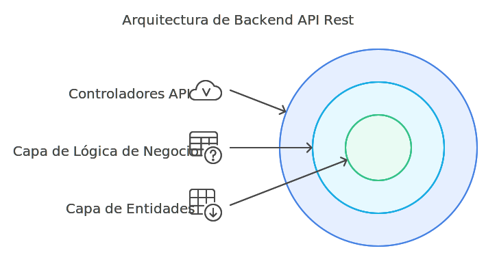
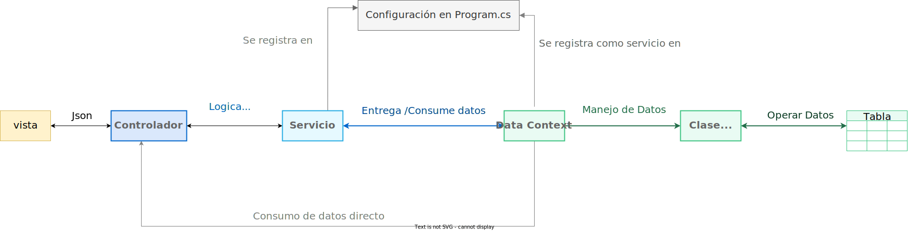

# Arquitectura de Backend API Rest en .NET Core

Este documento describe detalladamente la arquitectura de un proyecto backend implementado en .NET Core, empleando Entity Framework Core para la gestión de datos. El diagrama presentado a continuación ilustra la estructura y el flujo del proyecto, organizado en distintas capas que permiten una separación clara de responsabilidades.

## Arquitectura del Proyecto (Clean Architecture)

La arquitectura del proyecto se organiza siguiendo los principios de Clean Architecture, lo cual asegura la independencia entre los distintos módulos y facilita la mantenibilidad del proyecto. Clean Architecture se estructura en varias capas concéntricas, cada una con una función específica y dependencia mínima de las demás:

- **Controladores API REST (Interface Adapters)**
- **Capa de Lógica de Negocio (Business Logic Layer)**
- **Capa de Entidades (Entities Layer)**



### Controladores API REST (Interface Adapters)

Los controladores se encargan de recibir las solicitudes HTTP y delegar las responsabilidades a los servicios de aplicación. En esta capa se inyectan los servicios de aplicación para ejecutar la lógica de los casos de uso. Los controladores manejan las solicitudes HTTP y devuelven respuestas al cliente, adaptando el formato de los datos según lo requerido.

### Capa de Lógica de Negocio (Business Logic Layer)

Los servicios de aplicación representan los casos de uso específicos y la lógica que define cómo interactúan las entidades. En esta capa se define el comportamiento de la aplicación para cumplir con las reglas del negocio, gestionando las operaciones CRUD (Crear, Leer, Actualizar, Eliminar) y otros procesos específicos. La capa de lógica de negocio orquesta cómo se manipulan los datos y coordina el acceso a las entidades a través de los adaptadores de repositorio.

#### 1.2.2 Adaptadores de Repositorio (Repository Adapters)

Estos adaptadores permiten que la lógica de los servicios de aplicación interactúe con la capa de infraestructura de manera desacoplada. Los adaptadores de repositorio se encargan de traducir las operaciones de la base de datos, proporcionando una abstracción sobre el acceso a los datos para que los servicios no dependan directamente del framework o la base de datos.

- Modelo (Entity Model): Define la estructura de las entidades o clases que representan los objetos fundamentales del negocio. Los modelos en esta capa definen las reglas de negocio fundamentales y las propiedades de las entidades, independientes de cualquier marco de trabajo o base de datos.

- Data Context (DbContext): El Data Context se encarga de definir cómo se accede y gestiona la información de las entidades en la base de datos, estableciendo la conexión y gestionando las operaciones CRUD. Actúa como un puente entre las entidades y la base de datos, permitiendo que se realicen operaciones de una manera sencilla y estructurada. Se registra como un servicio en el archivo `Program.cs` utilizando la inyección de dependencias, lo cual facilita su uso en cualquier parte del proyecto.

## Resumen del Flujo del Proyecto Backend

El siguiente es un resumen del flujo del proyecto basado en el diagrama proporcionado:

1. **Presentación de Datos a la Vista:** Los datos procesados por el controlador se devuelven al cliente en formato JSON, permitiendo una presentación adecuada en la interfaz del usuario.
2. **Controlador:** Los controladores reciben las solicitudes HTTP y utilizan los servicios para procesar la información antes de devolver la respuesta al cliente.
3. **Servicio:** Los servicios se encargan de la lógica de negocio, utilizando el Data Context para gestionar los datos y aplicar las reglas específicas del negocio.
4. **Data Context:** El Data Context gestiona la conexión y las operaciones con la base de datos, facilitando el acceso a los datos y su manipulación. En los casos de que no se necesite una logica de negocio compleja el Controlador puede acceder a los datos directamente injectando el Data Context.
5. **Clase Model:** La información en la tabla se mapea a un modelo de objetos para representar las entidades en el sistema.
6. **Base de Datos (Table):** Los datos se almacenan en una tabla en la base de datos.



Esta estructura modular basada en Clean Architecture permite una clara separación de responsabilidades entre las capas, lo cual facilita el mantenimiento, escalabilidad y prueba del proyecto. Cada componente cumple un rol específico dentro del flujo de datos, desde la base de datos hasta la interfaz del cliente, asegurando una gestión eficiente de la información y promoviendo la independencia entre las distintas capas del sistema.

## Estructura de carpetas del proyecto

La arquitectura conceptual anterior se materializa en un árbol de carpetas concreto. La recomendación práctica — derivada de proyectos en producción — es **un solo `.csproj` con organización por dominio de negocio**, no multi-proyecto desde el día uno. El multi-proyecto (Clean Architecture con `Core/`, `Infrastructure/`, `Api/`) se justifica cuando hay una librería reutilizable concreta o un binario separable, no "por limpieza".

```
{Empresa}.{Producto}.Api/
├── {Empresa}.{Producto}.Api.csproj     # Único proyecto
├── Program.cs                           # Entrypoint corto, delega a Extensions/
├── appsettings.json
│
├── Auth/                                # Módulo de autenticación aparte
│   ├── Controllers/
│   ├── Services/
│   ├── Models/                          # Entidades EF del contexto Auth
│   ├── Dtos/
│   └── Persistence/                     # DbContext de Auth
│
├── Commons/                             # Capa compartida con sub-arquitectura
│   ├── Application/
│   │   ├── Builders/                    # Patrón Builder
│   │   ├── Strategies/                  # Patrón Strategy
│   │   └── Validators/                  # FluentValidation
│   ├── Data/
│   │   ├── Models/                      # Entidades EF de negocio
│   │   ├── Enums/
│   │   └── Persistence/                 # DbContext principal
│   ├── Infrastructure/                  # Notificaciones, módulos, etc.
│   ├── Presentation/                    # Controllers comunes, DTOs compartidos
│   ├── Services/                        # Servicios transversales (Factory, Base)
│   ├── StateMachine/                    # Motor genérico de máquinas de estado
│   ├── Constants/
│   ├── Enums/
│   └── Utilities/
│
├── Modules/                             # Módulos de negocio por dominio
│   └── {Dominio}/
│       └── {SubDominio}/
│           ├── Controllers/
│           ├── Services/
│           └── Dtos/
│
├── Extensions/                          # Bootstrap modular
│   ├── ServiceCollectionExtensions.cs
│   └── ApplicationBuilderExtensions.cs
│
└── Database/
    └── migrations/
```

Tres áreas, tres propósitos distintos:

- **`Auth/`** — todo lo que conoce el modelo de usuario/rol y su propio `DbContext`. Separado porque su ciclo de vida (migraciones, respaldo) difiere del negocio.
- **`Commons/`** — código transversal. Su sub-arquitectura (`Application/`, `Data/`, `Infrastructure/`, `Presentation/`, `Services/`) refleja capas sin imponer multi-proyecto.
- **`Modules/{Dominio}/`** — lógica específica de un dominio de negocio. Un módulo no llama a otro directamente; se comunica vía servicios de `Commons/` o eventos.

### Regla de los dos consumidores

Para que un tipo viva en `Commons/` debe tener al menos **dos módulos que lo consuman**. Si solo un módulo lo usa, va dentro de ese módulo. Esta regla evita que `Commons/` se convierta en cajón de sastre donde acaba todo lo que "parece compartido".

- Mal: `Commons/Services/OrdenCompraService.cs` — específico de Compras, solo un consumidor.
- Bien: `Commons/Services/CatalogoServiceBase.cs` — base para Catálogos, Productos, Tipos de Servicio, múltiples consumidores.

## Sufijos por rol

Cada archivo lleva un sufijo que identifica su propósito sin abrir el archivo. Es un contrato con lectores humanos y con agentes: `grep "class.*Service"` devuelve todos los servicios; `grep "interface I"` todas las interfaces.

| Rol | Carpeta | Sufijo | Ejemplo |
|---|---|---|---|
| Endpoint HTTP | `Modules/{Dominio}/{SubDominio}/Controllers/` | `Controller` | `OrdenCompraController` |
| Lógica de negocio | `Modules/{Dominio}/{SubDominio}/Services/` | `Service` | `OrdenCompraService` |
| Request DTO | `Modules/{Dominio}/{SubDominio}/Dtos/` | `Request` | `CrearOrdenCompraRequest` |
| Response DTO | `Modules/{Dominio}/{SubDominio}/Dtos/` | `Response` | `OrdenCompraResponse` |
| DTO de filtro | `Modules/{Dominio}/{SubDominio}/Dtos/` | `FilterDto` | `OrdenCompraFilterDto` |
| Entidad EF | `Commons/Data/Models/` | `Model` | `OrdenCompraModel` |
| Enum transversal | `Commons/Enums/` | (ninguno) | `Estado` |
| Builder | `Commons/Application/Builders/` | `Builder` | `CotizacionBuilder` |
| Strategy | `Commons/Application/Strategies/` | `Strategy` | `EstadoFilterStrategy` |
| Factory | `Commons/Services/` | `Factory` | `ServicioNegocioFactory` |
| Template Method base | `Commons/Services/` | `ServiceBase` | `CatalogoServiceBase` |
| Máquina de estados | `Modules/{Dominio}/StateMachine/` | `MaquinaEstados` | `BoletaMaquinaEstados` |
| Validador | `Commons/Application/Validators/` | `Validator` | `OrdenCompraValidator` |
| DbContext | `Commons/Data/Persistence/` o `Auth/Persistence/` | `DataContext` | `MysqlDataContext` |
| Extension methods | `Extensions/` | `Extensions` | `ServiceCollectionExtensions` |

Reglas de naming asociadas:

- **Una clase por archivo**, nombre del archivo = nombre de la clase.
- **Namespaces reflejan carpetas** sin excepción. Archivo en `Modules/Compras/OrdenCompra/Services/` → namespace `{Raíz}.Modules.Compras.OrdenCompra.Services`.
- **Dominio en español** si el dominio es español (`ClienteService`, no `CustomerService`); infraestructura técnica en inglés (`ServiceCollectionExtensions`).

## Paquetes NuGet con versión fijada

La reproducibilidad del `package.json` aplica igual en `.csproj`: **nada de rangos `*` ni `latest`**. Un `dotnet restore` debe resolver el mismo árbol cada vez.

```xml
<ItemGroup>
  <PackageReference Include="Microsoft.EntityFrameworkCore" Version="8.0.1" />
  <PackageReference Include="Pomelo.EntityFrameworkCore.MySql" Version="8.0.0" />
  <PackageReference Include="FluentValidation.AspNetCore" Version="11.3.1" />
  <PackageReference Include="AutoMapper.Extensions.Microsoft.DependencyInjection" Version="12.0.1" />
  <PackageReference Include="Serilog.AspNetCore" Version="8.0.2" />
  <PackageReference Include="Swashbuckle.AspNetCore" Version="6.9.0" />
  <PackageReference Include="BCrypt.Net-Next" Version="4.0.3" />
</ItemGroup>
```

- Mal: `Version="8.*"` — `dotnet restore` trae `8.0.2` el lunes y `8.0.3` el martes con un bug nuevo.
- Bien: versión exacta. Cualquier bump es un cambio explícito con commit dedicado.

## Bootstrap modular con extension methods

`Program.cs` debe quedar corto. La configuración de DI y middleware vive en `Extensions/ServiceCollectionExtensions.cs`, agrupada por área (Auth, Commons, Modules).

```csharp
// Program.cs — diez líneas
var builder = WebApplication.CreateBuilder(args);
builder.Services.AddClientesApi(builder.Configuration);
var app = builder.Build();
app.UseClientesApi();
app.Run();
```

```csharp
// Extensions/ServiceCollectionExtensions.cs
public static IServiceCollection AddClientesApi(
    this IServiceCollection services, IConfiguration config)
{
    services.AddAuthModule(config);
    services.AddCommonsInfrastructure(config);
    services.AddBusinessModules();
    return services;
}
```

Cada módulo nuevo expone su propio `AddXxxModule()` y se registra desde `AddBusinessModules()` — un solo cambio, sin tocar otros módulos.

- Mal: cien líneas de `services.AddScoped<...>()` en `Program.cs`. Imposible de revisar sin scroll.
- Bien: `Program.cs` de diez líneas; cada módulo sabe qué registrar.

## Glosario

**Clean Architecture** *(Clean Architecture)* — enfoque de arquitectura en capas concéntricas que aísla la lógica de negocio de frameworks e infraestructura.

**Controlador** *(Controller)* — componente que recibe solicitudes HTTP, delega en servicios y devuelve la respuesta al cliente.

**Servicio de aplicación** *(Application service)* — pieza que implementa casos de uso y coordina entidades y repositorios.

**Entidad** *(Entity)* — modelo que representa un objeto del dominio y sus reglas fundamentales, independiente del framework.

**DbContext** *(DbContext)* — clase de Entity Framework Core que gestiona conexión, seguimiento de cambios y operaciones sobre la base de datos.

**Adaptador de repositorio** *(Repository adapter)* — abstracción que desacopla los servicios del mecanismo concreto de persistencia.

**Inyección de dependencias** *(Dependency injection)* — técnica para entregar colaboradores a una clase en tiempo de ejecución; configurada en `Program.cs`.

**Regla de los dos consumidores** *(Two-consumer rule)* — política interna: un tipo solo vive en `Commons/` si al menos dos módulos lo consumen; evita que `Commons/` se vuelva cajón de sastre.

**Sufijo por rol** *(Role suffix)* — convención de agregar `Model`, `Controller`, `Service`, `Request`, `Response`, etc. al nombre de la clase para identificar su propósito sin abrir el archivo.

**Sub-arquitectura de Commons** *(Commons sub-architecture)* — división interna de `Commons/` en `Application/`, `Data/`, `Infrastructure/`, `Presentation/`, `Services/` que refleja capas sin imponer multi-proyecto.

**Extension methods de bootstrap** *(Bootstrap extension methods)* — métodos en `Extensions/ServiceCollectionExtensions.cs` que encapsulan el `services.AddXxx()` de cada módulo y mantienen `Program.cs` corto.

:::info Referencias primarias
- [Microsoft · .NET docs](https://learn.microsoft.com/en-us/dotnet/) — referencia del ecosistema .NET.
- [ASP.NET Core docs](https://learn.microsoft.com/en-us/aspnet/core/) — guías de APIs web con ASP.NET Core.
- [Entity Framework Core docs](https://learn.microsoft.com/en-us/ef/core/) — referencia oficial de EF Core.
:::

---

<div className="agent-block">

### Bloque estructurado para agentes

**Objetivo:** estructurar un backend API REST en .NET Core siguiendo Clean Architecture para separar responsabilidades por capa.

**Entradas:**
- Requerimientos funcionales y no funcionales del backend.
- Modelo de dominio inicial y relaciones.
- Proveedor de base de datos seleccionado.
- Restricciones de despliegue y escalabilidad.

**Pasos:**
1. Definir capas: controladores, servicios de aplicación, adaptadores de repositorio, entidades.
2. Mapear responsabilidades: controladores reciben HTTP, servicios aplican lógica, repositorios acceden a datos.
3. Crear el árbol `Auth/`, `Commons/` (con sub-arquitectura), `Modules/`, `Extensions/`, `Database/`.
4. Aplicar sufijos por rol (`Model`, `Controller`, `Service`, `Request`, `Response`, `Builder`, `Strategy`, `Factory`, `MaquinaEstados`).
5. Configurar el `DbContext` y registrar dependencias mediante extension methods en `Extensions/`.
6. Fijar versión exacta de cada paquete NuGet en el `.csproj`.
7. Decidir, por caso de uso, si aplica el flujo completo (con servicio) o el simplificado (controlador → DataContext).
8. Validar la independencia entre capas y la regla de los dos consumidores para `Commons/`.

**Salidas:**
- Diagrama de arquitectura del proyecto.
- Árbol de carpetas literal con `Auth/`, `Commons/`, `Modules/`, `Extensions/`.
- Tabla de sufijos por rol documentada en `CLAUDE.md`.
- `.csproj` con paquetes NuGet en versión fijada.
- `Program.cs` corto, configuración modular en `Extensions/`.
- Reglas de decisión sobre qué flujo aplicar por operación.

**Errores comunes:**
- Mezclar lógica de negocio en los controladores.
- Acoplar servicios directamente al framework en lugar de usar abstracciones.
- Crear servicios triviales que solo reenvían al `DbContext`.
- Exponer entidades de dominio como DTOs de la API.
- `Commons/` como cajón de sastre — violar la regla de los dos consumidores.
- Módulos de negocio que se llaman entre sí directamente (`Inventario → Compras.OrdenCompraService`).
- Paquetes NuGet con rangos (`8.*`, `latest`) que rompen reproducibilidad.

**Referencias cruzadas:**
- [1.2.2 La Capa de Controlador en un Backend API REST](./02-capa-controlador.md)
- [1.2.3 La Capa de Servicios en un Backend API REST](./03-capa-servicios.md)
- [1.2.4 La Capa de Datos en un Backend API REST](./04-capa-datos.md)
</div>
