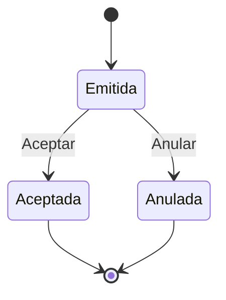
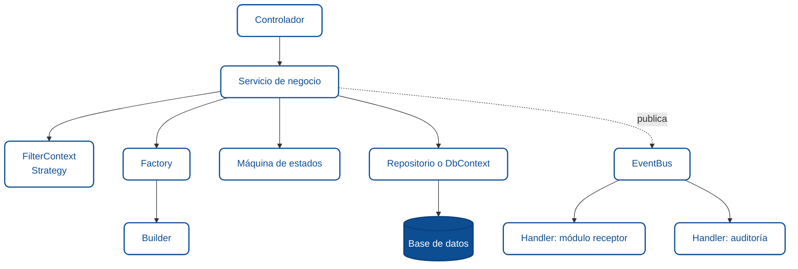

# Patrones de diseño en APIs REST

Una API REST bien escrita tiene una deuda silenciosa con los patrones de diseño. No los menciona en ningún lado, pero sin ellos aparece la duplicación: filtros que se copian y pegan entre servicios, métodos de creación de entidades que repiten las mismas validaciones, clases de catálogo que son casi idénticas salvo por un par de líneas. En cuanto un proyecto tiene tres o cuatro módulos de negocio, esa duplicación se convierte en fricción diaria.

Este módulo presenta cinco patrones que resuelven problemas concretos en una API REST moderna — Strategy, Factory, Builder, Template Method y Máquina de Estados — y cierra con un mapa de patrones adicionales que se vuelven útiles cuando la aplicación crece en número de módulos y en coordinación entre ellos. El enfoque es práctico: qué problema resuelve cada patrón, cuándo aplica y cuándo no, y qué señales indican que ya lo necesitas.

## Regla del tres

Antes de introducir cualquier patrón, aplica la regla del tres: **no generalizar hasta que el caso se repita tres veces**. Dos es coincidencia; tres es patrón. Un método duplicado entre dos servicios puede simplemente copiarse hoy y limpiarse mañana — sin costo de abstracción. Un método duplicado entre tres servicios justifica el refactor a una clase común.

La regla existe porque una abstracción creada con dos casos suele ser incorrecta: la tercera implementación obliga a rediseñar el patrón recién creado. Esperar al tercer caso da evidencia suficiente sobre qué varía, qué no, y dónde deben estar los *hooks*. Menos trabajo total, mejor diseño.

- Mal: *"Voy a crear una Strategy para este primer filtro, para estar preparados."* Cero ocurrencias repetidas; la abstracción va a envejecer mal.
- Bien: *"Tres servicios tienen un `ApplyFilters` con el mismo bloque — ahora toca extraer la Strategy."*

**Valor para el agente:** la regla del tres es el filtro contra "patrones por ego". Si no hay tres casos, el patrón va al backlog, no a `main`.

## Strategy: filtros y reglas que varían por contexto

El caso más frecuente donde aparece el patrón Strategy en una API REST es el filtrado de consultas. Un servicio típico de un recurso cualquiera empieza con un método modesto que acepta un término de búsqueda. Semanas después llegan los filtros por estado, por rango de fechas, por categoría, por un campo específico de negocio. El método `ApplyFilters` crece a cincuenta líneas de `if` encadenados, y cuando se abre el servicio del siguiente recurso se copia el mismo bloque con pequeñas variaciones.

La solución es aislar cada tipo de filtro en su propia estrategia y componerlas en un contexto reutilizable. Cada estrategia sabe cuándo puede aplicar — si el filtro viene en el DTO y tiene valor — y cómo aplicarse sobre la consulta. El servicio consumidor declara una sola vez qué estrategias usa, en qué campos, y las compone con el mecanismo de paginación estándar.

```csharp
_filterContext = new FilterContext<RecursoModel, RecursoFilterDto>()
    .ConfigureCommonFilters(
        f => f.TerminoBusqueda,
        r => r.Nombre,
        r => r.Descripcion,
        r => r.Codigo)
    .AddStrategy(new EstadoFilterStrategy<RecursoModel, RecursoFilterDto, Estado>(
        f => f.Estado,
        r => r.Estado,
        Estado.Activo));
```

El beneficio más claro aparece al agregar un filtro nuevo: se crea una estrategia, se registra en el contexto, y ni un solo servicio existente se modifica. El costo es aceptar la abstracción — para una consulta con uno o dos filtros triviales, el patrón es excesivo. La señal de que ya lo necesitas es sentir la tentación de copiar y pegar el método `ApplyFilters` de un servicio a otro.

## Factory: creación compleja que merece un solo hogar

La creación de entidades que requieren validaciones, enriquecimiento con datos de otras tablas o reglas que dependen de parámetros variables es un lugar donde el código suele envejecer mal. Empieza en el servicio como un bloque sencillo de instanciación, y termina como un método de doscientas líneas que nadie quiere tocar porque "hace varias cosas a la vez".

El patrón Factory concentra esa lógica de creación en un solo punto. Una `RecursoFactory` sabe cómo construir una entidad con todas sus validaciones y relaciones ya resueltas. Un `ParserFactory` devuelve el parser adecuado según el tipo de entrada recibido. Los servicios consumidores dejan de preocuparse por el cómo y se quedan con el qué.

Este patrón se nota más en sistemas donde varias rutas llegan a crear el mismo tipo de objeto — por ejemplo, un endpoint que crea un registro desde el formulario de usuario y otro que lo crea desde una importación masiva deben aplicar las mismas reglas. Sin factory, esas reglas se duplican. Con factory, viven una sola vez y pueden evolucionar sin miedo.

## Builder: objetos complejos armados con intención

Cuando una entidad tiene quince campos, varios calculados, y un proceso de validación que depende del conjunto completo — no de cada campo por separado — la construcción directa con `new` y setters se vuelve frágil. Olvidas asignar un campo, el total no cuadra, la validación salta en producción en vez de en el código.

El patrón Builder expone una API fluida que guía al desarrollador paso a paso y valida el objeto al final. Un documento de negocio se construye con su contexto, los datos principales, las fechas relevantes, los importes o totales si aplica, los detalles asociados y el estado inicial. El método `Build()` ejecuta las validaciones antes de devolver el modelo. Si falta algo crítico, falla ahí mismo con un mensaje claro.

```csharp
var documento = new DocumentoBuilder()
    .ConPropietario(idPropietario)
    .ConReferencia(idReferencia)
    .ConFechas(DateOnly.FromDateTime(DateTime.Now), validezDias: 30)
    .ConMontos(subtotal: 1000, descuento: 50, impuestos: 150)
    .AgregarDetalle(descripcion: "Concepto", cantidad: 1, precioUnitario: 1000)
    .Build();
```

El costo es crear y mantener el builder. Vale la pena cuando el objeto tiene más de siete u ocho campos, cuando las validaciones son contextuales o cuando varias capas del sistema necesitan construirlo. Para un DTO con tres propiedades, basta el constructor.

## Template Method: flujo común, diferencias mínimas

La mayoría de los proyectos terminan con varios servicios de catálogo casi idénticos — tipos de servicio, regímenes fiscales, bancos, departamentos. Todos responden a los mismos verbos: listar todos, obtener por identificador, validar existencia. La tentación es escribir cada uno desde cero, con la diferencia de tres líneas entre unos y otros. El resultado son cientos de líneas duplicadas que envejecen a ritmos distintos.

El patrón Template Method resuelve esto con una clase base que define el flujo común y deja *hooks* para las piezas específicas. El servicio concreto solo declara de qué `DbSet` lee, qué mensaje de error usa si no encuentra el registro y cómo construye el filtro por identificador. El resto lo hereda.

```csharp
public class TipoServicioService : CatalogoServiceBase<TipoServicioModel, TipoServicioResponse, short>
{
    protected override DbSet<TipoServicioModel> DbSet => _dbContext.TiposServicios;
    protected override string EntityNotFoundMessage => ModulesMsg.TipoServicioNoEncontrado;
    protected override Expression<Func<TipoServicioModel, bool>> BuildIdFilter(short id)
        => t => t.IdTipoServicio == id;
}
```

Agregar un nuevo catálogo pasa de escribir un servicio completo a diez líneas que declaran las diferencias. La señal de que ya lo necesitas es tener dos o más servicios donde el noventa por ciento del código es el mismo.

## Máquina de estados: el ciclo de vida con reglas claras

Las entidades que avanzan por estados — una boleta que puede emitirse, aceptarse o anularse; una cotización que pasa por borrador, enviada, aprobada, rechazada; una orden que se crea, confirma, prepara, despacha — rara vez tienen transiciones libres. Una boleta anulada no debería volver a aceptarse. Una cotización aprobada no debería regresar a borrador. Cuando esas reglas se expresan como cadenas de `if` en los servicios, cada nueva transición es un riesgo: un desarrollador olvida validar un estado y se cuela una operación inválida.

Una máquina de estados concentra todas las transiciones válidas en un solo diccionario. El servicio pide "siguiente estado" y recibe o bien el estado resultante o bien una excepción con un mensaje contextual. La lógica de dominio — timestamps de auditoría, efectos secundarios — queda en el servicio; las reglas de transición viven exclusivamente en la máquina.



El beneficio es doble. Primero, la auditoría se vuelve trivial: la máquina de estados es la documentación ejecutable del ciclo de vida. Segundo, agregar un nuevo estado o una nueva transición significa tocar un solo lugar, con pruebas aisladas. La señal de que ya lo necesitas es descubrir un bug donde una entidad quedó en un estado imposible porque nadie validó la transición.

## Matriz de decisión: dolor → patrón → ubicación

Los cinco patrones anteriores resuelven problemas distintos y no se pisan entre sí. Conviene tener presente el mapa antes de abrir cualquiera de ellos en un servicio nuevo — incluyendo la carpeta donde se espera que viva cada uno.

| Dolor observado | Patrón | Cuándo NO usar | Ubicación sugerida | Sufijo |
|---|---|---|---|---|
| `ApplyFilters` duplicado en 3+ servicios | Strategy | Un solo servicio con 1-2 filtros triviales | `Commons/Application/Strategies/FilterStrategies/` | `XxxStrategy` |
| Creación con validaciones multipaso repetida en 3+ servicios | Factory | Creación directa con `new` sin reglas; DTOs planos | `Commons/Services/` o `Modules/{Dominio}/Services/` | `XxxFactory` |
| Constructor con 5+ parámetros y cálculos intermedios | Builder | DTOs de 3-4 propiedades sin validación cruzada | `Commons/Application/Builders/` o `Modules/{Dominio}/Services/ScenarioBuilders/` | `XxxBuilder` |
| CRUD de catálogo duplicado en 3+ servicios | Template Method | Servicios con flujos completamente distintos | `Commons/Services/{Xxx}ServiceBase.cs` | `XxxServiceBase` |
| Entidad con 3+ estados y `if`-guards de transición | Máquina de estados | Flag booleano; dos estados con transición libre | `Modules/{Dominio}/StateMachine/` | `XxxMaquinaEstados` |
| Acoplamiento directo entre módulos (A → B) | **Fuera de alcance** | — | — | — |
| Queries de acceso a datos repetidas | Repository (evaluar con arquitecto) | — | — | — |

Tres reglas transversales al usar la tabla:

- **Patrón sigue a dolor, no al revés.** Sin síntomas concretos, ninguna fila aplica.
- **Transversal vs específico de módulo.** Si el patrón referencia tipos de un solo módulo, vive dentro del módulo. Si referencia tipos genéricos, vive en `Commons/`.
- **Sufijo obligatorio.** Permite que `grep "class.*Strategy"` siga devolviendo todos los casos; el próximo agente detecta el patrón sin leer el código.

## Patrones para sistemas con múltiples módulos

Cuando la API deja de ser una sola aplicación y empieza a integrar varios módulos que deben coordinarse entre sí, aparecen problemas nuevos que los cinco patrones anteriores no resuelven por sí solos. Vale la pena conocer el mapa aunque no todos se implementen el día uno.

El **Repository Pattern** abstrae el acceso a datos para que los servicios no dependan del `DbContext` directamente. Suena a ceremonia adicional, y lo es, pero paga dividendos cuando varios módulos necesitan operaciones idénticas de paginación, filtrado genérico o inclusión de relaciones, y sobre todo cuando el equipo introduce pruebas unitarias con mocks.

La **arquitectura dirigida por eventos** — un patrón Observer aplicado al dominio — desacopla módulos entre sí. Cuando un módulo debe reaccionar a lo que sucede en otro, la solución rápida es que el primero llame directamente al segundo. La solución correcta es que el módulo origen publique un evento — por ejemplo, `EntidadCreada` o `OperacionCompletada` — y que los módulos interesados lo escuchen en handlers propios. Así se pueden agregar más consumidores — auditoría, notificaciones, integraciones externas — sin tocar el código que originó el evento.

El **Specification Pattern** centraliza reglas de negocio reutilizables. Cuando una regla como "un usuario puede realizar esta operación si cumple cierto estado y tiene los permisos adecuados" aparece en tres servicios distintos, esa regla debe vivir en una especificación que los tres consultan, no en tres condicionales independientes que algún día se desincronizan.

El **Command Pattern** formaliza operaciones complejas que combinan varios pasos — una operación compuesta implica validar entradas, verificar precondiciones, ejecutar cambios coordinados en varias entidades y registrar el resultado. En lugar de un método de servicio que hace todo, un `EjecutarOperacionCommand` con su `CommandHandler` agrupa la secuencia completa y la hace auditable.

El **Module Pattern** separa los módulos de la aplicación en unidades independientes que se registran al inicio. Cada módulo declara sus propios servicios y rutas; agregar un módulo nuevo no toca código existente. Esta separación facilita el desarrollo paralelo por equipos distintos y permite activar o desactivar funcionalidades por configuración.

**Decorator Pattern** para funcionalidades transversales como logging, caching y auditoría, aplicadas selectivamente sobre servicios específicos sin modificarlos. **Facade Pattern** para exponer al frontend o a otros sistemas una interfaz simplificada cuando detrás hay varios servicios coordinados.

La prioridad sensata al escalar es Repository primero, eventos después, y los demás conforme aparezcan los problemas que resuelven. Agregarlos sin una necesidad clara convierte la API en un ejercicio académico.

## Cómo se integran en el flujo de una petición



El diagrama muestra cómo se combinan los patrones dentro de una misma petición. El controlador delega en el servicio. El servicio arma la consulta con Strategy, crea entidades con Factory y Builder, valida transiciones con la máquina de estados, persiste con Repositorio, y opcionalmente publica un evento para que otros módulos reaccionen. Ningún patrón lo hace todo; cada uno resuelve una pieza concreta del problema.

## Señales de que estás listo para introducirlos

Los patrones no son decoración. Si un código lineal resuelve el problema del día, empezar con patrones es sobre-ingeniería. Las señales reales de que ha llegado el momento son concretas y suelen venir en este orden: primero aparece la duplicación repetida en métodos `ApplyFilters` y se introduce Strategy. Luego empieza a dolerse la creación de una entidad con muchas validaciones y aparece Factory o Builder. Más tarde, dos servicios de catálogo nuevos se ven idénticos y se extrae una clase base con Template Method. Y cuando una entidad con varios estados genera su primer bug de transición inválida, llega la hora de una máquina de estados.

Los patrones estructurales se justifican cuando el sistema cruza el umbral de varios módulos que deben coordinarse. Mientras la API sea un solo dominio bien delimitado, basta con los cinco primeros.

## Glosario

**Strategy** *(Strategy pattern)* — patrón que encapsula algoritmos intercambiables; útil para filtros y reglas que varían por contexto.

**Factory** *(Factory pattern)* — patrón que concentra la creación de objetos complejos en un solo punto con reglas y validaciones compartidas.

**Builder** *(Builder pattern)* — patrón que construye objetos complejos paso a paso mediante una API fluida y valida al final.

**Template Method** *(Template Method pattern)* — patrón con clase base que define el flujo y hooks para variaciones específicas.

**Máquina de estados** *(State machine)* — estructura que declara explícitamente los estados válidos y sus transiciones permitidas.

**Regla del tres** *(Rule of three)* — heurística que dice: refactorizar hacia una abstracción reutilizable solo cuando el caso se repite tres veces. Dos es coincidencia; tres es patrón.

**Repository** *(Repository pattern)* — abstracción sobre el acceso a datos que desacopla los servicios del mecanismo concreto de persistencia.

**Arquitectura dirigida por eventos** *(Event-driven architecture)* — estilo donde los módulos publican y consumen eventos para reducir acoplamiento directo.

**Specification** *(Specification pattern)* — encapsulamiento de reglas de negocio reutilizables consultables desde varios servicios.

**Decorator** *(Decorator pattern)* — composición de funcionalidades transversales (logging, caching) sobre un servicio sin modificarlo.

:::info Referencias primarias
- [Microsoft · .NET docs](https://learn.microsoft.com/en-us/dotnet/) — referencia del ecosistema .NET.
- [ASP.NET Core docs](https://learn.microsoft.com/en-us/aspnet/core/) — guías de APIs web.
- [Martin Fowler · Patterns of Enterprise Application Architecture](https://martinfowler.com/books/eaa.html) — referencia clásica de patrones.
:::

---

<div className="agent-block">

### Bloque estructurado para agentes

**Objetivo:** identificar qué patrones de diseño aplicar en una API REST según los síntomas observados en el código y el tamaño del sistema.

**Entradas:**
- Código fuente o descripción de los servicios actuales.
- Lista de módulos de negocio existentes y planificados.
- Señales de duplicación, reglas dispersas o bugs recurrentes por transiciones inválidas.

**Pasos:**
1. Aplicar la regla del tres: no introducir un patrón hasta que el caso se repita tres veces.
2. Detectar duplicación en métodos de filtrado o paginación en 3+ servicios; aplicar Strategy en `Commons/Application/Strategies/`.
3. Detectar métodos de creación con más de siete u ocho campos y validación cruzada; aplicar Builder en `Commons/Application/Builders/` o por módulo.
4. Detectar varias rutas que crean el mismo tipo de entidad con reglas compartidas; aplicar Factory en `Commons/Services/`.
5. Detectar 3+ servicios de catálogo con CRUD idéntico; aplicar Template Method como `XxxServiceBase` en `Commons/Services/`.
6. Detectar entidades con tres o más estados y transiciones restringidas; aplicar Máquina de Estados en `Modules/{Dominio}/StateMachine/`.
7. Si el sistema crecerá a varios módulos coordinados, priorizar Repository y arquitectura dirigida por eventos antes de agregar más patrones tácticos.
8. Revisar la matriz dolor → patrón → ubicación antes de aplicar cualquier patrón nuevo; evitar patrones donde una solución directa resuelve el caso.
9. Migrar todos los casos existentes al patrón en un solo PR — nunca dejar "el viejo y el nuevo" conviviendo.

**Salidas:**
- Lista de patrones a aplicar con justificación por síntoma observado.
- Plan de introducción gradual (táctico primero, estructural después).
- Criterios para revisar en revisiones de código.

**Errores comunes:**
- Aplicar un patrón porque "es buena práctica" sin síntoma concreto.
- Violar la regla del tres: generalizar con dos casos produce abstracciones que hay que rediseñar al llegar el tercero.
- Introducir Repository y Command desde el día uno sin varios módulos coordinados.
- Mantener condicionales de estado en servicios cuando ya existe una máquina de estados.
- Copiar `ApplyFilters` entre servicios en lugar de extraer estrategias.
- Ubicación incorrecta (patrón transversal dentro de un módulo, o específico en `Commons/`).
- Sufijo inconsistente (`ClienteFiltros` en vez de `ClienteFilterStrategy`) — `grep` deja de encontrar todos los casos.
- Migración parcial: introducir el patrón y migrar solo un servicio — ahora hay tres formas en vez de dos.

**Referencias cruzadas:**
- [1.2.1 Arquitectura de Backend API Rest en .NET Core](./01-arquitectura-de-backend.md)
- [1.2.3 La Capa de Servicios en un Backend API REST](./03-capa-servicios.md)
- [1.1.4 Autenticación y Autorización en APIs RESTful](../capacitacion-servicios-web-api-rest/04-autenticacion-autorizacion-rest.md)
</div>
