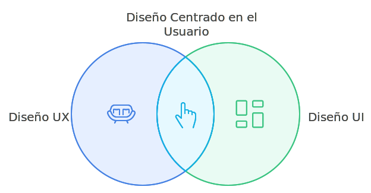

# Introducción a UX/UI

El diseño UX (User Experience) y UI (User Interface) nacen de la necesidad de mejorar cómo las personas interactúan con productos y tecnología. UX se originó en estudios de psicología y diseño industrial, donde se buscaba crear experiencias funcionales y agradables para los usuarios. UI, por su parte, surgió con el diseño visual y de interfaces gráficas, enfocado en hacer esas interacciones intuitivas y atractivas. Ambos conceptos se combinan para poner al usuario en el centro del diseño, creando productos eficientes, fáciles de usar y visualmente impactantes.

