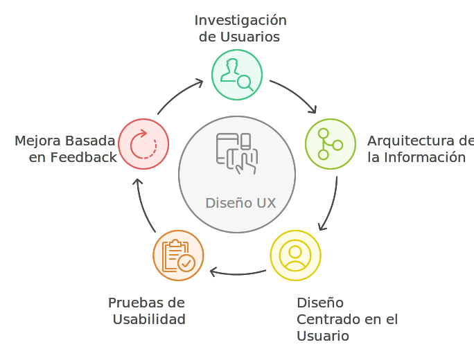

# ¿Qué es UX?

UX (User Experience) se refiere a la experiencia del usuario al interactuar con un producto o servicio. Se centra en la satisfacción del usuario, asegurando que **el producto sea fácil de usar, eficiente y agradable**. El proceso de diseño UX incluye la investigación de usuarios, creación de flujos de información, pruebas de usabilidad y mejoras continuas basadas en el feedback del usuario.

## Ciclo del Proceso de Diseño UX

El Ciclo del Proceso de Diseño UX es una guía que organiza los pasos para crear y mejorar productos pensados para las personas. Desde entender a los usuarios hasta probar y mejorar las soluciones, este proceso asegura que el diseño sea útil y fácil de usar.

### **Investigación de Usuarios**  

El proceso comienza con la investigación de usuarios, que consiste en recopilar información sobre quiénes son, qué necesitan y cómo interactúan con un producto o servicio. Esta etapa es esencial para comprender sus comportamientos, expectativas y problemas, sentando las bases para el diseño.

### **Arquitectura de la Información**  

Una vez que se entiende a los usuarios, el siguiente paso es estructurar el contenido de manera lógica y accesible. La Arquitectura de la Información organiza elementos como menús, categorías y mapas de sitio, facilitando que los usuarios encuentren lo que necesitan.

### **Diseño Centrado en el Usuario**  

Con la información recopilada y estructurada, se diseña con un enfoque centrado en el usuario. Esto significa que todas las decisiones se toman considerando las necesidades y expectativas de los usuarios, asegurando que el producto sea relevante, funcional y fácil de usar.

### **Pruebas de Usabilidad**  

Antes de lanzar el producto o implementar nuevas funcionalidades, se realizan pruebas de usabilidad. Estas pruebas evalúan cómo interactúan los usuarios con el producto, identificando problemas y oportunidades de mejora para optimizar la experiencia.

### **Mejora Continua Basada en el Feedback**

El ciclo no termina con el lanzamiento. Una vez que el producto está en uso, se recopila feedback de los usuarios para implementar mejoras. Este enfoque iterativo permite que el producto evolucione y siga satisfaciendo las necesidades cambiantes de los usuarios y del mercado.

:::warning Lo que UX no es:

- No es diseño gráfico.
- No es diseño web o móvil
- No es diseño de interfaces.
- No es solamente crear casos de uso o historias de usuario.

:::
