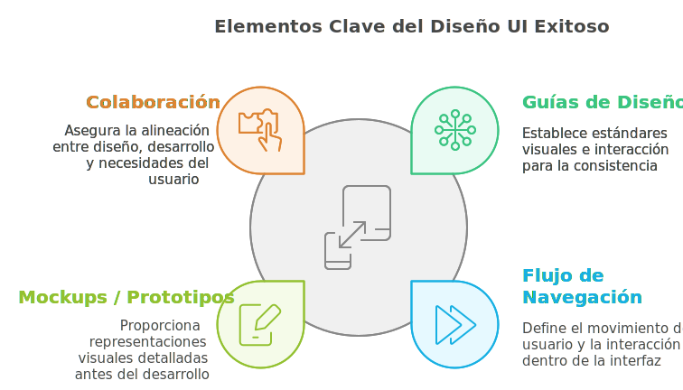

# ¿Qué es UI?

UI  (User Interface), por otro lado, se refiere a la interfaz de usuario, es decir, a **la apariencia y el diseño visual del producto**. Involucra la creación de elementos gráficos como botones, íconos, tipografía, colores y disposición de los elementos en la pantalla. El objetivo del diseño UI es hacer que la interacción del usuario con el producto sea intuitiva y estéticamente agradable.

## Aspectos clave para Diseño UI

El diseño UI es el proceso de crear interfaces visuales e interactivas que sean atractivas, funcionales e intuitivas. A continuación, se explican los pasos clave para llevar a cabo un diseño UI exitoso y cómo contribuyen a la experiencia del usuario.

### **Guías de Diseño**  

Las guías de diseño son herramientas que establecen los estándares visuales y de interacción de un producto. Incluyen elementos como la paleta de colores, tipografía, y reglas de composición para asegurar una apariencia coherente.  
Son útiles porque garantizan consistencia en el diseño, facilitan la colaboración entre equipos y aseguran que el producto mantenga una identidad visual unificada.

> :bulb: **¿Cómo lo hago?**
>
> - Define una **paleta de colores** que refleje la identidad de la marca y cumpla con estándares de accesibilidad.
> - Elige una **tipografía legible**, con reglas para tamaños, pesos y estilos.
> - Establece un **layout** que organice los elementos visualmente, asegurando una estructura clara y fácil de usar.

### Flujo de Navegación e Interacción**  

El flujo de navegación e interacción define cómo los usuarios se mueven entre las pantallas y cómo interactúan con los elementos de la interfaz. Este paso incluye planificar rutas claras y crear interacciones intuitivas.  
Es útil porque mejora la experiencia del usuario al hacer que el producto sea fácil de usar, reduciendo la frustración y aumentando la eficiencia.

> :bulb: **¿Cómo lo hago?**
>
> - Diseña rutas claras para que los usuarios encuentren lo que necesitan fácilmente.
> - Asegúrate de que las interacciones (clics, deslizamientos, etc.) sean intuitivas y proporcionen retroalimentación.
> - Utiliza herramientas como [Draw.io](https://app.diagrams.net/) para mapear los flujos entre pantallas.

### **Mockups y Prototipos**  

Los mockups son representaciones detalladas del diseño final de una interfaz. Muestran cómo se verá el producto con todos los elementos visuales aplicados, adaptándose a los estándares de cada plataforma.  Los prototipos extienden este concepto al añadir interactividad, simulando cómo los usuarios navegarán por el producto y explorarán las funcionalidades. Son útiles porque permiten detectar errores antes del desarrollo, optimizar el diseño y proporcionar una referencia clara para los desarrolladores.

> :bulb: **¿Cómo lo hago?**
>
> - Crea representaciones visuales detalladas de las pantallas del producto, alineadas con las guías de diseño.
> - Adapta los mockups a los estándares específicos de cada plataforma (web, móvil, escritorio).
> - Usa herramientas como [Figma](https://www.figma.com/) o [Adobe XD](https://www.adobe.com/products/xd.html) para desarrollar mockups interactivos.

:::tip  Guías utiles como referencia

1. [**Google Material Design**](https://material.io/design)
2. [**Guía de estilo de Angular**](https://angular.dev/style-guide)
3. [**Sistema de Diseño de Clarity**](https://clarity.design/)

:::

### **Colaboración entre Diseñadores, Desarrolladores y UX**  

La colaboración entre diseñadores, desarrolladores y especialistas en UX es el proceso de trabajar juntos para crear un diseño que sea visualmente atractivo, funcional y técnicamente viable.  
Es útil porque asegura que el producto final cumpla con las expectativas del diseño, sea técnicamente realizable y responda a las necesidades de los usuarios.

> :bulb: **¿Cómo lo hago?**
>
> - Trabaja junto con diseñadores UX para traducir wireframes y flujos en interfaces visuales.
> - Colabora con desarrolladores para garantizar que el diseño sea técnicamente viable y optimizado.
> - Usa herramientas colaborativas como [Zeplin](https://zeplin.io/) o [Figma](https://www.figma.com/) para compartir especificaciones y comentarios.
