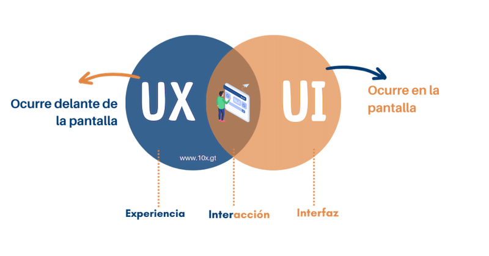

# Diferencias entre UX/UI

En palabras simples: UX es lo que el usuario siente y experimenta frente a la pantalla, mientras que UI es lo que ve y toca en la pantalla. La interacción entre ambos define cómo el usuario interactúa con nuestra aplicación, creando una experiencia que puede ser intuitiva y fluida, o complicada y frustrante.

## Ejemplo de la Diferencia entre UX y UI

Consideremos el caso de una aplicación de banca móvil.

- UX: El equipo de UX investigaría cómo los usuarios manejan sus finanzas, identificando las funciones más importantes, como transferencias rápidas de dinero y notificaciones de transacciones. Probarían prototipos para asegurar que los usuarios puedan completar estas tareas fácilmente y sin frustraciones.

- UI: El equipo de UI diseñaría los botones para las transferencias de dinero, seleccionaría colores que transmitan confianza y seguridad, y aseguraría que la tipografía sea clara y legible.

## **Casos de Aplicación**

- E-commerce: En una tienda en línea, el equipo de UX se encargaría de que el proceso de compra sea simple y sin fricciones, realizando pruebas de usabilidad para asegurarse de que los usuarios puedan encontrar y comprar productos fácilmente. El equipo de UI, en cambio, diseñaría elementos visuales atractivos, como los botones de “Agregar al carrito” y la disposición de las imágenes de los productos.

- Redes Sociales: Para una plataforma social, el equipo de UX se centraría en la facilidad con la que los usuarios pueden interactuar con sus amigos y descubrir nuevo contenido. El equipo de UI trabajaría en la estética del feed de noticias, asegurando que las publicaciones sean visualmente atractivas y fáciles de leer.

- Aplicaciones de Salud: En una aplicación de seguimiento de la salud, el equipo de UX aseguraría que los usuarios puedan registrar sus datos de salud fácilmente y acceder a sus historiales sin complicaciones. El equipo de UI diseñaría gráficos y tablas claras para que los usuarios puedan visualizar sus progresos y tendencias.

## Glosario

**UX** *(User Experience)* — experiencia completa del usuario con un producto o servicio; se enfoca en lo que siente y logra.

**UI** *(User Interface)* — capa visual e interactiva; se enfoca en lo que el usuario ve y toca.

**Flujo de usuario** *(User flow)* — secuencia de pasos que realiza un usuario para completar una tarea concreta.

**Prueba de usabilidad** *(Usability testing)* — observación de usuarios realizando tareas para evaluar la experiencia.

**Prototipo** *(Prototype)* — maqueta interactiva que permite validar experiencia e interfaz antes de desarrollar.

**Jerarquía visual** *(Visual hierarchy)* — organización de elementos visuales que guía la atención del usuario hacia lo prioritario.

:::info Referencias primarias
- [Nielsen Norman Group](https://www.nngroup.com/articles/) — referencia en UX.
- [Material Design](https://m3.material.io/) — sistema de diseño de Google.
- [Apple Human Interface Guidelines](https://developer.apple.com/design/human-interface-guidelines/) — guías de interfaces.
:::

---

### Bloque estructurado para agentes

**Objetivo:** diferenciar responsabilidades de UX y UI para asignar tareas y evaluar el diseño en casos concretos.

**Entradas:**
- Producto o flujo a analizar (banca móvil, e-commerce, redes sociales, salud, etc.).
- Objetivos funcionales y comerciales del flujo.
- Personas involucradas en diseño y desarrollo.
- Indicadores actuales de experiencia y apariencia.

**Pasos:**
1. Separar decisiones de experiencia (qué siente y logra el usuario) de decisiones visuales (qué ve y toca).
2. Asignar investigación, flujos y pruebas a UX; asignar visual, tipografía y colores a UI.
3. Evaluar un caso real del dominio aplicando esta división.
4. Definir puntos de sincronización entre ambas disciplinas.
5. Medir resultados con métricas de usabilidad y satisfacción visual.

**Salidas:**
- Mapa claro de responsabilidades UX vs UI por flujo.
- Checklist de revisión para cada disciplina.
- Métricas asociadas al desempeño del diseño.

**Errores comunes:**
- Evaluar un diseño como "bonito" sin mirar la experiencia.
- Probar experiencia con mockups sin iteraciones visuales finales.
- Asumir que un único perfil cubre ambas disciplinas en productos complejos.
- No establecer puntos de sincronización UX/UI.

**Referencias cruzadas:**
- [3.1.2 ¿Qué es UX?](./02-que-es-ux.md)
- [3.1.3 ¿Qué es UI?](./03-que-es-ui.md)
- [3.1.5 Convenciones de UI consistentes](./05-convenciones-de-ui-consistentes.md)

