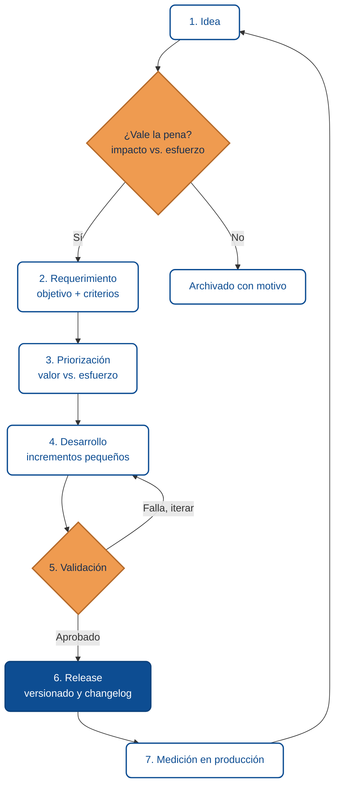
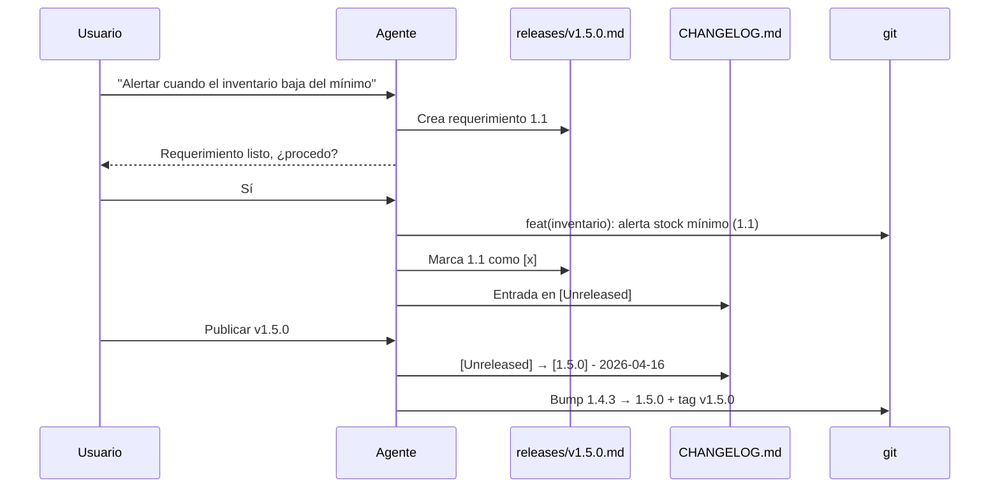

# De la idea al release

Un proyecto útil no nace en el código. Nace cuando alguien detecta un problema real y el equipo convierte esa intuición en una entrega que alguien usa. Entre ambos extremos hay una secuencia que, bien llevada, reduce ambigüedad, cuida el presupuesto y deja evidencia para auditar lo que se hizo y por qué.

Esta lección describe esa secuencia con un nivel de detalle suficiente para que un equipo pequeño la ejecute sin burocracia, y un agente pueda seguirla para generar artefactos consistentes.

## El ciclo paso a paso



El ciclo es continuo, no lineal. Cada release alimenta nuevas ideas con evidencia real, no con supuestos. Los pasos numerados en el diagrama corresponden a las etapas 1-7 desarrolladas a continuación.

**Alternativa en lista** (útil si el diagrama no carga):

1. **Idea** → decisión *"¿vale la pena?"* (impacto vs. esfuerzo) — si no, archivar con motivo.
2. **Requerimiento** con objetivo y criterios verificables.
3. **Priorización** por valor vs. esfuerzo.
4. **Desarrollo** en incrementos pequeños.
5. **Validación** — si falla vuelve al paso 4; si aprueba avanza al 6.
6. **Release** con versión SemVer y CHANGELOG.
7. **Medición** en producción que alimenta nuevas ideas.

## Etapa 1 · De la intuición a la idea registrada

Las ideas vienen de muchas fuentes: incidentes, feedback de usuarios, análisis de métricas, ideas del equipo, regulaciones nuevas, oportunidades de negocio. El riesgo no está en generar ideas — **está en dejarlas flotando**.

### ¿Qué hace que una idea esté "bien capturada"?

Una idea útil describe una **tensión a resolver**, no una solución. La forma más rápida de evitar saltar directo a "cómo lo construyo" es responder tres preguntas — adaptación del **Círculo Dorado** de Simon Sinek aplicado al inicio de un proyecto ([10X · Círculo Dorado en la fase inicial](https://www.10x.gt/blog/gestion-de-proyectos-18/circulo-dorado-fase-inicial-proyecto/)):

| Pregunta | Qué captura | Qué evita |
|----------|-------------|-----------|
| **Por qué** | El problema o la oportunidad concreta | Construir una solución sin saber a qué dolor responde |
| **Qué** | El cambio observable esperado (métrica, comportamiento, capacidad) | Declarar éxito sin forma de medirlo |
| **Cómo** | Pistas o restricciones de implementación si ya existen — *opcional* | Comprometerse con una solución antes de validar el problema |

Un formato mínimo para registrar una idea antes de decidir si invertir en ella:

| Campo | Ejemplo |
|-------|---------|
| Título | *"Aprobar órdenes de compra desde el celular"* |
| Origen | Feedback de 3 supervisores en marzo 2026 |
| Por qué (problema) | Las órdenes esperan hasta 2 días porque los supervisores solo pueden aprobarlas desde la PC de la oficina |
| Qué (cambio esperado) | 80% de las órdenes aprobadas en menos de 4 horas hábiles desde su creación |
| Cómo (pista opcional) | Posible vista móvil con autenticación biométrica; validar si ya existe la acción de aprobación en backend |
| Hipótesis de impacto | Reducir retraso en entregas; mejorar satisfacción del área de compras |
| Estimación gruesa | S/M/L (S: días, M: semanas, L: mes+) |
| Propuesto por | Nombre o equipo |

Con ese registro básico puedes decidir sin sesgo si vale la pena pasar a requerimiento o archivar con un motivo claro.

## Etapa 2 · El requerimiento mínimo viable

### Idea vs. requerimiento: la diferencia es la testabilidad

Antes de comparar, conviene fijar las dos definiciones operativas que se usan en el resto del curso:

:::info Definiciones
- **Idea** — enunciado breve de una **tensión a resolver** (un problema, una oportunidad, un dolor observado). Describe *por qué* vale la pena intervenir, pero **no compromete al equipo a construir nada**. Puede archivarse sin costo. Cualquier persona del equipo puede redactarla.
- **Requerimiento** — descripción **verificable hoy** de un cambio concreto que el equipo se compromete a entregar. Tiene alcance delimitado, criterios de aceptación medibles y un responsable capaz de construirlo. Entra al backlog y consume presupuesto.
:::

La línea que las separa no es el nivel de detalle ni la longitud del documento — es si **se puede verificar hoy**. Una idea explora un problema; un requerimiento define una solución medible.

Dicho de otra forma: una idea responde *"¿qué duele?"*; un requerimiento responde *"¿cómo sabremos que lo resolvimos?"*. Mientras no exista esa segunda respuesta, sigue siendo idea.

| Aspecto | Idea | Requerimiento |
|---------|------|---------------|
| Lenguaje | "mejorar la experiencia", "agilizar aprobaciones" | "el reporte abre en < 3 s con 12 meses de datos" |
| Alcance | Explora el problema | Delimita una solución |
| Verificación | Hipótesis a validar | Criterios verificables hoy |
| Quién lo escribe | Cualquiera del equipo | Persona que puede construirlo |
| Compromiso | Ninguno todavía | Entra a backlog si se prioriza |

Tres ejemplos tomados de un ERP típico, que cualquier usuario de negocio reconoce:

**Caso 1 · Nueva opción para el usuario**

- *Idea:* "Los vendedores prometen productos sin verificar existencias y terminamos con pedidos que no podemos cumplir a tiempo."
- *Requerimiento:* nueva pantalla **Nivel mínimo por producto** en el módulo de Inventario: el encargado de compras configura un mínimo por producto y por bodega; cuando las existencias caen por debajo de ese mínimo, el sistema envía un correo a las 8:00 a.m. al responsable con la lista de productos afectados. Cubre los 50 productos más vendidos; el resto se configura manualmente.

**Caso 2 · Mejora de usabilidad**

- *Idea:* "Cuando un supervisor revisa una orden de compra tiene que entrar una por una para ver qué se cambió y por qué; no hay forma rápida de auditar modificaciones."
- *Requerimiento:* en el detalle de la orden de compra, agregar una pestaña **Historial de cambios** con una línea de tiempo que muestre fecha, usuario y motivo de cada modificación. Visible solo para el rol *Supervisor*. Se registran cambios en: proveedor, productos, cantidades, precios y estado.

**Caso 3 · Rendimiento**

- *Idea:* "El reporte de ventas por sucursal del mes tarda mucho los lunes; la gerencia se queja de tener que esperar para tomar decisiones."
- *Requerimiento:* el reporte **Ventas por sucursal (mes)** abre en menos de 3 segundos con 12 meses de datos (p95 medido en ambiente de pruebas con datos reales). Se mantiene el mismo formato visual y los mismos filtros actuales — solo cambia el tiempo de respuesta.

El patrón se repite: la idea nombra una **tensión del negocio**; el requerimiento la traduce a algo **concreto, medible y con alcance delimitado** — sin meterse todavía en detalles de código o base de datos, que quedan para el diseño técnico.

### El formato del requerimiento

No confundas un requerimiento con un documento formal de cien páginas. Un **requerimiento útil** es el texto más corto que permite al equipo construir la cosa correcta sin adivinar.

Estructura mínima sugerida:

```
ID: REQ-142
Título: Alerta de existencias bajo mínimo por producto
Autor y fecha: Nombre — 2026-04-15
Versión del documento: 1.0.0

## Objetivo
Notificar al encargado de compras cuando un producto cae por debajo
del nivel mínimo configurado, para evitar que se prometan pedidos
que no se pueden cumplir a tiempo.

## Contexto
En marzo 2026 hubo 12 pedidos demorados por falta de existencias
detectada después de vender. El área de compras pide visibilidad
proactiva, no reportes a fin de mes.

## Alcance
- Nueva pantalla "Nivel mínimo por producto" en módulo de Inventario.
- Configuración del mínimo por producto y por bodega.
- Envío diario de correo a las 8:00 a.m. al responsable de compras
  con la lista de productos por debajo del mínimo.

## No-alcance
- No se sugieren cantidades de reposición (queda para un requerimiento futuro).
- No se generan órdenes de compra automáticas.
- No se notifica por SMS ni por notificación push.

## Criterios de aceptación
1. El encargado puede configurar el mínimo desde la nueva pantalla,
   con validación de que el valor es un entero ≥ 0.
2. A las 8:00 a.m. hora local, se envía un correo que lista productos
   cuya existencia en bodega < mínimo configurado.
3. Si no hay productos bajo el mínimo, no se envía correo.
4. Prueba integrada verifica el envío con datos de prueba.

## Dependencias / riesgos
- Requiere servicio de correo ya configurado (disponible).
- Riesgo bajo: solo se lee inventario; no modifica existencias.

## Impacto
- UX: nueva opción en el menú de Inventario, permisos para rol
  "Encargado de compras".
- Datos: nueva tabla de configuración de mínimos (una fila por
  producto+bodega).
- Operación: una tarea programada adicional en el scheduler.
```

Este formato cabe en una pantalla y sirve tanto para una persona como para un agente que redacte o implemente.

### Criterios de aceptación: la regla de oro

Si un criterio no se puede **verificar con un comando, una prueba o una revisión concreta**, no es un criterio de aceptación — es un deseo. Ejemplos:

| Mal formulado | Mejor formulado |
|---------------|-----------------|
| "Que sea rápido" | p95 de respuesta &lt; 500 ms en el endpoint X |
| "Que se vea bien" | Cumple el diseño de Figma Y, validado en revisión |
| "Que no falle" | Cobertura de tests ≥ 80% en el módulo Z; prueba E2E del happy path |

## Etapa 3 · Priorización con criterio

Un backlog sin priorización es un cementerio de buenas intenciones. Matrices útiles para equipos pequeños:

- **Valor vs. esfuerzo** (2x2): lo alto valor + bajo esfuerzo va primero. Lo alto valor + alto esfuerzo se planifica con cuidado. El resto puede esperar o archivarse.
- **RICE** (Reach, Impact, Confidence, Effort): útil cuando hay varias iniciativas compitiendo por el mismo equipo.
- **Kano**: para diferenciar funcionalidades esperadas de las que realmente deleitan al usuario.

No importa tanto cuál uses; importa **que decidas explícitamente** y dejes registro.

## Etapa 4 · Desarrollo alineado al requerimiento

Un error común: empezar a codificar antes de entender el requerimiento completo. Síntomas:

- Dos personas implementan piezas incompatibles.
- El PR final no cierra el ticket porque el alcance "creció".
- QA descubre criterios que nadie sabía que existían.

Buenas prácticas:

- **Cada commit cita el ID** (`feat(inventario): alerta de stock mínimo (REQ-142)`).
- **PR con checklist** que repite los criterios de aceptación.
- **Incrementos pequeños** (PRs de menos de 500 líneas siempre que sea posible).
- **Tests que demuestran** el criterio, no solo que el código compila.

## Etapa 5 · Validación completa, no solo "compila"

Validar en serio significa mirar cinco dimensiones, no solo una:

| Dimensión | Pregunta clave | Ejemplo concreto |
|-----------|----------------|------------------|
| Sintáctica | ¿Compila y pasa el linter? | `pnpm run build`, `eslint` |
| Funcional | ¿Cumple cada criterio? | Checklist del requerimiento |
| Seguridad | ¿Introdujo alguna vulnerabilidad? | SAST + SCA (ver [módulo de Sonar](../desarrollo-web-y-movil/fundamentos-sonarqube/05-sast-y-sca-en-validacion.md)) |
| UX / usuario | ¿La persona entiende qué pasó? | Revisión con producto o usuario real |
| Performance | ¿Se mantiene el SLO? | Prueba de carga puntual o comparación de métricas |

Saltar niveles puede ser razonable para un fix trivial. Saltar **todos** para un cambio relevante es una apuesta.

## Etapa 6 · Release con versionado y changelog

El release no es "subir el código". Es **dejar evidencia** de lo que se subió:

- **Versión SemVer** que refleja el impacto real del cambio (ver [módulo 02](./02-versionado-semantico-en-equipos.md)).
- **Entrada en CHANGELOG** que conecta con el requerimiento (ver [módulo 04](./04-trazabilidad-requerimiento-release.md)).
- **Manual de usuario** actualizado si el cambio es visible al usuario (ver [módulo 03](./03-manuales-de-usuario-final.md)).

Sin estos tres artefactos, el release existe pero no se puede auditar ni comunicar.

## Etapa 7 · Medición y cierre de ciclo

El release no cierra el aprendizaje; lo abre. Qué observar en producción:

- **Adopción**: ¿quién está usando la nueva capacidad?
- **Errores**: ¿aparecieron incidentes nuevos que antes no existían?
- **Performance**: ¿los SLOs siguen saludables?
- **Feedback**: ¿qué dicen los usuarios al respecto?

Ese monitoreo genera nuevas ideas que alimentan el siguiente ciclo. **Sin medición en producción, el ciclo no se cierra** — se convierte en una línea recta que nunca aprende.

## El método práctico: markdown como contrato con el agente

La teoría del ciclo es útil; la forma más directa de ejecutarla con un agente de IA es poner el contrato **en archivos markdown dentro del propio repo**. Es el patrón que usan equipos pequeños reales: una plantilla base, un archivo por versión, y un flujo escrito donde el agente pueda leerlo.

Tres archivos sostienen todo el método:

1. **`releases/_template.md`** — plantilla base, no se edita por versión.
2. **`releases/vX.Y.Z.md`** — un archivo por versión, copia del template con los requerimientos reales.
3. **`CHANGELOG.md`** — índice público de qué cambió en cada versión.

Opcionalmente, **`BACKLOG.md`** para ideas priorizadas antes de decidir en qué versión entran.

### Plantilla mínima

Los campos están marcados como **[requerido]** u **(opcional)**. Todo lo que esté entre corchetes (`[...]`) se reemplaza; lo que esté entre paréntesis o en prosa son anotaciones explicativas.

```markdown
# vX.Y.Z — [Título descriptivo]                 <!-- [requerido] -->

**Estado:** Pendiente | En desarrollo | En pruebas | Publicado — YYYY-MM-DD   <!-- [requerido] -->
**Fecha objetivo:** YYYY-MM-DD                  <!-- (opcional) -->
**Branch:** dev                                 <!-- [requerido] -->

## Requerimientos

### [Módulo afectado]                           <!-- [requerido] -->

#### A.B [Título del requerimiento]             <!-- [requerido] — A.B = módulo.correlativo -->

- **Tipo:** Feature | Bugfix | Mejora | Refactor            <!-- [requerido] -->
- **Repos:** API | Web | API + Web              <!-- [requerido] -->
- **Migración BD:** Sí | No | Posible           <!-- [requerido] -->
- **Estado:** [ ] Pendiente                     <!-- [requerido] — cambia a [x] al completar -->
- **Descripción:** contexto suficiente para construir sin preguntar.  <!-- [requerido] -->
- **Criterios de aceptación:**                  <!-- [requerido] — mínimo 1 criterio verificable -->
  1. Verificable con comando, prueba o revisión concreta.
  2. ...
- **Dependencias:** otros requerimientos, servicios externos, datos.  <!-- (opcional) -->
- **Notas técnicas:** decisiones de implementación previstas.         <!-- (opcional) -->

## Migraciones BD                               <!-- (opcional) — solo si aplica -->

- [ ] `Database/migrations/vX.Y.Z/001-descripcion.sql`

## Notas                                        <!-- (opcional) -->

(decisiones de diseño, dependencias entre requerimientos, trade-offs)
```

**Convención de numeración:**

- **Versión del producto:** `vX.Y.Z` (SemVer). Vive en `package.json` / `.csproj` y en el nombre del archivo.
- **ID de requerimiento:** `A.B` donde `A` = módulo (1, 2, 3…) y `B` = correlativo dentro del módulo. Ejemplo: `1.1` es el primer requerimiento del módulo 1.

Así nunca se confunde "la versión del producto" con "el número del requerimiento".

### Instrucciones para el agente, dentro del repo

Para que el agente respete el flujo sin que se lo recuerdes cada vez, el contrato se escribe en `CLAUDE.md` / `AGENTS.md` / `.cursorrules` (ver [Context engineering](../colaboracion-con-agentes-ia/02-context-engineering-claude-md.md)). Plantilla reutilizable:

```markdown
## Flujo de desarrollo obligatorio        <!-- [requerido] -->

1. **Idea**: prompt del usuario o ítem del BACKLOG.md.
2. **Requerimiento**: documentar en `releases/vX.Y.Z.md`
   usando `releases/_template.md` como base.
3. **Construcción**: implementar según el requerimiento ya documentado.
4. **Cierre**: marcar el checkbox, actualizar `CHANGELOG.md`,
   subir versión en `package.json` / `.csproj`.

Regla: no empezar a codificar sin un requerimiento registrado.

## Convenciones de commit                 <!-- (opcional pero recomendado) -->

- Formato: `feat|fix|docs|refactor(ámbito): descripción (A.B)`
- `A.B` = ID del requerimiento.

## Comandos útiles                        <!-- (opcional) -->

- Build: `pnpm run build`
- Tests: `pnpm test`
- Tag de release: `git tag vX.Y.Z && git push origin vX.Y.Z`
```

La regla crítica: el requerimiento se documenta **antes** de construir, no después. Si el agente empieza a codificar sin pasar por aquí, el método se rompe.

### Ciclo completo con el agente



Cada paso deja rastro. Cualquier persona — o el propio agente en una futura sesión — puede reconstruir por qué existe cada línea de código.

### Releases planificados vs. hotfixes

El método soporta dos cadencias, con la misma plantilla:

| Escenario | Rama | Versión | Diferencia |
|-----------|------|---------|-----------|
| **Release planificado** | `dev` | MINOR o MAJOR | Agrupa varios requerimientos; se cierra cuando la lista está completa |
| **Hotfix urgente** | `hotfix/vX.Y.Z` desde `main` | PATCH | Un único requerimiento crítico; merge a `main` **y** al branch activo para no perder el fix |

Para un hotfix el flujo es el mismo, más corto: crear `releases/v1.5.1.md` con un solo requerimiento, implementar, publicar, merge.

### BACKLOG.md como sala de espera

Cuando las ideas llegan más rápido de lo que se implementan, `BACKLOG.md` evita perderlas:

```markdown
# Backlog

## Alta prioridad

- [ ] Alerta de existencias bajo mínimo — origen: compras, 12 pedidos demorados marzo 2026.
- [ ] Aprobar órdenes de compra desde el celular — origen: reunión supervisores 2026-04-02.

## Media prioridad

- [ ] Filtro por sucursal en reporte de ventas mensual.

## Archivado

- ~~Exportar a Excel el listado de proveedores~~ — descartado: poco uso, alto costo de mantenimiento.
```

Cuando abres una nueva versión, **subes ítems del backlog al `vX.Y.Z.md`** con el formato completo de requerimiento. El backlog queda vivo sin convertirse en cementerio.

## Cadencias típicas por tamaño de equipo

| Tamaño | Cadencia típica | Artefactos mínimos |
|--------|-----------------|--------------------|
| 1–2 personas | Flujo continuo | Requerimientos como issues del repo, CHANGELOG por release |
| 3–8 personas | Semana/quincena | Backlog priorizado, review semanal, CHANGELOG por release |
| 8–20 personas | Sprint de 2 semanas | Roadmap trimestral, sprint, retrospectiva, CHANGELOG mensual |
| 20+ personas | Múltiples tracks | RFCs por iniciativa, forecasts, gobernanza explícita |

Adopta lo mínimo útil para tu tamaño. Agregar rituales sin necesidad es la forma más rápida de matar velocidad.

## Señales de que el ciclo está sano

- Nadie pregunta *"¿qué cambió en la v1.5.0?"* sin poder responder en 30 segundos.
- QA no encuentra criterios que nadie conocía.
- Soporte puede responder al usuario con el manual actualizado.
- El agente puede generar un resumen correcto del último release leyendo el CHANGELOG.

## Señales de que algo se rompió

- Requerimientos en chats que "alguien recuerda".
- Releases con entradas genéricas ("mejoras varias").
- QA descubre riesgos después del merge, no antes.
- Manuales que describen una UI que ya no existe.

---

<div className="agent-block">

### Bloque estructurado para agentes

**Objetivo:** operar un ciclo idea → release trazable y auditable, sin burocracia innecesaria.

**Entradas:**
- Proyecto con código fuente.
- Sistema de tickets o issues con IDs estables.
- Convención de versionado y CHANGELOG acordada.

**Pasos:**
1. Registrar cada idea (prompt, BACKLOG.md o ticket) con formato mínimo.
2. Decidir explícitamente (requerimiento o archivo) con motivo registrado.
3. Copiar `releases/_template.md` a `releases/vX.Y.Z.md` si es versión nueva; redactar el requerimiento con criterios verificables **antes** de codificar.
4. Priorizar con matriz elegida (valor/esfuerzo, RICE, Kano).
5. Desarrollar en incrementos pequeños; cada commit cita el ID del requerimiento.
6. Validar en 5 dimensiones: sintáctica, funcional, seguridad, UX, performance.
7. Al completar: marcar `[ ]` → `[x]`, entrada en `[Unreleased]` del CHANGELOG, manual actualizado si aplica.
8. Al publicar: `[Unreleased]` → `[X.Y.Z] — YYYY-MM-DD`, bump de versión en `package.json` / `.csproj`, tag `vX.Y.Z`.
9. Medir en producción y alimentar nuevas ideas con esa evidencia.

**Salidas:**
- Cadena auditable: idea → requerimiento → commits → release → manual.
- Métricas de producción que alimentan próximos ciclos.

**Errores comunes:**
- Saltar de idea a código sin requerimiento.
- Criterios de aceptación no verificables.
- Releases sin entrada de CHANGELOG significativa.
- No medir en producción — el ciclo se convierte en línea recta.

**Referencias cruzadas:**
- [5.2 Versionado semántico en equipos](./02-versionado-semantico-en-equipos.md)
- [5.3 Manuales de usuario final](./03-manuales-de-usuario-final.md)
- [5.4 Trazabilidad requerimiento → release](./04-trazabilidad-requerimiento-release.md)
</div>

---

<AuthorCredit />
