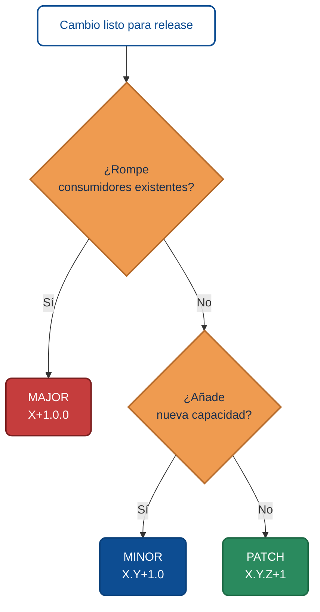

# Versionado semántico en equipos

El versionado no es un detalle cosmético. Es **una forma compartida de comunicar impacto**. Cuando el equipo está alineado en qué significa subir MAJOR, MINOR o PATCH, cada release se convierte en una conversación eficiente con los equipos que consumen tu software.

Esta lección cubre las reglas prácticas, las decisiones grises (que son la mayoría) y el puente con el CHANGELOG.

:::tip Plantilla copiable: requerimientos por versión
Complementaria al CHANGELOG: la plantilla `release-requirements.md.example` vive en [`examples-md/project/`](https://github.com/10xGuatemala/bootcamp/tree/main/examples-md/project) y documenta **una versión concreta** con sus requerimientos, repos afectados, migraciones de BD y checklist de release.

Es **release-centric**, no sprint-centric — sirve cuando el producto se versiona con SemVer y el release cruza múltiples repos (API + Web + docs + BD). Cópiala a `docs/requerimientos/vX.Y.Z.md` de tu proyecto.
:::

## La regla, en una línea

> `MAJOR.MINOR.PATCH` — subes MAJOR si rompes, MINOR si añades compatible, PATCH si corriges.

[Semantic Versioning 2.0.0](https://semver.org/lang/es/) es la referencia oficial. Aquí no la duplicamos; cubrimos cómo aplicarla en equipos reales.

## Matriz de decisiones típicas

Esta es la matriz que resuelve el 90% de las decisiones que vemos en proyectos reales:

| Cambio | Ejemplo concreto | Bump |
|--------|------------------|------|
| Añadir endpoint nuevo, opcional para consumidores | `POST /api/v1/reports/exports` nuevo (crea un trabajo de exportación como recurso) | MINOR |
| Añadir campo nuevo a un response | `{ "email": "...", "phone": "..." }` donde antes solo había `email` | MINOR |
| Añadir campo opcional a un request | DTO acepta `locale` opcional nuevo | MINOR |
| Cambiar el nombre de un campo de response | `firstName` → `first_name` | **MAJOR** |
| Hacer requerido un campo que antes era opcional | `phone` ahora obligatorio | **MAJOR** |
| Eliminar un endpoint | Borrar `GET /api/v1/legacy/...` | **MAJOR** |
| Corregir validación demasiado laxa | Antes aceptaba email inválido; ahora no | PATCH si ningún consumidor real enviaba ese input; **MAJOR** si algún cliente legítimo se rompe |
| Arreglar typo en un error de respuesta | `mesage` → `message` | PATCH (si nadie lo parsea) |
| Mejorar rendimiento sin cambiar contrato | Query optimizada que responde 3x más rápido | PATCH |
| Cambiar comportamiento por defecto | Paginación pasa de 50 → 20 por página | **MAJOR** |

### Cómo decidir en los casos grises

La matriz anterior cubre lo habitual. Para los casos en zona gris, aplica estos **criterios de decisión** en orden:

1. **¿Algún consumidor real cambia de comportamiento observable?** Si sí, es al menos MINOR.
2. **¿Ese consumidor tiene que modificar su código o su configuración** para seguir funcionando? Si sí, es MAJOR.
3. **¿Puedes introducirlo detrás de un flag o un deprecation warning** sin romper a nadie hoy? Si sí, publícalo como MINOR y programa el MAJOR en el siguiente ciclo con fecha comunicada.

Ejemplo aplicado a *"corregir validación demasiado laxa"*: si los logs de producción demuestran que ningún cliente real envía ese input inválido, no rompe a nadie → PATCH. Si en cambio encuentras integradores que dependían de la laxitud, comunícalo primero (MINOR + warning) y retíralo en MAJOR.

## Decisión visual



## SemVer en productos con UI (no solo APIs)

SemVer se inventó pensando en APIs de librerías. Para productos con UI funciona igual, pero ajusta el criterio de "rompe":

- **MAJOR**: un usuario necesita re-aprender un flujo importante, un integrador debe reconfigurar, un administrador debe migrar datos.
- **MINOR**: nueva pantalla, opción adicional, cambio visible que no obliga a cambiar hábitos.
- **PATCH**: bug fix, ajuste de texto, mejora de rendimiento imperceptible para el usuario.

## SemVer en aplicaciones cliente empaquetadas

Si distribuyes instaladores o apps móviles, añade una cuarta consideración: **compatibilidad de datos locales**. Si la v2.0.0 no puede abrir bases de datos locales generadas por la v1.x, tu cambio es definitivamente MAJOR — y debes proveer migración.

## Pre-releases y builds

SemVer permite sufijos para iteraciones antes de un release estable:

- `2.0.0-alpha.1` — versión temprana, inestable, para pruebas internas
- `2.0.0-beta.3` — feature-complete pero con bugs esperables
- `2.0.0-rc.1` — release candidate; si no aparece nada crítico, promueve a `2.0.0`

Y metadata de build, que **no afecta precedencia**:

- `2.0.0+build.2026.04.15` — útil para relacionar con un commit específico

Estos sufijos son oro para la comunicación: cualquier integrador sabe exactamente en qué estado está tu entrega.

## Política de versiones soportadas

Más allá del número, tu equipo necesita decidir **qué versiones se siguen parcheando**. Tres políticas típicas:

| Política | Cómo funciona | Para quién |
|----------|---------------|------------|
| Solo la última MAJOR | Solo parcheo la v3.x; la v2.x ya no recibe fixes | Equipos pequeños, productos SaaS |
| Las dos últimas MAJOR | Parcheo v2.x y v3.x; antes de eso, EOL | Productos con integradores grandes |
| LTS seleccionadas | v2.x es LTS hasta 2028, v3.x normal | Open source con comunidad amplia |

Publícala. Un integrador no debería tener que adivinar cuándo tu v1.x dejará de recibir parches de seguridad.

## El puente con CHANGELOG

La versión te dice *cuánto* cambió; el CHANGELOG te dice *qué* cambió. Son complementarios:

```markdown
## [2.1.0] - 2026-04-15

### Added
- Endpoint `POST /api/v1/reports/exports` para crear un trabajo de exportación de reportes a CSV (REQ-218).
- Campo opcional `locale` en todos los requests que devuelven textos (REQ-221).

### Changed
- Paginación por defecto del listado de tickets cambia de 50 a 20. Las integraciones
  que dependen del valor anterior deben pasar `per_page=50` explícitamente.

### Fixed
- Validación de email rechazaba addresses con `+alias` (BUG-411).

### Deprecated
- El parámetro `legacy=true` se retirará en v3.0.0. Usa el endpoint `/v2/reports/`.
```

Sigue el formato [Keep a Changelog](https://keepachangelog.com/es-ES/1.1.0/). Los encabezados estándar (`Added`, `Changed`, `Deprecated`, `Removed`, `Fixed`, `Security`) son más que convención: permiten a agentes y herramientas parsear automáticamente.

## Automatización sin perder control

Herramientas como `release-please`, `standard-version`, `semantic-release` pueden inferir la versión del próximo release a partir de los mensajes de commit (Conventional Commits: `feat:`, `fix:`, `BREAKING CHANGE:`). Ventajas:

- Menos errores humanos al decidir el bump.
- CHANGELOG generado automáticamente.
- Consistencia entre equipos y proyectos.

Precauciones:

- Requiere disciplina en los mensajes de commit.
- No todas las decisiones son mecánicas — deja margen para intervención manual.
- Configura quién puede aprobar un MAJOR: un bot no debería publicar una breaking change sin revisión humana.

## Errores comunes

| Error | Por qué duele |
|-------|---------------|
| Saltar directo a 2.0.0 "porque suena maduro" | Comunicas un rompimiento que no existe; confundes integradores |
| Quedarse en 0.x.y indefinidamente | En 0.x no garantizas nada; frena adopción corporativa |
| Publicar una breaking change como PATCH | Rompes integraciones y confianza en un solo movimiento |
| No tener política de soporte publicada | Todos asumen que parcheas todo, nadie sabe cuándo debe migrar |
| CHANGELOG solo con "mejoras varias" | Inútil para auditar, imposible de comunicar |

## Checklist por release

- [ ] El bump de versión refleja el impacto real del cambio.
- [ ] `CHANGELOG.md` tiene una entrada con secciones estándar.
- [ ] Cada entrada cita el ID del requerimiento o bug correspondiente.
- [ ] El tag de git coincide con la versión publicada.
- [ ] Las notas de release son legibles para alguien que no escribió el código.
- [ ] Si hay breaking changes, están listadas al inicio con guía de migración.

---

<div className="agent-block">

### Bloque estructurado para agentes

**Objetivo:** aplicar SemVer con consistencia y generar CHANGELOG auditable en cada release.

**Entradas:**
- Convención de versionado acordada (SemVer).
- Convención de mensajes de commit (Conventional Commits recomendada).
- Política de soporte definida.

**Pasos:**
1. Clasificar cada cambio con la matriz de decisión (MAJOR / MINOR / PATCH).
2. Documentar breaking changes al inicio de la entrada del CHANGELOG, con guía de migración.
3. Para pre-releases, usar sufijos `-alpha.N`, `-beta.N`, `-rc.N`.
4. Mantener CHANGELOG en formato Keep a Changelog con secciones estándar.
5. Automatizar con herramientas (`release-please` u otras) cuando la disciplina de commits lo permita.
6. Publicar y comunicar política de versiones soportadas.

**Criterios de aceptación por tipo de cambio:**

| Tipo | Criterio verificable |
|------|----------------------|
| MAJOR | Entrada del CHANGELOG abre con "BREAKING:" y lista al menos una guía de migración; tag `vX.0.0`; comunicación enviada a integradores |
| MINOR | Nuevo endpoint o campo presente con prueba que lo cubre; entrada en `Added` del CHANGELOG; ningún consumidor existente cambia comportamiento |
| PATCH | Bug corregido con prueba que lo demuestra (antes fallaba, ahora pasa); entrada en `Fixed` con referencia al ID del bug; sin cambios en contratos |
| Pre-release | Sufijo `-alpha.N` / `-beta.N` / `-rc.N`; no se promueve hasta cumplir los criterios del tipo estable equivalente |

**Salidas:**
- Versión consistente con el impacto del cambio.
- Entrada de CHANGELOG legible, auditable y parseable por agentes.
- Integradores informados sobre qué migrar y cuándo.

**Errores comunes:**
- Breaking change publicada como PATCH.
- CHANGELOG genérico ("mejoras varias").
- Pre-releases sin sufijo claro, mezcladas con releases estables.
- Sin política de soporte publicada.

**Referencias cruzadas:**
- [5.1 De la idea al release](./01-de-la-idea-al-release.md)
- [5.4 Trazabilidad requerimiento → release](./04-trazabilidad-requerimiento-release.md)
</div>

---

<AuthorCredit />
