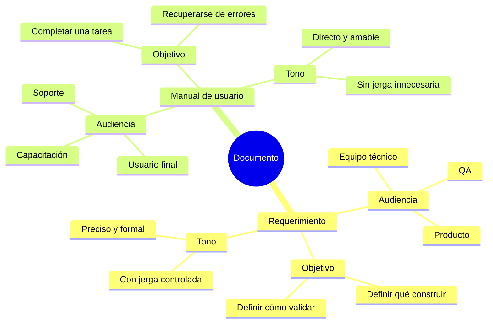

import AuthorCredit from '@site/src/components/AuthorCredit';

# Manuales de usuario final

Un manual técnico y un manual de usuario persiguen objetivos distintos. El primero ayuda a un equipo a implementar; el segundo ayuda a una persona a **operar con confianza**, incluso si nunca va a entender cómo funciona por dentro.

Confundir estas audiencias produce los dos peores escenarios posibles: manuales que los usuarios no entienden y documentación técnica que los desarrolladores ignoran. Esta lección explica cómo estructurar manuales que sí funcionan.

## Dos documentos, dos audiencias



## Los tres principios que no fallan

### 1. Habla de tareas, no de pantallas

Un usuario rara vez abre un manual para "conocer la aplicación". Lo abre porque necesita **hacer algo específico**: emitir una factura, aprobar un cambio, recuperar una contraseña. La estructura del manual debe reflejar eso.

| Mal estructurado | Bien estructurado |
|------------------|-------------------|
| *"La pantalla Facturas"* | *"Cómo emitir una factura a un cliente existente"* |
| *"Menú de administración"* | *"Cómo otorgar permisos a un nuevo empleado"* |
| *"Formulario de login"* | *"Cómo recuperar el acceso si olvidaste tu contraseña"* |

### 2. Orden: tarea → requisitos → pasos → resultado → recuperación

La estructura interna de cada sección debería ser casi mecánica:

```
## Cómo emitir una factura a un cliente existente

### Antes de empezar, necesitas:
- Permisos de "Facturación".
- Datos del cliente registrado previamente.

### Pasos
1. Abre el menú "Ventas" → "Nueva factura".
2. Busca al cliente por nombre o NIT.
3. Agrega los productos y cantidades.
4. Revisa los impuestos calculados.
5. Presiona "Emitir".

### Resultado esperado
Ves un mensaje verde "Factura #F-2026-00123 emitida".
La factura aparece en el listado de "Facturas del día".

### Si algo sale mal
- **Error "Cliente no encontrado"**: confirma que el cliente exista en "Clientes".
- **Error "Producto sin stock"**: revisa inventario antes de facturar.
- **No recibes email de confirmación**: confirma con tu administrador la configuración SMTP.
```

Este patrón es reconocible para cualquier lector y fácil de generar para un agente.

### 3. Verifica con un usuario real, no con el que escribió

Un manual que el autor considera "claro" rara vez es claro para quien nunca vio la aplicación. Ritual de validación:

- Dale el manual impreso o digital a alguien que no hizo la funcionalidad.
- Pídele que intente completar la tarea **sin pedir ayuda**.
- Observa dónde se detiene, qué pregunta, qué interpreta mal.
- Esos puntos son los que hay que reescribir.

## Prioriza las fuentes en este orden

Cuando documentes, no arranques leyendo código. Ese orden produce manuales incomprensibles. El orden correcto:

1. **La interfaz real**: navega tú mismo el flujo. Toma notas de lo que ve el usuario.
2. **Las reglas de negocio**: ¿qué bloquea el sistema? ¿qué validaciones aparecen?
3. **Mensajes del sistema**: errores, advertencias, confirmaciones. Cítalos literales.
4. **Código, como último recurso**: solo cuando la UI o el backend no dejan claro un detalle importante.

## Elementos gráficos: cuándo sí y cuándo no

Capturas de pantalla son útiles cuando:

- Guían visualmente una ubicación específica dentro de una UI compleja.
- Muestran un estado de éxito o error que el usuario debe reconocer.
- Ilustran un diseño único (un formulario largo, un wizard).

Son contraproducentes cuando:

- La UI cambia con frecuencia — tendrás que actualizar mil capturas.
- Reemplazan al texto en lugar de complementarlo.
- Son los únicos accesibles: personas con lectores de pantalla se quedan sin información.

Regla: **texto primero, imágenes como apoyo**. Siempre incluye `alt` descriptivo.

## Tono: cercano, concreto, sin condescender

- Usa **segunda persona**: "Haces clic en…" es más claro que "El usuario hará clic en…".
- **Verbos directos**: "abre", "selecciona", "confirma" — no "proceder a abrir".
- **Evita "simplemente" o "solo"**: a quien lee el manual, nada le resulta simple.
- **Define jerga** la primera vez: *"NIT (Número de Identificación Tributaria)"* y luego solo "NIT".
- **Escribe para leer saltando**: el usuario no lee linealmente. Usa encabezados, listas, énfasis.

## Versiona junto al producto

Un manual sin versión es un manual que envejece en silencio. Mínimo:

- Indica la versión del producto desde la cual aplica (*"Disponible desde v1.5.0"*).
- Mantén una nota en la parte superior con la fecha de última revisión.
- Si una sección se reescribe, indica qué cambió en el CHANGELOG del manual o del producto.

Esto también ayuda a que un agente que genere soporte automatizado pueda citar la fuente con confianza.

## Accesibilidad: no es opcional

Un manual accesible beneficia a todos, no solo a usuarios con discapacidad:

- **Contraste suficiente** en textos e imágenes con anotaciones.
- **`alt` text** descriptivo en todas las imágenes.
- **Estructura semántica**: encabezados jerárquicos (H1 → H2 → H3), no negritas como títulos.
- **Enlaces con texto descriptivo**: *"ver política de privacidad"*, no *"haz clic aquí"*.
- **Videos con subtítulos** y transcripción.
- **Lenguaje claro**: ayuda a lectores de pantalla y a personas con diversidad cognitiva.

## Internacionalización desde el inicio

Si tu producto está en varios idiomas, el manual también debe estarlo. Consejos:

- **Español neutro** cuando sirvas a varios países latinoamericanos.
- **Evita modismos** que no traducen bien.
- **Traducciones revisadas por humanos**, no solo automáticas.
- **Capturas locales**: un usuario brasileño no se reconoce en una UI en español.

## Cuándo retirar secciones

Un manual que solo crece eventualmente nadie lo lee. Retira o archiva cuando:

- La funcionalidad se deprecó hace más de dos releases MAJOR.
- La captura ya no coincide con la UI y nadie tiene tiempo de actualizarla.
- El flujo cambió y ya no aplica.

Mantén un historial por versión si algún usuario aún está en versiones antiguas.

## Plantilla reusable

La plantilla tiene **secciones fijas** (en todos los manuales) y **secciones opcionales** según el producto. Un manual que omita cualquier sección fija probablemente está incompleto.

```markdown
# {Nombre del producto} — Manual de usuario

Última revisión: YYYY-MM-DD · Versión del producto: vX.Y.Z

## Quién es el usuario                         <!-- [requerido] -->
- Perfil: quién debería leer este manual (rol, contexto).
- Supuestos: qué se asume que ya sabe o tiene.

## Objetivos del producto                      <!-- [requerido] -->
- Qué resuelve, en 2-4 frases sin jerga técnica.

## Requisitos previos                          <!-- [requerido] -->
- Accesos, datos, permisos, dispositivos o navegadores soportados.

## Flujo principal                              <!-- [requerido] -->
La tarea que la mayoría de usuarios necesita. Estructura:
- Antes de empezar, necesitas: ...
- Pasos (numerados).
- Resultado esperado.
- Si algo sale mal: ...

## Tareas secundarias                           <!-- [requerido] — al menos una -->
### Cómo {tarea 2}
### Cómo {tarea 3}
...

## Resolución de errores comunes               <!-- [requerido] -->
Formato por error:
- **Mensaje literal que ve el usuario**: causa probable y pasos de resolución.

## Glosario                                    <!-- (opcional) -->
- Términos técnicos con definición sencilla.

## Historial de cambios                        <!-- [requerido] -->
- vX.Y.Z (YYYY-MM-DD): qué cambió en este manual. Enlaza al CHANGELOG del producto.

## ¿Necesitas ayuda?                           <!-- [requerido] -->
- Canal de soporte, horario, forma de contacto.
```

## Manual ↔ CHANGELOG: una relación explícita

Cuando el producto sube de versión, el manual debe reflejar lo que cambió en la UI o en los flujos del usuario. La relación es directa:

| Entrada del CHANGELOG | Acción en el manual |
|-----------------------|---------------------|
| `Added` — capacidad nueva visible | Añadir sección o paso nuevo; actualizar "Historial de cambios" |
| `Changed` — comportamiento visible distinto | Reescribir el paso afectado; mantener nota si el usuario viene de la versión anterior |
| `Fixed` — bug que el usuario notaba | Revisar si la sección de errores comunes debe retirar la mención al bug |
| `Deprecated` — capacidad que se va a retirar | Añadir aviso en la sección afectada con la fecha estimada |
| `Removed` — capacidad eliminada | Archivar la sección; dejar referencia en el historial |

El manual cita la versión del producto en la portada y en cada aviso. Un agente que lea el CHANGELOG puede proponer los cambios del manual automáticamente siguiendo esta tabla.

## Skill reusable: generar un manual de usuario

Las reglas siguientes son la forma ejecutable de todo lo anterior: **un contrato** que un agente de IA puede leer y respetar para redactar manuales coherentes, sin alucinar elementos que no existen en la UI.

Guárdalo como archivo aparte (por ejemplo `skills/redactar-manual-usuario.md`) o incluso en `CLAUDE.md` / `AGENTS.md` del repo del producto. Cualquier agente con acceso a ese archivo puede invocarlo.

```markdown
# Skill: redactar manual de usuario

## Propósito
Generar o actualizar secciones de un manual de usuario final a partir
de una captura, un flujo descrito o una entrada del CHANGELOG.

## Reglas obligatorias

- **Audiencia:** escribir para el usuario final, no para desarrolladores.
- **Lenguaje:** claro y directo; sin jerga técnica interna.
- **Fidelidad:** no inventar botones, campos, pantallas ni opciones que
  no estén presentes en el flujo o en la captura proporcionada.
  Si falta información, pedirla antes de redactar.
- **Tono:** corporativo y profesional; en segunda persona; sin
  condescender ("simplemente", "solo").

## Estructura obligatoria por procedimiento

Cada procedimiento del manual debe incluir, en este orden:

1. **Propósito** — en una frase, qué logra el usuario al completar
   este procedimiento.
2. **Precondiciones** — accesos, datos, permisos o pasos previos
   necesarios. Si no hay, escribir "Ninguna".
3. **Pasos enumerados** — acciones concretas del usuario, una por línea,
   usando verbos directos. Referenciar el texto literal de botones y
   campos tal como aparecen en la UI.
4. **Resultado esperado** — qué debe ver el usuario al terminar
   (mensaje, cambio de estado, redirección). Incluir el texto literal
   del mensaje cuando aplique.
5. **Observaciones** — condiciones especiales, variantes, enlaces a
   temas relacionados o a la sección de errores comunes.

## Entrada esperada

Una de estas tres:
- Captura o descripción literal del flujo en la UI.
- Entrada del CHANGELOG que describe un cambio visible al usuario.
- Prompt del usuario indicando la tarea a documentar.

## Salida esperada

- Sección en markdown con la estructura obligatoria.
- Ningún elemento inventado.
- Tono coherente con el resto del manual.
- Mensajes del sistema citados literalmente y resaltados.

## Antes de entregar, verificar

- [ ] Cada procedimiento tiene las 5 secciones obligatorias.
- [ ] Todos los botones/campos mencionados existen en la captura o flujo.
- [ ] El lenguaje es comprensible para alguien sin formación técnica.
- [ ] No se usan palabras como "simplemente" ni "solo".
- [ ] Los mensajes del sistema están citados con su texto literal.
```

Una vez registrada la skill, invocarla es tan simple como:

> "Usando la skill **redactar-manual-usuario**, documenta el procedimiento 'Cómo aprobar una solicitud de vacaciones' a partir de esta captura."

El agente genera la sección siguiendo las reglas sin que el equipo tenga que repetirlas cada vez.

---

<div className="agent-block">

### Bloque estructurado para agentes

**Objetivo:** redactar o mejorar un manual de usuario final que respete la audiencia, estructura y tono adecuados.

**Entradas:**
- Producto con UI disponible.
- Lista de tareas principales que el usuario debe realizar.
- Mensajes del sistema (errores, confirmaciones) recolectados de la UI real.
- Público objetivo (región, nivel de experiencia, accesibilidad).

**Pasos:**
1. Inventariar las tareas del usuario (no las pantallas).
2. Para cada tarea, aplicar la estructura: requisitos → pasos → resultado → recuperación.
3. Priorizar fuentes: UI real → backend → código.
4. Validar con un usuario que no participó en el desarrollo.
5. Añadir versionado y fecha de revisión.
6. Revisar accesibilidad (contraste, alt text, estructura semántica).
7. Retirar secciones obsoletas.

**Salidas:**
- Manual estructurado por tareas, con patrón reconocible.
- Plantilla reusable por la organización.
- Evidencia de validación con al menos un usuario real.

**Errores comunes:**
- Estructurar el manual por pantallas en vez de por tareas.
- Reemplazar texto con capturas que envejecen rápido.
- Usar jerga técnica sin definir.
- Olvidar versionar el manual.

**Referencias cruzadas:**
- [01 · De la idea al release](./01-de-la-idea-al-release.md)
- [04 · Trazabilidad requerimiento → release](./04-trazabilidad-requerimiento-release.md)

</div>

---

<AuthorCredit />
