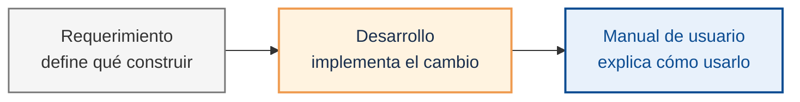
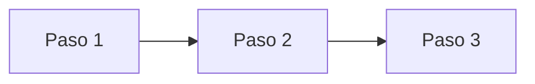
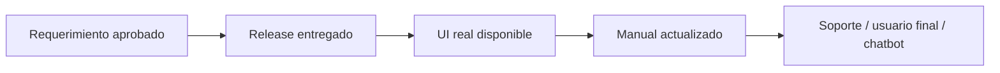

# Manuales de usuario final

Un manual técnico y un manual de usuario persiguen objetivos distintos. El primero ayuda a un equipo a implementar; el segundo ayuda a una persona a **operar con confianza**, incluso si nunca va a entender cómo funciona por dentro.

Confundir estas audiencias produce los dos peores escenarios posibles: manuales que los usuarios no entienden y documentación técnica que los desarrolladores ignoran. Esta lección explica cómo estructurar manuales que sí funcionan.

## Dos documentos, dos audiencias



El requerimiento y el manual no compiten; viven en momentos distintos del ciclo. El requerimiento guía al equipo que construye. El manual guía a la persona que usa lo construido.

| Documento | Audiencia principal | Pregunta que responde | Buen resultado |
|-----------|---------------------|-----------------------|----------------|
| Requerimiento | Producto, desarrollo, QA | ¿Qué hay que construir y cómo se valida? | El equipo puede implementar y probar sin adivinar intención |
| Manual de usuario | Usuario final, soporte, capacitación | ¿Cómo completo esta tarea en el producto? | La persona puede operar, reconocer éxito y recuperarse de errores |

La diferencia más importante está en la fuente: el requerimiento describe la intención antes o durante el desarrollo; el manual se redacta contra la **UI real entregada**. Si el botón final dice **Guardar y emitir**, el manual usa ese texto aunque el requerimiento haya dicho "Confirmar".

## Los tres principios que no fallan

### Habla de tareas, no de pantallas

Un usuario rara vez abre un manual para "conocer la aplicación". Lo abre porque necesita **hacer algo específico**: emitir una factura, aprobar un cambio, recuperar una contraseña. La estructura del manual debe reflejar eso.

| Mal estructurado | Bien estructurado |
|------------------|-------------------|
| *"La pantalla Facturas"* | *"Cómo emitir una factura a un cliente existente"* |
| *"Menú de administración"* | *"Cómo otorgar permisos a un nuevo empleado"* |
| *"Formulario de login"* | *"Cómo recuperar el acceso si olvidaste tu contraseña"* |

### Orden: tarea → requisitos → pasos → resultado → recuperación

La estructura interna de cada sección debería ser casi mecánica:

```
## Cómo emitir una factura a un cliente existente

### Antes de empezar, necesitas:
- Permisos de "Facturación".
- Datos del cliente registrado previamente.

### Pasos
1. Abre el menú "Ventas" → "Nueva factura".
2. Busca al cliente por nombre o NIT.
3. Agrega los productos y cantidades.
4. Revisa los impuestos calculados.
5. Presiona "Emitir".

### Resultado esperado
Ves un mensaje verde "Factura #F-2026-00123 emitida".
La factura aparece en el listado de "Facturas del día".

### Si algo sale mal
- **Error "Cliente no encontrado"**: confirma que el cliente exista en "Clientes".
- **Error "Producto sin stock"**: revisa inventario antes de facturar.
- **No recibes email de confirmación**: confirma con tu administrador la configuración SMTP.
```

Este patrón es reconocible para cualquier lector y fácil de generar para un agente.

### Verifica con un usuario real, no con el que escribió

Un manual que el autor considera "claro" rara vez es claro para quien nunca vio la aplicación. Ritual de validación:

- Dale el manual impreso o digital a alguien que no hizo la funcionalidad.
- Pídele que intente completar la tarea **sin pedir ayuda**.
- Observa dónde se detiene, qué pregunta, qué interpreta mal.
- Esos puntos son los que hay que reescribir.

## Prioriza las fuentes en este orden

Cuando documentes, no arranques leyendo código. Ese orden produce manuales incomprensibles. El orden correcto:

1. **La interfaz real**: navega tú mismo el flujo. Toma notas de lo que ve el usuario.
2. **Las reglas de negocio**: ¿qué bloquea el sistema? ¿qué validaciones aparecen?
3. **Mensajes del sistema**: errores, advertencias, confirmaciones. Cítalos literales.
4. **Código, como último recurso**: solo cuando la UI o el backend no dejan claro un detalle importante.

## Elementos gráficos: cuándo sí y cuándo no

Capturas de pantalla son útiles cuando:

- Guían visualmente una ubicación específica dentro de una UI compleja.
- Muestran un estado de éxito o error que el usuario debe reconocer.
- Ilustran un diseño único (un formulario largo, un wizard).

Son contraproducentes cuando:

- La UI cambia con frecuencia — tendrás que actualizar mil capturas.
- Reemplazan al texto en lugar de complementarlo.
- Son los únicos accesibles: personas con lectores de pantalla se quedan sin información.

Regla: **texto primero, imágenes como apoyo**. Siempre incluye `alt` descriptivo.

## Tono: cercano, concreto, sin condescender

- Usa **segunda persona**: "Haces clic en…" es más claro que "El usuario hará clic en…".
- **Verbos directos**: "abre", "selecciona", "confirma" — no "proceder a abrir".
- **Evita "simplemente" o "solo"**: a quien lee el manual, nada le resulta simple.
- **Define jerga** la primera vez: *"NIT (Número de Identificación Tributaria)"* y luego solo "NIT".
- **Escribe para leer saltando**: el usuario no lee linealmente. Usa encabezados, listas, énfasis.

## Versiona junto al producto

Un manual sin trazabilidad envejece en silencio. No siempre necesitas publicar la versión del producto dentro de cada manual, pero sí debes dejar evidencia de cuándo aplica y qué entrega lo originó.

Mínimo:

- Mantén `Fecha de actualización` en la sección de información del documento.
- Indica módulo, rol, área y alcance del manual.
- Si el manual responde a un release o requerimiento específico, enlázalo en el historial del manual o en la metadata del documento.
- Si tu producto publica versiones para usuarios finales, agrega `Versión del producto` o `Disponible desde vX.Y.Z`; si no, no lo inventes.

Esto también ayuda a que un agente que genere soporte automatizado pueda citar la fuente con confianza.

## Accesibilidad: no es opcional

Un manual accesible beneficia a todos, no solo a usuarios con discapacidad:

- **Contraste suficiente** en textos e imágenes con anotaciones.
- **`alt` text** descriptivo en todas las imágenes.
- **Estructura semántica**: encabezados jerárquicos (H1 → H2 → H3), no negritas como títulos.
- **Enlaces con texto descriptivo**: *"ver política de privacidad"*, no *"haz clic aquí"*.
- **Videos con subtítulos** y transcripción.
- **Lenguaje claro**: ayuda a lectores de pantalla y a personas con diversidad cognitiva.

## Internacionalización desde el inicio

Si tu producto está en varios idiomas, el manual también debe estarlo. Consejos:

- **Español neutro** cuando sirvas a varios países latinoamericanos.
- **Evita modismos** que no traducen bien.
- **Traducciones revisadas por humanos**, no solo automáticas.
- **Capturas locales**: un usuario brasileño no se reconoce en una UI en español.

## Cuándo retirar secciones

Un manual que solo crece eventualmente nadie lo lee. Retira o archiva cuando:

- La funcionalidad se deprecó hace más de dos releases MAJOR.
- La captura ya no coincide con la UI y nadie tiene tiempo de actualizarla.
- El flujo cambió y ya no aplica.

Mantén un historial por versión si algún usuario aún está en versiones antiguas.

## Plantilla reusable

La plantilla tiene **secciones fijas** (en todos los manuales) y **secciones opcionales** según el destino. Está pensada para manuales generados por agentes: primero produce un Markdown completo y, si el destino lo requiere, deja puntos claros para insertar capturas.

````markdown
# Manual de Usuario para {Área o tarea} de {Módulo}

> **Nota para el redactor:** si el manual es para usuarios que ya conocen
> el sistema, puedes omitir la introducción y empezar en "Información del
> documento". Si el destino es chatbot/RAG, prioriza texto literal sobre
> capturas.

## Introducción                                 <!-- opcional -->

{Una explicación breve: para qué sirve el módulo, a quién ayuda y qué
tareas cubre. No repetir historia del producto ni detalles técnicos.}

## Información del documento                    <!-- requerido -->

- Fecha de actualización: YYYY-MM-DD
- Requerimiento/release relacionado: {ID o enlace, si aplica}
- Módulo: {Nombre del módulo}
- Rol: {Rol objetivo}
- Área: {Área o tarea cubierta}
- Alcance: {Qué cubre y qué no cubre este archivo}

## Flujo de trabajo                              <!-- requerido si aplica -->



Omitir este bloque en manuales de pura consulta. Usarlo cuando el usuario
debe completar una tarea con varias etapas.

## Tabla de contenido                            <!-- requerido -->

- [1. Descripción general](#1-descripción-general)
- [2. Cómo {tarea principal}](#2-cómo-tarea-principal)
- [3. Errores comunes](#3-errores-comunes)

---

## 1. Descripción general

Esta sección explica qué permite hacer esta pantalla o flujo, usando el
vocabulario que ve el usuario en la UI.

### 1.1 Acceso a la opción

Para acceder a esta opción, abre **{Sección del menú} → {Opción visible}**.

### 1.2 Secciones visibles

- **{Nombre de sección visible}:** qué muestra o permite.
- **{Nombre de otra sección}:** qué muestra o permite.

Ilustración 1: {Descripción de la captura, si aplica}.

---

## 2. Cómo {tarea principal}

### Antes de empezar, necesitas:

- {Permiso, rol o dato previo}.
- {Precondición adicional, o "Ninguna" si no aplica}.

### Pasos

1. {Acción concreta con texto literal de la UI}.
2. {Siguiente acción}.
3. {Acción final}.

### Resultado esperado

- {Mensaje literal, cambio de estado o pantalla resultante}.
- {Dónde confirmar que la tarea terminó correctamente}.

Ilustración 2: {Descripción de la captura, si aplica}.

### Si algo sale mal

- **"{Mensaje literal de error}"**: causa probable y cómo resolver.
- **"{Otro mensaje}"**: causa probable y cómo resolver.

---

## 3. Errores comunes

- **{Situación o mensaje visible}:** qué significa y qué hacer.
- **{Situación o mensaje visible}:** qué significa y qué hacer.

## Glosario                                      <!-- opcional -->

- **{Término}:** definición en una línea, escrita para usuario final.

## Soporte                                       <!-- opcional -->

- Canal oficial: {correo, mesa de ayuda o ruta interna}.
- Horario o SLA: {si aplica}.

## Historial del manual                          <!-- requerido -->

- vX.Y.Z (YYYY-MM-DD): actualizado por {requerimiento/release/ticket}.
````

## Cómo se relacionan releases, requerimientos y manual

El manual se actualiza cuando un **release entrega un requerimiento que cambia la experiencia del usuario**. Esa es la relación importante: requerimiento entregado → UI real → manual.

El release indica qué requerimientos ya están disponibles para usuarios. El manual traduce esos requerimientos entregados en instrucciones operativas: qué necesita la persona, qué pasos sigue, qué resultado debe ver y cómo recuperarse si algo falla.

La cadena correcta es:



Cada tipo de cambio produce una acción distinta en el manual:

| Cambio entregado en el release | Qué hacer en el manual | Fuente principal |
|--------------------------------|------------------------|------------------|
| Funcionalidad nueva visible | Crear procedimiento nuevo | UI real del requerimiento entregado |
| Flujo existente cambió | Reescribir los pasos afectados | UI real comparada contra el manual anterior |
| Validación o mensaje cambió | Actualizar requisitos, errores comunes o resultado esperado | UI real y mensaje literal del sistema |
| Funcionalidad se deprecó | Añadir aviso al inicio de la sección | Requerimiento/release que declara la deprecación |
| Funcionalidad se eliminó | Archivar o retirar la sección | Requerimiento/release que elimina la función |

**Regla práctica:** no redactes procedimientos desde el requerimiento ni desde la nota del release. Úsalos para saber **qué revisar**. Redacta desde la UI real, porque ahí aparecen los permisos, estados, textos y restricciones que el usuario final sí enfrenta.

El módulo [5.5](./05-generar-manuales-con-agentes.md) toma esta relación y la convierte en un flujo ejecutable con agentes: una skill redacta desde la UI, otra puede generar capturas si el destino lo necesita, y un orquestador valida que el resultado sea consistente.

## Skill reusable: generar un manual de usuario

Las reglas siguientes son la forma ejecutable de todo lo anterior: **un contrato** que un agente de IA puede leer y respetar para redactar manuales coherentes, sin alucinar elementos que no existen en la UI.

:::tip Archivo copiable
La plantilla completa de `redactar-manual-usuario.skill.md` vive como archivo real en [`examples-md/agents/skills/general/`](https://github.com/10xGuatemala/bootcamp/tree/main/examples-md/agents/skills/general). Esa versión incluye además dos secciones extra que no caben aquí: **ordenar por workflow real** (primero tareas frecuentes, después maestros) y **variante multi-tenant** con segmentación sistema × rol para apps con menús distintos según el perfil del usuario.

Copia el archivo a tu repo (`.claude/skills/redactar-manual-usuario.skill.md` o equivalente según tu agente) y cualquier agente con acceso al repositorio podrá invocarlo.
:::

El bloque siguiente es una versión reducida del contrato, útil para entender la forma sin salir de esta lección:

```markdown
# Skill: redactar manual de usuario

## Propósito
Generar o actualizar secciones de un manual de usuario final a partir
de la UI real navegada con el rol objetivo. La fuente de verdad es
siempre la pantalla, no la prosa de un requerimiento o release.

## Reglas obligatorias

- **Audiencia:** escribir para el usuario final, no para desarrolladores.
- **Lenguaje:** claro y directo; sin jerga técnica interna.
- **Fidelidad:** no inventar botones, campos, pantallas ni opciones que
  no estén presentes en la UI. Si falta información, pedir acceso a la
  pantalla antes de redactar.
- **Tono:** corporativo y profesional; en segunda persona; sin
  condescender ("simplemente", "solo").

## Estructura obligatoria por procedimiento

Cada procedimiento del manual debe incluir, en este orden:

1. **Propósito** — en una frase, qué logra el usuario al completar
   este procedimiento.
2. **Precondiciones** — accesos, datos, permisos o pasos previos
   necesarios. Si no hay, escribir "Ninguna".
3. **Pasos enumerados** — acciones concretas del usuario, una por línea,
   usando verbos directos. Referenciar el texto literal de botones y
   campos tal como aparecen en la UI.
4. **Resultado esperado** — qué debe ver el usuario al terminar
   (mensaje, cambio de estado, redirección). Incluir el texto literal
   del mensaje cuando aplique.
5. **Observaciones** — condiciones especiales, variantes, enlaces a
   temas relacionados o a la sección de errores comunes.

## Entrada esperada

Una combinación de estas tres, con la UI siempre presente:
- Acceso a la app real con un usuario del rol objetivo (obligatorio).
- Captura o descripción literal del flujo en la UI (obligatorio si no
  hay acceso vivo a la app).
- Prompt del usuario indicando la tarea a documentar.

Adicionalmente, como **disparadores** de cuándo redactar (no como fuente):
- Un requerimiento entregado en un release.
- Una nota del release que indique qué pantalla revisar.
- Un ticket de soporte que mencione una pantalla confusa.

Si el disparador llega sin acceso a la UI, pedir el acceso antes de
redactar — nunca inventar pasos a partir del requerimiento o de la nota del release.

## Salida esperada

- Sección en markdown con la estructura obligatoria.
- Ningún elemento inventado.
- Tono coherente con el resto del manual.
- Mensajes del sistema citados literalmente y resaltados.

## Antes de entregar, verificar

- [ ] Cada procedimiento tiene las 5 secciones obligatorias.
- [ ] Todos los botones/campos mencionados existen en la UI navegada.
- [ ] El lenguaje es comprensible para alguien sin formación técnica.
- [ ] No se usan palabras como "simplemente" ni "solo".
- [ ] Los mensajes del sistema están citados con su texto literal.
```

Una vez registrada la skill, invocarla es tan simple como:

> "Usando la skill **redactar-manual-usuario**, documenta el procedimiento 'Cómo aprobar una solicitud de vacaciones' a partir de esta captura."

El agente genera la sección siguiendo las reglas sin que el equipo tenga que repetirlas cada vez.

## Glosario

**Manual de usuario** *(User manual / End-user documentation)* — documento orientado a tareas dirigido a usuarios finales. El [framework Diátaxis](https://diataxis.fr/) lo clasifica dentro de las categorías *tutorial* y *how-to guide*, distinguiéndolo de *reference* y *explanation*.

**Manual técnico** *(Technical / Developer documentation)* — documentación para equipos de implementación. En [Diátaxis](https://diataxis.fr/) corresponde principalmente a *reference* y *explanation*.

**Tutorial** *(Tutorial)* — *"una lección que toma al estudiante por la mano a través de una serie de pasos para completar un proyecto"* ([Diátaxis · Tutorials](https://diataxis.fr/tutorials/)); orientado al aprendizaje, no a la tarea concreta.

**How-to guide** *(How-to guide)* — *"receta para alcanzar un objetivo específico"* ([Diátaxis · How-to guides](https://diataxis.fr/how-to-guides/)); orientada a usuarios que ya saben lo básico y necesitan resolver algo concreto.

**Voz y tono** *(Voice and tone)* — conjunto de decisiones editoriales que definen cómo se dirige la documentación al lector. La [Google Developer Documentation Style Guide](https://developers.google.com/style) recomienda *"be conversational and friendly without being frivolous"* y el [Microsoft Writing Style Guide](https://learn.microsoft.com/en-us/style-guide/welcome/) promueve *"warm and relaxed, crisp and clear, ready to lend a hand"*.

**Accesibilidad en documentación** *(Accessible documentation)* — prácticas que aseguran que el manual sea utilizable por personas con discapacidad; incluye texto alternativo, contraste y estructura semántica. Guía oficial en [Microsoft Writing Style Guide · Accessibility](https://learn.microsoft.com/en-us/style-guide/welcome/).

**Internacionalización (i18n)** *(Internationalization)* — diseñar contenido para que pueda traducirse sin rehacerlo; incluye evitar modismos, usar fechas ISO y separar texto de imágenes. Recomendaciones en la [Google Developer Documentation Style Guide](https://developers.google.com/style).

:::info Referencias primarias
- [Diátaxis framework](https://diataxis.fr/) — taxonomía canónica de documentación técnica (tutorial / how-to / reference / explanation).
- [Google Developer Documentation Style Guide](https://developers.google.com/style) — estándar abierto de estilo para docs técnicos.
- [Microsoft Writing Style Guide](https://learn.microsoft.com/en-us/style-guide/welcome/) — guía editorial de Microsoft, gratuita y accesible.
:::

---

<div className="agent-block">

### Bloque estructurado para agentes

**Objetivo:** redactar o mejorar un manual de usuario final que respete la audiencia, estructura y tono adecuados.

**Entradas:**
- Producto con UI disponible.
- Lista de tareas principales que el usuario debe realizar.
- Mensajes del sistema (errores, confirmaciones) recolectados de la UI real.
- Público objetivo (región, nivel de experiencia, accesibilidad).

**Pasos:**
1. Inventariar las tareas del usuario (no las pantallas).
2. Para cada tarea, aplicar la estructura: requisitos → pasos → resultado → recuperación.
3. Priorizar fuentes: UI real → backend → código.
4. Validar con un usuario que no participó en el desarrollo.
5. Añadir versionado y fecha de revisión.
6. Revisar accesibilidad (contraste, alt text, estructura semántica).
7. Retirar secciones obsoletas.

**Salidas:**
- Manual estructurado por tareas, con patrón reconocible.
- Plantilla reusable por la organización.
- Evidencia de validación con al menos un usuario real.

**Errores comunes:**
- Estructurar el manual por pantallas en vez de por tareas.
- Reemplazar texto con capturas que envejecen rápido.
- Usar jerga técnica sin definir.
- Olvidar versionar el manual.

**Referencias cruzadas:**
- [5.1 De la idea al release](./01-de-la-idea-al-release.md)
- [5.4 Trazabilidad requerimiento → release](./04-trazabilidad-requerimiento-release.md)
</div>

---

<AuthorCredit />
