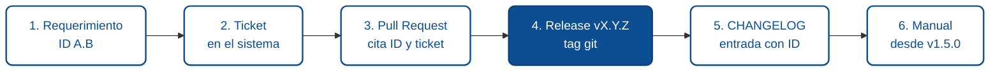

# Trazabilidad: del requerimiento al release

Un equipo maduro no solo entrega software. También puede **responder, en cualquier momento**, tres preguntas:

1. *"¿De dónde salió este cambio?"*
2. *"¿Qué versiones incluyen esta corrección?"*
3. *"¿Dónde lo documentamos para el usuario?"*

La trazabilidad es lo que hace posibles esas respuestas. Sin ella, el conocimiento se pierde en chats, tickets viejos y recuerdos de quien ya no está.

## La cadena canónica de trazabilidad

La cadena es fija: **Requerimiento → Ticket → PR → Release → CHANGELOG → Manual**. Cualquier eslabón roto te deja sin poder auditar el cambio.



**Alternativa en lista** (útil si el diagrama no carga):

1. **Requerimiento** — ID `A.B`, objetivo, criterios de aceptación.
2. **Ticket** — referencia en el sistema de gestión, enlaza al requerimiento.
3. **Pull Request** — cita ID del requerimiento y ticket en título/descripción; contiene los commits.
4. **Release** — tag git `vX.Y.Z` una vez mergeado y publicado.
5. **CHANGELOG** — entrada bajo `[X.Y.Z]` con ID del requerimiento.
6. **Manual** — sección actualizada; cita *"Disponible desde vX.Y.Z"*.

Cada eslabón debe poder llevarte al siguiente **sin fricción**. Si te toma más de dos clics pasar de una entrada de CHANGELOG al requerimiento original, la cadena se oxidó.

## Los enlaces imprescindibles

| Enlace | Cómo se establece | Formato típico |
|--------|-------------------|----------------|
| **Requerimiento → Ticket** | El ticket cita el ID del requerimiento en su título o descripción | `[1.1] Validación de longitud en comentarios` |
| **Ticket → PR (commits)** | Los commits del PR citan el ID del requerimiento | `feat(tickets): validar longitud (1.1)` |
| **PR → Release** | El PR se mergea y queda incluido en el tag `vX.Y.Z` | Tag de git apunta al merge commit |
| **Release → CHANGELOG** | Al publicar, la sección `[Unreleased]` pasa a `[X.Y.Z] - YYYY-MM-DD` con el ID | `- Validación de longitud en comentarios (1.1).` |
| **CHANGELOG → Manual** | El manual cita la versión desde la cual existe la capacidad | *"Disponible desde v1.5.0"* |

## Mensajes de commit como eslabón

Los [Conventional Commits](https://www.conventionalcommits.org/es/v1.0.0/) funcionan bien como convención: `tipo(alcance): descripción`. Añadir el **ID del requerimiento** en el alcance o al final hace el resto:

```
feat(auth): soportar login con MFA  (REQ-142)
fix(tickets): evitar doble asignación  (BUG-318)
docs(manual): sección de MFA  (REQ-142)
```

Tres razones por las que esto paga:

- **Búsqueda trivial**: `git log --grep="REQ-142"` trae toda la historia.
- **Changelog automático**: herramientas como `release-please` o `standard-version` generan entradas a partir de estos mensajes.
- **Auditoría reversible**: si un cambio rompió producción, `git blame` + ID → requerimiento → contexto.

## CHANGELOG como índice narrativo

`CHANGELOG.md` **no reemplaza el manual** ni el requerimiento. Es el **índice narrativo** de la historia del producto: una persona lo lee y entiende el arco del cambio; un agente lo parsea y sabe qué versión consultar para una capacidad.

**Entrada útil:**

```markdown
## [1.5.0] - 2026-03-10

### Added
- Validación de longitud máxima en comentarios, 1024 caracteres (REQ-142).
  Manual actualizado en la sección "Crear ticket".

### Fixed
- Corrección de doble asignación de tickets bajo alta concurrencia (BUG-318).
```

**Entrada que no sirve:**

```markdown
## 1.5.0

- varios cambios
- mejoras de rendimiento
- correcciones menores
```

La diferencia: el primero se puede auditar; el segundo solo da confianza.

## Enlaces bidireccionales

Donde valga la pena, **cierra el círculo**:

- El requerimiento enlaza al PR que lo resolvió (*"Resuelto en PR #451, v1.5.0"*).
- El CHANGELOG enlaza al requerimiento (*"Ver REQ-142"*).
- El manual de usuario enlaza a la entrada del CHANGELOG (*"Disponible desde v1.5.0, ver CHANGELOG"*).

No es sobrecarga: es lo que permite que alguien que llega tres años después entienda por qué existe cada línea.

## Cómo un agente usa esta trazabilidad

Cuando preguntas a un agente *"¿qué cambió en la v1.5.0?"* o *"¿dónde está documentada la validación de comentarios?"*, el agente **no adivina**: recorre la cadena.

Para que funcione, el agente necesita:

- `CHANGELOG.md` con formato consistente (Keep a Changelog).
- Mensajes de commit con ID estable.
- Manual con menciones explícitas de versión (*"Disponible desde v1.5.0"*).
- Ruta clara del repositorio a la documentación.

Si estos cuatro puntos están en su lugar, una sola pregunta natural obtiene una respuesta verificable con enlaces a las fuentes.

## Errores comunes

- **CHANGELOG que se escribe "al final"** — suele quedar incompleto y con entradas genéricas. Mejor escribir la entrada cuando se hace merge del PR.
- **IDs que cambian** (moverte de un Jira a otro, por ejemplo) sin mantener un mapa de equivalencias. Se rompe la trazabilidad histórica.
- **Requerimientos que viven en Google Docs sin identificador estable.** Imposible referenciarlos desde git.
- **Manuales sin indicar versión** — el usuario ve instrucciones que no coinciden con su ambiente.
- **Commits "WIP" o "fix"** sin contexto. No aportan a la cadena.

## Checklist de madurez

- [ ] Cada requerimiento tiene un ID estable y citable.
- [ ] El mensaje de commit incluye el ID cuando el cambio responde a un requerimiento.
- [ ] El CHANGELOG se actualiza en el mismo PR del cambio.
- [ ] El tag de release coincide con la sección del CHANGELOG.
- [ ] El manual de usuario declara desde qué versión existe cada capacidad.
- [ ] Se puede llegar del manual al requerimiento en ≤ 2 clics.

---

<div className="agent-block">

### Bloque estructurado para agentes

**Objetivo:** establecer una cadena de trazabilidad que conecte requerimiento, cambios de código, release y documentación de usuario.

**Entradas:**
- Sistema de gestión de requerimientos con IDs estables.
- Repositorio de código con historial de commits.
- Convención de mensajes de commit (Conventional Commits recomendada).
- `CHANGELOG.md` y manuales del producto.

**Pasos:**
1. Adoptar una convención de ID para requerimientos; citarlo en mensajes de commit.
2. Mantener `CHANGELOG.md` en formato Keep a Changelog; actualizarlo en el PR del cambio.
3. Etiquetar cada release con la versión SemVer correspondiente.
4. Enlazar el manual de usuario a la versión desde la cual existe la capacidad.
5. Verificar que se puede navegar del manual al requerimiento en ≤ 2 saltos.
6. Automatizar lo que sea posible (generación de changelog desde commits).

**Salidas:**
- Cadena completa: requerimiento → ticket → PR → release → CHANGELOG → manual.
- Respuestas verificables a "¿qué cambió en X versión?" y "¿dónde se documenta Y capacidad?".

**Checklist de auditoría (aplicable a cualquier release publicado):**

| Verificación | Cómo comprobarla |
|--------------|------------------|
| ¿Cada entrada del CHANGELOG cita un ID? | `grep -E "\((\w+-?\d+\.?\d*)\)" CHANGELOG.md` dentro de la versión |
| ¿Cada ID del CHANGELOG existe como requerimiento? | Buscar el ID en `releases/vX.Y.Z.md` o en el sistema de tickets |
| ¿El tag `vX.Y.Z` coincide con la entrada del CHANGELOG? | `git tag --list` y comparar con los encabezados `## [X.Y.Z]` |
| ¿Los PRs citan el ID? | En el título o descripción del PR debe aparecer el ID |
| ¿El manual declara la versión mínima? | Buscar *"Disponible desde v"* en el manual para cada capacidad nueva |
| ¿Se llega del manual al requerimiento en ≤ 2 saltos? | Hacer el recorrido manualmente una vez por release |

**Errores comunes:**
- Escribir el CHANGELOG "al final", no durante el merge.
- Mensajes de commit genéricos sin ID.
- Manuales sin referencia de versión.
- Requerimientos en documentos sin identificador estable.

**Referencias cruzadas:**
- [5.2 Versionado semántico en equipos](./02-versionado-semantico-en-equipos.md)
- [5.3 Manuales de usuario final](./03-manuales-de-usuario-final.md)
</div>

---

<AuthorCredit />
