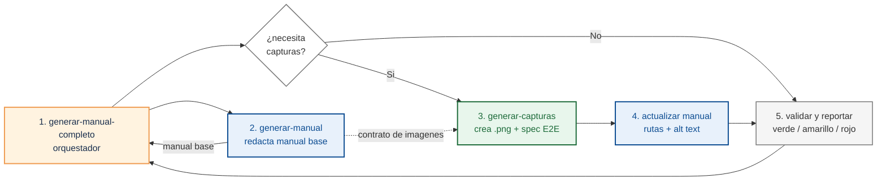

# Generación de manuales con agentes

El módulo [5.3 Manuales de usuario final](./03-manuales-de-usuario-final.md) dejó la skill `redactar-manual-usuario`. Esa skill redacta procedimientos desde la UI real o desde capturas literales cuando no hay acceso vivo. Pero un manual real puede cubrir varios flujos, roles y destinos: lectura humana, soporte interno, chatbot, RAG o capacitación.

Sin orquestación, eso se convierte en prompts sueltos, secciones con estilos distintos y pasos que no siempre corresponden al release entregado. Este módulo introduce un patrón de orquestación que genera el manual Markdown primero, agrega capturas solo cuando el destino las necesita y valida la consistencia al final.

## ¿Qué es un orquestador de manuales?

Un orquestador es un agente cuyo trabajo es **invocar otros agentes en orden y validar el resultado conjunto**. No redacta; no captura. Coordina, recoge salidas y reporta.

En el patrón que veremos, el orquestador `generar-manual-completo` coordina dos skills especializadas:

- `generar-manual` — navega la UI real con el rol objetivo (o usa capturas literales) y redacta el `.md` siguiendo las reglas de [5.3](./03-manuales-de-usuario-final.md). El código sirve como apoyo para permisos, rutas y validaciones, no como fuente principal.
- `generar-capturas` — fase opcional. Lee el `.md` recién escrito, mapea cada `` a un componente real y produce las imágenes con un test E2E (Playwright, Cypress o el que use el equipo).

Después, el orquestador valida el resultado. En modo **Solo Markdown**, revisa estructura, fuente y fidelidad a la UI. En modo **Completo**, además confirma que cada imagen referenciada existe y que las capturas corresponden al manual.

El siguiente diagrama muestra el patrón completo como una cadena de trabajo. Primero se redacta el manual base; si el destino necesita imágenes, la skill de capturas genera los archivos y actualiza el manual con esas referencias. Al final, el orquestador valida el resultado.



Lectura del diagrama:

1. `generar-manual-completo` recibe el módulo/flujo y controla el proceso.
2. `generar-manual` redacta el manual base desde la UI real.
3. El manual base vuelve al orquestador como resultado de la skill.
4. La decisión `¿necesita capturas?` no es un paso de trabajo: solo marca la rama. Si la respuesta es sí, el orquestador invoca `generar-capturas` usando el contrato de imágenes del manual base; después el manual se actualiza con rutas y `alt` text.
5. Si la respuesta es no, el orquestador salta directo a validación. En ambos casos, valida el resultado final y entrega el reporte verde / amarillo / rojo.

El reporte usa tres niveles:

- **Verde**: validación pasada. El manual cumple la regla revisada.
- **Amarillo**: advertencia. El manual puede publicarse, pero conviene revisión humana.
- **Rojo**: error bloqueante. Hay que corregir antes de entregar o publicar.

El orquestador marca **amarillo** cuando detecta riesgo, pero no tiene evidencia suficiente para decidir si es un error. Ejemplos:

- El destino es lectura humana y el manual no tiene capturas. Puede ser intencional, pero alguien debe confirmarlo.
- Una captura pesa muy poco o se parece demasiado a otra. Puede ser una pantalla simple o una captura vacía.
- El manual usa un término de negocio que no aparece en el glosario. Puede ser conocido por el equipo o puede confundir.
- El flujo menciona una variante de rol que el agente no pudo verificar con permisos reales.
- Una sección fue actualizada por un release, pero no hay evidencia de validación con usuario o soporte.

En otras palabras: **rojo** significa "sé que está mal"; **amarillo** significa "no puedo probar que esté bien".

Cada skill tiene un alcance acotado:

| Skill | Lee | Produce | Responsabilidad principal |
|-------|-----|---------|---------------------------|
| `generar-manual` | UI real con el rol objetivo + plantilla del manual | `manuales/<modulo>/<NN-flujo>.md` | Redactar procedimientos fieles a la UI, con citas literales de botones y mensajes |
| `generar-capturas` *(opcional)* | El `.md` recién escrito | Spec E2E + `.png` en el path declarado | Mapear cada `![alt]` a un selector estable y producir imágenes cuando el destino las requiere |
| `generar-manual-completo` | Manual y, si existen, capturas | Reporte verde / amarillo / rojo | Validar el manual; validar imágenes solo en modo completo |

## Variantes según el destino del manual

No todos los proyectos necesitan capturas reales. Antes de adoptar el patrón completo, decide qué variante aplica:

| Destino del manual | Capturas | Stack mínimo | Skills usadas |
|--------------------|----------|--------------|---------------|
| Lectura humana en sitio web | E2E reales en `.png` | Playwright / Cypress + dev server + credenciales | `redactar` + `capturar` + `orquestador` |
| Chatbot / RAG / soporte automatizado | Sin imágenes — descripción literal del UI | Solo Markdown | `redactar` + `orquestador` en modo Solo Markdown |
| Producto sin UI (CLI, API, librería) | Sin capturas — comandos y respuestas literales | Solo Markdown + bloques de código | `redactar` adaptada + `orquestador` en modo Solo Markdown |
| Equipo sin infra E2E todavía | Capturas curadas a mano | Editor de imágenes + carpeta versionada | `redactar` + flujo manual de capturas |
| Migración progresiva | Empieza sin imágenes; agrégalas cuando exista E2E | Markdown ahora, Playwright después | `redactar` ahora; agregar `capturar` + `orquestador` después |

Las variantes sin capturas no son "manuales incompletos". Para un chatbot, una imagen es ruido; lo único útil es el texto literal del botón, el mensaje de error y el orden de los pasos. Un manual `.md` puro, redactado con la skill `redactar-manual-usuario` aplicando fielmente los textos del UI, alimenta perfectamente un sistema de RAG sin necesidad de generar un solo `.png`.

El orquestador `generar-manual-completo` se adapta: cuando el manual no declara referencias ``, la fase 2 se salta automáticamente y la fase 3 valida solo las reglas del Markdown. La sección de [comportamiento ante errores](#errores-comunes) detalla ese caso.

**Regla práctica:** decide el destino del manual **antes** de elegir variante. Si el destino cambia (ej. "lo escribimos para humanos pero ahora lo va a leer un bot"), no agregues capturas; revisa primero si las que tienes aportan o si están obsoletas.

## Por qué importa la orquestación

Una sola skill que **observe la UI + escriba manual + genere capturas + valide todo** parece más simple, pero falla en producción por tres razones:

1. **Contexto.** Mezclar observación de UI, reglas de negocio, redacción y helpers de Playwright en el mismo prompt llena el contexto con información que no aplica a todas las fases.
2. **Consistencia.** Cuando una sola skill hace todo, no existe un punto donde alguien revise si el `![alt]` del manual y el `.png` final hablan de la misma pantalla. Los errores se acumulan en silencio.
3. **Reproducibilidad.** Si la captura falla por un timeout, no hay forma de reintentar solo esa fase. Un orquestador con fases declaradas permite reintentar la fase 2 sin reescribir el manual.

La orquestación resuelve las tres: cada skill tiene un solo trabajo, el orquestador valida el conjunto, y cada fase es reintentable de forma independiente.

## Objetivo

Diseñar un flujo de agentes que produce un manual de usuario en Markdown desde la UI real, agrega capturas solo si el destino las necesita y entrega un reporte final verde / amarillo / rojo accionable.

## Entradas

Entradas comunes:

- Release o requerimiento entregado que indica qué flujo revisar.
- UI real disponible con un usuario del rol objetivo, o capturas literales del flujo.
- Plantilla o convención de manual (`manuales/<modulo>/<NN-flujo>.md`, `manuales/<modulo>/README.md`).
- Convenciones del agente declaradas en `CLAUDE.md` o `AGENTS.md` (ver [examples-md/agents/](https://github.com/10xGuatemala/bootcamp/tree/main/examples-md/agents)).

Entradas solo para la variante con capturas:

- App ejecutable localmente o en ambiente de pruebas.
- Credenciales E2E del rol objetivo vía `.env`.
- Runner de capturas (Playwright, Cypress, Selenium, Puppeteer, etc.).
- Convención de destino para imágenes (`imagenes/<modulo>/<NN-flujo>/`).

## Pasos para diseñar el orquestador

### Paso 1: Separar lectura de redacción en skills distintas

La tentación es escribir una sola skill "manual-end-to-end". El problema es que mezcla dos lecturas (código fuente + manual ya redactado) y dos escrituras (markdown + spec de Playwright) en un solo contexto.

- Mal: *una skill `documentar-modulo` que observa la UI, redacta el manual y al final escribe el spec con las capturas en el mismo prompt*. La ventana de contexto se llena de información que no aplica a todas las fases.
- Bien: *`generar-manual` observa la UI y produce `.md`; `generar-capturas` solo lee ese `.md` y produce `.spec.ts` + `.png` cuando el destino lo requiere*. Cada skill carga únicamente las fuentes que necesita.

**Valor para el agente:** contextos limpios reducen alucinaciones. La skill de capturas no necesita saber qué validaciones tiene el backend — solo necesita saber qué pantallas referenciar y qué selectores usar.

### Paso 2: Encadenar las skills con dependencia explícita

El orquestador no asume que la fase anterior funcionó. Verifica con un check observable antes de pasar a la siguiente.

- Mal: *`generar-manual-completo` llama a `generar-manual` y, sin verificar nada, llama a `generar-capturas`*. Si `generar-manual` falló a la mitad, el spec se escribe contra un manual incompleto y produce capturas que no corresponden.
- Bien: *después de fase 1, el orquestador comprueba que `manuales/<modulo>/<NN-flujo>.md` existe y contiene procedimientos válidos. Si el manual declara referencias `` y el destino requiere imágenes, ese conteo se vuelve el objetivo de capturas para fase 2. Si no, fase 2 se salta*.

**Valor para el agente:** dependencias declaradas hacen reproducible la cadena. Si el orquestador se interrumpe en fase 2, otro agente puede retomar desde ahí leyendo el conteo en el manual.

### Paso 3: Validar consistencia al final, no en el medio

Cada skill tiene su propio checklist (¿el título sigue el patrón? ¿el spec corre limpio?). El orquestador agrega una capa más: cruzar ambos artefactos.

- Mal: *cada skill se autovalida y el orquestador asume que todo está bien si nadie lanzó error*. La skill del manual no sabe si los `.png` existen; la skill de capturas no sabe si el manual cita los textos correctos.
- Bien: *el orquestador, en fase 3, lee el `.md` final y valida que los procedimientos sigan la estructura acordada. Si hay capturas, además verifica:*
  - *cada `` apunta a un archivo que existe*,
  - *no hay dos `.png` con bytes idénticos (suele indicar captura duplicada)*,
  - *cada `Ilustración N:` es secuencial sin saltos*,
  - *el spec y el script `docs:screenshots:*` quedaron registrados*.

**Valor para el agente:** la validación cruzada detecta inconsistencias que ninguna skill puede ver desde su lado. Es la justificación de que el orquestador exista.

### Paso 4: Reportar verde / amarillo / rojo, no "OK / Falló"

Un reporte binario obliga al usuario a abrir el manual para ver qué falló. Tres niveles dejan claro qué requiere atención inmediata y qué puede esperar.

- Mal: *"Manual generado correctamente"* (cuando en realidad faltan tres capturas).
- Bien:

  ```text
  ## Manual: 02-cotizaciones.md

  ✅ 11 validaciones pasadas
  ⚠️  2 warnings
  ❌ 1 error

  ### ❌ Errores
  - Imagen referenciada faltante: imagenes/ventas/02-cotizaciones/04-confirmacion.png

  ### ⚠️ Warnings
  - 03-borrador.png pesa 18 KB (umbral: 50 KB) — posible pantalla vacía.
  - Ilustraciones saltan de 5 a 7 (falta numeración 6).
  ```

**Valor para el agente:** el reporte es accionable. Cada error señala el archivo y la causa probable; cada warning sugiere revisión humana sin bloquear la entrega.

### Paso 5: Manejar fallos parciales sin abortar la auditoría

La fase 2 (capturas), cuando aplica, depende de infraestructura externa: el dev server, una base de datos sembrada, credenciales válidas. Esa fase fallará a veces por entorno, no por código.

- Mal: *si fase 2 lanza error, abortar todo el orquestador*. El manual existe pero no se valida.
- Bien:
  - *Fase 1 falla*: abortar (sin manual no hay nada que validar).
  - *Fase 2 no aplica*: saltar capturas y ejecutar fase 3 solo sobre el Markdown.
  - *Fase 2 falla por entorno (credenciales, dev server caído)*: saltar capturas, ejecutar fase 3 sobre el manual existente y reportar que las imágenes no se generaron por causa de entorno.
  - *Fase 2 falla por código (selector roto)*: reportar el spec exacto y la línea, sugerir reabrir `/generar-capturas` después de arreglar.

**Valor para el agente:** un orquestador robusto distingue las clases de fallo. Confundir "no hay credenciales" con "el spec está mal escrito" hace que el equipo arregle lo que no estaba roto.

## Salidas

Después de ejecutar `/generar-manual-completo <modulo> <NN-flujo>`:

| Artefacto | Path destino | Producido por | Aplica a |
|-----------|--------------|---------------|----------|
| Manual de usuario | `manuales/<modulo>/<NN-flujo>.md` | `generar-manual` | Todas las variantes |
| Índice del módulo | `manuales/<modulo>/README.md` | `generar-manual` | Todas las variantes |
| Capturas de pantalla | `imagenes/<modulo>/<NN-flujo>/*.png` | `generar-capturas` | Solo variante con E2E |
| Spec ejecutable | `e2e-docs/specs/<NN-flujo>.spec.ts` | `generar-capturas` | Solo variante con E2E |
| Script reutilizable | `package.json` → `docs:screenshots:<flujo>` | `generar-capturas` | Solo variante con E2E |
| Reporte de validación | Salida en consola | `generar-manual-completo` | Todas las variantes |

En las variantes sin capturas (chatbot, sin UI, equipo sin infra E2E), las tres filas marcadas como "Solo variante con E2E" no se producen y el reporte de fase 3 valida únicamente reglas del Markdown. El reporte en consola es la única salida que no se versiona — vive el tiempo de la sesión y se reproduce volviendo a invocar el orquestador.

## Errores comunes

- **Acoplar las skills en ambos sentidos** (el manual depende de las capturas y viceversa). Rompe la independencia y obliga a regenerar todo cuando solo cambió una imagen.
- **Validar dentro de cada skill en lugar de en el orquestador**. Cada skill aprueba lo suyo, pero nadie cruza ambos artefactos. Resultado: manuales que se ven bien por separado y mienten en conjunto.
- **No diferenciar fallo de entorno vs. fallo de código**. El equipo arregla lo que no estaba roto; el bug real queda escondido.
- **Saltarse la fase 3 cuando "todo se ve bien"**. La fase de validación es barata y atrapa los errores que no se notan hasta que un cliente reporta una imagen rota.
- **Generar capturas sin haber redactado el manual primero**. El spec termina apuntando a textos inventados (`getByText('Guardar')` cuando la UI dice **Crear**).
- **Cargar todo el código fuente en el contexto del orquestador**. El orquestador no necesita leer el frontend — para eso delega en `generar-manual`.
- **Forzar capturas cuando el destino no las necesita.** Si el manual va a alimentar un chatbot o un sistema RAG, las imágenes son ruido: el modelo solo lee texto. Decide la [variante correcta](#variantes-según-el-destino-del-manual) antes de invocar la fase 2.

## Prompt de auditoría del orquestador

Bloque copiable que un agente puede usar para auditar un orquestador de manuales antes de adoptarlo:

```text
Audita este orquestador (`generar-manual-completo`) y responde:

1. ¿Las skills `generar-manual` y `generar-capturas` están desacopladas?
   ¿La de capturas funciona contra cualquier .md que cumpla la convención
   de path o asume detalles internos del que produce `generar-manual`?

2. ¿Hay un check observable entre fase 1 y fase 2? ¿Qué archivo o conteo
   se verifica antes de continuar?

3. ¿La fase 3 cruza ambos artefactos o solo revisa cada uno por separado?
   Lista las validaciones cruzadas concretas.

4. ¿El reporte distingue verde / amarillo / rojo? ¿Cada error indica
   archivo y causa probable o solo "falló"?

5. ¿El orquestador distingue fallo de entorno (credenciales, dev server)
   de fallo de código (spec roto)? ¿Cómo se reportan distinto?

Marca cada respuesta con ✅ / ⚠️ / ❌ y resume al final qué falta para
considerar el orquestador production-ready.
```

:::tip Empieza por el orquestador, no por las skills
La trampa común es escribir primero `generar-manual`, después `generar-capturas`, y descubrir al final que el orquestador no puede componerlas porque cada una asume cosas distintas sobre los paths o los argumentos. Diseña el contrato del orquestador (`/comando <modulo> <NN-flujo>`, fases, validaciones cruzadas) **antes** de escribir cada skill. Las skills se diseñan para encajar en ese contrato, no al revés.
:::

## Puente al siguiente módulo

Este orquestador cierra el ciclo de la categoría. Lo que produce — un manual versionado y auditado — completa la cadena de [trazabilidad](./04-trazabilidad-requerimiento-release.md): requerimiento → ticket → PR → release → UI real → manual auditado por agentes.

El siguiente paso natural está fuera de esta categoría: integrar el orquestador en el pipeline de CI/CD para que cada release con cambios visibles sugiera o ejecute la revisión del manual. Eso convierte la documentación en un artefacto verificable por la pipeline, al mismo nivel que los tests.

---

<div className="agent-block">

### Bloque estructurado para agentes

**Objetivo:** diseñar un sistema multi-agente que produce y valida un manual de usuario en Markdown, con capturas opcionales según el destino.

**Entradas:**
- Repo de la app (frontend + backend) con sistema de roles/permisos identificable en código.
- Repo de docs con plantilla y convención de paths.
- `CLAUDE.md` / `AGENTS.md` con convenciones del agente.
- Acceso E2E a credenciales del rol objetivo vía `.env` solo cuando el destino requiere capturas.

**Pasos:**
1. Separar lectura de redacción en skills distintas (`generar-manual` observa la UI, `generar-capturas` lee el manual).
2. Encadenar con dependencia explícita: verificar artefactos observables antes de pasar de fase.
3. Validar consistencia en una fase 3 dedicada (cruzar manual + imágenes), no dentro de cada skill.
4. Reportar verde / amarillo / rojo con archivo y causa por cada error.
5. Distinguir fallo de entorno (credenciales, dev server) de fallo de código (spec roto) en el reporte.

**Salidas:**
- Manual `.md` orientado a tareas, fiel a la UI.
- Capturas `.png` en path declarado, sin duplicados sospechosos, solo si el destino las requiere.
- Spec E2E reutilizable + script en `package.json`, solo en modo completo.
- Reporte verde/amarillo/rojo accionable.

**Errores comunes:**
- Acoplar skills en ambos sentidos.
- Autovalidar en cada skill sin cruce final.
- Confundir fallo de entorno con fallo de código.
- Cargar todo el código fuente en el contexto del orquestador.

**Referencias cruzadas:**
- [5.3 Manuales de usuario final](./03-manuales-de-usuario-final.md)
- [5.4 Trazabilidad requerimiento → release](./04-trazabilidad-requerimiento-release.md)
- [Skill `redactar-manual-usuario`](https://github.com/10xGuatemala/bootcamp/blob/main/examples-md/agents/skills/general/redactar-manual-usuario.skill.md.example)
- [Skill `generar-capturas-manual`](https://github.com/10xGuatemala/bootcamp/blob/main/examples-md/agents/skills/general/generar-capturas-manual.skill.md.example)
- [Skill `orquestador-manual-completo`](https://github.com/10xGuatemala/bootcamp/blob/main/examples-md/agents/skills/general/orquestador-manual-completo.skill.md.example)

</div>

---

## Glosario

**Orquestador** *(Orchestrator agent)* — agente cuya función es invocar otros agentes en un orden definido y validar el resultado conjunto. No realiza el trabajo especializado; coordina y reporta.

**Skill** *(Skill / agent capability)* — instrucción reutilizable que un agente carga para resolver una tarea específica (redactar manual, capturar pantallas, revisar código). Documentadas como Markdown versionado en el repo.

**Validación cruzada** *(Cross-artifact validation)* — verificación que confronta dos artefactos producidos por skills distintas (ej. `.md` del manual contra los `.png` de las capturas) para detectar inconsistencias que ninguna skill puede ver desde su lado.

**Fase observable** *(Observable phase)* — paso del orquestador cuyo éxito se puede comprobar leyendo un archivo o un conteo concreto, no por la ausencia de error de la skill anterior.

**Fallo de entorno** *(Environment failure)* — error que depende de infraestructura externa al código (credenciales faltantes, dev server caído, base de datos sin sembrar). Se reporta distinto del fallo de código y no invalida la fase de validación del manual.

**Reporte verde / amarillo / rojo** *(Three-tier report)* — formato de salida del orquestador que distingue validaciones pasadas, advertencias y errores, cada uno con archivo y causa probable.

:::info Referencias primarias
- [Anthropic — Building effective agents](https://www.anthropic.com/engineering/building-effective-agents) — patrones para componer agentes simples (orquestador, evaluador-optimizador, prompt chaining) sin sobre-ingeniería.
- [Anthropic — Multi-agent research system](https://www.anthropic.com/engineering/multi-agent-research-system) — caso de estudio de un orquestador que coordina sub-agentes y consolida resultados.
- [Diátaxis](https://diataxis.fr/) — taxonomía que clasifica los manuales generados por este orquestador como *how-to guides*.
- [Playwright — Best Practices](https://playwright.dev/docs/best-practices) — referencia de selectores estables y waits que la skill `generar-capturas-manual` aplica.
- [5.3 Manuales de usuario final](./03-manuales-de-usuario-final.md) — base conceptual del manual que este orquestador automatiza.
:::

---

<AuthorCredit />
