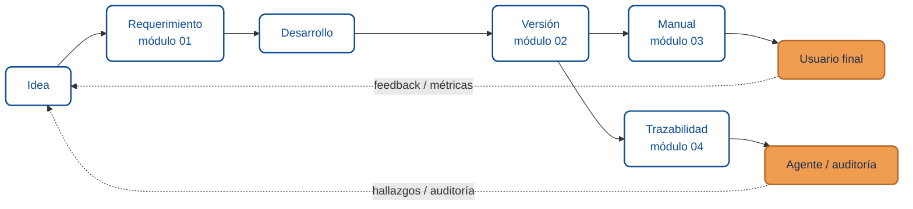

import AuthorCredit from '@site/src/components/AuthorCredit';

# Documentación y Requerimientos

Esta categoría aborda cómo una idea se convierte en un cambio **trazable**, **versionado** y **documentado** — de forma que personas y agentes de IA puedan reconstruir la historia de cualquier entrega.

No es gestión de proyectos (metodología, sprints, equipos). Es **la evidencia escrita** del producto: qué se pidió, qué versión lo incluye, cómo lo usa el usuario final, y cómo se conecta cada pieza.

:::info Glosario mínimo
- **Skill**: instrucción reutilizable que un agente de IA puede invocar (por ejemplo: "redactar requerimiento", "actualizar CHANGELOG"). Se alimenta de plantillas markdown versionadas.
- **SemVer** (*Semantic Versioning*): convención `MAJOR.MINOR.PATCH` para comunicar cambios compatibles vs. incompatibles. Ver [semver.org](https://semver.org/lang/es/).
- **CHANGELOG**: archivo (`CHANGELOG.md`) que lista los cambios entregados por versión en lenguaje humano.
:::

## Por qué separarlo de Gestión de Proyectos

La documentación funcional tiene audiencias, tono y plantillas propias:

| Gestión de Proyectos | Documentación y Requerimientos |
|----------------------|-------------------------------|
| Metodología, roles, sprints | Requerimientos funcionales, CHANGELOG, manuales |
| Equipo técnico y líderes | Usuarios finales, soporte, equipos consumidores |
| "¿Cómo trabajamos?" | "¿Qué entregamos y qué cambió?" |

Mezclarlas confunde a los lectores y complica que un agente genere skills específicas ("redactar requerimiento" vs. "planificar sprint").

## Mapa de la categoría

El flujo no es lineal: cada entrega al usuario final y cada evidencia para el agente/auditoría generan **nuevas ideas** que alimentan el siguiente ciclo.

Las flechas punteadas cierran el ciclo: sin retroalimentación desde producción y auditoría, la documentación se convierte en una línea recta que no aprende.

## Módulos del curso

import DocCardList from '@theme/DocCardList';

<DocCardList />

<AuthorCredit />
