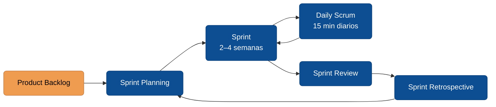

# Scrum como framework

Scrum es el marco ágil más usado en la industria. No es una metodología completa — es un **framework mínimo**: tres roles, cinco eventos y tres artefactos. Todo lo demás (prácticas de ingeniería, herramientas, cadencia exacta) lo decide el equipo.

> Scrum no es programar más rápido. Es entregar valor incrementalmente y aprender de cada entrega.

## Los tres roles

| Rol | Responsabilidad principal | Lo que **no** es |
|---|---|---|
| **Product Owner (PO)** | Maximizar el valor del producto. Prioriza el Product Backlog. Decide qué se construye y en qué orden. | No es el "jefe" del equipo. No estima. No asigna tareas. |
| **Scrum Master (SM)** | Asegurar que el equipo entienda y aplique Scrum. Remover impedimentos. Facilitar ceremonias. | No es el gerente. No asigna trabajo. No firma vacaciones. |
| **Developers** | Construir el incremento. Auto-organizan cómo hacerlo. Estiman y se comprometen. | No es "solo programadores" — incluye QA, diseño, DBAs, todo lo necesario para entregar. |

**Tamaño del equipo:** 3 a 9 *Developers* (sin contar PO y SM). Menos de 3 pierde el beneficio de la colaboración; más de 9 se vuelve inmanejable y suele significar que hay que partir el producto.

## Los cinco eventos

| Evento | Duración | Propósito | Quiénes |
|---|---|---|---|
| **Sprint** | 2–4 semanas (fija) | Contenedor de todo lo demás. Produce un incremento usable. | Todos |
| **Sprint Planning** | ≤ 8 h para sprint de 4 sem | Decidir qué se hace este sprint y cómo. | PO, SM, Devs |
| **Daily Scrum** | 15 min, misma hora | Sincronizar el día. Ajustar plan del sprint. | Devs (SM facilita si ayuda) |
| **Sprint Review** | ≤ 4 h para sprint de 4 sem | Mostrar incremento, recibir feedback, ajustar backlog. | PO, Devs, *stakeholders* |
| **Sprint Retrospective** | ≤ 3 h para sprint de 4 sem | Inspeccionar proceso, decidir 1–2 mejoras concretas. | PO, SM, Devs |

**Regla de oro:** el sprint **no se extiende**. Si algo no entró, se mueve al siguiente sprint o vuelve al backlog. Extender el sprint rompe la cadencia y encubre el problema (capacidad mal estimada, alcance mal definido, impedimentos no resueltos).

## Los tres artefactos

| Artefacto | Qué es | Quién lo dueña |
|---|---|---|
| **Product Backlog** | Lista ordenada de todo lo que *podría* hacerse. Vive y cambia. | Product Owner |
| **Sprint Backlog** | Subset del Product Backlog comprometido para este sprint + plan de cómo hacerlo. | Developers |
| **Incremento** | El resultado usable al final del sprint. Debe cumplir la *Definition of Done*. | Developers |

### Definition of Done (DoD)

Un checklist explícito que responde *"¿cuándo podemos decir que esto está listo?"*. Típicamente incluye:

- Código revisado (PR aprobado).
- Tests automáticos pasando.
- Desplegado a staging.
- Documentación actualizada si aplica.
- Aceptado por el PO.

Sin DoD, *"terminado"* significa cosas distintas en cada cabeza y el incremento no es realmente usable.

## Qué Scrum *no* resuelve

Scrum es bueno para:

- Productos con requisitos que evolucionan.
- Equipos pequeños y co-ubicados (o con buena comunicación remota).
- Ciclos cortos de feedback con usuarios reales.

Scrum es mal ajuste para:

- Proyectos con alcance fijo, contrato cerrado y cero tolerancia al cambio.
- Trabajo puramente operativo sin "producto" (ahí va mejor Kanban).
- Investigación exploratoria sin criterios de "terminado" (ahí va mejor un spike con timebox).

**No existe "Scrum obligatorio"**. Si el contexto no encaja, forzarlo produce teatro — ceremonias sin decisiones, roles sin autoridad, backlog sin priorización.

## Glosario

**Scrum** *(Scrum)* — según la [Scrum Guide 2020](https://scrumguides.org/docs/scrumguide/v2020/2020-Scrum-Guide-Spanish-European.pdf): *"un marco de trabajo ligero que ayuda a las personas, equipos y organizaciones a generar valor a través de soluciones adaptativas para problemas complejos"*. En su forma mínima: 3 responsabilidades (*accountabilities*), 5 eventos, 3 artefactos.

**Product Owner (PO)** *(Product Owner)* — responsable de maximizar el valor del producto resultante del trabajo del Scrum Team; único responsable de gestionar el Product Backlog ([Scrum Guide 2020](https://scrumguides.org/docs/scrumguide/v2020/2020-Scrum-Guide-Spanish-European.pdf)).

**Scrum Master (SM)** *(Scrum Master)* — según la [Scrum Guide 2020](https://scrumguides.org/docs/scrumguide/v2020/2020-Scrum-Guide-Spanish-European.pdf): *"responsable de establecer Scrum... y de la efectividad del Scrum Team"*. Líder servicial, no jefe; facilita y remueve impedimentos.

**Developers** *(Developers)* — personas del Scrum Team comprometidas con crear cualquier aspecto de un Incremento utilizable en cada Sprint; incluye todo perfil necesario para entregar (dev, QA, diseño) ([Scrum Guide 2020](https://scrumguides.org/docs/scrumguide/v2020/2020-Scrum-Guide-Spanish-European.pdf)).

**Sprint** *(Sprint)* — evento contenedor de duración fija de un mes o menos donde se crea un Incremento de valor útil y utilizable ([Scrum Guide 2020](https://scrumguides.org/docs/scrumguide/v2020/2020-Scrum-Guide-Spanish-European.pdf)).

**Sprint Goal** *(Sprint Goal)* — *"único objetivo del Sprint"* ([Scrum Guide 2020](https://scrumguides.org/docs/scrumguide/v2020/2020-Scrum-Guide-Spanish-European.pdf)); compromiso del Sprint Backlog que da coherencia a las historias.

**Product Backlog** *(Product Backlog)* — lista emergente y ordenada de lo que se necesita para mejorar el producto; única fuente de trabajo para el Scrum Team ([Scrum Guide 2020](https://scrumguides.org/docs/scrumguide/v2020/2020-Scrum-Guide-Spanish-European.pdf)).

**Sprint Backlog** *(Sprint Backlog)* — compuesto por el Sprint Goal (*el qué*), los elementos seleccionados del Product Backlog (*el qué*) y un plan accionable (*el cómo*) ([Scrum Guide 2020](https://scrumguides.org/docs/scrumguide/v2020/2020-Scrum-Guide-Spanish-European.pdf)).

**Incremento** *(Increment)* — *"peldaño concreto hacia la Meta del Producto"*; debe ser utilizable y cumplir la Definition of Done ([Scrum Guide 2020](https://scrumguides.org/docs/scrumguide/v2020/2020-Scrum-Guide-Spanish-European.pdf)).

**Definition of Done (DoD)** *(Definition of Done)* — *"descripción formal del estado del Incremento cuando cumple con las medidas de calidad requeridas"* ([Scrum Guide 2020](https://scrumguides.org/docs/scrumguide/v2020/2020-Scrum-Guide-Spanish-European.pdf)).

**Daily Scrum** *(Daily Scrum)* — evento de 15 minutos para los Developers del Scrum Team; inspecciona el progreso hacia el Sprint Goal y adapta el Sprint Backlog ([Scrum Guide 2020](https://scrumguides.org/docs/scrumguide/v2020/2020-Scrum-Guide-Spanish-European.pdf)).

**Sprint Review** *(Sprint Review)* — inspección del resultado del Sprint y determinación de adaptaciones futuras; el Scrum Team presenta los resultados a los interesados clave ([Scrum Guide 2020](https://scrumguides.org/docs/scrumguide/v2020/2020-Scrum-Guide-Spanish-European.pdf)).

**Sprint Retrospective** *(Sprint Retrospective)* — *"planificar maneras de aumentar la calidad y la efectividad"* ([Scrum Guide 2020](https://scrumguides.org/docs/scrumguide/v2020/2020-Scrum-Guide-Spanish-European.pdf)); inspección del proceso y las interacciones.

:::info Referencias primarias
- [Scrum Guide 2020 (español europeo)](https://scrumguides.org/docs/scrumguide/v2020/2020-Scrum-Guide-Spanish-European.pdf) — guía oficial de Ken Schwaber y Jeff Sutherland.
- [Scrum Alliance · About Scrum](https://www.scrumalliance.org/about-scrum) — recursos introductorios y certificaciones (inglés).
- [Agile Alliance · Glosario ágil](https://www.agilealliance.org/agile101/agile-glossary/) — glosario colaborativo de términos ágiles (inglés).
:::

---

### Bloque estructurado para agentes

**Objetivo:** diagnosticar si un equipo está aplicando Scrum o solo realizando sus ceremonias.

**Entradas:**
- Cadencia actual del equipo (duración de sprint, frecuencia de ceremonias).
- Definiciones de rol en el equipo.
- Última Sprint Review y Retrospective (qué se decidió).
- Definition of Done vigente (si existe).

**Pasos:**
1. Verificar que existan los 3 roles con responsabilidades claras y sin solapar autoridad.
2. Verificar que los 5 eventos ocurran con timebox respetado.
3. Verificar que los 3 artefactos existan y estén actualizados (backlog priorizado, sprint backlog visible, incremento que cumple DoD).
4. Detectar *smells*: sprints que se extienden, daily que reporta a un jefe, PO ausente, retro sin acciones.
5. Proponer 1–2 ajustes concretos — no reescribir todo el proceso de golpe.

**Salidas:**
- Tabla de cumplimiento por rol/evento/artefacto (OK / parcial / ausente).
- Lista priorizada de ajustes.

**Errores comunes:**
- Asumir que tener ceremonias = tener Scrum.
- Pedir al SM que asigne tareas (rompe auto-organización).
- Extender el sprint para "terminar lo comprometido".
- Product Backlog de 500 ítems sin priorizar.

**Referencias cruzadas:**
- [4.2.1 Manifiesto Ágil](./01-manifiesto-agil.md)
- [4.2.3 Niveles de planeamiento](./03-niveles-de-planeamiento.md)
- [4.3.3 Sprint Planning y Daily](../ciclo-del-proyecto/03-sprint-planning-y-daily.md)

---

<AuthorCredit />
