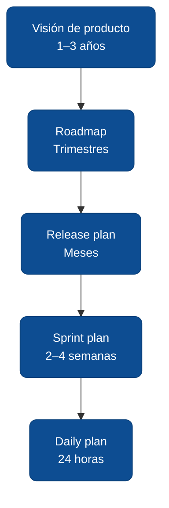

# Niveles de planeamiento

Uno de los malentendidos más frecuentes sobre Scrum es que *"no se planea"*. En realidad Scrum planea en **cinco niveles**, cada uno con un horizonte y un responsable distintos. Entender qué nivel toca cuándo evita dos errores opuestos: comprometer detalle demasiado temprano y, al revés, improvisar sin visión.

## Los cinco niveles



| Nivel | Horizonte | Responsable | Qué decide | Qué **no** decide |
|---|---|---|---|---|
| **Visión** | 1–3 años | Product Owner + negocio | A quién sirve el producto, qué problema resuelve, por qué ahora. | Qué features, qué stack. |
| **Roadmap** | Trimestres | PO | Temas o *capabilities* en el orden esperado. | Fechas exactas, detalles de feature. |
| **Release** | Meses | PO + Devs | Qué va en el próximo release y con qué objetivo medible. | Tareas técnicas. |
| **Sprint** | 2–4 semanas | Devs (PO aclara) | Qué historias entran, cómo se construyen. | Cambios a media ejecución. |
| **Daily** | 24 h | Devs | Qué hacemos hoy, quién pide ayuda, qué impedimentos atacamos. | Nuevas historias. |

## Regla del detalle: más lejos, más borroso

El backlog **no tiene el mismo grado de detalle en todos los niveles**. Las historias del sprint actual están refinadas al grano fino (criterios de aceptación, estimación, mockups). Las del próximo sprint: definidas pero no estimadas. Los temas del roadmap: una frase. La visión: un párrafo.

```
Detalle  ▲
         │ Sprint actual  ██████████
         │ Próximo sprint ██████
         │ Release        ███
         │ Roadmap        █
         │ Visión         ·
         └──────────────────────► Horizonte
```

Refinar el roadmap completo al detalle del sprint es **desperdicio**: la mitad nunca se construirá tal cual se escribió.

## Cuándo cada plan se ajusta

- **Visión:** cuando cambia la estrategia del negocio o el mercado invalida una hipótesis clave.
- **Roadmap:** al cierre de cada trimestre, o cuando el aprendizaje de los últimos releases lo justifique.
- **Release:** al final de cada sprint en la *Sprint Review*, con los *stakeholders*.
- **Sprint:** al cierre, en la *Retrospective*. Durante el sprint el plan se protege (no se añaden historias).
- **Daily:** en el daily, todos los días.

## Anti-pattern: el plan-Gantt disfrazado

El error más común al combinar Scrum con cultura de PMO tradicional es mantener un **Gantt a 12 meses con fechas exactas por feature** y llamarle "roadmap". Esto reintroduce el compromiso rígido que Scrum intenta evitar:

- El equipo entrega el 70% del mes 1 y alguien reporta *"vamos 70%"* — cuando en realidad lo entregado no resuelve ningún problema completo de usuario.
- Cada desviación se trata como falla en vez de como aprendizaje.
- El backlog compite con el Gantt y pierde.

Un roadmap ágil comunica **intención y orden aproximado** — no fechas exactas por feature. Las fechas vienen del ritmo observado, no al revés.

## Capacidad vs. velocidad

- **Capacidad** = horas disponibles del equipo en el sprint (después de descontar vacaciones, reuniones, soporte).
- **Velocidad** = cuántos *story points* entrega el equipo por sprint, observado en los últimos 3–5 sprints.

Planear el sprint con capacidad pero proyectar el release con **velocidad**. La velocidad es una lectura empírica, no un objetivo. Si alguien pide *"subir la velocidad"*, la respuesta técnica correcta es: **la velocidad no se sube, se observa; lo que se mejora es el proceso que la produce**.

## Glosario

**Visión de producto** *(Product Vision)* — enunciado de 1–3 años que responde *a quién sirve el producto y por qué*. Mike Cohn la describe en [*Agile Estimating and Planning*](https://www.mountaingoatsoftware.com/books/agile-estimating-and-planning) como el nivel más alto de la *planning onion*.

**Roadmap** *(Product Roadmap)* — secuencia trimestral de *temas* o *capabilities*, sin fechas exactas por feature; comunica dirección, no compromiso de entrega por fecha ([Mountain Goat Software](https://www.mountaingoatsoftware.com/books/agile-estimating-and-planning)).

**Release plan** *(Release Plan)* — plan de meses que define qué va en el próximo release y con qué objetivo medible; segundo nivel de la *planning onion* de Cohn.

**Sprint plan** *(Sprint Plan)* — plan de un mes o menos que resulta del Sprint Planning; según la [Scrum Guide 2020](https://scrumguides.org/docs/scrumguide/v2020/2020-Scrum-Guide-Spanish-European.pdf) *"no se realizan cambios que pongan en peligro el Sprint Goal"* durante el Sprint.

**Velocidad (velocity)** *(Velocity)* — cantidad promedio de *story points* completados por Sprint; Mike Cohn recomienda usarla como medida observada para proyectar releases, no como meta impuesta ([*Agile Estimating and Planning*](https://www.mountaingoatsoftware.com/books/agile-estimating-and-planning)).

**Capacidad (capacity)** *(Capacity)* — horas o personas-día disponibles del equipo para el Sprint, descontando vacaciones, reuniones y soporte; se distingue de *velocity* por medir disponibilidad, no entrega.

**Story points** *(Story Points)* — unidad relativa de esfuerzo introducida por la comunidad XP y popularizada por Mike Cohn; compara tamaño de historias entre sí, no tiempo absoluto ([Mountain Goat Software](https://www.mountaingoatsoftware.com/books/agile-estimating-and-planning)).

:::info Referencias primarias
- [Scrum Guide 2020 (español europeo)](https://scrumguides.org/docs/scrumguide/v2020/2020-Scrum-Guide-Spanish-European.pdf) — guía oficial que define Sprint Planning y artefactos.
- [Mike Cohn · *Agile Estimating and Planning*](https://www.mountaingoatsoftware.com/books/agile-estimating-and-planning) — referencia canónica para niveles de planeamiento y story points.
- [Agile Alliance · Glosario ágil](https://www.agilealliance.org/agile101/agile-glossary/) — definiciones colaborativas (inglés).
:::

---

<div className="agent-block">

### Bloque estructurado para agentes

**Objetivo:** revisar el plan de un proyecto Scrum y clasificar cada artefacto de planeación en el nivel correcto, detectando compromisos prematuros o visión ausente.

**Entradas:**
- Artefactos de planeación existentes (roadmap, release plan, sprint backlog).
- Horizonte que cada uno cubre.
- Frecuencia con que se revisa cada uno.

**Pasos:**
1. Clasificar cada artefacto en el nivel que le corresponde (visión, roadmap, release, sprint, daily).
2. Verificar que el grado de detalle coincida con el horizonte (fine-grain solo en sprint actual).
3. Detectar compromisos prematuros: fechas exactas en roadmap, historias refinadas a 6 meses vista.
4. Detectar ausencias: no hay visión escrita, no hay release plan, backlog sin priorizar.
5. Proponer ajustes: qué simplificar, qué añadir, con qué cadencia revisar.

**Salidas:**
- Tabla de niveles: qué existe, qué nivel, qué falta.
- Lista de ajustes priorizados.

**Errores comunes:**
- Tratar el roadmap como Gantt.
- Refinar backlog completo al detalle del sprint.
- Confundir capacidad con velocidad.
- Reportar progreso como porcentaje de un plan maestro (*"vamos 70%"*) en vez de entregas funcionando.

**Referencias cruzadas:**
- [4.2.2 Scrum como framework](./02-scrum-framework.md)
- [4.3.4 Medición con OKRs](../ciclo-del-proyecto/04-medicion-con-okrs.md)
</div>

---

<AuthorCredit />
