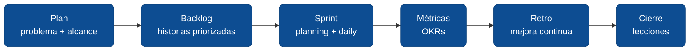

# Ciclo del proyecto

Esta sección recorre el ciclo completo de ejecución de un proyecto ágil: del problema al cierre. Cada módulo incluye **plantillas listas** para copiar a tu repositorio y adaptar al contexto de tu equipo.

## Módulos

<DocCardList />

**Contenido:**

- [4.3.1 Plan, problema y alcance](./01-plan-problema-alcance.md)
- [4.3.2 Product Backlog](./02-product-backlog.md)
- [4.3.3 Sprint Planning y Daily](./03-sprint-planning-y-daily.md)
- [4.3.4 Medición con OKRs](./04-medicion-con-okrs.md)
- [4.3.5 Retrospectivas](./05-retrospectivas.md)
- [4.3.6 Cierre y lecciones aprendidas](./06-cierre-y-lecciones.md)

---

<AuthorCredit />
