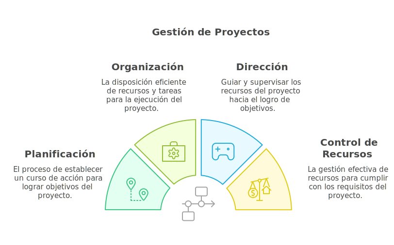
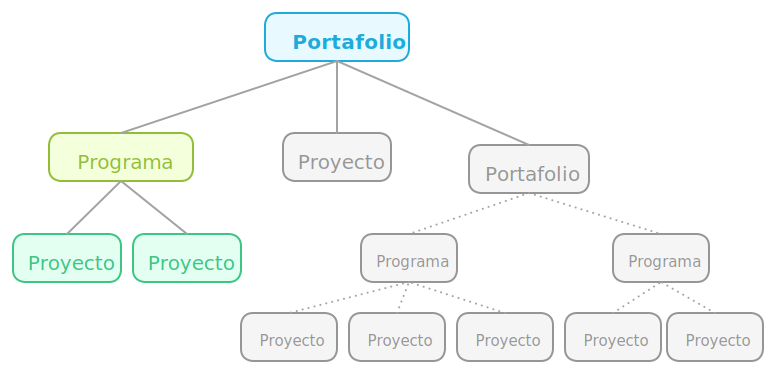
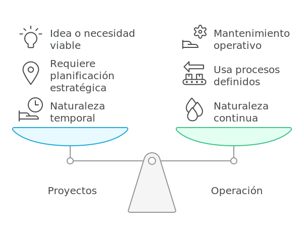

# Introducción a la Gestión de Proyectos

La gestión de proyectos es una herramienta esencial para lograr resultados exitosos en cualquier industria. Si eres principiante, tal vez te preguntes: ¿por dónde empezar? Con tantos cursos, documentos y metodologías, puede parecer una tarea abrumadora. Este módulo te ofrece una guía inicial, explicando qué es un proyecto, en qué se diferencia de las operaciones y cómo se relaciona con los objetivos organizacionales.

## 1.1 ¿Qué es la Gestión de Proyectos?

La gestión de proyectos implica planificar, organizar y dirigir recursos para alcanzar objetivos específicos dentro de un tiempo y presupuesto definidos. Es esencial para garantizar la entrega exitosa de resultados únicos y alineados con las metas organizacionales.

Según la Guía [PMBOK® - Project Management Body of Knowledge](https://www.pmi.org/standards/pmbok), la gestión de proyectos es "la aplicación de conocimientos, habilidades, herramientas y técnicas a las actividades del proyecto para cumplir con los requisitos del mismo".

## 1.2 Definiciones Clave

- **Proyecto:**
  - Un esfuerzo **temporal** emprendido para crear un producto, servicio o resultado único (PMBOK®).
  - Ejemplo: desarrollar una nueva aplicación móvil.
- **Programa:**
  - Un grupo de proyectos relacionados gestionados de forma coordinada para obtener beneficios que no se lograrían gestionándolos individualmente. Ejemplo: un programa de transformación digital que incluye proyectos de capacitación y desarrollo de software.
- **Portafolio:**
  - Una colección de proyectos y programas agrupados para alcanzar objetivos estratégicos. Ejemplo: un portafolio de sostenibilidad que incluye proyectos de energía renovable y reducción de residuos.

**En resumen:** Un portafolio agrupa programas y proyectos para alinear sus resultados con los objetivos estratégicos de la organización. Los programas consisten en varios proyectos relacionados, lo que permite gestionar los beneficios conjuntos de manera eficiente. Por ejemplo, un portafolio de innovación tecnológica puede incluir un programa de transformación digital, que a su vez contiene proyectos como la implementación de un sistema ERP y la capacitación del personal.

## 1.3 Diferencias entre Proyectos y Operación

- **Características Principales de los Proyectos:**
  - Los proyectos **son temporales**, tienen un inicio, una ejecución y un final definidos, mientras que la operación son procesos continuos y recurrentes.
  - Un proyecto requiere planificación estratégica y recursos específicos que se liberan una vez que se completa. La operación, en cambio, usa procesos definidos para mantener un funcionamiento constante.
  - Los proyectos nacen de una **idea** o **necesidad** que debe ser viable y puede convertirse en un **proceso operativo permanente** dentro de la organización.
  - Los proyectos pueden formar parte de un programa o portafolio más grande que abarca varios esfuerzos relacionados.

