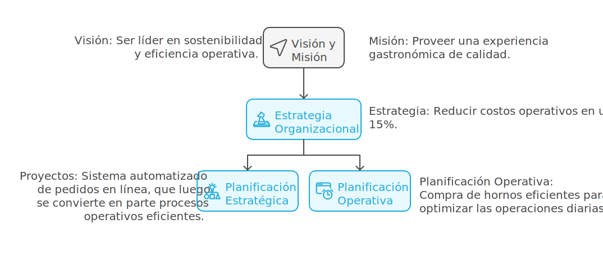
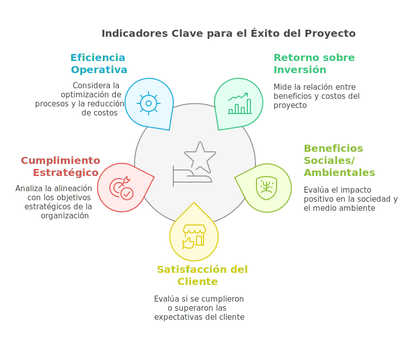

# Contexto Organizacional de los Proyectos

Los proyectos no funcionan de manera aislada; son herramientas que ayudan a las organizaciones a convertir su visión y misión en resultados tangibles. Este módulo se enfoca en cómo los proyectos se integran en el contexto organizacional y su relación con la estrategia, operaciones y gobernanza.

## Los proyectos y la estrategia organizacional

- **Visión y Misión:**
  - En una empresa la **misión** define el propósito central de la organización (por qué existe), mientras que la **visión** describe su meta a largo plazo (dónde quiere llegar).
  - **Relación con los proyectos:** Los proyectos se diseñan para cumplir con objetivos específicos que apoyen la misión y permitan avanzar hacia la visión. Además, muchos proyectos exitosos se convierten en procesos operativos que mantengan los beneficios logrados.

- **Estrategia Organizacional:**
  - La estrategia define los objetivos clave de la organización y las acciones necesarias para cumplir con su misión y alcanzar su visión.
  - **Planificación Estratégica y Operativa:**
    - La **planificación estratégica** establece metas a largo plazo y define proyectos clave para alcanzarlas.
    - La **planificación operativa** se enfoca en mantener los procesos y actividades recurrentes necesarias para la operación diaria.
  - **Proyectos como Instrumentos Estratégicos:**
    - Los proyectos traducen las estrategias en acciones concretas. Por ejemplo, un objetivo de "mejorar la eficiencia operativa" puede originar proyectos como la automatización de procesos o la implementación de un ERP.

> **Ejemplo práctico:** Supongamos que una cadena de restaurantes tiene como estrategia "reducir costos operativos en un 15%". Para ello, implementa un proyecto para instalar un sistema automatizado de pedidos en línea (proyecto). Una vez implementado, este sistema se convierte en parte de las operaciones diarias, gestionando automáticamente los pedidos y reduciendo la necesidad de personal administrativo extra.
>
> **Ejemplo adicional:** La misma cadena de restaurantes también decide adquirir nuevos hornos de alta eficiencia energética para todas sus sucursales. Aunque la compra de estos equipos optimiza la operación diaria, no se considera un proyecto porque no tiene un carácter único ni temporal, sino que es parte de la planificación operativa habitual.

### Medición del valor

**Éxito más allá de los entregables:**
El éxito de un proyecto no solo depende de cumplir con el cronograma, sino del valor que genera a la organización y a sus partes interesadas. Esto implica analizar los beneficios tangibles e intangibles que el proyecto aporta.

**Indicadores para medir proyectos:**

- **Retorno sobre inversión (ROI):** Este indicador mide la relación entre los beneficios obtenidos y el costo del proyecto. Un ROI positivo sugiere que el proyecto ha generado más valor del que ha costado.
- **Beneficios sociales o ambientales:** Proyectos que impactan positivamente en el entorno o en la sociedad, como la reducción de emisiones de carbono o mejoras en las comunidades locales.
- **Satisfacción del cliente:** Es un indicador cualitativo que evalúa si las expectativas de los usuarios o clientes finales fueron cumplidas o superadas.
- **Cumplimiento de los objetivos estratégicos:** Analiza si el proyecto contribuyó directamente a alcanzar las metas de la organización.
- **Eficiencia operativa:** Considera si el proyecto ayudó a optimizar procesos, reducir costos o mejorar tiempos de entrega.

> **Ejemplos prácticos:**
>
> - Un proyecto de digitalización en una empresa de servicios logra reducir el tiempo de respuesta al cliente en un 50%. Este resultado no solo mejora la satisfacción del cliente, sino que también incrementa la eficiencia operativa y permite atender a un mayor número de usuarios con los mismos recursos.
>
> - Un proyecto para instalar paneles solares en una planta industrial genera un ROI positivo al reducir los costos energéticos en un 30% anual. Además, el impacto ambiental positivo mejora la percepción de la marca en el mercado y refuerza su compromiso con la sostenibilidad.

**Herramientas de medición del valor:**

- **Matriz de beneficios:** Ayuda a priorizar y documentar los beneficios esperados del proyecto.
- **Encuestas de satisfacción:** Recopilan datos de los clientes o usuarios finales para evaluar su experiencia.
- **Análisis de datos:** Permite medir cambios en los indicadores operativos clave antes y después de la implementación del proyecto.

Medir el valor generado no solo valida el éxito del proyecto, sino que también proporciona información valiosa para la planificación de futuros proyectos y decisiones estratégicas.

## Glosario

**Misión** *(Mission)* — propósito central de la organización; responde a por qué existe.

**Visión** *(Vision)* — meta a largo plazo; describe el estado futuro al que la organización aspira.

**Estrategia organizacional** *(Organizational strategy)* — objetivos clave y acciones necesarias para cumplir la misión y alcanzar la visión ([PMI](https://www.pmi.org/)).

**Planificación estratégica** *(Strategic planning)* — definición de metas a largo plazo y proyectos clave para alcanzarlas.

**Planificación operativa** *(Operational planning)* — gestión de procesos y actividades recurrentes necesarios para la operación diaria.

**ROI** *(Return on Investment)* — indicador financiero que relaciona beneficios obtenidos con el costo del proyecto; un ROI positivo indica que se generó más valor del invertido.

**Matriz de beneficios** *(Benefits matrix)* — herramienta para priorizar y documentar los beneficios esperados de un proyecto.

**Valor** *(Value)* — conjunto de resultados tangibles e intangibles que el proyecto aporta a la organización y a sus partes interesadas ([PMBOK Guide](https://www.pmi.org/pmbok-guide-standards)).

:::info Referencias primarias
- [PMBOK Guide séptima edición (PMI)](https://www.pmi.org/pmbok-guide-standards) — principio de entrega de valor.
- [PMI · Strategic Alignment](https://www.pmi.org/) — alineamiento de proyectos con la estrategia.
- [Kaplan & Norton — Balanced Scorecard](https://hbr.org/1992/01/the-balanced-scorecard-measures-that-drive-performance-2) — marco clásico para medir el desempeño estratégico.
:::

---

### Bloque estructurado para agentes

**Objetivo:** verificar que un proyecto está alineado con la estrategia organizacional y definir cómo se medirá el valor entregado.

**Entradas:**
- Misión, visión y objetivos estratégicos vigentes.
- Descripción del proyecto y sus entregables.
- Presupuesto y horizonte temporal.
- Partes interesadas clave.

**Pasos:**
1. Mapear cada objetivo del proyecto contra un objetivo estratégico.
2. Identificar si se trata de planificación estratégica u operativa.
3. Definir indicadores de valor (ROI, satisfacción, impacto social, eficiencia).
4. Documentar beneficios esperados tangibles e intangibles.
5. Acordar con patrocinador la línea base de medición.
6. Plantear mecanismos de seguimiento post-entrega.

**Salidas:**
- Matriz de alineación estrategia-proyecto.
- Lista de indicadores con valores meta.
- Plan de medición de valor.

**Errores comunes:**
- Justificar el proyecto solo con entregables, sin valor estratégico.
- Medir solo cronograma y costo, ignorando resultados de negocio.
- Omitir indicadores cualitativos (satisfacción, impacto social).
- No acordar la línea base de medición con el patrocinador.

**Referencias cruzadas:**
- [4.1.1 Introducción a la Gestión de Proyectos](./01-introduccion-gestion-proyectos.md)
- [4.1.4 Procesos Clave en la Gestión de Proyectos](./04-proceso-clave-proyectos.md)
- [4.1.6 Metodologías y Estándares para la Gestión de Proyectos](./06-metodologias-proyectos.md)

