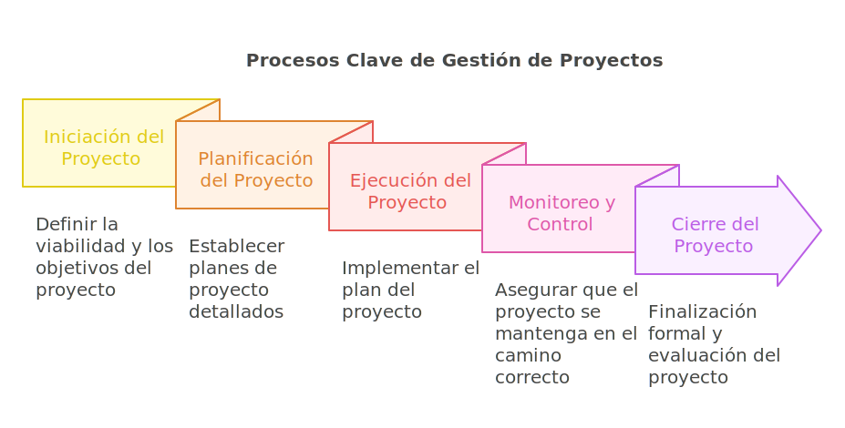

# Procesos Clave en la Gestión de Proyectos

Los procesos de gestión de proyectos no son exclusivos de un enfoque como PMBOK® o Ágil. Cada metodología aporta un marco que permite abordar las necesidades específicas del proyecto. Este módulo presenta un panorama general de los procesos clave desde el enfoque tradicional y Ágil, destacando sus similitudes y diferencias.

## Iniciación del proyecto

- **Definición:**
  Fase inicial donde se define la viabilidad del proyecto y su alineación con los objetivos estratégicos. En Ágil, esta fase puede ser equivalente al establecimiento del backlog inicial.

- **Actividades Clave:**
  - Enfoque tradicional: Crear el acta de constitución del proyecto.
  - Enfoque Ágil: Definir los objetivos generales y las historias de usuario iniciales.

- **Responsabilidades:**
  - El gestor de proyectos asegura la aprobación del proyecto por las partes interesadas.
  - El Product Owner prioriza y define el valor del backlog.

> **Ejemplo:** En un proyecto de implementación de software, el equipo Ágil identifica historias clave para iniciar el desarrollo, mientras que un enfoque tradicional detalla el alcance completo en el acta de constitución.

## Planificación del proyecto

- **Definición:**
  Establece cómo se logrará el objetivo del proyecto. La planificación en Ágil es iterativa y menos detallada al inicio.

- **Componentes Clave:**
  - Enfoque tradicional: Plan de cronograma, costos, calidad y riesgos.
  - Enfoque Ágil: Roadmap del producto, sprints y definición de "hecho".

- **Herramientas:**
  - Diagramas de Gantt (tradicional).
  - Tableros Kanban o Scrum (Ágil).

- **Responsabilidades:**
  - Tradicional: El gestor crea un plan detallado con hitos y entregables.
  - Ágil: El equipo colabora para priorizar y planificar en ciclos cortos (sprints).

> **Tip:** Usa reuniones de retrospectiva al final de cada sprint para mejorar continuamente.

## Ejecución del proyecto

- **Definición:**
  Implementación del plan para producir los entregables del proyecto.

- **Actividades Clave:**
  - Tradicional: Asignación de tareas y seguimiento del cronograma.
  - Ágil: Desarrollo iterativo y demostraciones al final de cada sprint.

- **Responsabilidades:**
  - Tradicional: El gestor supervisa la ejecución de acuerdo al plan.
  - Ágil: El Scrum Master elimina impedimentos para el equipo.

> **Ejemplo:** Un proyecto de diseño web en Ágil incluye entregar un prototipo funcional al final de cada sprint para obtener feedback inmediato.

## Monitoreo y control

- **Definición:**
  Asegura que el proyecto se mantenga en el camino correcto, controlando desviaciones.

- **Indicadores Clave:**
  - Enfoque tradicional: Variación del cronograma y presupuesto.
  - Enfoque Ágil: Velocidad del equipo y valor entregado al cliente.

- **Herramientas:**
  - Informes de avance (tradicional).
  - Gráficos de burndown y burnup (Ágil).

> **Dato Importante:** Los gráficos de burndown permiten visualizar el trabajo restante en tiempo real, ayudando al equipo a ajustarse.

## Cierre del proyecto

- **Definición:**
  Finalización formal del proyecto, asegurando que los entregables cumplan con los requisitos.

- **Actividades Clave:**
  - Tradicional: Documentar lecciones aprendidas y entregar resultados finales.
  - Ágil: Realizar una retrospectiva final y evaluar el valor entregado.

- **Responsabilidades:**
  - El gestor documenta el desempeño general.
  - En Ágil, el equipo identifica mejoras para futuros proyectos.

> **Ejemplo:** En un proyecto Ágil, el cierre incluye validar que las historias de usuario cumplan con los criterios de aceptación definidos.

## Glosario

**Acta de constitución** *(Project charter)* — documento que autoriza formalmente la existencia del proyecto y otorga autoridad al gestor ([PMBOK Guide](https://www.pmi.org/pmbok-guide-standards)).

**Product Owner** *(Product Owner)* — rol responsable de maximizar el valor del producto y gestionar el Product Backlog ([Scrum Guide 2020](https://scrumguides.org/)).

**Scrum Master** *(Scrum Master)* — rol responsable de habilitar el proceso Scrum y remover impedimentos del equipo ([Scrum Guide 2020](https://scrumguides.org/)).

**Sprint** *(Sprint)* — iteración de duración fija (habitualmente 1–4 semanas) en la que se crea un incremento de producto usable ([Scrum Guide 2020](https://scrumguides.org/)).

**Diagrama de Gantt** *(Gantt chart)* — visualización de cronograma con barras que muestran inicio, fin y dependencias de las actividades.

**Kanban** *(Kanban)* — método visual para gestionar el flujo de trabajo limitando el WIP (*Work in Progress*).

**Burndown** *(Burndown chart)* — gráfico que muestra el trabajo restante a lo largo del tiempo en un sprint o release.

**Definición de hecho** *(Definition of Done)* — conjunto de criterios que un incremento debe cumplir para considerarse terminado ([Scrum Guide 2020](https://scrumguides.org/)).

:::info Referencias primarias
- [PMBOK Guide séptima edición (PMI)](https://www.pmi.org/pmbok-guide-standards) — procesos y dominios de desempeño.
- [Scrum Guide 2020](https://scrumguides.org/) — definición oficial de Scrum y sus artefactos.
- [Atlassian · Agile](https://www.atlassian.com/agile) — referencias prácticas de Scrum y Kanban.
:::

---

### Bloque estructurado para agentes

**Objetivo:** ejecutar los procesos clave de un proyecto de extremo a extremo, adaptando el enfoque (tradicional o ágil) al contexto.

**Entradas:**
- Acta de constitución o visión del producto.
- Lista inicial de entregables o backlog.
- Equipo asignado y roles definidos.
- Restricciones de tiempo, costo y calidad.

**Pasos:**
1. Formalizar la iniciación con charter o visión.
2. Planificar el alcance: cronograma tradicional o roadmap + sprints.
3. Ejecutar el trabajo según el marco elegido.
4. Monitorear avance con indicadores apropiados (EVM o burndown).
5. Controlar desviaciones y tomar acciones correctivas.
6. Cerrar el proyecto con lecciones aprendidas o retrospectiva final.

**Salidas:**
- Plan o roadmap aprobado.
- Entregables validados por el cliente.
- Informe de cierre y lecciones aprendidas.

**Errores comunes:**
- Saltar la iniciación y asumir alcance implícito.
- Mezclar enfoques sin un marco claro (*ScrumFall*).
- Monitorear solo cronograma, ignorando valor entregado.
- Cerrar sin capturar lecciones aprendidas.

**Referencias cruzadas:**
- [4.1.3 Roles y Responsabilidades en la Gestión de Proyectos](./03-roles-proyectos.md)
- [4.1.5 Gestión del Cambio y Resolución de Problemas](./05-gestion-cambio.md)
- [4.1.6 Metodologías y Estándares para la Gestión de Proyectos](./06-metodologias-proyectos.md)

