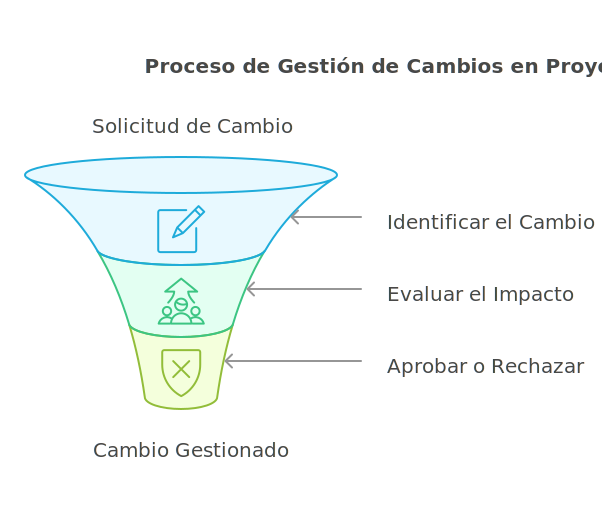
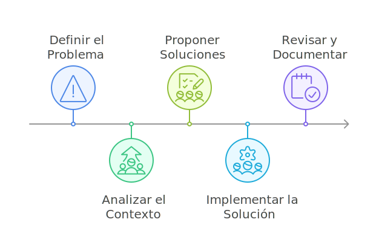

# Gestión del Cambio y Resolución de Problemas

Los cambios y problemas son inevitables en cualquier proyecto. Este módulo detalla cómo enfrentarlos de manera estructurada, integrando herramientas y ejemplos prácticos para garantizar que los objetivos del proyecto no se vean comprometidos.

## Gestión del cambio

La gestión del cambio implica identificar, evaluar y manejar cualquier alteración en el alcance, cronograma o presupuesto del proyecto, garantizando que las decisiones sean informadas y controladas.

### Pasos clave

  1. **Identificar el Cambio:**
     - Documentar de manera clara qué requiere modificación (e.g., alcance, entregables o requisitos).
     - Establecer la razón del cambio y quién lo solicita.
  2. **Evaluar el Impacto:**
     - Analizar cómo el cambio afectará el tiempo, los costos y la calidad del proyecto.
     - Determinar los recursos adicionales necesarios y los riesgos asociados.
  3. **Aprobar o Rechazar:**
     - Decidir junto con las partes interesadas si el cambio es viable.
     - Actualizar los documentos del proyecto y comunicar la decisión al equipo.

- **Enfoque Ágil:**
  - Los cambios se gestionan mediante la revisión constante del backlog.
  - Las prioridades se ajustan al inicio de cada sprint para mantener la agilidad.

> **Ejemplo Práctico:**
En un proyecto de desarrollo de software, un cliente solicita agregar una funcionalidad a mitad del ciclo. El Product Owner evalúa el impacto en el tiempo y prioriza el cambio en el backlog para ser desarrollado en el próximo sprint.

### Herramientas de gestión del cambio

| Herramienta           | Descripción                                                                 | Contexto Ideal                                                        |
|--------------------------|-----------------------------------------------------------------------------|--------------------------------------------------------------------------------|
| **Matrices de Impacto** | Evalúan cómo el cambio afecta distintas áreas del proyecto.                  | Proyectos donde es crucial identificar el impacto global de los cambios. |
| **Solicitudes de Cambio** | Documentos formales que detallan el cambio propuesto y su impacto.         | Organizaciones con alta regulación o múltiples partes interesadas.      |
| **Software de Gestión**  | Herramientas como Jira o Monday.com para registrar y dar seguimiento.       | Proyectos con equipos distribuidos o cambios frecuentes.                |

## Resolución de problemas

  Es el proceso de identificar y abordar obstáculos que impiden el progreso del proyecto, asegurando que no afecten los entregables finales.

### Técnicas comunes

| Técnica                  | Descripción                                                                 | Contexto Ideal                                                                 |
|--------------------------|-----------------------------------------------------------------------------|--------------------------------------------------------------------------------|
| **Análisis de Causa Raíz (Ishikawa)** | Identifica las causas principales de un problema y las categoriza.          | Problemas complejos con múltiples factores, como retrasos en producción.       |
| **Los 5 Porqués**       | Técnica simple que profundiza en la causa raíz preguntando "¿Por qué?".     | Problemas directos o específicos, como fallas en una tarea puntual.            |
| **Análisis de Opciones** | Explora soluciones considerando costos, tiempo y viabilidad.                | Problemas donde existen varias soluciones posibles y se necesita priorización. |

### Pasos para la resolución de problemas

  1. **Definir el Problema:**
     - Asegurarse de comprender el problema completamente antes de actuar.
  2. **Analizar el Contexto:**
     - Usar herramientas como diagramas de Ishikawa para identificar la causa raíz.
  3. **Proponer Soluciones:**
     - Generar múltiples alternativas y evaluar la mejor opción según los objetivos del proyecto.
  4. **Implementar la Solución:**
     - Asignar responsables y monitorear la efectividad de la acción tomada.
  5. **Revisar y Documentar:**
     - Evaluar el resultado para asegurar que el problema no vuelva a ocurrir y registrar la lección aprendida.

> **Ejemplo Práctico:**
En un proyecto de construcción, un retraso en la entrega de materiales se soluciona contactando a un proveedor alternativo para garantizar que las actividades continúen según lo planeado.

## Comunicación durante el cambio y los problemas

- **Importancia de la Comunicación:**
  - La comunicación clara y oportuna es fundamental para garantizar que el equipo y las partes interesadas estén alineados durante cambios y problemas.

- **Buenas Prácticas:**
  - **Actualizaciones Frecuentes:** Proporcionar reportes regulares sobre el estado del cambio o problema.
  - **Uso de Herramientas de Colaboración:** Plataformas como Slack, Teams o Asana permiten documentar y compartir información en tiempo real.
  - **Establecer Roles Claros:** Definir quién es responsable de gestionar el cambio o resolver el problema y quién debe ser informado.

:::tip

Siempre prioriza la transparencia al comunicar problemas. Es preferible informar temprano y ajustar expectativas que ocultar un problema hasta que sea demasiado tarde.

:::

La gestión efectiva del cambio y la resolución de problemas no solo previenen desviaciones en el proyecto, sino que también fortalecen la confianza entre los equipos y las partes interesadas. Al integrar herramientas y técnicas adecuadas, es posible enfrentar desafíos con proactividad y garantizar el éxito del proyecto.

## Glosario

**Gestión del cambio** *(Change management)* — proceso para identificar, evaluar y manejar alteraciones al alcance, cronograma o presupuesto del proyecto ([PMBOK Guide](https://www.pmi.org/pmbok-guide-standards)).

**Solicitud de cambio** *(Change request)* — documento formal que describe un cambio propuesto, su justificación y su impacto esperado.

**Matriz de impacto** *(Impact matrix)* — herramienta que evalúa cómo un cambio afecta distintas áreas del proyecto (alcance, tiempo, costo, calidad, riesgo).

**Análisis de causa raíz** *(Root cause analysis)* — método para identificar la causa fundamental de un problema más allá de sus síntomas; el diagrama de Ishikawa y los 5 porqués son técnicas típicas.

**Diagrama de Ishikawa** *(Fishbone diagram)* — diagrama causa-efecto que agrupa posibles causas en categorías (personas, procesos, materiales, máquinas, entorno, medición).

**Los 5 porqués** *(5 Whys)* — técnica iterativa de Toyota para encontrar la causa raíz preguntando "¿por qué?" hasta llegar al origen del problema.

**Lecciones aprendidas** *(Lessons learned)* — conocimiento capturado durante o al cierre del proyecto para mejorar iniciativas futuras.

:::info Referencias primarias
- [PMBOK Guide séptima edición (PMI)](https://www.pmi.org/pmbok-guide-standards) — dominio de desempeño *Project Work* y control de cambios.
- [John Kotter · Leading Change](https://www.kotterinc.com/8-steps-process-for-leading-change/) — modelo de 8 pasos para liderar el cambio organizacional.
- [ASQ · Root Cause Analysis](https://asq.org/quality-resources/root-cause-analysis) — referencias sobre causa raíz e Ishikawa.
:::

---

### Bloque estructurado para agentes

**Objetivo:** gestionar cambios y resolver problemas durante la ejecución del proyecto con decisiones trazables y comunicación oportuna.

**Entradas:**
- Línea base de alcance, cronograma y costo.
- Solicitudes de cambio recibidas.
- Incidentes y bloqueos reportados.
- Herramientas de gestión y colaboración vigentes.

**Pasos:**
1. Registrar la solicitud de cambio o el problema detectado.
2. Analizar impacto en alcance, tiempo, costo y calidad.
3. Aplicar causa raíz (Ishikawa o 5 porqués) cuando sea un problema.
4. Evaluar alternativas y recomendar decisión.
5. Aprobar o rechazar con las partes interesadas.
6. Comunicar la decisión, actualizar documentos y monitorear efectos.

**Salidas:**
- Registro de cambios actualizado.
- Plan de acción para problemas con responsable y fecha.
- Lecciones aprendidas documentadas.

**Errores comunes:**
- Aceptar cambios informales sin evaluar impacto.
- Tratar síntomas sin llegar a la causa raíz.
- Comunicar tarde o de forma parcial.
- No registrar la lección aprendida para el futuro.

**Referencias cruzadas:**
- [4.1.3 Roles y Responsabilidades en la Gestión de Proyectos](./03-roles-proyectos.md)
- [4.1.4 Procesos Clave en la Gestión de Proyectos](./04-proceso-clave-proyectos.md)
- [4.1.6 Metodologías y Estándares para la Gestión de Proyectos](./06-metodologias-proyectos.md)

