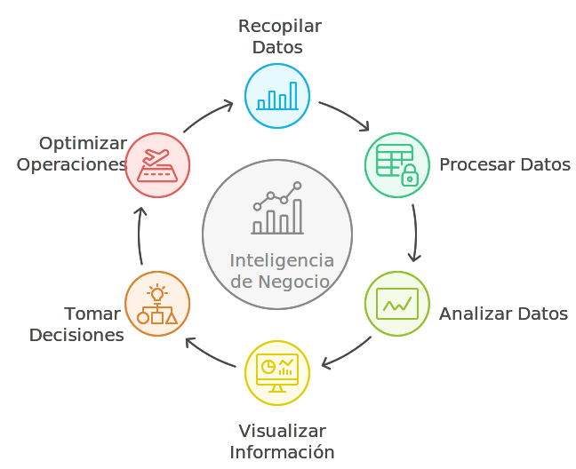
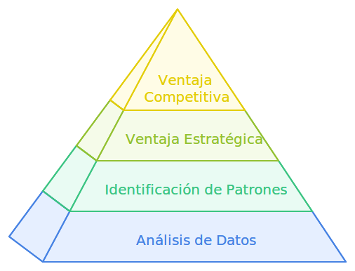

# ¿Qué es la Inteligencia de Negocio?

La Inteligencia de Negocio (BI) es un conjunto de estrategias, procesos, tecnologías y herramientas que permiten transformar datos en información útil para la toma de decisiones empresariales. El objetivo de la BI es ayudar a las organizaciones a comprender su situación actual, identificar oportunidades de mejora y optimizar sus operaciones, logrando así una ventaja competitiva. La BI utiliza datos de diversas fuentes, los procesa y los convierte en información visual, como gráficos y reportes, que son fáciles de interpretar.

**Ejemplos de Aplicación**: La inteligencia de negocio se utiliza ampliamente en áreas como marketing, ventas, recursos humanos y
finanzas. En marketing, se puede utilizar para analizar el comportamiento de los clientes y diseñar campañas más efectivas. En ventas, se utiliza para identificar tendencias de compra y prever la demanda futura. En recursos humanos, ayuda a evaluar el rendimiento de los empleados y en finanzas, a controlar costos y mejorar la rentabilidad.

## Importancia del análisis de datos en la empresa

El análisis de datos es un pilar fundamental para la toma de decisiones informadas en cualquier organización. A través de la BI, las empresas pueden identificar patrones, tendencias y correlaciones en sus datos que les permiten anticiparse a los cambios del mercado y responder de manera proactiva. La capacidad de analizar datos en tiempo real permite a las empresas reaccionar rápidamente a problemas operativos y detectar oportunidades de crecimiento antes que sus competidores.

**Ventajas Competitivas**: Aquellas organizaciones que aprovechan la BI de manera efectiva pueden optimizar sus operaciones, mejorar la satisfacción del cliente y aumentar la eficiencia en la asignación de recursos. Por ejemplo, un minorista puede analizar las tendencias de ventas para ajustar su inventario y evitar el desabastecimiento o el exceso de stock.

## Glosario

**Inteligencia de Negocio** *(Business Intelligence · BI)* — conjunto de estrategias, procesos y tecnologías para transformar datos en información útil para decisiones.

**KPI** *(Key Performance Indicator)* — indicador clave que mide el desempeño de un proceso o área respecto a un objetivo.

**Análisis de datos** *(Data analysis)* — proceso de examinar datos para descubrir patrones, tendencias y relaciones relevantes.

**Tablero de control** *(Dashboard)* — panel visual que consolida métricas e indicadores para facilitar el seguimiento y la toma de decisiones.

**Toma de decisiones basada en datos** *(Data-driven decision making)* — práctica de sustentar decisiones en evidencia cuantitativa y no en intuición aislada.

:::info Referencias primarias
- [Kimball Group · Dimensional modeling](https://www.kimballgroup.com/data-warehouse-business-intelligence-resources/kimball-techniques/) — referencia clásica de BI.
- [TDWI · BI and analytics research](https://tdwi.org/) — investigación y mejores prácticas.
- [Microsoft · BI documentation](https://learn.microsoft.com/en-us/power-bi/) — documentación de Power BI.
:::

---

### Bloque estructurado para agentes

**Objetivo:** entender qué aporta la Inteligencia de Negocio a una organización y en qué áreas se puede aplicar.

**Entradas:**
- Objetivos estratégicos y operativos de la organización.
- Fuentes de datos disponibles (operativas, externas, históricas).
- Capacidades actuales de análisis y reporting.
- Áreas de negocio candidatas para iniciar (marketing, ventas, finanzas, RR.HH.).

**Pasos:**
1. Identificar decisiones que hoy se toman sin datos o con datos fragmentados.
2. Mapear fuentes de datos relevantes para esas decisiones.
3. Seleccionar un área piloto con impacto visible y datos accesibles.
4. Definir métricas y KPIs a observar en la fase inicial.
5. Evaluar herramientas de análisis y visualización para el caso seleccionado.
6. Planear la evolución hacia procesos y almacenes de datos más formales.

**Salidas:**
- Lista de casos de uso de BI priorizados.
- Área piloto con métricas definidas.
- Hoja de ruta inicial para evolucionar la práctica de BI.

**Errores comunes:**
- Pretender implementar BI en toda la organización simultáneamente.
- Iniciar sin definir métricas ni decisiones esperadas.
- Usar solo datos operativos actuales sin contemplar histórico.
- Confundir reporting operativo con análisis estratégico.

**Referencias cruzadas:**
- [2.1.2 Conceptos Clave de la Inteligencia de Negocio](./02-conceptos-clave.md)
- [2.1.3 Análisis de Datos Directo vs. Almacén de Datos](./03-analisis-directo-vs-almacen.md)
- [2.2.1 Introducción a la Visualización de Datos](../introduccion-visualizacion-datos/01-introduccion.md)

