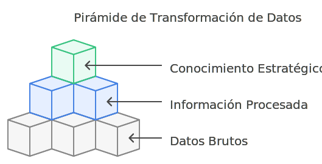
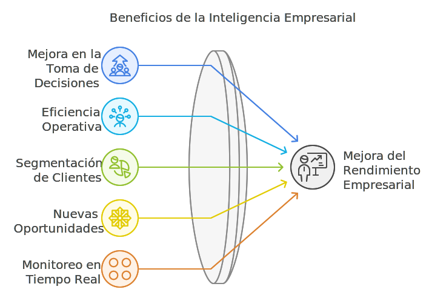

# Conceptos Clave de la Inteligencia de Negocio

Este módulo está dedicado a comprender los conceptos clave dentro de la inteligencia de negocio, incluyendo la diferencia entre datos, información y conocimiento, los beneficios de la BI, y ejemplos específicos de su aplicación en diferentes sectores.

## Datos vs. Información vs. Conocimiento

Para entender la inteligencia de negocio, es esencial diferenciar entre datos, información y conocimiento.

- **Datos**: Son hechos brutos, como números o registros de eventos. Los datos por sí solos no tienen un significado hasta que se procesan. Ejemplos de datos incluyen registros de ventas, cifras de producción o información sobre clientes.

- **Información**: Surge cuando los datos se organizan y procesan de manera que adquieren un contexto y significado. Por ejemplo, agrupar las ventas por categorías de producto para entender cuáles tienen mejor rendimiento.

- **Conocimiento**: Se obtiene al interpretar y analizar la información para tomar decisiones. El conocimiento implica entender las implicaciones de la información y usarla para guiar acciones estratégicas. Un ejemplo sería identificar que ciertas categorías de productos tienen mejor rendimiento en ciertas épocas del año y, con ese conocimiento, planificar promociones específicas.

- **Ciclo de Transformación de Datos**: En el contexto de la BI, los datos se transforman en información y luego en conocimiento para apoyar la toma de decisiones. Este ciclo es fundamental para convertir datos dispersos en acciones que agreguen valor.

## Beneficios de la inteligencia de negocio

- **Mejora en la Toma de Decisiones**: La BI permite a las empresas basar sus decisiones en datos objetivos y análisis detallados, lo cual reduce el riesgo asociado a la intuición o la falta de información precisa.

- **Eficiencia Operativa**: Al monitorear y analizar procesos en tiempo real, las empresas pueden identificar ineficiencias y corregirlas de manera oportuna.

- **Segmentación de Clientes y Personalización**: La BI ayuda a segmentar a los clientes con base en su comportamiento, preferencias y patrones de compra, lo que permite diseñar campañas de marketing más efectivas y personalizar ofertas para cada cliente.

- **Identificación de Nuevas Oportunidades**: La capacidad de analizar grandes volúmenes de datos históricos y actuales permite identificar oportunidades emergentes y áreas de crecimiento potencial.

- **Monitoreo en Tiempo Real**: Muchas herramientas de BI permiten a los usuarios monitorear métricas clave en tiempo real, lo que facilita una respuesta rápida ante cambios inesperados.

## Casos de uso de la inteligencia de negocio

La inteligencia de negocio se utiliza en diversos sectores y áreas funcionales de las empresas para lograr ventajas competitivas y mejorar la eficiencia.

- **Sector Retail**: Los minoristas utilizan la BI para analizar el comportamiento del consumidor, identificar productos más vendidos y ajustar el inventario en consecuencia. Por ejemplo, Walmart utiliza BI para gestionar su cadena de suministro y mantener un flujo de productos óptimo.

- **Salud**: En el sector de la salud, los hospitales y clínicas utilizan BI para mejorar la atención al paciente y gestionar los recursos hospitalarios de manera más eficiente. Por ejemplo, el análisis de datos históricos puede ayudar a prever picos de demanda y asignar personal médico de acuerdo a esas necesidades.

- **Finanzas**: Las instituciones financieras utilizan la BI para identificar riesgos, optimizar sus carteras de inversión y asegurar el cumplimiento de normativas. Por ejemplo, se pueden utilizar herramientas de BI para detectar transacciones fraudulentas en tiempo real.

- **Manufactura**: Las empresas manufactureras utilizan la BI para monitorear el rendimiento de la producción, minimizar costos y mejorar la calidad del producto. Esto permite reducir el desperdicio y maximizar la eficiencia operativa.

- **Ejemplo Práctico**: Amazon utiliza BI para recomendar productos a sus clientes en función de sus compras anteriores y comportamiento de navegación, lo cual ha sido clave en su estrategia de ventas cruzadas y mejora de la experiencia del cliente.

## Glosario

**Datos** *(Data)* — hechos brutos sin procesar; por sí solos no tienen contexto ni significado.

**Información** *(Information)* — datos organizados y procesados que adquieren contexto y significado.

**Conocimiento** *(Knowledge)* — interpretación de la información que habilita decisiones y acciones.

**Ciclo datos-información-conocimiento** *(DIKW pyramid)* — modelo que describe cómo los datos se elevan hacia conocimiento y sabiduría accionable.

**Segmentación** *(Segmentation)* — agrupamiento de clientes o registros según características y comportamientos comunes.

**Monitoreo en tiempo real** *(Real-time monitoring)* — seguimiento continuo de métricas operativas para reaccionar de inmediato.

:::info Referencias primarias
- [Kimball Group](https://www.kimballgroup.com/data-warehouse-business-intelligence-resources/kimball-techniques/) — referencia clásica de BI.
- [TDWI](https://tdwi.org/) — investigación y prácticas de BI.
- [Microsoft · Power BI docs](https://learn.microsoft.com/en-us/power-bi/) — documentación oficial.
:::

---

### Bloque estructurado para agentes

**Objetivo:** diferenciar datos, información y conocimiento, y relacionar los beneficios de la BI con casos de uso sectoriales.

**Entradas:**
- Datos crudos y registros operativos disponibles.
- Áreas funcionales a servir (ventas, finanzas, salud, manufactura, etc.).
- Decisiones que se pretenden mejorar con datos.
- Restricciones regulatorias o de privacidad.

**Pasos:**
1. Catalogar los datos disponibles por dominio y sistema fuente.
2. Organizarlos para transformarlos en información contextualizada.
3. Interpretar esa información para derivar conocimiento accionable.
4. Asociar cada iniciativa a beneficios esperados: decisiones, eficiencia, segmentación, oportunidades, monitoreo en tiempo real.
5. Seleccionar casos de uso representativos del sector para validar el enfoque.

**Salidas:**
- Pirámide datos-información-conocimiento aplicada al caso.
- Mapa de beneficios esperados por iniciativa.
- Casos de uso priorizados por sector y función.

**Errores comunes:**
- Tratar datos crudos como si fueran información lista para decidir.
- Presentar conocimiento sin trazar su origen en los datos.
- Ignorar la dimensión regulatoria al manejar datos sensibles.
- Copiar casos de uso de otros sectores sin adaptarlos al contexto.

**Referencias cruzadas:**
- [2.1.1 ¿Qué es la Inteligencia de Negocio?](./01-introduccion-bi.md)
- [2.1.3 Análisis de Datos Directo vs. Almacén de Datos](./03-analisis-directo-vs-almacen.md)
- [2.1.4 El Proceso ETL (Extracción, Transformación y Carga)](./04-etl.md)

