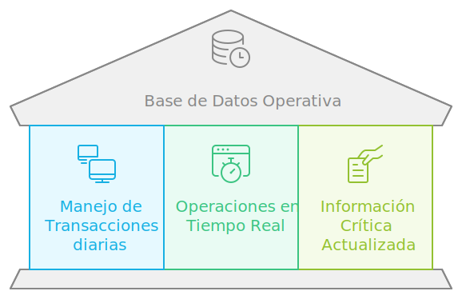
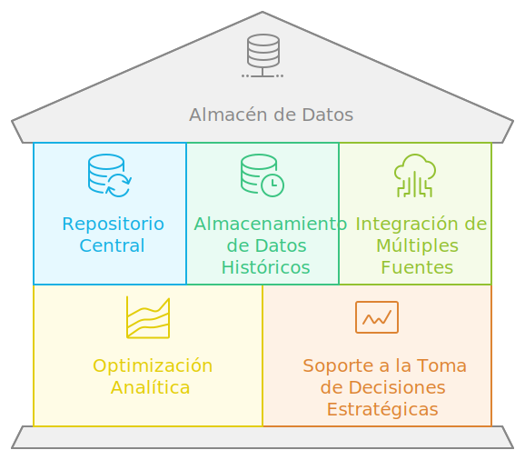
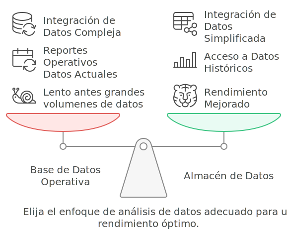

# Análisis de Datos Directo vs. Almacén de Datos

En este módulo, exploraremos dos enfoques principales para realizar análisis de datos: el análisis directo desde la base de datos operativa de la empresa y el análisis mediante un almacén de datos (data warehouse). Antes de profundizar en cada enfoque, primero entenderemos qué es una base de datos operativa y un almacén de datos, así como sus funciones y usos en la organización.

## Base de Datos Operativa

**Definición**: Una base de datos operativa es aquella que se utiliza para gestionar las operaciones diarias de la empresa. Está diseñada para soportar el procesamiento de transacciones y las actividades operativas que se realizan en tiempo real. Este tipo de base de datos contiene información crítica que debe estar siempre actualizada y disponible para los usuarios. Ejemplos de bases de datos operativas incluyen sistemas CRM (Customer Relationship Management), ERP (Enterprise Resource Planning) y software de misión crítica, como el sistema de gestión de inventarios o el sistema de gestión de productos.

- **Ejemplos de bases de datos operativas**:
  
  - **CRM**: La base de datos de un sistema CRM que permite gestionar las relaciones con los clientes y almacenar datos relevantes como el historial de interacciones, preferencias y necesidades de los clientes.
  
  - **ERP**:  La base de datos de un sistema ERP que permite la gestión integral de los recursos de la empresa, como las finanzas, inventarios y producción.
  
  - **Software de Misión Crítica**: Otros ejemplos incluyen las bases de datos de sistemas para la gestión de pedidos, sistemas de nómina, y sistemas de producción que deben estar disponibles constantemente para asegurar la continuidad de las operaciones.

## Almacén de Datos (Data Warehouse)

**Definición**: Un almacén de datos, o data warehouse, es un repositorio central que almacena grandes volúmenes de datos históricos provenientes de múltiples fuentes. A diferencia de las bases de datos operativas, el almacén de datos está diseñado específicamente para el análisis y la generación de informes. Los datos se organizan y optimizan para permitir consultas complejas y análisis en profundidad, apoyando la toma de decisiones estratégicas de la empresa.

- **Objetivo Principal**: El objetivo principal de un almacén de datos es proporcionar una visión integrada y consolidada de la información para facilitar el análisis de tendencias, la identificación de patrones, y la evaluación del desempeño de la organización a lo largo del tiempo.

- **Características Clave**:

  - **Datos Históricos**: Un almacén de datos almacena información histórica que puede abarcar varios años, lo que permite realizar análisis comparativos y detectar tendencias a largo plazo.

  - **Integración de Datos**: Combina datos de diversas fuentes, como bases de datos operativas, sistemas de ERP, CRM y otros repositorios de información, asegurando que los datos estén limpios y consolidados para su análisis.

  - **Optimización para el Análisis**: Está optimizado para consultas complejas, lo que lo hace ideal para el análisis estratégico y la toma de decisiones empresariales.

## Análisis Directo vs Análisis desde un Almacén de Datos

Existen dos métodos principales para realizar análisis de datos: uno es el análisis directo desde la base de datos rede la empresa (la base de datos de operación diaria) y el otro es usando un almacén de datos (data warehouse). Vamos a ver las diferencias y beneficios de cada uno.

### Análisis Directo desde la Base de Datos Operativa

- **Ralentización del Sistema**: Realizar análisis directamente en la base de datos operativa puede hacer que el sistema se vuelva más lento, afectando a todos los que lo usan. Los recursos se comparten entre las operaciones diarias y las consultas analíticas, lo cual reduce el rendimiento general.

- **Solo Datos Actuales**: Este método solo es efectivo para ver los datos más recientes (reportes operativos). Acceder a información histórica requiere recursos significativos, lo que puede causar degradación del servicio.

- **Dificultad para Integrar Datos**: Combinar datos de diferentes fuentes para análisis es complicado, lento y propenso a errores cuando se hace desde una base de datos operativa.

- **Inconsistencias de Datos**: Sin un buen sistema de gestión, los datos pueden ser inconsistentes y no confiables. La falta de un proceso formal para la calidad de datos puede llevar a errores en los reportes.

- **Eficaz para Reportes Operativos**: Este enfoque es adecuado para reportes operativos que requieren acceso inmediato a los datos más actuales y están directamente relacionados con las operaciones diarias del negocio, como monitorear actividades en tiempo real y realizar ajustes inmediatos.

### Análisis desde un Almacén de Datos

- **Mejor Rendimiento**: Un almacén de datos mejora el rendimiento del análisis al separar las tareas operativas diarias de las de análisis. Los datos se almacenan en un entorno optimizado para consultas complejas y reportes.

- **Acceso a Datos Históricos**: Un almacén de datos permite almacenar y acceder a grandes volúmenes de datos históricos, proporcionando una visión más completa y detallada de la situación de la empresa a lo largo del tiempo.

- **Integración de Datos Simplificada**: Facilita la integración de datos de diferentes fuentes, mejorando la coherencia y la integridad de los datos. Esto permite realizar análisis más completos y confiables.

- **Calidad y Consistencia de Datos**: El almacén de datos asegura que los datos sean de alta calidad y consistentes, gracias a los procesos de limpieza y transformación de datos implementados durante su carga.

- **Ideal para Análisis Estratégico**: Es ideal para análisis estratégicos y de tendencias que requieren datos históricos y la integración de múltiples fuentes de datos. Permite realizar análisis en profundidad y generar informes detallados que apoyen la toma de decisiones a largo plazo.

