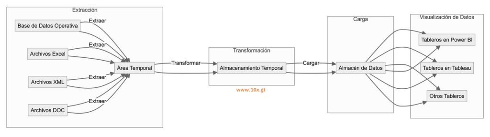

# El Proceso ETL (Extracción, Transformación y Carga)

Para llevar los datos desde la base de datos operativa y otras fuentes hacia el almacén de datos, se utiliza el proceso ETL (Extracción, Transformación y Carga). En este módulo, aprenderemos cómo funciona este proceso, su importancia y cómo garantiza que los datos sean precisos, consistentes y listos para el análisis.

## Extracción

**Definición**: La extracción implica capturar datos de diversas fuentes, como bases de datos operativas, archivos, sistemas ERP, CRM, etc. Esta etapa asegura que toda la información relevante sea recopilada de manera estructurada y sin pérdida de datos importantes.

**Desafíos Comunes**: La extracción de datos puede presentar desafíos como incompatibilidades de formato y limitaciones de acceso a ciertos sistemas. Es crucial contar con herramientas adecuadas que faciliten la extracción de datos sin afectar el rendimiento de las fuentes operativas.

## Transformación

**Definición**: La transformación es el proceso de limpieza, formateo y ajuste de los datos para cumplir con las necesidades específicas del negocio. En esta etapa se eliminan datos duplicados, se corrigen errores, y se normalizan los datos para que sean consistentes y utilizables.

**Pasos Comunes**: Incluye la limpieza de datos, la normalización, la conversión de formatos y la creación de métricas derivadas. La transformación asegura que los datos sean precisos, estén completos y sean coherentes para su análisis.

## Carga

**Definición**: La carga es el proceso de transferencia de los datos transformados al almacén de datos, donde estarán disponibles para el análisis y la generación de informes. La carga puede ser total o incremental dependiendo de la estrategia de actualización del almacén.

**Consideraciones de Rendimiento**: Es importante optimizar el proceso de carga para minimizar el impacto en el almacén de datos y asegurar que los datos estén disponibles para el análisis en el menor tiempo posible.

## Herramientas populares de ETL

Existen diversas herramientas para el proceso ETL que facilitan la extracción de datos, algunas de las más populares incluyen:

- **Talend**: Es una herramienta de código abierto que permite realizar todo el proceso ETL de forma visual, con una interfaz amigable.

- **Informatica PowerCenter**: Es una herramienta líder en el mercado para el proceso ETL, que ofrece gran capacidad de integración de datos y es utilizada por grandes empresas.

- **Microsoft SQL Server Integration Services (SSIS)**: Parte de la suite de Microsoft SQL Server, es una herramienta muy utilizada en el ámbito corporativo para la integración y transformación de datos.

- **Apache Nifi**: Es una herramienta de código abierto que facilita la automatización del flujo de datos entre sistemas.

- **Pentaho Data Integration (PDI)**: También conocida como Kettle, es una herramienta de integración de datos que permite realizar el proceso ETL de manera visual y es parte de la suite de Pentaho.

## Glosario

**ETL** *(Extract, Transform, Load)* — proceso que extrae datos de fuentes, los transforma y los carga al almacén.

**Extracción** *(Extraction)* — captura estructurada de datos desde sistemas fuente sin degradar su rendimiento.

**Transformación** *(Transformation)* — limpieza, normalización, conversión y enriquecimiento de los datos extraídos.

**Carga** *(Load)* — escritura de los datos transformados en el almacén destino; puede ser total o incremental.

**Carga incremental** *(Incremental load)* — estrategia que solo carga cambios desde la última ejecución, en lugar del conjunto completo.

**Orquestación** *(Data pipeline orchestration)* — coordinación automática de tareas del pipeline con dependencias, reintentos y monitoreo.

:::info Referencias primarias
- [Kimball Group · ETL](https://www.kimballgroup.com/data-warehouse-business-intelligence-resources/kimball-techniques/dimensional-modeling-techniques/) — referencia clásica.
- [TDWI](https://tdwi.org/) — prácticas de integración de datos.
- [Microsoft · Integration Services](https://learn.microsoft.com/en-us/sql/integration-services/) — documentación de SSIS.
:::

---

### Bloque estructurado para agentes

**Objetivo:** diseñar un proceso ETL para mover datos desde fuentes operativas hacia un almacén de datos listo para análisis.

**Entradas:**
- Inventario de fuentes de datos (bases operativas, archivos, ERP, CRM).
- Modelo destino en el almacén de datos.
- Requisitos de frecuencia, volumen y latencia.
- Herramientas ETL disponibles o candidatas.

**Pasos:**
1. Definir qué datos extraer de cada fuente y con qué cadencia.
2. Establecer reglas de limpieza, normalización y conversión en la transformación.
3. Diseñar la estrategia de carga (total o incremental) según volumen y frescura.
4. Seleccionar la herramienta ETL adecuada al stack y al presupuesto.
5. Automatizar la orquestación y el monitoreo del proceso.
6. Validar calidad de los datos cargados con pruebas y métricas.

**Salidas:**
- Diseño del flujo ETL por fuente y tabla destino.
- Plan de ejecución y monitoreo.
- Criterios de aceptación de calidad de datos.

**Errores comunes:**
- Saltar la transformación y cargar datos sucios al almacén.
- Usar carga total cuando el volumen ya exige carga incremental.
- No monitorear fallas del ETL ni alertar a los responsables.
- Elegir la herramienta por moda y no por ajuste al stack.

**Referencias cruzadas:**
- [2.1.3 Análisis de Datos Directo vs. Almacén de Datos](./03-analisis-directo-vs-almacen.md)
- [2.1.5 Implementación de un Datamart como Alternativa](./05-datamart-alternativa.md)
- [2.2.4 Informes y Tableros (Dashboard)](../introduccion-visualizacion-datos/04-informes-tableros.md)

