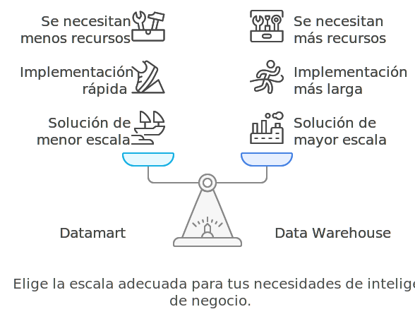
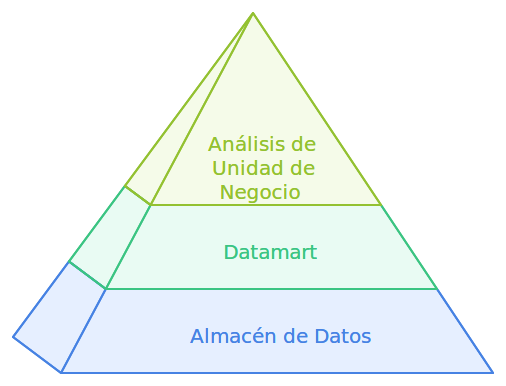

# Implementación de un Datamart como Alternativa

En este módulo, exploraremos qué es un datamart y cómo puede ser una alternativa eficaz al data warehouse completo. Los datamarts ofrecen una solución de menor escala que puede ser implementada de manera más rápida y con menos recursos, ideal para aquellas empresas que desean comenzar con inteligencia de negocio sin una gran inversión inicial.

## Definición de un Datamart

Un **datamart** es un subconjunto de un data warehouse que se centra en un área específica del negocio, como ventas, finanzas o recursos humanos. A diferencia de un almacén de datos completo, un datamart permite realizar análisis de datos de manera más rápida y enfocada, facilitando el acceso a información relevante para una unidad de negocio específica.

## Beneficios de los Datamarts

- **Menor Inversión**: Los datamarts requieren menos inversión y tiempo para implementarse en comparación con un almacén de datos completo. Esto los convierte en una opción viable para empresas que desean comenzar con inteligencia de negocio sin una gran inversión inicial.
- **Análisis Específico**: Al centrarse en una función específica del negocio, los datamarts permiten un análisis más profundo y rápido de los datos que son directamente relevantes para esa área. Esto facilita la toma de decisiones a nivel departamental y mejora la eficiencia operativa.
- **Facilidad de Implementación**: Debido a su enfoque específico y a su menor escala, los datamarts son más fáciles y rápidos de implementar. Esto permite a las empresas obtener resultados y beneficios en un periodo de tiempo más corto.

## Implementación Gradual

- **Crecimiento Escalable**: Las empresas pueden comenzar con uno o varios datamarts según las necesidades específicas de cada departamento o área de negocio. Con el tiempo, estos datamarts pueden integrarse para formar un data warehouse completo, proporcionando una visión integral de la organización.
- **Reducción de Riesgos**: Al implementar primero datamarts, las empresas pueden reducir el riesgo asociado con grandes proyectos de BI. Pueden probar la efectividad del análisis de datos en áreas específicas antes de comprometer recursos adicionales para un data warehouse a gran escala.
