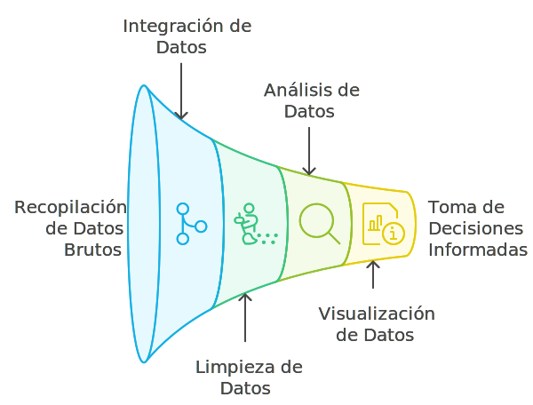

# Introducción a la Visualización de Datos

La visualización de datos es la forma de representar información en gráficos e imágenes para hacerla más comprensible. En el contexto empresarial, esto significa simplificar datos complicados para ayudar a los responsables a tomar decisiones más rápidas y efectivas.

La visualización de datos ocurre en la última etapa del proceso de inteligencia de negocio (BI). El proceso de BI comienza con la recopilación de datos de diversas fuentes, luego se procede a la integración y limpieza de esos datos para asegurar su calidad. Después, se realiza el análisis de los datos para identificar patrones y obtener conclusiones útiles. Finalmente, la visualización de datos convierte esos análisis en gráficos y dashboards que permiten a los responsables de la toma de decisiones comprender la información y actuar en consecuencia.

## Importancia de la visualización de datos

- Los datos suelen ser complicados de entender si se presentan en su forma cruda. La visualización permite que estos datos se traduzcan en gráficos claros, lo cual es esencial para entender rápidamente lo que sucede y tomar decisiones informadas.
- Cuando los datos se presentan de manera clara, todos los miembros del equipo pueden estar alineados, lo que significa menos malentendidos y una mejor coordinación de las actividades y estrategias.

:::info Claves para la Retención de Información

El cerebro humano procesa mejor las imágenes que el texto. Utilizar gráficos y diagramas ayuda a las personas a recordar la información por más tiempo, lo cual es crucial para la planificación y el seguimiento de decisiones.

:::

## Glosario

**Visualización de datos** *(Data visualization)* — representación gráfica de información para facilitar su comprensión.

**Dashboard** *(Dashboard)* — panel que consolida gráficos e indicadores para apoyar decisiones.

**Gráfico** *(Chart)* — representación visual de datos cuantitativos o categóricos.

**Audiencia** *(Audience)* — grupo de personas que consumirá la visualización y cuya comprensión guía el diseño.

**Ciclo de BI** *(BI cycle)* — etapas que van desde la recolección y limpieza hasta el análisis y la visualización.

:::info Referencias primarias
- [Edward Tufte · The Visual Display of Quantitative Information](https://www.edwardtufte.com/tufte/books_vdqi) — referencia clásica en visualización.
- [Storytelling with Data](https://www.storytellingwithdata.com/) — recursos de comunicación con datos.
- [Datawrapper Academy](https://academy.datawrapper.de/) — guías prácticas de visualización.
:::

---

### Bloque estructurado para agentes

**Objetivo:** ubicar la visualización de datos dentro del ciclo de BI y justificar su importancia para la toma de decisiones.

**Entradas:**
- Análisis de datos existentes listos para comunicar.
- Audiencia objetivo (ejecutiva, operativa, técnica).
- Canales donde se consumirán los gráficos y dashboards.
- Objetivos de la decisión a apoyar.

**Pasos:**
1. Confirmar que los datos ya pasaron por recolección, integración y análisis.
2. Identificar el mensaje central que debe transmitir la visualización.
3. Seleccionar el nivel de detalle adecuado para la audiencia.
4. Diseñar gráficos y dashboards alineados al mensaje.
5. Validar la comprensión con usuarios representativos.

**Salidas:**
- Visualizaciones claras asociadas a decisiones concretas.
- Dashboards operativos o estratégicos según el caso.
- Lineamientos para nuevas visualizaciones en el mismo contexto.

**Errores comunes:**
- Visualizar datos crudos sin análisis previo.
- Diseñar para mostrar "todo" y perder foco en el mensaje.
- Ignorar a la audiencia y usar lenguaje técnico inadecuado.
- Validar solo con el equipo que produjo el gráfico.

**Referencias cruzadas:**
- [2.2.2 Elementos Clave para una Presentación de Datos](./02-elementos-clave.md)
- [2.2.3 Tipos de Gráficos](./03-tipos-graficos.md)
- [2.1.1 ¿Qué es la Inteligencia de Negocio?](../introduccion-bi/01-introduccion-bi.md)

