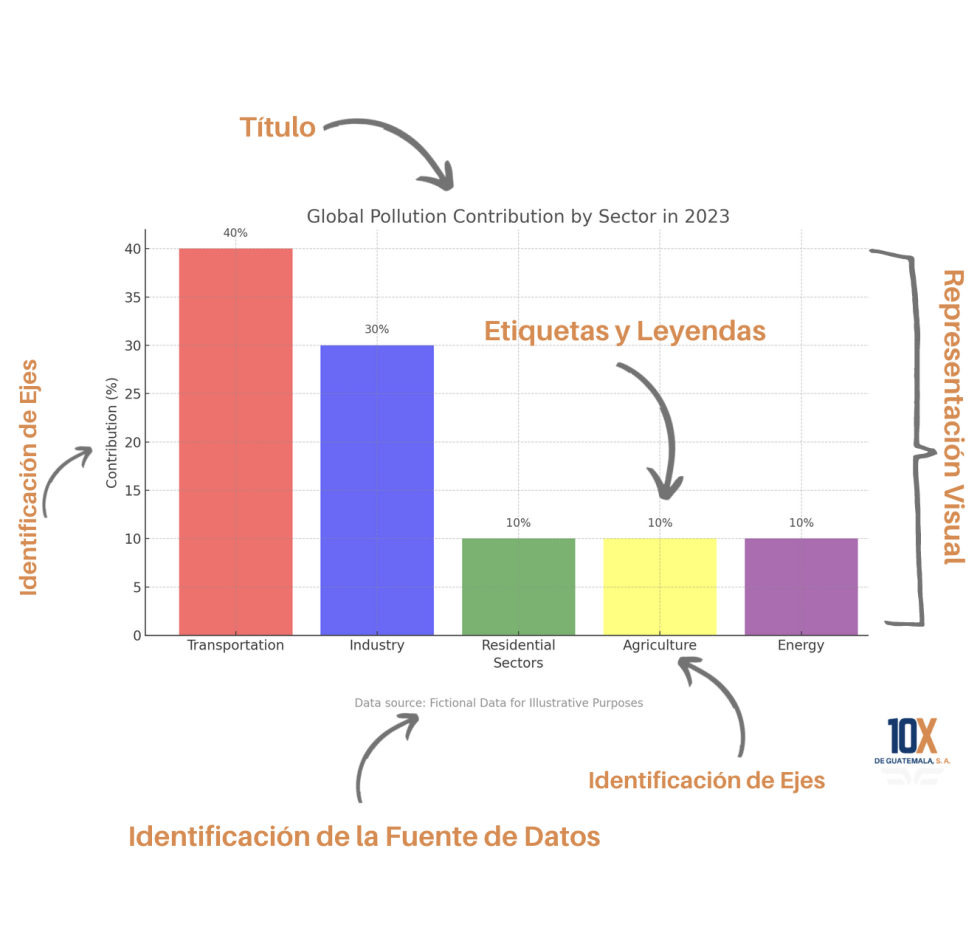

# Elementos Clave para una Presentación de Datos

Aquí profundizaremos en los elementos esenciales para una presentación efectiva de datos: títulos descriptivos, etiquetas claras, leyendas, identificación de ejes y representación visual apropiada. También abordaremos la importancia de citar las fuentes de los datos para mejorar la credibilidad y generar confianza con el público. Este módulo proporciona las herramientas necesarias para maximizar el impacto de tus visualizaciones y transmitir mensajes claros.

## Elementos Clave

### 1. Títulos Descriptivos

Un buen título es como un resumen que le dice al espectador de qué trata el gráfico. Debe ser claro y directo para que el público entienda de inmediato el mensaje principal.

### 2. Etiquetas y Leyendas Claras

Las etiquetas ayudan a explicar qué representa cada parte del gráfico, y las leyendas aclaran qué significan los colores o símbolos. Esto facilita que cualquier persona pueda entender el gráfico sin mucho esfuerzo.

### 3. Representación Visual Apropiada

Cada tipo de gráfico tiene un propósito específico. Por ejemplo, los gráficos de barras son ideales para comparar cantidades, mientras que los gráficos de líneas muestran cambios a lo largo del tiempo. Elegir el gráfico adecuado asegura que el mensaje sea claro.

### 4. Identificación de Ejes

Los ejes de un gráfico deben estar claramente etiquetados para evitar malentendidos. Esto significa especificar qué representan los números o categorías en el eje horizontal y vertical.

### 5. Citar Fuentes de Datos

Es importante mostrar de dónde provienen los datos para que la audiencia confíe en la información. Citar las fuentes añade transparencia y credibilidad a la presentación.

:::info Hechos y Referencias Interesantes

- Las personas recuerdan el 65% de la información visual hasta tres días después, en comparación con el 10% de la información escuchada (Brain Rules por John Medina).
- Los gráficos de barras y los gráficos circulares son las representaciones más efectivas para comparar datos (The Visual Display of Quantitative Information por Edward Tufte).

:::
