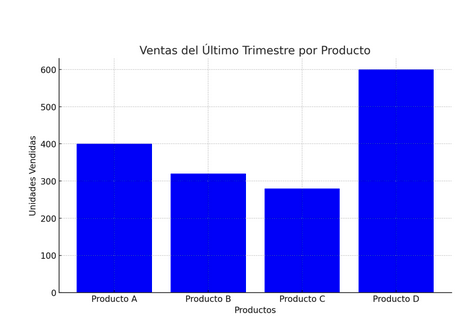
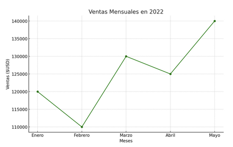
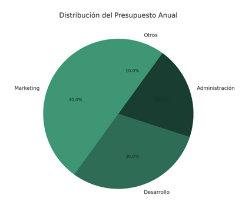
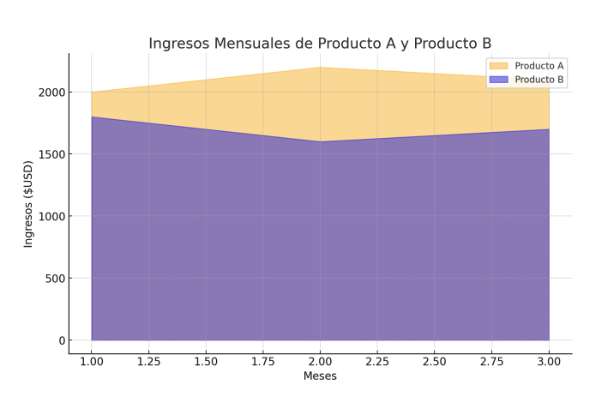
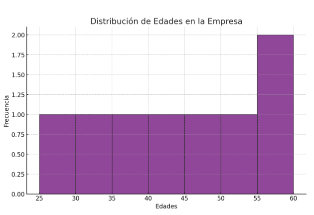

# Tipos de Gráficos

La selección del tipo de gráfico correcto es esencial para comunicar de manera efectiva el mensaje de los datos. Cada tipo de gráfico tiene un propósito particular y puede ser más adecuado dependiendo del contexto y del tipo de información que desees presentar. A continuación, veremos algunos de los tipos de gráficos más comunes y sus características clave

## Gráficos de Barras

El propósito de este tipo de gráficos es comparar cantidades entre diferentes categorías. Son ideales cuando se desea mostrar diferencias claras entre grupos.

- Ejemplo: Supongamos que tenemos datos de ventas de diferentes productos para el último trimestre:
  - •Producto A: 400 unidades
  - •Producto B: 320 unidades
  - •Producto C: 280 unidades
  - •Producto D: 600 unidades

    

    Los gráficos de barras permiten ver de un vistazo qué productos se vendieron mejor que otros. En este caso, podemos ver que el Producto D fue el más vendido.

## Gráficos de Líneas

El propósito de este tipo de gráficos es mostrar tendencias y cambios a lo largo del tiempo. Son útiles para visualizar cómo evolucionan los datos en periodos continuos.

- Ejemplo: Supongamos que tenemos datos de ventas mensuales para el año 2022:
  - •Enero: $120,000
  - •Febrero: $110,000
  - •Marzo: $130,000
  - •Abril: $125,000
  - •Mayo: $140,000

    

    En este gráfico, podemos observar cómo las ventas fluctúan cada mes. Este tipo de gráfico es ideal para identificar patrones, como aumentos o caídas estacionales.

## Gráficos Circulares (Pie Charts)

El propósito de este tipo de gráficos es mostrar la proporción de partes de un todo. Son útiles cuando se desea mostrar cómo se distribuye un conjunto total en diferentes componentes.

- Ejemplo: Supongamos que el presupuesto anual de una empresa se distribuye de la siguiente manera:
  - •Marketing: 40%
  - •Desarrollo: 30%
  - •Administración: 20%
  - •Otros: 10%

    

    Los gráficos circulares permiten visualizar qué proporción del presupuesto se asigna a cada área. En este ejemplo, podemos ver que la mayor parte del presupuesto se destina a Marketing.

## Gráficos de Área

El propósito de este tipo de gráficos es mostrar la magnitud y tendencia de una o más series a lo largo del tiempo, similar a los gráficos de líneas, pero enfatizando el volumen.

- Ejemplo: Supongamos que tenemos datos de ingresos mensuales para dos productos durante el primer trimestre:
  - •Producto A: [2000,2200,2100] [2000,2200,2100]
  - •Producto B: [1800,1600,1700] [1800,1600,1700]

    

    Los gráficos de área permiten comparar cómo evolucionan los ingresos de los productos a lo largo del tiempo, mostrando claramente las diferencias en magnitud y tendencia.

## Histogramas

El propósito de este tipo de gráficos es mostrar la distribución de una variable numérica, permitiendo visualizar cómo los datos se agrupan en diferentes rangos.

- Ejemplo: Supongamos que tenemos datos de edades en una empresa:
  - Edades: [25,30,35,40,45,50,55,60] [25,30,35,40,45,50,55,60]

  

    El propósito de este tipo de gráficos es mostrar la distribución de una variable numérica, permitiendo visualizar cómo los datos se agrupan en diferentes rangos.
