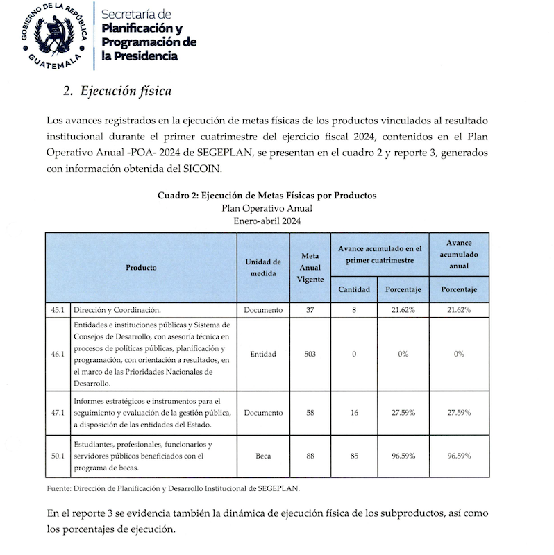
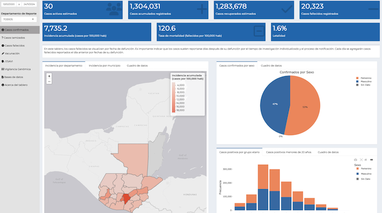

# Informes y Tableros (Dashboard)

Los informes y los tableros (dashboards) son herramientas fundamentales en el ámbito empresarial y de la inteligencia de negocio. Mientras que los informes permiten una revisión detallada y estructurada de datos históricos para la toma de decisiones estratégicas, los tableros brindan una visión en tiempo real de las métricas clave que ayudan a monitorear el rendimiento de diversas actividades. Ambos cumplen roles complementarios para asegurar que los responsables puedan entender la situación actual y planificar de manera efectiva.

## Informes

Un informe es un documento estructurado que recopila y presenta datos e información de manera organizada para un propósito específico. Puede ser tanto en formato digital como impreso. Los informes permiten analizar información detallada, identificar tendencias y comparar resultados con metas previamente establecidas.

- Ejemplo de Informe Financiero: Supongamos que una empresa quiere evaluar su rendimiento financiero del último trimestre. El informe podría incluir secciones como ingresos, gastos, utilidades netas y comparaciones con trimestres anteriores. Esto proporcionaría un panorama más completo sobre el estado financiero de la empresa y ayudaría a planificar acciones futuras.

- Informe de acceso público del SEGEPLAN Guatemala  [Informe Financiero de Rendición de Cuentas de Primer Cuatrimestre de 2024](https://www.minfin.gob.gt/images/downloads/informes_gestion/1cuatri24/segeplan1.pdf)

### Importancia de los informes

Los informes son fundamentales para la toma de decisiones ya que ofrecen una base sólida de datos. Por ejemplo, el informe financiero mencionado podría usarse para decidir futuras inversiones o recortes de presupuesto. Los informes también son clave para documentar el rendimiento de las áreas de la empresa y sirven como una herramienta de transparencia y comunicación, tanto interna como externa.

## Tableros (Dashboards)

Un tablero (Dashboard) es una herramienta gráfica que muestra métricas clave y KPIs (Indicadores Clave de Rendimiento) para monitorear el estado de una actividad específica en tiempo real. Los tableros suelen ser interactivos y permiten a los usuarios acceder rápidamente a la información más relevante.

- Ejemplo de Tablero de Ventas: Imagina un tablero que muestra las ventas diarias, ventas por empleado y el inventario actual. Este podría usarse en una tienda minorista para monitorear el rendimiento de los empleados y asegurarse de que el inventario esté alineado con la demanda.

- Ejemplo Tablero de COVID-19 del MSPAS de Guatemala

- Tablero de acceso público: [tablero de COVID-19 Guatemala](https://tableros.mspas.gob.gt/covid/)

### Importancia de los tableros

Los tableros son vitales para el monitoreo en tiempo real y la toma de decisiones ágil. Permiten visualizar métricas importantes al instante, lo cual es fundamental para reaccionar rápidamente ante cambios en el entorno. En el ejemplo anterior, si se observa que las ventas están bajando, se podrían tomar medidas inmediatas, como lanzar ofertas especiales o ajustar estrategias de marketing para impulsar las ventas. Los tableros también fomentan la transparencia en la organización, ya que los datos están disponibles de forma visible y accesible para todos los interesados.

## Diferencias clave entre informes y tableros

- Propósito: Los informes se enfocan en el análisis detallado y documentado de datos históricos, mientras que los tableros se enfocan en el monitoreo en tiempo real.
- Periodicidad: Los informes suelen generarse periódicamente (por ejemplo, mensual o trimestralmente), mientras que los tableros están disponibles continuamente y muestran datos en tiempo real.
- Detalle vs. Resumen: Los informes ofrecen una visión detallada, mientras que los tableros presentan una visión resumida de los indicadores clave.
- Ambas herramientas son complementarias y, cuando se usan juntas, permiten una mejor gestión y toma de decisiones dentro de la empresa.

## Glosario

**Informe** *(Report)* — documento estructurado con datos e información para análisis detallado y comunicación.

**Tablero** *(Dashboard)* — panel visual e interactivo que consolida métricas y KPIs en tiempo real.

**KPI** *(Key Performance Indicator)* — indicador clave que mide el desempeño contra una meta.

**Monitoreo en tiempo real** *(Real-time monitoring)* — observación continua de métricas para reaccionar con rapidez.

**Periodicidad** *(Reporting cadence)* — frecuencia con que se genera un informe (mensual, trimestral, etc.).

**Métrica** *(Metric)* — medida cuantitativa que describe el comportamiento de un proceso o resultado.

:::info Referencias primarias
- [Storytelling with Data](https://www.storytellingwithdata.com/) — guía de comunicación con datos.
- [Datawrapper Academy](https://academy.datawrapper.de/) — prácticas de dashboards e informes.
- [Microsoft · Power BI docs](https://learn.microsoft.com/en-us/power-bi/) — documentación oficial.
:::

---

### Bloque estructurado para agentes

**Objetivo:** decidir cuándo entregar un informe estructurado y cuándo un tablero interactivo para apoyar la toma de decisiones.

**Entradas:**
- Necesidad analítica (revisión detallada vs. monitoreo en tiempo real).
- Frecuencia de consulta esperada.
- Audiencia (ejecutiva, operativa, regulatoria).
- Datos históricos y en tiempo real disponibles.

**Pasos:**
1. Determinar si la decisión requiere análisis profundo de histórico o reacción inmediata.
2. Elegir informe para entregables periódicos con contexto y narrativa.
3. Elegir tablero para monitoreo continuo con KPIs interactivos.
4. Definir métricas clave y fuentes de datos para cada entregable.
5. Combinar ambos cuando el caso requiere detalle y monitoreo complementarios.
6. Revisar la adopción y ajustar la periodicidad o métricas según uso real.

**Salidas:**
- Informe o tablero diseñado para el caso específico.
- Catálogo de KPIs y métricas usados.
- Política de actualización y publicación.

**Errores comunes:**
- Presentar informes cuando la decisión requiere reacción en tiempo real.
- Construir tableros con métricas sin asociarlas a decisiones.
- No definir responsables de mantenimiento del tablero o informe.
- Duplicar datos entre informes y tableros con criterios distintos.

**Referencias cruzadas:**
- [2.2.2 Elementos Clave para una Presentación de Datos](./02-elementos-clave.md)
- [2.2.3 Tipos de Gráficos](./03-tipos-graficos.md)
- [2.1.5 Implementación de un Datamart como Alternativa](../introduccion-bi/05-datamart-alternativa.md)

