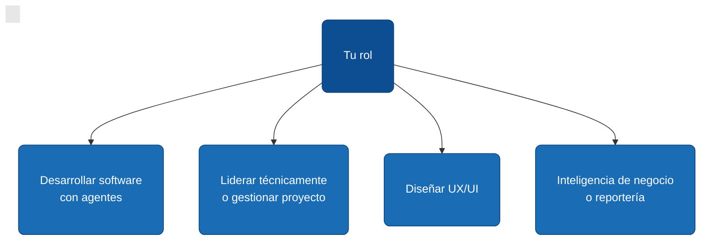

# Primer día

Bienvenido. Esta página existe para que tu primer día tenga una ruta clara: qué leer, en qué orden, y cuándo empezar a producir.

El bootcamp tiene seis rutas. **No las leas todas el primer día.** Encontrá tu rol abajo y seguí ese camino — el resto queda como referencia para consultar cuando el trabajo lo demande.

## Si vas a desarrollar software con agentes

La ruta más larga del primer día. Cuatro días de lectura, después tocás código.

**Día 1 — Fundamentos de colaboración con agentes:**

1. [6.1 Fundamentos de colaboración con agentes](./colaboracion-con-agentes-ia/01-fundamentos-colaboracion-agentes.md) — qué hace bien un agente y cuándo delegarle.
2. [6.2 Context engineering y CLAUDE.md](./colaboracion-con-agentes-ia/02-context-engineering-claude-md.md) — cómo se le da contexto a un agente.
3. [6.5 Diseño de prompts y verificación](./colaboracion-con-agentes-ia/05-diseno-de-prompts-y-verificacion.md) — cómo escribirle instrucciones que pueda verificar.

**Día 2 — Ciclo de vida del software con AIDLC 10X:**

4. [6.8 Ciclo de vida AIDLC 10X](./colaboracion-con-agentes-ia/08-ciclo-de-vida-aidlc-10x.md) — el ciclo de tres fases con gates humanos. Es **el sistema operativo del equipo**.
5. [6.9 Fase 1 · Concepción del release](./colaboracion-con-agentes-ia/09-fase-1-concepcion-del-release.md).
6. [6.10 Fase 2 · Construcción dirigida por release.md](./colaboracion-con-agentes-ia/10-fase-2-construccion-dirigida-por-release.md).
7. [6.11 Fase 3 · Operación con humano en el bucle](./colaboracion-con-agentes-ia/11-fase-3-operacion-con-humano-en-el-bucle.md).

**Día 3 — Calidad y seguridad:**

8. [6.12 Evaluaciones del trabajo del agente](./colaboracion-con-agentes-ia/12-evaluaciones-del-trabajo-del-agente.md) — cómo se valida lo que hace el agente sin revisar línea por línea.
9. [6.4 Seguridad al ejecutar herramientas externas](./colaboracion-con-agentes-ia/04-seguridad-en-herramientas-externas.md) — validación, ReDoS, timeouts.
10. [6.6 Seguridad de chatbots con IA](./colaboracion-con-agentes-ia/06-seguridad-de-chatbots.md) — prompt injection, exposición de datos.
11. [5.2 Versionado semántico en equipos](./documentacion-y-requerimientos/02-versionado-semantico-en-equipos.md) — base del versionado que asume el ciclo.

**Día 4 — Stack y arranque:**

12. [6.7 De specs a proyecto real](./colaboracion-con-agentes-ia/07-de-specs-a-proyecto-real.md) — cómo se arranca un proyecto desde un contrato.
13. [6.3 Arquitectura orientada a skills](./colaboracion-con-agentes-ia/03-arquitectura-orientada-a-skills.md) — cuándo encapsular tareas recurrentes en skills.
14. La sub-ruta del **stack que vas a tocar**, en [Desarrollo Web y Móvil](./desarrollo-web-y-movil/index.md): `.NET Core Web API`, `REST`, `SonarQube` (SAST), o `Modernización legacy`. Solo la que aplique al proyecto asignado.

**Día 5 — A producir:**

15. Cloná el repo del proyecto. Abrí su `CLAUDE.md`. Leé el `releases/vX.Y.Z.md` activo. Pareá con alguien del equipo en tus dos o tres primeros items; después operás solo con el agente.

## Si vas a liderar técnicamente o gestionar el proyecto

Tu día 1 es entender el ciclo de vida y los rituales del equipo. Sos quien conduce Concepción y aprueba los gates.

**Día 1 — Cómo se gestiona y se versiona:**

1. [4. Gestión ágil de proyectos](./gestion-proyectos/index.md) — fundamentos del proyecto, ciclo del proyecto, agilidad y Scrum.
2. [5. Documentación y Requerimientos](./documentacion-y-requerimientos/index.md) — versionado SemVer, CHANGELOG, manuales de usuario, trazabilidad requerimiento ↔ release.

**Día 2 — Cómo se construye con agentes bajo AIDLC 10X:**

3. [6.8 Ciclo de vida AIDLC 10X](./colaboracion-con-agentes-ia/08-ciclo-de-vida-aidlc-10x.md) — sistema operativo del equipo.
4. [6.9 Fase 1 · Concepción del release](./colaboracion-con-agentes-ia/09-fase-1-concepcion-del-release.md) — la fase que vos conducís.
5. [6.10 Fase 2 · Construcción](./colaboracion-con-agentes-ia/10-fase-2-construccion-dirigida-por-release.md) y [6.11 Fase 3 · Operación](./colaboracion-con-agentes-ia/11-fase-3-operacion-con-humano-en-el-bucle.md) — para entender qué supervisás y qué autorizás.
6. [6.12 Evaluaciones del trabajo del agente](./colaboracion-con-agentes-ia/12-evaluaciones-del-trabajo-del-agente.md) — el rol que asignás (eval champion) y la métrica que medís.

**Día 3 — Vocabulario técnico mínimo:**

7. [6.2 Context engineering y CLAUDE.md](./colaboracion-con-agentes-ia/02-context-engineering-claude-md.md).
8. [Desarrollo Web y Móvil — index](./desarrollo-web-y-movil/index.md) — para reconocer el vocabulario que usa el equipo.

A partir del día 4, tu trabajo es triage de backlog, redactar el primer `releases/vX.Y.Z.md` con tu equipo y conducir el primer gate.

## Si vas a diseñar UX/UI

Tu día 1 son los fundamentos del diseño centrado en el usuario y los sistemas de diseño. Después incorporás el mínimo de agentes para entregables.

**Día 1 — Fundamentos de diseño:**

1. [3.1 Fundamentos UX/UI](./diseno-ux-ui/fundamentos-ux-ui/index.md) — investigación, arquitectura de información, accesibilidad.
2. [3.2 Sistemas de diseño](./diseno-ux-ui/sistemas-de-diseno/index.md) — tokens, componentes, microcopy, handoff técnico.

**Día 2 — Diseñar para que un agente pueda implementarlo:**

3. [6.7 De specs a proyecto real](./colaboracion-con-agentes-ia/07-de-specs-a-proyecto-real.md) — entender cómo se traducen tus diseños a un contrato `specs.md`.
4. [6.2 Context engineering y CLAUDE.md](./colaboracion-con-agentes-ia/02-context-engineering-claude-md.md) — qué del diseño debe vivir en el repo para que el agente respete tus decisiones.

**Día 3 — Cómo se opera el equipo:**

5. [6.8 Ciclo de vida AIDLC 10X](./colaboracion-con-agentes-ia/08-ciclo-de-vida-aidlc-10x.md) — para entender en qué fase de cada release te involucran.

A partir del día 4, los entregables (briefs, screen specs, design tokens) viven en `examples-md/design/` del repo del producto.

## Si vas a hacer inteligencia de negocio o reportería

Tu día 1 es entender los fundamentos de BI y visualización; después agregás el mínimo de agentes para acelerar consultas y reportes.

**Día 1 — Fundamentos de BI:**

1. [2.1 Introducción a BI](./inteligencia-negocio/introduccion-bi/index.md) — principios de análisis y toma de decisiones.
2. [2.2 Introducción a visualización de datos](./inteligencia-negocio/introduccion-visualizacion-datos/index.md) — patrones de visualización que comunican.

**Día 2 — Trabajar con agentes para reportería:**

3. [6.1 Fundamentos de colaboración con agentes](./colaboracion-con-agentes-ia/01-fundamentos-colaboracion-agentes.md) — cuándo delegarle al agente y cuándo no.
4. [6.5 Diseño de prompts y verificación](./colaboracion-con-agentes-ia/05-diseno-de-prompts-y-verificacion.md) — cómo escribirle al agente para generar consultas y reportes correctos.

**Día 3 — Vocabulario del producto:**

5. [5.1 De la idea al release](./documentacion-y-requerimientos/01-de-la-idea-al-release.md) — para entender el ciclo del producto que reportás.

A partir del día 4, los reportes y dashboards se solicitan vía items del `releases/vX.Y.Z.md` que afecten al área de datos.

## Reglas mínimas de tu primer mes

Aplican a cualquier rol:

- **Una pregunta a la vez al agente.** Sin cuestionarios masivos.
- **Si te empuja a un default, preguntá por qué.** Lo que el agente no decide, lo decidís vos — no se asume.
- **Si dudás de un item del release, no lo implementes.** Volvé al lead. La ambigüedad en construcción se cobra triple en operación.
- **Marcá `[x]` solo cuando probaste.** El estado refleja lo que está hecho, no lo que está empezado.
- **Cada commit mapea a un item del release.** Si tu diff toca cosas que no están en el release, eso es scope creep — lo movés al `BACKLOG.md` antes del PR.

Bienvenido. Si algo de este bootcamp no está claro, decímelo — el bootcamp es un documento vivo y mejora con cada nuevo lector.

---

<AuthorCredit />
