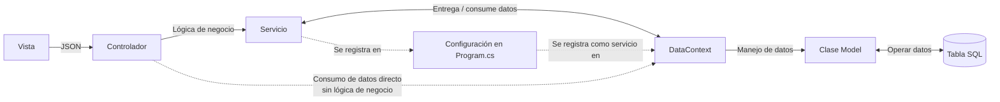

<!-- Destino sugerido: .claude/skills/estructura-proyecto-net.skill.md -->

---
name: estructura-proyecto-net
description: Establece y mantiene la estructura de un proyecto .NET 8 Web API con arquitectura modular — carpetas por dominio (`Modules/{Dominio}/{SubDominio}/`), capa común compartida (`Commons/`), módulo de autenticación aparte (`Auth/`), naming por rol (`XxxModel`, `XxxController`, `XxxService`, `XxxRequest`, `XxxResponse`), namespaces que reflejan la estructura de carpetas, y manejo disciplinado de paquetes NuGet.
---

# Skill: estructura-proyecto-net

Un proyecto .NET que arranca con `dotnet new webapi` y nunca se organiza termina con cuarenta controladores sueltos en la raíz, modelos mezclados con DTOs, dos `ClienteService` que hacen cosas distintas, y un equipo que pasa el primer año buscando dónde poner lo nuevo. El otro extremo — Clean Architecture con ocho proyectos separados y referencias cruzadas el día 1 — genera overhead de mantenimiento antes de que el producto tenga dos clientes reales. Este skill existe para el punto medio con evidencia de producción: **un solo proyecto, carpetas por dominio, namespaces que reflejan carpetas, naming por rol, y capa común con sub-arquitectura**. No es arquitectura académica; es una referencia pública de organización para APIs modulares que necesitan sostener varios dominios de negocio sin volverse una bola de pelo.

## Cuándo invocarme

Úsame cuando:
- Se arranca un proyecto .NET Web API nuevo y hay que establecer la estructura antes del primer commit de lógica.
- Se reorganiza un proyecto existente que creció orgánicamente y necesita disciplina de carpetas/naming.
- Se va a agregar un módulo de negocio nuevo (ej. `Facturacion`, `Compras`) y hay que decidir dónde vive cada pieza.
- Se auditan controladores/servicios/DTOs existentes contra las convenciones del proyecto.

**No me uses para:**
- Decidir **qué hace** un endpoint (para eso: `nuevo-endpoint-rest-net`).
- Decidir **qué patrón** aplicar cuando un servicio crece (para eso: `patrones-diseno-net`).
- Definir el schema de una entidad (para eso: `nueva-entidad-ef-core`).
- Migrar a Clean Architecture multi-proyecto — esa decisión la toma el arquitecto, no un skill; este skill asume proyecto único.

## Entradas

1. **Nombre del proyecto** en formato `Empresa.Api.Dominio` (ej. `DiezX.Api.Clientes`) — define el namespace raíz y el `.csproj`.
2. **Lista de dominios de negocio** conocidos al día 1 (ej. `Compras`, `Clientes`, `Inventario`, `Nomina`, `RRHH`, `Finanzas`).
3. **Existencia de autenticación** — si sí, `Auth/` como módulo aparte con su propio `DbContext`.
4. **Convenciones específicas del proyecto** si existen (CLAUDE.md / AGENTS.md del repo).

Si el proyecto no tiene `CLAUDE.md`, este skill genera la estructura base y registra las decisiones al final para que se archiven allí.

## Reglas obligatorias

- **Un solo `.csproj` hasta que el dolor justifique la división.** Multi-proyecto se introduce cuando hay un motivo concreto (librería reutilizable, binario separable), no "por limpieza".
- **Namespaces reflejan carpetas.** Si el archivo vive en `Modules/Compras/OrdenCompra/Services/`, su namespace es `{Raíz}.Modules.Compras.OrdenCompra.Services`. Sin excepción — facilita que cualquiera lo ubique por namespace.
- **Una clase por archivo, archivo = nombre de la clase.** `OrdenCompraService.cs` contiene `OrdenCompraService`, nada más.
- **Sufijos por rol, obligatorios.** `XxxModel`, `XxxController`, `XxxService`, `XxxRequest`, `XxxResponse`, `XxxBuilder`, `XxxStrategy`, `XxxFactory`, `XxxDto` (cuando no es Request ni Response). El sufijo es el contrato con lectores y con agentes.
- **Módulos por dominio de negocio, no por capa.** `Modules/Compras/OrdenCompra/{Controllers,Services,Dtos}` manda sobre `Controllers/Compras/...` + `Services/Compras/...`. Cohesión por dominio, no por tipo de archivo.
- **Capa común con sub-arquitectura explícita.** `Commons/` no es cajón de sastre — tiene `Application/`, `Data/`, `Infrastructure/`, `Presentation/`, `Services/`, `Constants/`, `Enums/`, `Utilities/`.
- **Modelos EF Core centralizados** en `Commons/Data/Models/` cuando comparten un solo `DbContext`. Un modelo por archivo.
- **Paquetes NuGet con versión fijada.** Nada de rangos `*` o `latest`. La reproducibilidad es tan importante acá como en `package.json`.
- **Dependencias internas (ej. librerías de la compañía) referenciadas con versión explícita,** no via `project reference` a menos que se esté editando la librería en paralelo.

## Flujo de ejecución

La estructura de carpetas no es decorativa — refleja el flujo de una petición HTTP en runtime. Antes de mover archivos o crear carpetas nuevas, hay que entender cómo viaja un request desde el navegador hasta la tabla SQL y cómo vuelve la respuesta.



Diagrama canónico del módulo [1.2.1 Arquitectura de backend](../../../../docs/desarrollo-web-y-movil/net-core-web-api/01-arquitectura-de-backend.md). Lectura en prosa:

1. **Vista → Controlador** (flecha llena): el cliente (SPA, app móvil, otro servicio) envía un request HTTP con cuerpo JSON. El controlador deserializa al DTO de request.
2. **Controlador → Servicio** (flecha llena, flujo principal): el controlador delega al servicio cuando hay lógica de negocio (validaciones cruzadas, cálculos, efectos secundarios, múltiples operaciones). Implementado en [`nuevo-endpoint-rest-net`](./nuevo-endpoint-rest-net.skill.md) §Decisión.
3. **Servicio ↔ DataContext** (flecha doble): el servicio usa el `DbContext` (EF Core) para leer/escribir datos, aplicando reglas antes y después.
4. **DataContext → Clase Model** (flecha llena): EF Core materializa filas de la tabla como instancias de la clase `XxxModel`.
5. **Clase Model ↔ Tabla** (flecha doble): las operaciones de EF Core (`SaveChanges`, queries LINQ) se traducen a SQL y ejecutan contra la tabla. El mapeo lo define [`nueva-entidad-ef-core`](./nueva-entidad-ef-core.skill.md).
6. **Controlador → DataContext directo** (flecha punteada, flujo alternativo): atajo permitido **solo** cuando no hay reglas de negocio, la operación es única y el mapeo DTO ↔ entidad es uno a uno. Típicamente lectura de catálogos estáticos (`GET /api/paises`). Si duda, usa el flujo principal.
7. **Configuración en Program.cs** (flechas punteadas hacia arriba): tanto el `Servicio` como el `DataContext` se registran en el contenedor DI durante el bootstrap. Los métodos de extensión en `Extensions/` encapsulan los `services.AddScoped<>()` y `services.AddDbContext<>()`.

Regla derivada: **cada flecha del diagrama corresponde a una carpeta del árbol**. El controlador vive en `Modules/{Dominio}/{SubDominio}/Controllers/`; el servicio en `Services/`; el model en `Commons/Data/Models/`; el DbContext en `Commons/Data/Persistence/`; el registro en DI en `Extensions/ServiceCollectionExtensions.cs`. Si al implementar un endpoint no sabe dónde va un archivo, identifique primero qué flecha del diagrama representa.

**Valor para el agente:** el diagrama es el contrato de cómo fluye una petición. Si un agente genera un controlador que llama a otro controlador, o un servicio que expone un endpoint HTTP, violó el flujo — y esa violación es detectable leyendo el diagrama antes que el código.

## Árbol de referencia

```
{Empresa}.Api.{Dominio}/
├── {Empresa}.Api.{Dominio}.csproj         # Único proyecto
├── {Empresa}.Api.{Dominio}.sln            # Solution (conveniencia para IDEs)
├── Program.cs                              # Entrypoint + bootstrapping
├── appsettings.json
├── appsettings.Development.json
├── appsettings.Production.json
├── CLAUDE.md                               # Convenciones para agentes
├── README.md
├── CHANGELOG.md
│
├── Auth/                                   # Módulo de autenticación aparte
│   ├── Controllers/
│   ├── Services/
│   ├── Models/                             # Entidades EF del contexto Auth
│   ├── Dtos/
│   ├── Persistence/                        # DbContext de Auth
│   ├── Configurations/                     # Mensajes, configs específicas
│   └── Utils/
│
├── Commons/                                # Capa compartida con sub-arquitectura
│   ├── Application/
│   │   ├── Builders/                       # Builder pattern
│   │   ├── Strategies/                     # Strategy pattern
│   │   │   └── FilterStrategies/
│   │   ├── Services/                       # Servicios reutilizables de aplicación
│   │   └── Validators/                     # FluentValidation
│   ├── Data/
│   │   ├── Models/                         # Entidades EF (negocio)
│   │   ├── Enums/
│   │   └── Persistence/                    # DbContext principal
│   ├── Infrastructure/
│   │   ├── Modules/                        # Gestión de módulos (multi-tenant)
│   │   ├── ModuleManagement/
│   │   └── Notifications/                  # Email, push, etc.
│   ├── Presentation/
│   │   ├── Controllers/                    # Controladores comunes (Health, etc.)
│   │   ├── Conventions/                    # ApiConventions de Swagger
│   │   └── Dtos/                           # Request/Response compartidos
│   ├── Services/                           # Servicios transversales (Factory, etc.)
│   ├── StateMachine/                       # Motor genérico de máquinas de estado
│   ├── Constants/                          # Constantes (msg, límites, claves)
│   ├── Enums/                              # Enums transversales
│   └── Utilities/                          # Utilitarios (Date, Parser, Converter)
│
├── Modules/                                # Módulos de negocio por dominio
│   ├── Compras/
│   │   ├── OrdenCompra/
│   │   │   ├── Controllers/
│   │   │   │   └── OrdenCompraController.cs
│   │   │   ├── Services/
│   │   │   │   └── OrdenCompraService.cs
│   │   │   └── Dtos/
│   │   │       ├── OrdenCompraRequest.cs
│   │   │       └── OrdenCompraResponse.cs
│   │   └── Proveedores/
│   │       ├── Controllers/
│   │       ├── Services/
│   │       └── Dtos/
│   ├── Finanzas/
│   │   └── Cotizador/
│   │       ├── Controllers/
│   │       ├── Services/
│   │       │   └── ScenarioBuilders/       # Builders específicos del módulo
│   │       ├── StateMachine/               # Máquina de estados del módulo
│   │       ├── Models/                     # Modelos específicos (si no están en Commons/Data)
│   │       ├── Dtos/
│   │       ├── Constants/
│   │       └── Utilities/
│   ├── RRHH/
│   ├── Nomina/
│   ├── Inventario/
│   ├── Clientes/
│   └── Catalogos/
│
├── Extensions/                             # Extensiones de Program.cs
│   ├── ServiceCollectionExtensions.cs      # DI registration
│   └── ApplicationBuilderExtensions.cs     # Pipeline de middleware
│
├── Database/                               # Scripts SQL
│   └── migrations/
│       ├── v1.0.0/
│       │   ├── ddl.sql
│       │   └── dml.sql
│       └── v1.1.0/
│
├── Resources/                              # Plantillas, assets embebidos
│   └── Notifications/                      # Plantillas de email
│
└── Properties/
    └── launchSettings.json
```

## Pasos

### Paso 1: Definir el namespace raíz y el nombre del proyecto

Formato: `{Empresa}.Api.{Dominio}`. Ejemplo: `DiezX.Api.Clientes`.

- Mal: `ClientesApi` (sin empresa → colisiona en NuGet si llega a publicarse).
- Mal: `api-clientes` (kebab-case → no es válido en C#; el assembly no puede llamarse así limpio).
- Bien: `DiezX.Api.Clientes` → assembly `DiezX.Api.Clientes.dll`, namespace raíz idéntico, archivo `.csproj` homónimo.

Registrar en `.csproj`:

```xml
<PropertyGroup>
  <TargetFramework>net8.0</TargetFramework>
  <Nullable>enable</Nullable>
  <ImplicitUsings>enable</ImplicitUsings>
  <Version>1.0.0</Version>
  <Product>Clientes API</Product>
  <Company>10X de Guatemala S.A.</Company>
  <GenerateDocumentationFile>true</GenerateDocumentationFile>
  <NoWarn>$(NoWarn);1591</NoWarn>
</PropertyGroup>
```

**Valor para el agente:** el namespace raíz es la convención que todo `using` del proyecto respeta. Un archivo cuyo namespace no empieza con la raíz delata un problema de estructura.

### Paso 2: Crear el esqueleto de carpetas antes del primer feature

Orden de creación:

1. `Auth/` si hay autenticación.
2. `Commons/` con las sub-carpetas base (`Application/`, `Data/`, `Infrastructure/`, `Presentation/`, `Services/`, `Constants/`, `Enums/`, `Utilities/`).
3. `Modules/` vacío (las sub-carpetas por dominio se crean con el primer feature de cada dominio).
4. `Extensions/` con `ServiceCollectionExtensions.cs` vacío listo para registrar DI.
5. `Database/migrations/` con la carpeta de la versión inicial.
6. `Resources/` solo si hay plantillas embebidas.

Cada carpeta vacía lleva `.gitkeep` hasta que tenga archivos reales.

- Mal: crear `Modules/Compras/` antes de tener un feature de Compras. Se queda vacía y confunde.
- Bien: crear `Modules/` sola y agregar `Modules/Compras/` cuando llegue el primer endpoint de Compras.

**Valor para el agente:** la estructura refleja lo que existe, no lo que podría existir. Agrega carpetas conforme llega la lógica, no en especulación.

### Paso 3: Ubicar cada tipo de archivo según su rol

| Rol | Carpeta | Sufijo de clase | Ejemplo |
|---|---|---|---|
| Endpoint HTTP | `{Area}/{Dominio}/Controllers/` | `Controller` | `OrdenCompraController` |
| Lógica de negocio | `{Area}/{Dominio}/Services/` | `Service` | `OrdenCompraService` |
| Request DTO | `{Area}/{Dominio}/Dtos/` | `Request` | `CrearOrdenCompraRequest` |
| Response DTO | `{Area}/{Dominio}/Dtos/` | `Response` | `OrdenCompraResponse` |
| DTO de filtro/consulta | `{Area}/{Dominio}/Dtos/` | `FilterDto` / `QueryDto` | `OrdenCompraFilterDto` |
| Entidad EF (negocio) | `Commons/Data/Models/` | `Model` | `OrdenCompraModel` |
| Entidad EF (auth) | `Auth/Models/` | `Model` | `UsuarioModel` |
| Enum transversal | `Commons/Enums/` | (ninguno) | `Estado`, `TipoDocumento` |
| Enum específico | `Modules/{Dominio}/{SubDominio}/` o `Commons/Data/Enums/` | (ninguno) | `EstadoOrdenCompra` |
| Builder | `Commons/Application/Builders/` o `Modules/{Dominio}/Services/ScenarioBuilders/` | `Builder` | `CotizacionBuilder` |
| Strategy | `Commons/Application/Strategies/` | `Strategy` | `EstadoFilterStrategy` |
| Factory | `Commons/Services/` | `Factory` | `ServicioNegocioFactory` |
| Máquina de estados | `Modules/{Dominio}/StateMachine/` | `MaquinaEstados` | `CotizacionMaquinaEstados` |
| Validador FluentValidation | `Commons/Application/Validators/` o por módulo | `Validator` | `OrdenCompraValidator` |
| DbContext | `Commons/Data/Persistence/` o `Auth/Persistence/` | `DataContext` | `MysqlDataContext`, `MysqlDataContextAuth` |
| Mensajes estáticos | `{Area}/Configurations/` | `Msg` | `ModulesMsg`, `AuthMsg` |
| Extension methods | `Extensions/` o `Commons/Utilities/` | `Extensions` | `ServiceCollectionExtensions` |

- Mal: `ClienteDto.cs` con tres clases adentro (`ClienteRequest`, `ClienteResponse`, `ClienteFilterDto`). Un archivo ≠ tres clases.
- Bien: tres archivos, un sufijo cada uno, cada uno con su namespace.

**Valor para el agente:** el sufijo + la carpeta son un contrato de ubicación. Al buscar "dónde va el response de Cliente", la respuesta es unívoca: `Modules/Clientes/Dtos/ClienteResponse.cs`.

### Paso 4: Reglas de naming por tipo

- **Identificadores en C#** siempre en `PascalCase` para clases, propiedades, métodos públicos; `camelCase` para parámetros y variables locales; `_camelCase` para campos privados de instancia.
- **Interfaces** con prefijo `I`: `IFilterStrategy`, `IEventHandler`.
- **Enums** en `PascalCase`, valores también en `PascalCase`: `enum Estado { Activo, Inactivo, Eliminado }`.
- **Nombres en español para entidades de dominio** (cuando el dominio es español): `ClienteModel`, `OrdenCompraService`. No traducir "Cliente" a "Customer" si el resto del dominio es español — genera fricción.
- **Nombres en inglés para infraestructura técnica**: `ServiceCollectionExtensions`, `DateUtil`, `FilterContext`. Convención de la comunidad .NET.
- **Tablas y columnas SQL en `snake_case`** (mapeadas con `[Table("clientes")]` y `[Column("nombre_comun")]`), detalle cubierto en [`nueva-entidad-ef-core`](./nueva-entidad-ef-core.skill.md).

- Mal: `IClienteService` en `Modules/Clientes/Services/ClienteService.cs`. La interfaz va en su propio archivo `IClienteService.cs`.
- Bien: `IClienteService.cs` + `ClienteService.cs`, ambos en la misma carpeta, mismo namespace.

**Valor para el agente:** naming consistente es búsqueda predecible. `grep "class.*Service"` devuelve todos los servicios; `grep "interface I"` todas las interfaces.

### Paso 5: Distinguir `Auth/`, `Commons/` y `Modules/` — qué va dónde

- **`Auth/`**: todo lo que conoce el modelo de usuario/rol/empresa y el `DbContext` de autenticación. Tiene su propio `MysqlDataContextAuth` porque su ciclo de vida es distinto al del negocio (migraciones, respaldo).
- **`Commons/`**: código transversal que al menos dos módulos usan. Si solo un módulo lo usa, **no** va en Commons — va en el módulo. Regla de los dos consumidores.
- **`Modules/{Dominio}/`**: lógica específica del dominio de negocio. Un módulo no conoce otro módulo directamente — se comunica vía servicios de `Commons/` o eventos, no llamando `Modules.Compras.OrdenCompraService` desde `Modules.Inventario`.

- Mal: crear `Commons/Services/OrdenCompraService.cs`. Es específico de Compras, va en `Modules/Compras/OrdenCompra/Services/`.
- Bien: `Commons/Services/CatalogoServiceBase.cs` — lo usan Catálogos, Productos, Tipos de Servicio, múltiples consumidores.

**Valor para el agente:** la regla de los dos consumidores evita que `Commons/` se convierta en cajón de sastre. Cuando duden, preguntar: ¿quién más usa esto? Si la respuesta es "nadie", no va en Commons.

### Paso 6: Registrar paquetes NuGet con disciplina

En `.csproj`, agrupar las referencias y fijar versión exacta:

```xml
<ItemGroup>
  <!-- Librería interna -->
  <PackageReference Include="DiezX.Api.Commons" Version="1.11.1" />

  <!-- Framework -->
  <PackageReference Include="Microsoft.AspNetCore.OpenApi" Version="8.0.0" />
  <PackageReference Include="Microsoft.EntityFrameworkCore" Version="8.0.1" />
  <PackageReference Include="Pomelo.EntityFrameworkCore.MySql" Version="8.0.0" />

  <!-- Validación y mapeo -->
  <PackageReference Include="FluentValidation.AspNetCore" Version="11.3.1" />
  <PackageReference Include="AutoMapper.Extensions.Microsoft.DependencyInjection" Version="12.0.1" />

  <!-- Observabilidad -->
  <PackageReference Include="Serilog.AspNetCore" Version="8.0.2" />

  <!-- Docs -->
  <PackageReference Include="Swashbuckle.AspNetCore" Version="6.9.0" />

  <!-- Seguridad -->
  <PackageReference Include="BCrypt.Net-Next" Version="4.0.3" />
</ItemGroup>
```

- Mal: `Version="8.*"` o no especificar versión. `dotnet restore` resuelve distinto según el día.
- Bien: versión exacta `8.0.1`. Cualquier bump es un cambio explícito con commit dedicado.

Antes de agregar un paquete, confirmar:

1. ¿Ya existe uno equivalente en la lista? (Evitar `Newtonsoft.Json` si ya se usa `System.Text.Json`).
2. ¿La librería interna (`DiezX.Api.Commons` u otra de la empresa) ya cubre la funcionalidad?
3. ¿El paquete es mantenido? (Último release < 2 años, no archivado).

**Valor para el agente:** una lista de dependencias auditable es una lista pequeña. El review humano detecta paquetes sospechosos cuando la lista cabe en la pantalla.

### Paso 7: Registrar la inyección de dependencias en `Extensions/`

`Program.cs` debe quedar corto. La configuración vive en `Extensions/ServiceCollectionExtensions.cs`:

```csharp
// Program.cs
var builder = WebApplication.CreateBuilder(args);
builder.Services.AddClientesApi(builder.Configuration);
var app = builder.Build();
app.UseClientesApi();
app.Run();
```

```csharp
// Extensions/ServiceCollectionExtensions.cs
public static IServiceCollection AddClientesApi(this IServiceCollection services, IConfiguration config)
{
    services.AddAuthModule(config);
    services.AddCommonsInfrastructure(config);
    services.AddBusinessModules();
    return services;
}
```

Cada área (Auth, Commons, Modules) expone su propio método de extensión. Un módulo nuevo registra sus servicios en su propio método (`AddComprasModule()`) y se llama desde `AddBusinessModules()`.

- Mal: un solo `Program.cs` con cien líneas de `services.AddScoped<...>()`. Imposible de revisar sin scroll.
- Bien: `Program.cs` de diez líneas que llama a `AddClientesApi()`; cada módulo sabe qué registrar.

**Valor para el agente:** el bootstrapping modular permite que un módulo nuevo entre con un solo cambio en `Extensions/` — sin tocar código de otros módulos.

### Paso 8: Documentar las decisiones en `CLAUDE.md`

Al cerrar el scaffolding, agregar (o crear) `CLAUDE.md` con:

1. Nombre del proyecto y namespace raíz.
2. Árbol de carpetas con una línea por área explicando su propósito.
3. Tabla de sufijos obligatorios (rol → sufijo).
4. Regla de los dos consumidores para `Commons/`.
5. Convenciones de naming (C# vs SQL, español vs inglés).
6. Lista de paquetes NuGet "canónicos" (los aprobados; agregar otros requiere decisión explícita).
7. Link a este skill como fuente del contrato.

**Valor para el agente:** el `CLAUDE.md` materializa el contrato. Cualquier agente que llegue al repo después lee esas reglas antes de tocar código.

## Antes de entregar, verifico

- [ ] Un solo `.csproj` con nombre `{Empresa}.{Producto}.Api` y namespace raíz idéntico.
- [ ] `Auth/`, `Commons/`, `Modules/`, `Extensions/`, `Database/` creadas y con propósito claro.
- [ ] `Commons/` sub-dividido en `Application/`, `Data/`, `Infrastructure/`, `Presentation/`, `Services/`, `Constants/`, `Enums/`, `Utilities/`.
- [ ] Sufijos obligatorios aplicados a todo archivo creado (Model / Controller / Service / Request / Response / Builder / Strategy / Factory / MaquinaEstados).
- [ ] Namespaces reflejan carpetas sin excepción.
- [ ] Una clase por archivo; nombre del archivo = nombre de la clase.
- [ ] Paquetes NuGet con versión fijada (no rangos, no `latest`).
- [ ] `Program.cs` corto — la configuración vive en `Extensions/`.
- [ ] `CLAUDE.md` presente con convenciones del proyecto.
- [ ] Ningún archivo quedó sin carpeta por defecto en la raíz (salvo `Program.cs`, `*.csproj`, `*.sln`, `appsettings.*.json`).

## Errores comunes

- **Carpetas por capa en lugar de por dominio** (`Controllers/` + `Services/` + `Models/` en la raíz). Al tercer dominio es imposible encontrar código por feature; hay que navegar tres carpetas para entender un flujo.
- **`Commons/` cajón de sastre.** Todo lo que "parece compartido" termina ahí aunque un solo módulo lo use. Regla de los dos consumidores: si no hay dos, no va en Commons.
- **Falta de sufijos** (`ClienteDto` sin distinguir Request/Response/Filter; `Cliente` a secas sin `Model`). El lector tiene que abrir el archivo para saber qué rol cumple.
- **Múltiples clases por archivo** porque "son pequeñas". Mañana crecen y nadie las separa; `grep` por clase deja de funcionar.
- **Namespaces desalineados con carpetas.** El archivo se mueve de carpeta y el namespace no se actualiza; Rider/VS no lo detectan; el `using` queda roto o ambiguo.
- **Paquetes NuGet con rango de versión (`^8.0.0`, `*`).** Un `dotnet restore` en CI puede traer `8.0.2` el lunes y `8.0.3` el martes con un bug nuevo.
- **Multi-proyecto prematuro** (`Core/`, `Infrastructure/`, `Api/` el día 1 sin necesidad real). Agrega referencias cruzadas, builds más lentos y mental overhead que el producto no necesita hasta la versión 2.
- **Módulos de negocio que se llaman entre sí directamente.** `Inventario` consume `Compras.OrdenCompraService` → acoplamiento peligroso. La comunicación entre módulos va por `Commons/` (servicios transversales) o eventos.
- **Modelos EF dispersos por módulo** cuando hay un solo `DbContext`. Resultado: el DbContext importa desde diez ubicaciones y los modelos se duplican. Centralizar en `Commons/Data/Models/`.
- **Nombres en Spanglish** (`ClienteController` con método `GetCliente()` que retorna `ClienteResponse`). Elegir idioma por dominio y respetarlo.

## Glosario

**Namespace raíz** *(Root namespace)* — prefijo común de todos los namespaces del proyecto (ej. `DiezX.Api.Clientes`). Debe coincidir con el nombre del assembly y del `.csproj`.

**Módulo de negocio** *(Business module)* — carpeta bajo `Modules/` que agrupa toda la lógica de un dominio (Compras, RRHH, Finanzas). Tiene su propio `Controllers/`, `Services/`, `Dtos/`.

**Regla de los dos consumidores** *(Two-consumer rule)* — política interna: para que un tipo viva en `Commons/` debe tener al menos dos módulos que lo consuman. Evita que `Commons/` se vuelva cajón de sastre.

**Sufijo por rol** *(Role suffix)* — convención de agregar `Model`, `Controller`, `Service`, `Request`, `Response`, etc. al nombre de la clase para identificar su propósito sin abrir el archivo.

**Sub-arquitectura de Commons** *(Commons sub-architecture)* — división interna de `Commons/` en `Application/`, `Data/`, `Infrastructure/`, `Presentation/`, `Services/`, que refleja capas de la aplicación sin imponer multi-proyecto.

**Extension methods de bootstrap** *(Bootstrap extension methods)* — métodos en `Extensions/ServiceCollectionExtensions.cs` que encapsulan el `services.AddXxx()` de cada módulo; permiten que `Program.cs` quede corto y modular.

:::info Referencias primarias
- [Microsoft — Common web application architectures](https://learn.microsoft.com/en-us/dotnet/architecture/modern-web-apps-azure/common-web-application-architectures) — referencia oficial sobre arquitecturas .NET (monolítica, clean, microservices); este skill adopta la modular monolítica.
- [Microsoft — C# Coding Conventions](https://learn.microsoft.com/en-us/dotnet/csharp/fundamentals/coding-style/coding-conventions) — convenciones oficiales de naming y estilo en C#.
- [Microsoft — .NET Naming Guidelines](https://learn.microsoft.com/en-us/dotnet/standard/design-guidelines/naming-guidelines) — reglas de naming para tipos, miembros y namespaces.
- [Microsoft — Organizing code with projects](https://learn.microsoft.com/en-us/dotnet/core/tutorials/cli-templates-create-project-solution) — decisiones de proyecto único vs solución multi-proyecto.
- [1.2.1 Arquitectura de backend](../../../../docs/desarrollo-web-y-movil/net-core-web-api/01-arquitectura-de-backend.md) — módulo del bootcamp que fundamenta las decisiones de capas.
- [Skill `nuevo-endpoint-rest-net`](./nuevo-endpoint-rest-net.skill.md) — cómo agregar un endpoint una vez la estructura existe.
- [Skill `nueva-entidad-ef-core`](./nueva-entidad-ef-core.skill.md) — cómo agregar una entidad respetando `Commons/Data/Models/`.
- [Skill `patrones-diseno-net`](./patrones-diseno-net.skill.md) — cuándo introducir Strategy, Factory, Builder, Template Method o StateMachine dentro de esta estructura.
:::
